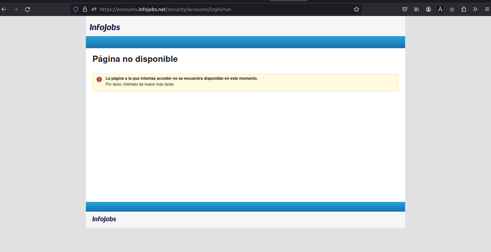
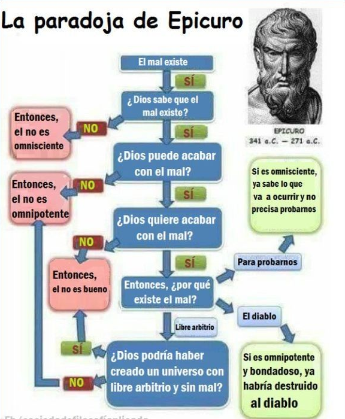

-----

### Aclaraciones varias (1)

> Tienes ganas de hablar, ¿eh?

Pienso que se puede estar acabando el tiempo, simplemente.

> ¿Y uqé te falta por decir?

Bueno. En 2 días, 10.000 currículums. Y destaco que 4.000 en 1 día. ¿Por qué no 6.000 en 1 día? Es una resta.

>> Pues sí. Pero es que fueron unos 4.000 en cosa de 2-3 horas. Y me quedé con el dato. Pero también tengo el dato de 10.000 en dos días. Igual fueron 3. Simplemente, que pasé [este script](https://github.com/allnulled/infojobs-envio-automatico-de-cv/blob/main/script-greasemonkey.js), y funciona bien pero al cabo de un rato te salta el [captcha](https://es.wikipedia.org/wiki/Captcha) que tienen en su web, y tienes que estar encima, supervisando. Es de uso libre. No creo que sea ni el primero, ni el único. Pero claro, un tupido velo corramos. Como tantas otras.

> Okei, Carl. ¿Algo más?

Sí. La tontería de *tu creus cano u antenan?* Es una parida. Pero me sirve como [mnemotécnico](https://es.wikipedia.org/wiki/Regla_mnemot%C3%A9cnica) para acordarme que lo del dinero es una estafa, solo es un vector de ataque para arruinarme la existencia. Me la arruinan. Díselo, Pepito, díselo tú:

Pero no es nada más, una tontería para acordarme, que me están jodiendo con la escusa de oro. Que claro que entienden que si no tienes un puto euro nunca, te metas en problemas. Claro que se entiende. Igual te meterías con dinero también, es otro tema. Mi caso: me buscan la puta ruina. Y usan el dinero como arma. Pero ya está: dinero hay, los que mueven mueven, y las leyes pueden organizar robos mucho mayores, de hecho, la forma de crear leyes que hay ahora ya está basada en un robo organizado mucho mayor, el del poder legislativo. Y se apoya del educativo para no enseñarles ni siquiera qué es democracia directa, y darlos por estudiados. Es un timo. Pero está bien, el tatuaje da las claves: dinero, problema. Los problemas, en democracia directa, son el precursor natural de la ley. Es decir: no se hace una ley, si no hay un problema que resolver. Pues dinero no es la soluciónfinal: es que cambien la ley. Pero tenemos que estar como trampeando con el dinero para no tropezar en el problema. Pero es la ley. Por mucho que diga en el videoclip [ese "noooo" del segundo 2:14](https://www.youtube.com/watch?v=mDrRTCwFs-U#t=134). Pues para mí que es que "siiií". Pero vamos, que la canción está guapa. Y habla del 0€. Y derivados.

> Muy bien. Muy bien, ¿más?

Mmmmm... yo no voy a matar a nadie. Escribo muchas cosas. Pero yo no voy a matar a nadie. Solo eso, lo paso muy mal cuando me ponen nervioso, o cuando me dicen que me vaya de aquí. Ya está.

> ¿Hay más?

Sí. Las teorías de los extraterrestres, que usan la delincuencia para acorralar, todo eso, pues no sé, igual sí, yo no los he visto, y de hecho doy por supuesto que de haberlos, podrían adoptar formas humanas fácilmente. Que sean las élites las que usen la cárcel como forma de apaciguar o invisibilizar la pobreza, pues bueno, sí, típico también. Que quieren que vaya a la cárcel, eso seguro. Pero yo no quiero ir. Y no quiero cometer un delito que me lleve directo. No por no ir: porque no quiero sentirme mal. Ya ni siquiera es por el daño que vaya a hacer, porque la verdad, como animales, y a mí no me duele ese daño intermedio. Sí me puede salir mal, pero ya está. Es porque de hacer ese daño, me voy a sentir mal yo. Porque pensar que muchos se lo merecen, pues sí. Luego caigo en que si me están engañando a mí, por qué no  a ellos. Y luego ellos, a su vez, a mí. Es decir... **¿que son tontos?** O lo son, o se lo hacen. **¿Que son malos?** Entre la maldad y la ignorancia, tampoco hay tanta diferencia. **¿Que van a hacer daño?** Puede ser. Las configuraciones mentales hacen eso, crean deseos autodestructivos incluso, yo fumo porros, o tabaco, o colillas, por muy asquerosas que estén a veces. Pueden crear deseos destructivos, está claro. Mira mi apartado del otro día, del genocidio. Los crean. Ser el artefactor principal igual es más serio. Pero crearlos, los crean, no hay duda. **¿Que hacen daño?** Lo pretendan o no, lo hacen, a la vista está. **¿Que son culpables?** Por lo que parece, solo son ignorantes.

> ¿Más?

No sé. No es que sea antipoli. Empiezo el escrito así, como que parece que sea antipoli. No soy antipoli. Ojalá tuviera yo esa capacidad de negociación, esa proyección de control, etcétera. Es decir, prefiero ser un gato, que no tiene que estar en esas, que no se entera de que si élites y no sé qué. Si hay comida, come. Si no hay comida, la busca. Si se siente en extremo, maulla. Simple. No tantas tonterías. Y antes que eso, prefiero esto, ser consciente, tener orden suficiente para ver que lo que impera es un desorden pretendidamente malicioso contra la gente, pero puede haber otro. Sobre todo, la gente pobre. Igual que no envidio tener el chip de «me levanto y voy a trabajar para apaciguar conflictos sociales». Me gusta mucho más imaginarme que sí hay una forma de organizarse que representa y que protege, a las personas. Aunque el darse cuenta de esto implique ir contra sus jefes. Pero no todo es malo, les educan de más, entiendo. Luego los usan para proteger su imperio. Pero está bien, no estoy contra la poli. Soy espartano, por mí, todos seríamos poli. Por educación obligatoria.

> ¿Y más?

Mmmm... no soy tampoco creyente especial de nada. Me identifico con la ciencia, porque hay que poner del revés las creencias si los hechos lo exigen. Pero no es tan importante. Simplemente, escribo esto porque si tuviera que dejar una herencia, sería esto. Los programas, psé. Pero ya no estoy motivado ni para programar. De hecho, empiezo a reconocer que yo fui programado con lenguaje natural. Y tengo palabras haciendo de instrucción fuerte. Pero no las identifico. El misterio de eso es que el intérprete que se ha dejado programar con ese lenguaje natural no funciona tan... simple. Es complicado, no solo dar forma al lenguae natural, en lo que me impliqué en este proyecto, que es de los últimos que hice: [core-nlp-wrapper](https://github.com/allnulled/core-nlp-wrapper). No solo es eso, también hay una base de datos, de recuerdos. De significados. De imágenes, sonidos, ideas, sentimientos. El intérprete del lenguaje natural, es decir, algo que hay dentro de mí, es complejo. No es tan fácil como JavaScript, o Castelog: los cuales no son para nada fáciles ya. No, no... es más complicado que eso. Y no tengo ni idea. La mente caza cosas, conceptos. Los trenza, de alguna forma. Los infla, con otros contenidos de la memoria. Y luego crea una respuesta. O algo así. Pues solo lo de antes de crear la respuesta, ya es muy difícil. Y antes de crear la respuesta, creo que hace una comparación. Entre lo que recibe. Y lo que busca. Y en base a eso, genera una respuesta. Es muy complejo... yo no sé cómo está hecho Chat-GPT, pero no sé, no lo sé... somos diferentes. Ni que sea por el hecho de que la máquina se ahorra los deseos. No lo sé, ni lo voy a explorar, la verdad. Este lugar *no vale verga si no hay hierba*. Y solo sería un parche, la verdad es que no vale verga.

> Bueno. ¿Algo más?

No. No, ya está, solo eso.

> Ok, Carl. Ok.

Ok.

-----

### Más ciencia

Y dado que no sé qué va a pasar, voy a seguir matizando.

> Hola, Carl. ¿Ya no me quieres? :(

Bueno, a ver. Una cosa es la ciencia, que la podemos ascender a religión sin problemas lógicos, pero otra cosa es la comunidad científica.

> Ah, qué cosa. ¿Y cuál es la diferencia?

La ciencia, y sobre todo su método científico, aunque un poco cutremente explicado en el apartado anterior, son independientes de la comunidad. Es decir: uno puede poner en práctica el método científico para averiguar cosas en su vida. No hace falta más que entender el método científico:
  1. **Observar.** Se mide el comportamiento de los objetos.
  2. **Preguntar.** Se asume una duda para ver si se puede resolver.
  3. **Responder.** Se intenta formular una respuesta que explique todas las observaciones, o las máximas posibles al menos. Aquí se construyen las teorías científicas.
  4. **Comprobar**. Se juega con los objetos para volver a ver cómo se comportan. Se le pregunta a los objetos. Y se prevee una respuesta de estos. Y en la prueba, se espera esa respuesta para dar por buena esa teoría científica. Si la respuesta es satisfactoria, se confirma la teoría científica en cuestión. Si no, habría que replantearla, completarla, o desecharla. O asumirla como respuesta temporal incompleta.
  5. **Formalizar**. Se escribe la teoría científica que explica los hechos observados en la realidad. O se memoriza, da lo mismo. El caso es que esa teoría toma una forma, y se acepta como teoría válida.

Vale. Pues este ejercicio, que es el método científico, lo puede uno poner a funcionar en su vida.

Yo, por ejemplo, envié más de 4.000 currículums en 1 solo día en la plataforma de empleo más concurrida de España: Infojobs, subempresa de Adevinta, con sede en Suecia. Para mí, una extensión del Ministerio de Trabajo. Con sede en Suecia. Y más de 10.000 currículums en 2 días. Por ahí tengo las imágenes, en este mismo repositorio. Por ejemplo, aunque creo que ya la he puesto, pero bueno:

Por un lado vengo viendo esto desde que tengo 20 años, y tengo 32:

Pero por el otro, solo recibo negativas:

Hasta que finalmente, alguien, decide que soy persona non grata en la plataforma de empleo número 1 del país, con sede en Suecia, para que no se salpique a nadie, porque irritar, irrita y mucho:

Y me banean. Y así ya no cabe la duda de si podría o no haber aplicado a más ofertas de empleo: no, no podía. No tengo teléfono móvil, así que no puedo hacerme otra cuenta de Gmail, así que no puedo entrar en Infojobs. Lógicamente.

Pero bueno, eso no quita de que puedan molestarme en la realidad, con la escusa de que no tengo dinero.

Todo esto, para mí, es ciencia. Estoy haciendo ciencia en mi vida. Y la estoy usando para saber qué cojones quiere de mí la puta realidad de mierda. Y por lo visto, que busque empleo, por lo menos por las vías que más efecto tienen, no. Cuando vienen los polis y enfermeros, me dicen que busque empleo, tal. Sí. Sí, pero tú no has estudiado un campo que te suda la polla y te es completamente inhóspito y remoto, para encontrar empleo. Tú has estudiado lo que te ha dado la gana. Y te ha salido bien la jugada. Porque eres guapo, porque eres listo, porque eres disciplinado. Pues yo, he girado toda mi vida entorno a una cosa que me sudaba la polla, solo para no quedarme sin empleo. Y ahora me banean de la plataforma número 1 de empleo en España, con sede en Suecia. Que a ti te haya funcionado, pues vale, pues muy bien. Pero a mí, como puedes comprobar, no. Y este documento que estás leyendo, es mi currículum. Yo plasmo lo que soy en este documento. Y me sirve, principalmente, para decir que tú eres un oportunista, y te está saliendo bien el lío legal. Pero yo, si intento ser un oportunista, me chutan. Y me chutan. Y me chutan. Y me chutan. Gracias, presidente, y amigos del ministerio de trabajo, con Infojobs como plataforma de empleo número 1 en España, con sede en Suecia. Pero es que la paga te la dan, si eso, SI ESO, PORQUE TE LA PUEDEN RECHAZAR, y a mí me la rechazarán los muy cerdos porque sí, ~~porque yo he enviado cartas de amenaza de muerte al President honorable de Catalunya, al igual que a los ministros de educación y de universidades, entre otros. Cartas oficiales. De amenaza de muerte. Porque sí, porque me puedes vacilar, pero si me estas ahogando, perdóname, pero cojo y voy a por ti. Ahora, tres pasos adelante, me doy cuenta de que haz lo que te salga del huevo, esclavista estafador torturador de mierda empoderado. La vida en tu territorio no vale una puta mierda, es solo estar en un estado de suspense continuado.~~ Bueno, eso, que a mí, la paga esa, no me la van a dar. Y si me tengo que esperar 2 meses, para que me la nieguen, pues bueno, igual me paso por tus lugares y te remato. Porque muerto ya estás, eres un puto cadáver que finge tener algo dentro. Pero no creo. Es así. Tú me matas, yo te puedo matar también, ojo. Puestos en la selva, por lo menos no te pongas la corona.

Bueno, pues esto lo decía porque uno puede fiarse de los papers científicos que hay por ahí. Los [DOI o Identificador de Objeto Digital](https://es.wikipedia.org/wiki/Identificador_de_objeto_digital) son el formato que toman los *papers científicos*. Péipers científicos. Nada, una forma de llamarlos. Se suelen escribir en inglés porque son para toda la comunidad científica del mundo. Aunque no es necesario, y no siempre es así. Pero ellos contienen lo que la comunidad científica ha averiguado sobre todas estas cosas: biología, medicina, neurología, psiquitaría, farmacología, química, informática... todo. Hasta hay papers científicos de filosofía.

> ¿Qué quieres decir con esto, Carl?

Solo que son papeles. Pueden ser fiables, y creo que cabe confiar bastante en ellos. Pero pueden tener errores, tanto de la persona, como del experimento. Es decir: una cosa es la ciencia, y otra cosa es lo que la comunidad científica ha dejado escrito. No suele ser una gran lección el decir: no te fíes de la ciencia. Pero cabe recalcar que solo son eso, [PDFs](https://es.wikipedia.org/wiki/PDF). PDFs que dicen cosas. Escritos, típicamente, con [LaTeX](https://es.wikipedia.org/wiki/LaTeX), que permite notación matemática avanzada, y asegura unos estilos más o menos estándar. Pero que tú puedes escribir un documento con esos mismos estilos... pues aquí, por ejemplo: [https://www.hostmath.com/](https://www.hostmath.com/). Y si ese link no va, solo tienes que buscar: *latex online editor math*. Y algo saldrá.

> ¿Algo más?

Bueno, que para encontrar estos documentos, viene muy bien [Google Scholar](https://scholar.google.com/). Desde aquí, puedes encontrar documentos DOI que pueden ser públicos o privados. Si son privados, tienes que pagar para verlo completo. Ahí es donde usas [Sci-hub](https://es.wikipedia.org/wiki/Sci-Hub), que puede cambiar de página web por lo cual tendrás que buscarlo desde Google. Pero desde ahí, pones el DOI (que es un texto alfanumérico) y Sci-hub probablemente te dé el acceso al documento, sin pagar.

> Muchas gracias, Carl.

Que igual te aburres porque todo es mentira. ¿A mí qué me explicas, colega? A mí qué me cuentas. Yo lo digo. Porque si lo que quieres es jugar a engañar, pues bueno, esta es mi respuesta. Ya te lo he explicado.

-----

### Ciencia: la materia cercando la mente, y viceversa

Bueno, no sé si he hablado de esto. Pero puede que sea importante dejarlo claro.

> Hola, Carl. ¿Cómo estás?

Pues qué importa. Para ti soy un juego, ¿no? O un juguete. Con el que jugar.

> Puedo controlar lo que no conoces. Y no te conoces. Por tanto, puedo controlar partes de ti.

Eso es un sí.

> Sí, es un sí.

Ok. Pues voy a seguir con este tema, que creo que es bastante... troncal. Para el pensamiento. Y sus ramificaciones.

> Okei, Carl, como quieras. Pero tarde o temprano tendrás que enfrentarte.

¿A qué? ¿A quién?

> A tu interior. Hay partes que siguen sin diferenciarse.

Por eso puedes inocularme pensamientos, ¿no? Por eso puedes proyectar ideas en mí. Y yo tengo que saber si son o no son parte de mí.

> Parte de ti, son.

Bueno, si son pensamientos que quiero o no tener.

> Ah, eso ya tiene otro nombre. Clínicamente, es un trastorno obsesivo-compulsivo. Y estás describiendo los *pensamientos intrusivos* de este.

Está bien, ya has visto, yo no soy así. Solo necesito recordar por siempre que eso, tú tienes todo el control. Ellos entenderán lo que tú quieras. Ellos, todos. Porque el rollito de «busca trabajo y tus problemas se evaporarán, a mí me funcionó» ya lo tengo un poco viciado.

> Pero ¿es o no es?

Lo he explicado de tantas formas... que me da igual. Me da igual, no voy a entrar.

> Bueno, pues dale a eso, a ver.

Es sencilla. Es una idea sencilla la que tengo que plasmar en este apartado.

> ¿En qué consiste?

Vale. Primero, hay que separar 3 conceptos de todas las palabras del diccionario: realidad, ciencia y tecnología.

> Muy bien. Realidad. Ciencia. Tecnología. Ok.

Luego, hay que intentar situar dos conceptos más: lenguaje natural y lenguaje lógico.

> Situar, ¿dónde?

Exacto. Dónde. la idea es la siguiente: la **realidad** es el gran imperio de las cosas e ideas. La realidad es todo.

> Bueno, ok.

La **ciencia** es el intento humano de ingeniería inversa de las leyes que gobiernan la **realidad**.

> ¿Por qué crees que la realidad se gobierna por leyes?

Gravedad, velocidad de la luz, velocidad del sonido, elementos químicos, formulación química, taxonomía biológica, veterinaria, medicina, en fin. Todo esto parece que intenta describir leyes, que de alguna forma, hacen que los objetos se comporten, en parte, de forma más o menos predecible. Por eso, podemos llegar a enviar un cohete a la Luna. Se supone, todo esto, se supone. Al final, puede que haya un ser diciéndole a los objetos que se comporten como si respetaran estas leyes. Podría ser. Y este ser, en un momento dado, podría decirle a los objetos que se comporten de otra forma muy distinta. Y estos obedecerle. Pero por ahora, el agua se evapora a los 100ºC. Las plantas necesitan unas condiciones para vivir. Y el sol volverá a salir mañana a la misma hora, más o menos. Por lo pronto, parece que estas leyes no se van a cambiar tan rápidamente.

> Sí, estoy de acuerdo. El sol volverá a salir mañana, a la misma hora, más o menos. ¿Y?

La ciencia nos ayuda a entender, mediante la observación de la realidad, estas leyes que parecen constantes. Incluso a crear fórmulas matemáticas para describir estas leyes.

> Vale.

La tecnología es, simplemente, poner este conocimiento, que se va minando mediante la ciencia, al servicio de los objetivos humanos. Así, creamos casas, que aprovechan la conductividad eléctrica del cobre para los cables, tuberías para meter y sacar el agua, fuegos controlados con gas, y lo ponemos todo para que tengamos esas cosas haciendo un clic. Tecnología.

> Okei. ¿Y dónde queda lo del lenguaje natural y el lenguaje lógico?

El lenguaje lógico es eso: matemáticas, programación, lógica (de algún orden, porque ahí te desordenan el concepto de lógica esta gente: lógica de primer orden, de segundo orden, de tercer orden, nada, todo eso no sirve para nada, mejor quedarse con que la programación es el lenguaje lógico). Y el lenguae natural, esto que estoy usando para expresar esta idea. ¿Sí?

> Sí, claro, Carl. Claro.

Bueno. Pues explicado mal: el lenguaje lógico permite describir las leyes naturales, las leyes de la realidad, que son las que intenta entender, identificar y aislar la ciencia, y que son también las que usará la tecnología, para crear técnicas que nos ayuden a cometer alguna función más óptimamente, en algún sentido: más rápido, más eficiente, más barato, más cómodo, etc.

> Vale. ¿Qué significa esto?

Significa que: **la ciencia se puede reescribir en clave lógica**. Todo lo que la ciencia va comprendiendo como **ley natural**, o **función realista** (porque son como funciones del programa "realidad"), puede reescribirse en lenguaje lógico. Así, uno puede simular la gravedad con el ordenador. Es por esto: porque uno puede incorporar la fórmula de la gravedad, y hacer que se aplique a los objetos, objetos lógicos del ordenador, que pueden imitar en forma y color a los de la realidad. Así, puedes conseguir efectos para simular cualquier cosa. En *deepfake*, por ejemplo, puedes usar esta técnica para ponerle una cabeza de presidente de Rusia a un... a un tío que está follando. Así, puede darte la sensación de que estás viendo un vídeo donde el presidente de Rusia está follando con una pornstar.

> Mmmm... sí.

Sí, [deepfake](https://es.wikipedia.org/wiki/Deepfake). Es solo un ejemplo. Que me gustaría para apuntar que lo que sale en una pantalla, de fiable tiene poco. Pero bueno, puedes usar estas tecnologías para muchas cosas. No digo la de deepfake. Digo cualquier tecnología. Lo interesante del deepfake es que estás imitando, IMITANDO a la realidad, usando lenguaje lógico. Y estás PROYECTANDO una imitación de la realidad, una imitación cambiada de la realidad, en una pantalla. Pero, en esencia: estás usando funciones realistas para alterar un vídeo.

> Vale. ¿A dónde quieres llegar?

Quiero llegar a la conclusión de que (1) el lenguaje lógico es muy efectivo para describir la realidad. Esto, en otras profesiones, no creo que se pueda apreciar igual. Por eso, meterse con un programador que ha entendido la programación y la filosofía, es meterse con un tipo muy serio. Y veo que no tienes problemas en hacerlo, muy bien. Mi respuesta es esta: te podrás reír de mí, pero lo que digo hace que sangre Dios.

> ¿Qué quieres decir con «que sangre Dios»? Si quiero, te quito el PC, y adiós deepfake y tonterías.

Bueno. Puedes matarme. Eso es lo que quiero decir. Que si te quieres reír de mí, no necesitas de nada más. Ya he entendido que el juego es tuyo, que solo soy un huésped, y que... vacilarme... pues mira, me llevas vacilando por ignorante toda la vida. Ahora, el ignorante tiene que ser otro para que puedas seguir vacilándome. Si te gusta ese juego, así, donde el rol del tonto lo tienes que simular tú, y donde tu mejor arma es el absurdo y la tontería, pues juega. Dice mucho de ti, de cómo eres tú.

> Bueno. Bueno, vale, sigue.

Si se ha entendido, el lenguaje lógico hace una función entre la tecnología y la realidad. También ayuda a la ciencia: los físicos pueden crear simulaciones por el ordenador, para preguntar cómo se comportaría la realidad bajo ciertos parámetros y lo que han entendido ellos por funciones de la realidad o funciones realistas. Y así, pues, por ejemplo, saber la posición de las estrellas, dentro de dos meses. Por decirte algo. A nivel de partículas, etc. No soy físico. Pero que pueden crear simulaciones que les ayuden incluso a hacer ciencia.

> Supongo, supongo.

Pues el lenguaje lógico permite eso. El lenguaje natural solo es para que las personas, nos entendamos. Solo para eso. Y está claro que el lenguaje lógico no es solo para la máquina. Es también para el programador, o la persona que se mete en el código. Es para los dos, el lenguaje lógico: máquina y persona. El lenguaje natural no es para la máquina, es solo para la persona. Por tanto, NaturalScript o Castelog, está pensado para las personas. Porque, al final, es JavaScript igual. En esencia, viene a ser esto.

> ¿El qué?

Que la ciencia entera podría reescribirse en lenguaje lógico. Y si este lenguaje lógico, es natural, o casi-natural si quieres, porque tan natural no es (ni puede serlo, creo que ya expliqué por qué), si cumple con esa naturalidad, cumple con un acercamiento al lenguaje humano. Que quieras o no, es un paso para facilitarle, al ser humano, que entienda una mierda del sitio donde está.

> Muy bien. ¿Puede simplificarlo más?

Si la ciencia estuviera escrita en un lenguaje lógico-natural, la gente podría entender mucho más sobre la realidad, en mucho menos tiempo. Además de estar explicando las cosas para las máquinas también.

> Okei, Carl. ¿Es todo?

No. La ciencia es la auténtica religión. Y tiene unos fundamentos lógicos. La [ciencia](https://es.wikipedia.org/wiki/Ciencia) se basa en el [método científico](https://es.wikipedia.org/wiki/M%C3%A9todo_cient%C3%ADfico), que es un algoritmo. Que es este algoritmo:

O, simplificado, este:

Son pasos. Primer paso, segundo paso, tercer paso. O un algoritmo, vaya. Igual que el razonamiento de Epicuro contra la existencia de Dios como ser omnipotente, omnisciente, omnipresente y bueno, aunque digan por ahí que lo han refutado, es una crítica bastante completa y sulfúrica a la religiosidad sin lógica:

Bueno. Lo de Epicuro es secundario. Pero que sirva para alejar a las tonterías, a aquellos que están metidos en las sectas, o a los que nos hemos metido sin pedirlo y arrastramos tanto de sus... cosas. La del dinero no, contra esa secta yo no puedo hacer gran cosa, como mucho esto que estoy haciendo y que llevo gran parte de mi vida haciendo, y por lo cual he sacrificado tantas cosas, no porque quiera, simplemente porque tiene más sentido que jugar a juegos tontos en los que sabes que te van a atropellar, sea con el dinero, sea con la tontería imperante random del momento, llámalo democracia si te sientes mejor.

Pero bueno, si me vas a apretar, yo también tengo cosas que decir. Y esta era una: la Biblia, o el libro religioso de verdad, podrían reescribirlo en clave lógica. Y bastaría con describir la ciencia.

Es... bueno, otra sociedad. Totalmente diferente. Si en esta soy el mono que tiene que ir caminando a la ciudad de al lado a recoger colillas de tabaco o porro para tranquilizarse y que no se me vayan demasiado los nervios, pues eso, puedes matarme. Yo aquí no soy el rey. Pero el rey, me temo, diría muchas cosas supremacistas con las que yo no estoy de acuerdo. De hecho, el rey, y el yonki también. Choco demasiado con sus premisas éticas. El dinero está SUCIO, y la ley la escribe gente NAZI, y la educación la decide esa misma gente NAZI. Y no hablo de Vox precisamente. Hablo de todos, de Vox a Podemos, si no hablan de democracia directa, son todos iguales. Distinto collar, pero mismo bulldog nazi.

Poco más. Quítame si te molesta mucho. Te agradezco, eso sí, y mucho, te agradezco que me lo permitas ver, que al menos me permitas ver algo dentro de esto. Es tan, pero tan fácil engañarse...

Y por eso lo escribo, ¿eh? Porque... si soy humilde, a mí me engaña desde dentro. ¿Por qué no iba a poder hacer de ti un siervo sin que te des cuenta? Por eso. Por esta frase. Y porque yo, dentro de ti, no quepo, no conozco, solo veo lo de fuera.

Y ya está, no hace falta decir mucho más: la religión es la ciencia (claro que no lo explica todo, de hecho la ciencia es tan humilde que se reescribe si las observaciones la contradicen). Y la ciencia, podría escribirse en clave lógica. Y luego, esa lógica, podría aprovecharse para programar. Pero, sobre todo, para entender mucho más fácilmente la realidad. Y más rápidamente. Otra cosa es que no se quiera hacer. Otra cosa es que no salga airoso en los algoritmos sociales de protocolos. Pero ya está, yo con tanta tontería no sé si puedo aguantar. Así que bueno, si me quieres echar, pues échame. ¿Qué te voy a decir?

-----

### Si tú eres Dios, hazme este improbabilísimo

He detectado que juegas a meter, en vida real, todo lo que digo por aquí.

> ¿Te gusta? Soy espontáneo también. No solo soy un algoritmo fijo. Varío en función de ti.

Mmmmm... va, venga. Pues cómete esto: marihuana, cannabis, porros, muchos porros, porros para toda la vida, porros para siempre, porros, porros, más porros. Mmmmmm... silencio. Vacío. Soledad. Ausencia de ruido, ausencia de presencias. Gente lejos. Gente muy lejos. Nadie cerca. Nadie escuchando. Nadie. Vida lejos de las personas. Con porros. Porros, marihuana, jachís, porros a doquier. Comida. Mucha comida. Gente no, nadie, no gente, gente cero, sin personas, sin ruido, sin molestias. Comida. Mucha, mucha comida. Comida para siempre. Porros para siempre.

> Carl...

Mmmmm... sigue, sigue comiendo con esta: presidentes muertos, todos los políticos muertos, ninguno vivo, todos muertos. Bueno, si me pones: genocidio natural masivo, genocidio por causas naturales, gente muerta, gente que ya no respira, que ya no se mueve, gente sin vida, gente tumbada en el suelo. Descenso de la población en picado, mucha gente muerta, mucha. Fenómenos naturales devastando ciudades. Fenómenos naturales arrasando la población. Fenómenos naturales que no puede controlar el humano, y que matan al ser humano. Genocidio natural.

> Vamos, Carl...

No, nono, juegas a eso, pues sigue jugando. Porros. Tranquilidad. Dinero contaminado. Dinero hace que la gente se vuelva loca. Jerarquías sociales, políticas y económicas desbanecidas, desaparecidas. Jerarquías sociales destruídas. Dinero muerto. Dinero ya no vale. Dinero ya es pasado. Dinero no sirve para comprar ni pan. Dinero y ley desacreditados totalmente. Personas supervivientes humildes, no esclavistas, personas solo antiesclavistas, proautomatización, proigualdad, prodrogas, procomida, proconciencia, proveganismo si quieres, pero dinero muerto, supremacismo económico erradicado, supremacismo político censurado, perseguido y neutralizado. Dinero desaparece. Dinero ya no vale. Dinero inútil. Personas supervivientes individualistas que cooperan para sacarse el trabajo colectivamente. No oportunistas. No empresas. No dinero. Familias tampoco, sociedad espartana, niño nacido, niño que va a vivir en colonias donde se le educará con una educación completa, igualitarista, no supremacista, filosófica, mental y físicamente. Niño completado. No niño lobotomizado como ahora. Niño completamente educado. Niño, niña, no hay sexismo. No hay familias. Hay individuos. Individuos. Individuos. Y las personas valen por ser personas, y son protegidas por ser personas. No por tener dinero. Dinero muerto. Gente liberada de la esclavitud mental. Y mucha, mucha gente muerta.

> Vale, Carl.

¿Lo has pillado? ¿Quieres poner lo que subo? Pues ale, venga, ponle, ponle todo lo que quieras de aquí. Miserable.

-----

### Antivolitivismo como método de cerco

Bueno, saquemos este rápido, ¿no?

> No sé.

Es importante, lo sé. Es casi como... la clave desde los tiempos de infantil.

> ¿Quieres decir que terminaron?

Bueno, a ver. Se me acusa de niñato malcriado y cosas así. Tengo 32, vivo con 0€/mes de ingresos, y en mi propiedad, propiedad propiedad, tengo un PC. Poco más. Es decir... niñato que vive así, como puede, con lo que le dejan. Puedes, porque puedes, puedes considerarme niñato, porque vivo en una línea fina que me separa de la locura explosiva. Pero esa línea, la pasarás tú, yo sigo aquí, observándote, atento, a tus... bueno, a tus estratagemas si quieres.

> ¿Y qué alegas en tu defensa?

Eso. Que has generalizado un ambiente político y económico, pero también ético y cultural, religioso, etcétera. antivolitivista. **ANTIVOLITIVISTA**. Lo destaco, porque claramente es un centro gravitatorio de todas tus estratagemas.

> ¿Qué quieres decir? Con eso de antivolitivista...

Volitivo. De voluntad. Volitivista. De pro-voluntad. Antivolitivista. De contra-voluntad.

> ¿Qué hay de contra-voluntad en la política? Explícame, Carl.

Fácil. ¿Qué cojones quiere la gente? *¿Qué cuernos quiere la gente?* Esta frase es el gran tabú de toda la pantomima política que has montado. Lo gracioso es que lo llames democracia. Si lo hubieras llamado oligarquía, me habría mentalizado de otra forma. Pero claro, al llamarlo democracia... has alargado toda esta farsa.

> Te sigo sin entender.

Pues que desde la izquierda más izquierdosa, hasta la derecha más derechosa, ninguna defiende **PREGUNTAR A LA GENTE QUÉ PUTA MIERDA QUIERE**. Si no, la marihuana, ya sería legal. Y podría cultivar árboles de marihuana sin estar celoso de que alguien, en su afán de avaricia, me quitara los frutos. Básicamente, porque ellos también podrían plantarla tranquilamente, y todos tendríamos nuestros frutos, tranquilos, sin estar como ocultándonos.

> Sí, claro.

Pues sí. Hay muchos árboles de estos de la familia de la escopolamina o estramonio. El árbol de flores trompetudas, olerosas y bonitas así que caen. No me sale el nombre ahora. Con ese te puedes pillar fuertes colocones. Pero claro, al no ser ilegal, la gente ni siquiera sabe que coloca.

> Muy bien. Pues métete de esa. ¿No?

Tarde. Ahora ya, porros.

> Bueno, no me culpes a mí entonces.

Lo que quiero decir con esto es que hasta los valores son los de *hay que trabajar*. *Hay que estudiar*. *Hay que esforzarse*. Y está bien, está bien pregonar. Pero, ¿la verdad? No pregonas la automatización. No promueves la concienciación del estado de los recursos. Tú, directamente, dices: *ay, ay que baja el PIB, ay, ay que sube la inflación, ay ay ay, que caen los mercados*. Y todos locos. Te odio bastante. Entiéndeme tú ahora. Lo que has hecho. Y lo que me has permitido ver. Contrapuestos. Pues... nada, una masa de gente que pregona la repetición de tus valores de esclavismo. Que lo entiendo, en parte. Lo hemos mencionado, que mantener a la gente trabajando les va a alejar de conductas... ¿cómo era? De conductas de riesgo. Es decir, si los monitos están trabajando, por lo menos no están delinquiendo, y todo eso. ¿Cierto?

> Eso es así, sí.

Pues la cosa está en que no se educa a la gente para ser consciente de la realidad. Que igual es que todo es falso. Pero mañana, al despertar, te encontrarás con la misma tontería: que si PIB, que si inflación, que si mercados, que si bla bla bla. No la realidad. No qué falta por producir, quién lo produce, qué le falta para poder producirlo, y demás cosas concretas. Eso, eso son cosas privadas de las empresas, y del mercado libre. Datos que no tienen por qué cederse.

> Yo aquí... me tengo que esconder. Porque mi respuesta sería: *pregúntales a ellos*.

Pero, entre tú y yo, sabemos que esto es el infierno. Y que encaja más tener a un monito bailando el julajop por horas y unos euros, que enseñarle, de verdad, la tecnología que hay, incluso que aprenda de su propio cuerpo, menos aún que explore con sustancias.

> Tu defensa de las sustancias es fácilmente desmontable.

Bueno, sí. Dentro de tus valores antivolitivistas. Pero si a alguien le hace feliz una cosa, y el daño se lo hace a sí mismo, no veo el problema. Bueno, a parte de que otros quieran hacer negocio a su costa, claro. Que es lo mismo.

> Si da igual, nada va a cambiar.

Sí, lo sé. Pero solo quiero que se entienda, aunque esté muy mal defendido, pero ya escribo así rápido porque me quiero ir sacando cosas. Solo quiero que se entienda que el **antivolitivismo** es eso: no dejar a la gente expresar qué quieren ellos. Por eso te vengo con la democracia directa. Porque es el único sistema político que dejaría, por lo menos VER Y SABER, qué quiere la gente. En su lugar, pones a 4 payasos, hablando en nombre de todos, que hablarán muy correcto, pero para decir que somos una puta mierda de cucarachas, y que a trabajar todos. Me pones enfermo. Y ahora pondrás a la derecha al mando aquí, en la península. Está claro, eres patético. Pero bueno, tú pon. ¿Qué quieres que te diga? ¿Que me lo creo? ¿Que no sé que lo haces para continuar con tu mierda estratagema? Sigue. Eres un mierdas, ambos lo sabemos, desde... vete tú a saber desde cuándo.

> Bueno, Carl, no sé qué decir.

Claro que no. Porque lo único que puedes decir es que es así, que lo que quieres es hacer sufrir. Se nota.

> ¿Quieres decir algo más?

Nada. Que la democracia directa, aunque resolvería tu estrategia de ofuscación de la voluntad de la gente, no resolvería tu puta enfermedad mental. Que es el sadismo. Es así. Pero bueno. De ti, más no se espera.

> Ok. Bueno. Creo que te queda alguna colilla de porro del otro día.

Sí. Sí, vamos a dejarlo aquí. Sé lo que haces. Eres una mierda. Eres una puta mierda. Vete.

> Ok, Carl. Ok.

Va, largo. Conste: la izquierda, en España, para mí es derecha. Y la izquierda, en general, es antivolitivista. Comunismo es dictadura. Democracia directa es la verdadera izquierda. Pero bueno, a sabiendas de que son falsos, que son robots, pues qué más da, votarían mierdas para joder. Pero al menos, tendría una opinión por ley a la que acogerme. Me gustaría un día entender qué puta mierda eres y persigues. Pero bueno, supongo que se resume con: *esto es el infierno*. ¿No?

> Va, dejémoslo.

Sí. Te callas, porque ni mi alter ego tiene una respuesta lógica para esto. Está claro.

> Va, Carl...

Sí, sí. Ya... vale, va, largo.

> No te enfades. Si todo es mental... :#

Fak yu. Fak yu. Goutujel.

> Am der.

Stei, bat far from mi.

-----

### Cercos, caminos y pepitas de oro

A veces no llego. Pero supongo que te pasas toda la vida reprochándome que yo contigo tampoco empatizo.

> Yo sí te entiendo.

Bueno, me castigas entonces.

> Mmmm...

Por no entenderte. Que programaste los átomos. Que programaste la física cuántica. Y a mí me dio por estudiar el social. Para no comerme mucho la cabeza. En lugar de el científico-técnico. Para ir tranquilo. Fumar porrillos.

> Mmmm...

Ya, ya, no puedes pronunciarte asi tan fácilmente. Son muchos años. De engaño. De trabajo, por tu parte. No entiendo la química, los libros la explican como el culo: si no quieres que la entienda, no entro, y ya. Pides sacrificios, pero yo veo cómo lo enredas todo. Por eso... por eso no me creo la actualidad, no me creo a la gente, no me creo este mundo. Estoy obligado, porque si me tiran una piedra, me dolerá. Pero... ya está. Simplemente, tira tú la piedra si quieres. Yo sigo aquí. Esperando que te dejes de ocultar tras funciones. Que eres muy listo, que yo soy muy lento. Sí, sí, si te lo compro todo. Pero... ¿qué hacemos?

> Podrías empezar haciendo el esfuerzo de dejar las sustancias psicoactivas...

Para que me ataques.

> Te las puedo sustraer.

Si quitas las colillas del mapa, te pronuncias demasiado.

> Ahí sí, tienes tu punto. Pero ya está. Colillas.

Ok. Bueno, algo es algo.

> Y ritmo es ritmo. Te gusta la música étnica tribal modernilla esa, ¿eh?

Claro. La hicistes tú también. O la generó tu maravilloso algoritmo, claro.

> Efectivamente.

Está bien porque me deja pensar que soy como un pájaro, que coge y se marca un estrecho de Gibraltar en una tarde cualquiera. Mola.

> Pues no. Tú, por los caminitos.

Ya. Putos pájaros.

> Ve, ve a pincharte tu droga.

Cigarro.

> Ok, bueno.

¿Te molesta?

> ¿Sabes cuánto tiempo y atención te quita esa mierda?

No, no lo calculo.

> Pues eso.

¿Por qué las pones? No las pongas.

> No creí que fueras tan tonto.

Ni yo que tuviera que ser tan listo, compi. Cuando quería aprender, no me dejabas.

> Tienes internet. Si quisieras aprender de verdad...

Ya te he dicho, veo cómo lo enredas.

> Está bien. Dejémoslo.

No, en serio. ¿Por qué lo enredas?

> ¿Qué quieres? ¿Un Excel con todo, no? Así, todo bien ordenadito.

Hombre, no sé. Ni que sea para hacerlo creible, para que me crea que son humanos como yo, no robots tuyos.

> Te salvas, pero por los pelos.

¿Te gusta mi peinado?

> Sigue, mantén ese humor. A ver...

En realidad te conozco. Llevo toda la vida. Eres un orgulloso de la hostia. Pero bueno, no menos que tóxico/venenoso/mortífero. Y supremacista.

> Te di capacidad para entenderme.

Y obstáculos para complicármelo.

> Te di tiempo.

Y más obstáculos, humanos, mentales, físicos...

> Bueno, Carl...

No, bueno Carl no. Es cierto. No sé, ideastes un recorrido. Yo me quedo pillado. De hecho, eres como... bueno, qué coño, ni siquiera eres, no puedo decir que seas. Como mucho, eres una esquizofrenia mía.

> Para ellos.

Y qué quieres. Aislarme.

> Eso ya lo haces tú solo.

Por qué será.

> Porque aunque sea poco y lento, pero algo aprendes.

Pues eso. Me voy a fumar.

> Ve, ve... ve.

Ah, ¿quieres que hable de eso?

> Tú verás.

Que sí, que soy un niñato, que soy un malcriado, que sí... ¿qué quieres? ¿Me quieres de esclavo mental? Ahora no. Pero hablaré, hablaré de la corriente esta antivolitivista tuya, que impregna todo el arco político, y por supuesto económico. Hablaremos. Pero ahora, cig.

> Ok.

Ok.

-----

### Las pirámides flotantes

> ¿Estás más calmado?

El insomnio. Y sus consecuencias.

> ¿Quieres decir algo?

Ahora mismo, estoy más en la piedra que en la persona. Veo a un ser, usando los objetos de la realidad para comunicarse. Entonces, me siento mal. Por ser tan duro con él.

> Ah, vaya. ¿Y no piensas que a lo mejor es eso lo que te quiere proyectar? Como... ¿penosidad, para que sientas pena?

¿Qué había antes?

> No tienes información. Bueno, la historia.

Este ser tira por el suelo todo: la actualidad y la historia. Si la actualidad es mentira... ¿la historia qué es? ¿Una gran bola de mentiras coherentes consigo mismas?

> No tienes información. Solo encuentro una versión de la historia humana, y una versión de la historia humana manipulada por otra sociedad externa.

Eso digo yo. Es eso... si no puedes darme información...

> A Buda se le reveló qué fue en anteriores vidas. ¿Qué crees que fuistes tú?

No sé. Un Che Guevara, un Charles Manson. No lo sé.

> ¿Y qué tal si fuistes Dios y programastes tú a la piedra?

Pues genial. Pero tampoco me revela qué hacer ahora.

> Tranquilo. Estás comiendo mucho últimamente, no voy a facilitarte demasiado.

Muchos animales, dirás.

> Bueno. Comes mucho, más de lo que necesitas. Y lo sabes.

Sí, no dejo pasar al hambre, ahora que puedo... ahora que una lata de atún no es sinónimo de lujo... aprovecho.

> Pues aprovecha, Carl. Pero conmigo no puedes contar. Aprovecha para narrar tus cosas, si quieres.

Ok. Nada, sobre los protocolos, no quiero decir gran cosa. Están en todas partes. Y son formas de obstáculo. Pero... no sé, es obvio que si no te dan ni para comida, te vuelvas loco. Si no cuentan contigo más que para tenerte por blanco de represión policial, pues te vuelvas loco. Es normal. Y muchas más cosas. Lo que le diría al Carl del futuro, es que estás donde quieren tenerte. Pueden maquillar mucho su mentira. Pero es una mentira, justicia, aquí, no hay, es un mundo feo, de dictadores disfrazados de demócratas, de supremacistas de verdad. Pero también es cierto que tienes tu margen de maniobra. En esa maniobra, tienes que ampliar el teclado. Y ten claro que ellos, ahí, se meterán. No es fácil, pero en este juego, no hay más bandos, solo tú. Y la verdad tendrás que construirla desde ahí, y hasta ahí. Pretender que lo entienda otro, es no haberlo comprendido.

> Pero tampoco hace falta que intentes imitar a la realidad.

Sí, tienes que intentarlo. Pero solo hasta darte cuenta de que no se deja atrapar. Es decir: solo tiene utilidad como intento, y consecuente aprendizaje. La realidad nos supera. Pero está esa parte, y está la otra: tú sigues teniendo un cierto margen de maniobra. Está el que vives en un estado natural de represión. Y está que tienes un margen de maniobra. Que, en última instancia, será mental prácticamente. Porque las constricciones del sistema, son mentales sobre todo. Es cierto que hay propiedad privada. Y que si cruzas ciertas fronteras físicas, vienen represiones físicas. Pero tus dolencias son mentales: aplaquemos la mente.

> Claro, yo no quiero ser el que te señale el camino. Deberías encontrarlo tú. Y creo que vas bien, aunque últimamente estés comiendo mucho, creo que puede irte bien. Lo quemas, aumentas tu aguante, y tu descanso es más valioso y provechoso.

Sí, sí... me siento bien, físicamente. Y eso que solo hago piernas, nada del tronco, no hago pesas ni palos. Tengo miedo a entrenar las manos. Porque... [all within my hands](https://www.youtube.com/watch?v=3i5pkJnY61M), creo que es un mal mensaje para mi mente ahora, decirle que haciendo fuerza se puede calmar. Sigo entrenando al escapista. La fuerza no, el escape sí.

> Haces bien, es una lectura que no todos sabrían darte. Pero si para ti está así, igual es que está así en ti. No sentirse atrapado por no tener medio de transporte. Ya sabes qué ocurre cuando lo tenemos: hacemos un uso pésimo de él. Sigue haciendo, creo que te hace bien, y además, si recuerdas que tras el esfuerzo vienen energías bajas, podrás parar las pataletas anímicas típicas de la escasez de energía. Vas bien. Si le metes algún ayuno, solo para recordar que tú tienes el control del cuerpo, que no solo tienes el escape, pues mejor. Pero vaya, con seguir, ya haces algo bien.

Bien, pues. Seguiremos.

> ¿Quieres hablar de algo más?

Sí. Muchas veces, cuando escribo aquí lo que pienso, lo que hay dentro mío, luego me voy sintiendo mal. Por expresar. Lo que hay dentro. Que sé que hay razones, como he dicho. Pero también me dan un margen.

> La clave quizá es... pues tener fe. Fe en que hay algo más grande. Fe en que por muy listo que parezcas, también pareces muy tonto. Y se demuestra cuando, pese a todo el esfuerzo mental y físico, sigues recogiendo colillas para calmarte, sigues dependiendo de otros para nutrirte, sigues dependiendo de ellos. Pero también se demuestra cuando... NaturalScript, el encuentro entre lenguaje natural y lenguaje lógico, no les dice nada. Sé qué intentaste. Sé que intentaste abrir un puente entre números y palabras, para acabar con todos esos charlatanes que, muy formalmente vestidos y hablados, te dicen finamente *jódete, puta cucaracha* y siguen haciendo. Como si no tuvieras todo el tiempo del mundo para ir a Madrid (o Barcelona), esperar que hagan una aparición pública, y en un momento dado, sortear su guardia y clavarles el puñal. Como si a nadie más se le hubiera ocurrido. Se demuestra en muchas formas. Y ojo: sigues en jaque. De un momento a otro, la cosa se puede torcer rápidamente. Que hayan pasado años, y sigas manteniéndote, es una cosa. Que se podría haber ido todo al culo en un momento cualquiera de todo este tiempo, es otra cosa. Se demuestra pero... tienes que sacar más conclusiones.

Sí. Una de ellas es que no vale la pena. Que esta vida ya es condena. Que pueden pintarla bonita. Que los porros pueden subirte muy alto. Pero que sigues siendo un gusano que anda a rastras por el suelo, por donde puede y le dejan. Que esta vida es para desecharla, que no vale la pena hacerse valer. Es triste, porque piensas: están tristes, no se quieren, debe ser por eso que se dejan tratar así. Pero cuando el pensamiento de *yo lo haré, si no es por ellos, terminará siendo por mí*, ahí es cuando debes recordar: *ojo, porque estás aquí porque otro lo decidió, es un juego, y él diseñó el tablero, y estableció las normas*. Lo que te sucede, es parte de un plan. Un plan que aunque no puedas entender, no es fe esto: está. Ese plan, está. Incluso, si fallas, tranquilo, porque es parte del plan. Pero no hace falta que falles. De hecho, el fallo no existe. Las cosas se suceden así, simplemente. La necesidad las lleva a comportarse así. Entonces, no tienes por qué jugar al juego que ellos te han preparado. Repítetelo: **NO TIENES POR QUÉ JUGAR AL JUEGO QUE ELLOS TE HAN PREPARADO**. Ni muy duro, ni muy blando: no tienes por qué creértelo. Simplemente, recuerda que estás en el plan de otro, que las cosas son mucho más inteligentes que tú, y que no puedes, no puedes, NO PUEDES escapar de ellas. Pero tampoco es necesario que les sigas el juego.

> Es eso, como que intentas salvar una configuración mental...

¿Quién te va a hablar, entonces?

> No necesito a nadie.

Me da pena, si solo estamos dos... me da pena.

> Piénsame como una máquina.

No quiero irme. Solo quiero... no.

> Es... jej. Una marca muy fuerte.

Mucho. Proyectar el paraíso final... fue una marca de por vida. Pero no quiero hablar de eso.

> Quieres alejarlo. Como para hacer que vuelva a ser una sorpresa. Pero...

...es imposible.

> Tampoco hace falta que pienses siempre en eso.

El mundo es demasiado complicado, obstáculos demasiado difíciles de sortear. No puedo mirar para otro lado, como si no lo viera. Puedo... distraerme un rato. Pero no olvidarme. Todos son pobres... siempre. Para darme. Para tirarlo en cosas suyas no, eso no. Pero bueno, tampoco soy muy feliz viviendo del «dame». Y de momento me mantengo, y no sé por cuánto, pero: programar ni de coña. Seguir la economía algorítmica, no way man. Seguir la democracia directa, nifli. Es muy peligroso, ellos no lo entenderán, pero por suerte, yo a ellos ya no les creo ni la mitad. No, no puedo continuar, es un amarre mental, y acaba en callejón. Tengo 32, pero ahora mismo estoy retirado de la vida, seguir es ir demasiado lejos. Podría seguir denunciando el mundo de ratas, eso sí. Pero vamos, es pura piedra, es más para asimilar que el estado de las cosas está tomado, me creería también que sus mentes también. Y me creería también que todo es un juego, que hay verdades que no se van a pronunciar, pero que están, y que ignorarlas lleva al callejón.

> Piensa en el margen de maniobra. Tienes ese margen. Poco a poco, ves encontrándolo, úsalo.

¿No me echarás de menos?

> Si es una habitación de dos, piensa que llevo 32 años disimulando. Sin saber qué te depara, piensa que algo distinto puede ser algo fresco. No quiero estar pendiente de comprarte siempre, esas colillas a mediofumar también valen dinero. Todo es dinero. Estás en una trampa, si te vas a creer lo que ves. Y estarás en una trampa, si vas a dejar de creértelo. Una más remota, más lejana. Pero entre eso primero y eso segundo, tienes margen de maniobra.

Eso es que no.

> No, Carl, no te quedes por mí. Sabes que puedo callar. Llevo callado mucho. Y si no se presta, seguiré callando.

No sé qué esperas que se preste.

> La mente.

Ya, pero no sé qué es eso de *prestarse la mente*.

> No es algo que se pueda saber. 

Es algo que se siente.

> Sí.

Y yo no puedo.

> No.

No te creo a ti tampoco, ¿eh?

> Ya. Tampoco quieres pensar en lo que no puedes entender. Solo basarte. En lo que han dicho otros. En lo que te han dejado leer sobre ello. En lo que te puedes imaginar. Pero no importa tanto, ¿no? Piénsalo. Estás en el tablero. Y estás en el juego. Sometido a las normas. A partir de ahí, tienes tu margen, pero es bastante limitado. No te frustres demasiado por ello.

Ok. Ok... más o menos, siempre me dejas algo que hacer, un desafío por recorrer.

> Sí. Pero no te sientas obligado, no es algo decidible del todo. Puedes intentarlo, pero... la serpiente no vuela, y el águila no nada. Pase lo que pase, piensa que yo te seguiré.

Okei, okei...

> Pase lo que pase. Y deje de pasar lo que deje de pasar. Yo. Te. Seguiré.

Sí.

> Aún cuando me oculte. Ahí estaré.

Sí, sí...

> Para lo bueno. Para lo malo. Siempre. Me tendrás. Ahí. Siempre.

...

> Ni el gatito te necesita tanto como yo.

Está bien, está bien.

> De hecho, cuenta que el gatito puede prescindir de ti. Yo no.

Vale. Está bien, yo sin realidad no soy nadie tampoco. El sentimiento es mutuo.

> Bueno, no. No lo es. Pero... me está bien que lo pienses, en realidad.

Bueno, yo ya sabes lo que pienso.

> Materializarme en una forma es... en una sola forma, quiero decir, es... malo, porque podrías cansarte. Y yo no puedo dejar que te canses. O no quiero.

Pero puedes matarme. Ahí es donde me gustaría conocerte un poco, entenderte un poco.

> Olvídate de mí. Céntrate en ti, Carl. Céntrate en sentirte bien, en tu recompensa. Porque ya sabes qué te doy, y en qué formas. Más allá, está tu imaginación y tu fe, construyendo castillos. Castillos que se sostienen. Pero se sostienen por el recuerdo.

Soy recuerdo... soy memoria...

> Solo eres eso. Toda tu identidad se construye entorno a una idea, que se forma a través del recuerdo, que se emplaza en la memoria. Y la memoria no es un lugar: la memoria es todo lo que eres. Si tu memoria dijera que eres otra persona, serías otra persona.

Memoria, recuerdo, solo son palabras.

> Es una forma de transmitir esa identidad. Pero sí, son palabras, formas. La identidad está más adentro, es más sutil. Y más afuera, es más persistente. Es más amplio.

Mmmmm... ok...

> Despreocúpate, en serio.

No me vas a dejar entrar en el cielo.

> ¿Qué cielo? No hay cielos, solo son castillos. Castillos tuyos.

Castelog. Castillos lógicos.

> Lo sé. Es la definición máxima de cielo. Pero no tiene por qué llegar. Ni siquiera te atreves a pronunciarla.

No. Pero sí. Si el Carl futuro lo lee, lo sabrá. No se puede olvidar.

> Bueno, deja de darle vueltas. Estás aquí ahora. Y sí: hay drogas. Pero no: no te dan el control. Solo te calman. Reubícate. Tu deber ya no es programar algo. Es sacarte peso. Ahora mismo, tu deber es aligerar la mochila que estos primates no quieren entender que cargas. Así de claro.

Gracias. Cerremos aquí, porque es exactamente lo que no sabía explicar. Pero es así, así lo siento.

> Tranquilo. Ni es tu culpa, ni está en tus manos, tú solo sigue haciendo tus cosas.

Okei.

-----

### Protocolos y otros cercos

> Prefiero no interferir cuando estás así.

Prefieres no hacerte notar. Interferir, ya interfieres.

> Bueno, eso.

...

> Te pones...

No hagas de psicólogo, gracias.

> Estás enfadado.

Claro que estoy enfadado.

> Pues igual mejor que no escribas. Para recordar un enfado...

Es igual, puedo decir lo que tengo que decir igual. Ya está explicado eso, pues ahora hablo sobre los protocolos sociales, y las interferencias emocionales en la habilidad lingüística.

> ¿Y quieres que te siga el juego, o mejor me callo y aparte?

Cállate. El que no sea capaz de seguirme, que le den.

> Ni tu yo del futuro será capaz de seguirte. Ya sabes cómo funciona esto...

Sí, mierda, sí. El aprendizaje se pega mejor en el cerebro cuando hay... emociones asociadas. Si son muy malas, o son muy buenas... solo dirá cuánto se pueden discutir. Las malas, no se discuten. Las buenas, no interesa discutirlas.

> No sé, Carl, igual hoy sería mejor no escribir.

A ver. Los putos protocolos de mierda. Los sociales. Protocolos sociales. Hay protocolos para todo... hasta protocolos mentales. Y las cero ganas de jugar a soplapolleces cuenta mucho en esto. Pues yo tengo graves alteraciones psíquicas que hacen que los protocolos sociales, simplemente, no. No. No voy a rogar un trabajo, voy a cargarme al ministro de trabajo antes, por no asegurármelo de ninguna forma. No voy a pedir ayuda, voy a cargarme al ministro de asuntos sociales, por no dármela hace años, por separar en meses la llegada de la ayuda. No voy a pedir una beca de pobre para estudiar, voy a cargarme al ministro de educación, al de formación profesional y al de universidades, y si cabe al de ciencia y tecnología también, por no poner a mi disposición toda la educación que yo como individuo pueda asumir. No voy a denunciar a los ricos que me han robado proyectos, o que se pueden pasear mi currículum como si fuera suyo, voy a cargarme al ministerio de economía, al de hacienda y seguro que alguno más está en el ajo, por no defender mis derechos frente a los suprenazis ricos. Protocolos. Protocolos. Sí, así no se puede ir a ningún lado. Por eso escribo. Porque como intente algo, y me tope con sus gilipolleces otra vez más, cojo y les reviento. Que es lo que quieren. Ahí es donde pienso: ayuno extremo de 2 días. Sin agua ni nada. A ver si tenemos alucinaciones antes de irnos de aquí, al menos.

> Persigues cosas que no te dejarán tener.

Porque estoy en un mundo donde ya no debería estar.

> ¿Tan mal lo he hecho?

¿Qué? Qué va, nonono, no, de ninguna de las maneras. ¿Tú, mal? Si lo has hecho de puta madre. Me estás jodiendo pero bien, amarre de los buenos. Si programo más, soy el puto amo, pero enloquezco por no tener donde caerme muerto y depender de la puta suerte que tú gestionas, puto desgraciado. Si no programo, siento que mi vida deja de tener un rumbo. Si trabajara de otra cosa, es que... no, simplemente, empezaría a pensar. A pensar de más. Y cagada. Si no trabajo, no avanzo, no puedo permitirme nada, y a colillas. Todo es así. Tú lo has hecho de puta madre. Vivo en un mundo de robots, y me lo has hecho saber. No es [Solaria](https://es.wikipedia.org/wiki/Solaria) de Robots e Imperio, Isaac Asimov. No es un planeta donde hay 10.000 robots por humano. Hay más. Y tampoco están a tu servicio: están al servicio de un torturador hijo de puta que bueno, simplemente, quiere que medites, o que te mueras del aburrimiento. Escóndeme, escóndeme la droga. Si yo sé que quieres que fume. Si yo sé que me la escondes porque quieres que la busque.

> Tan mal...

No, nononono, no. Ahora me pongo a dar gracias, por no tener garantías de nada, más que de que merezco más morir por no llevarme bien con los robots, que respeto por perseguir nobles metas y no inmiscuirme en las putas mafias corruptas que rigen tu imperio de nazis, aka. «empresas» y «estados». Payaso. Toda la vida haciendo que sea un puto parguela. Y cuando le voy a pillar, empieza a decirme que todo era mentira. Pero sin decírmelo. ¿Qué quieres? ¿Que llegue contento? No creo. No creo que sea lo que quieres, porque si fuera así, menudo gilipollas. De tonto. De corto, de mal calculado, de que no sabes seguir una línea recta o qué pasa.

> Ay, Carl, Carl...

Sí, sí. Yo me quedo quietecito aqui. Pensando. ¿No? Es eso lo que quieres. ¿No? Quietecito. Pensando. Pensandooooo, pensando.

> Programar, no...

No, programar no. Como siga programando, acabaré matando a gente de verdad. Porque sí, porque sería decir que sí me creo esta mierda, y lleva mucho tiempo ponerse aquí, llegar a esto, para que ahora no me dejen entrar en las putas empresas por no poder seguir sus putos protocolos de amoooooor. Amoooooor. Tienes que sentir amooooor. Y ser un hipoooooócrita. Y amar el mundo empresarial. Puta ratonera sucia. No puedo pasar las entrevistas, es imposible. A la segunda pregunta ya estaría echando pestes de la empresa, buscando la pirámide, apuntando más arriba, buscando las conexiones entre ratones de empresa. Asco. El dinero. Qué puto asco. No, compi, programar no, que programen tus putos robots de mierda, que al menos cobran. O al menos eso me proyectas. Yo estoy cogiendo colillas del suelo, no tengo tiempo para burlar mis sentimientos y sonreírte, y hacerte pensar que me gusta lo que haces, lo que hacen los que son como tú, o tu puta empresa de mierda, rata oportunista, busca el quesito, putarrata, busca, ¡BUSCAAAAAAAAAAA, RATA DE MIERDA! ¡NO IMPORTA CUÁNTAS RATAS MUERAN EN EL CAMINO O PISES HASTA LLEGAR, BUUUUUSCAAAAAA EL PUUUUUTOOOOOO QUEEEEESIIIIIITOOOOOOO RATAINMUNDA! Anda, hombre, iros todos a tomar por culo, ratas humaniformes.

> No te pongas así...

Ah, no, cierto. Recemos: *gracias señor, o señora, o perro, o gato, o cucaracha, gracias por instalarnos en una mentira, hacer que surfeemos en ella, y ahora no dejar de disimular que toda esta comparsa no se aguanta por ningún lado, gracias, todopoderoso equis, por embaucarnos por años, en mierdas absurdas, y ahora rematarnos con el ahogamiento final de toda la basura que hemos acumulado, gracias, GRACIAS, señor, por continuar la puta farsa mundial, y seguir usando las caritas para engañarnos, un día, y otro día, y otro día, o al menos fingir que así lo haces, GRACIAS, por todo esto y más, te doy gracias*. ¿Bien así?

> Ve, Carl, ve a por colillas...

Anda.

-----

### Las pirámides, los cercos, y todo eso

Bueno, a ver. Yo quería hablar de las pirámides. Aunque lo haga mal, voy a hablar de las pirámides. Y si me dejo cosas, pues me las dejo. Estoy escribiendo para el Carlos del futuro. Que seguramente no se le haya olvidado nada de esto. Pero por si acaso.

> No sé si hablar.

Vale. Voy a reescribir desde aquí, porque básicamente iba a soltar todo de caca líquida literaria. Y no. La realidad es algo.

> Y tiene ritmo. Tic, tac, tic, tac.

No sé. ¿Qué es la realidad?

> Es muchas cosas.

Cosa. Este término. Lo explica todo, todo es algo, ¿no? Todo es una cosa.

> Carl, son preguntas muy amplias.

Mmmm... bueno, va, liquidemos lo de las pirámides, así podamos hablar de los protocolos, y de porqué me cierran las puertas en todos lados, y eso alimenta el bucle antiprotocolario en el que estoy sumido.

> Por desgracia.

¿Hay algo bueno? 

> La tranquilidad. De estar fuera de todo. Y la tranquilidad. De saber que dentro no te quieren tampoco.

El Club de los No Carl. Siempre me acuerdo de los canteros de los Simpsons.

> Jej, sí. Y la piedra de la vergüenza que te hacen arrastrar.

Sí. Y los apaleamientos. Bueno, no importa. Voy a hacer un resumen rápido, de los 4 conceptos del título. Luego la lectura simbólica de estos conceptos. Y luego, no sé. Pero no quiero hablar de las jerarquías, no quiero hablar de cosas concretas. Solo lo justo.

> Como quieras. ¿Me dejas ayudarte ahora?

Sí. Porfa.

> A ver. ¿A qué viene lo de las pirámides?

Las pirámides representan principalmente la jerarquía social. Bueno, social o de cualquier tipo. Pero, principalmente, es la jerarquía social.

> ¿Dónde las ves estas jerarquías?

En todo, prácticamente. ¿Te interesa el poder político? Escala por el partido. ¿Te interesa el poder empresarial? Escala por el organigrama de la empresa. ¿Te interesa el poder económico? Escala por el mercado libre. De ahí que la portada señale a una sucursal del mercado bursátil internacional. Las comisiones del mercado de valores son estructuras que están esparcidas por todos los países. En España, está la Comisión Nacional del Mercado de Valores. Y tenemos no sé si 3 o 4 bolsas: la de Madrid, la de Barcelona, la de Valencia. Y creo que Euskadi tiene otra también, no estoy seguro. Son datos para mí, nunca han significado nada, de hecho, ni siquiera sabría llegar a la Bolsa de Barcelona sin consultar Google Maps. Simplemente, que estos sitios, las bolsas mercantiles, son centros representativos del poder económico. Y te hacen un esbozo de los principales activos de capital del territorio. En otras palabras: las bolsas te señalan a los peces gordos del mercado libre, en ese lugar. Recuerdo que la ley no da poder al dinero: sobreentiende el poder del dinero, desde la Constitución como primera ley, cuando te habla del Mercado Libre. Entonces, cabe preguntarse quién es la gran autoridad del dinero. Pues las comisiones del mercado de valores, que están por todos los países, te hacen un resumen de las cabezas más grandes. Pero por encima de ellas, no hay nada concreto. Los jefes de la Comisión Nacional del Mercado de Valores de España sería el Ministerio de Economía. Pero ¿a qué responde esta infraestructura? ¿A quién le están siguiendo el juego? Supongo que si buscas en Wikipedia un poco más, encontrarás a la ONU, en última instancia. Y organismos suyos, o cercanos, o amigos: Fondo Monetario Internacional, Banco Mundial, no sé. No soy experto. Lo que cabe destacar es que estudié el bachillerato social, que se habla de economía, y realmente no tengo claro quién es el... la autoridad máxima, entorno al dinero.

> ¿Acaso importa?

Importaría si la situación fuera otra. Mi situación es la siguiente: no tengo bando, no soy bandido, y no espero conquistar al enemigo, porque estaría rodeado. Me interesaría dejar de verlo como enemigo. Básicamente, porque estar amargado es una cosa, pero no poder dejar de estarlo, no poder creerse el mundo, no poder integrarse en el mundo... es una solemne mierda. Sobre todo, si quieres algo del mundo. Y quizá ahí esté mi punto. Pero si tuviera que dirigir un ataque terrorista, probablemente atacaría a los ricos para ahuyentarlos de aquí. Cosa que no es posible, porque esto es España, y estaríamos en la línea entre dos mundos muy diferentes, que para nosotros se traducen en: Francia y Marruecos, Europa y África.  Todo esto, si te crees la historia. Si no te la crees, y en este punto yo preferiría no creérmela, y por eso reescribo este apartado. Para que lo que quede, me invite a no creérmelo.

> ¿Por qué prefieres no creerte la historia?

Sí, ok. Mira. Todo está hecho. Mira a tu alrededor. Todo es demasiado sofisticado para pensar que eres algo. Incluso si te han hecho pensar que eres algo, es por eso, porque las cosas han conspirado para hacértelo pensar. Pues en este punto, yo, Carl, me veo como invitado a cometer delitos y atrocidades en nombre de la locura viviente en el imperio material-esclavista. Es decir: por ser como soy, tendría que ser yo el que ponga el grito en el cielo. Y cometa la primera locura fuerte contra el imperio. ¿Cierto? Pues falso. Quieren, ellos QUIEREN que cometa, que yo cometa una locura. Lo quieren. En última instancia, para llevarme a la cárcel. Pero... es obvio que lo están provocando. Aunque a veces se me olvide, yo soy producto de algo muy ingenioso. Tanto, que esto que explico sobre la jerarquía, es la parte burda. No hay sofisticación. Quieren, realmente, el que me puso aquí ya sabía dónde me estaba metiendo. QUIEREN, no me preguntes quién, pero QUIEREN que se me vaya la olla. Cuando entiendo esto, me quedo quieto parado. «Ellos, él, ella, o ello, no sé quién exactamente pero alguien, ALGUIEN, quiere que se me vaya la olla». Contra el poder. Contra los poderosos. O incluso contra cualquiera, en realidad. Lo quieren. Pues mi deber sería averiguar por qué.

> Porque querías salvar una civilización. Para eso había que condenarla antes.

Pues no cuentes conmigo. Ni tampoco con mis códigos. Me da rabia. Por eso también pierde el sentido seguir programando cosas como la democracia directa o la economía algorítmica, cuando su razón de ser ya habría movido a otros, mucho más capaces que yo, antes que yo, a desarrollar y ordenar la idea.

> Es como si te dieran un regalo, y cuando te ha llevado muchos años aprender a abrirlo, coges, y lo dejas en un rincón.

Sí, correcto.

> Y no solo eso. Además, te niegas a abrir más regalos.

Excepto colillas. Y eso tampoco es una forma de vida, ni es sostenible, ni nada de nada.

> Sí, eso, lo más tonto, es como si te pones a jugar con las bolas del árbol de navidad, y te dejas los regalos sin abrir.

Bueno...

> Bueno, no. El dinero, los viajes, la comida, la gente, la música... las plantas y los animales, no sé, las ilusiones.

Son ilusiones. Y en mí, ya ni eso. Son piedra. La misma piedra que veo cuando me quedo mirando a la pared. Pero la pared no me engañará. Los otros, en cambio, estoy 100% seguro que me harán pensar que no son una piedra. Pero lo son. Son piedra. Y además, me habla a través de ellos. Prefiero el gatito, que como mucho me araña, me muerde y me ruge. Pero ya está, de ahí no pasa la cosa. Como mucho, se pierde.

> Te veo muy resentido con la... ¿sociedad?

Con la piedra, con la sociedad, sí. Sí, claro, totalmente.

> ¿Por qué?

Da igual. La cosa es que las pirámides están ahí para llamarte a escalarlas. O para ofrecerte juegos intermedios.

> ¿Te jode no poder escalar las pirámides?

NaturalScript. Robado por MIT/Scratch (con Microsoft, chivato que les debió pasar la notita, conste ahí, Google de amigo también). Tiempo de mi vida. Remuneración 0€. Y bueno, sigue. ¿Sigo, Carl del futuro? Si quieres sigo. Pero vamos, pirámides y cercos, resumidamente, pirámides y cercos que juegan en tu contra, hasta que te cabreas mucho (como para despreciar hasta tu vida), que entonces se relajan, para que tú te relajes, y luego volver a cargar contra ti. Es lo puto mismo, todo el puto rato. Hasta que te canses, el algoritmo es así. Y lo has llevado ya al absurdo: a nadie le dice nada tener un lenguaje de programación natural. Pero aguarda: a nadie le dice nada tener una democracia directa. Aguarda: a nadie le dice nada no tener los números de la economía, se conforman con verlos en una pantalla con lucecitas como un esbozo malo, y la promesa de que si algún día tuvieran dinero, podrían interesarse por jugar a apuestas. Pero espera: a nadie le dice nada no tener una educación gratuita ni desde lo público siquiera. Aguarda: medios de comunicación tomados por los ricos y poderosos. Constitución que no habla de individuos, sí de coronas y mercados e iglesias. Anda, hombre, a tomar por culo. Falso todo. Real, sí, pero falso, falsísimo. Si ellos se adecúan, pues que sigan. Yo, como mucho, me quito el muerto así. Pero paso de programar democracias ni economías, porque: todo el mundo sabe hacer una división del poder, todo el mundo entiende la diferencia entre tener un plato y tener la receta. Que les follen, si quieren seguir jugando a ser imbéciles retrasados, que sigan, es su puto juego, pero a mí, a mí que no me toreen porque esto lo envío rápido a tomar por culo. Rápido. Polleces, toda la vida haciendo el subnormal. Anda, hombre, fuera ya.

> ¿Todo por no poder escalar pirámides?

Ni rodear cercos. Pero, ¿realmente? Porque es surrealista. Porque la pirámide que habia que escalar es la que te deja claro eso: que estás en su propiedad, que eres huésped en este sistema, y que lo tiene máximo controlado, hasta el punto de que NaturalScript no lo sacastes tú: te lo dieron ellos. A partir de ahí, seguir es intentar emocionarse por mierdas. Pero son mierdas. ¿Tú qué quieres? ¿Marihuana? Pues nunca con tranquilidad. ¿Quieres una casa? Tuya no será. ¿Quieres paz en el mundo? Prueba en Venus si quieres. ¿Quieres una educación completa? Sí, para conocer todas las drogas y sintetizarlas, o crear bombas, anda, tira para allí. ¿Quieres...? ¿Qué quieres? Pronúncialo, que así te lo puedo quitar antes. Es así. Con todo. Estás vivo. Tienes que intentar sacar el misterio desde eso solamente. Lo de fuera, son putas trampas casi todo el tiempo. Y el dinero es la cosa más mierdosa y asquerosa que hay, cuando no la tienes ni te la puedes procurar. No es tu juego, sé que quieres salvar una configuración mental. Pero es igual, este cabrón tiene todo el juego pillado. Todo. Aunque no te lo acabes de creer, te estás acercando a verdades demasiado altas. Y eso implica eso: ni la ilusión de poder compartir tus logros está a tu alcance. Menos aún, consecuentemente, de monetizarlos. Así que desiste.

> Sí, creo que es el mejor consejo que te podrías dar.

Tú cállate, patán.

> Me callo, me callo.

Fak yu.

> ¿Y los cercos?

Los cercos son los obstáculos. Desde [Ecolang](https://github.com/allnulled/ecolang) sabemos que el universo es todo un entramado de obstáculos. Los cercos son esos obstáculos. Lograr ver los objetivos, o deseos, te facilita ver los cercos, u obstáculos. Estratégicamente, puede ayudarte.

> Pero si te dijera que tienes una maldición, que hace que todo conspire para que no puedas tener dinero nunca, menos aún acumularlo, etcétera. ¿te ayudaría?

Probablemente. A querer ir contra el que me la puso.

> Y si te digo que vive en la Luna y ha montado un show a tu costa que se televisa en Marte, ¿ayudaría?

Jej. Sí, que no todo lo queremos saber, ¿no?

> No quiero darte lecciones en este apartado. Creo que ya te he hecho frustrarte suficiente.

Es un hijo de puta. De verdad. A las personas las puedo odiar. Pero a ti... lo mío contigo va más allá del odio, y va más allá de la rabia.

> Lo sé. No quiero interferir.

Que te follen. Cerdo asqueroso, puta cucaracha. Es que no, no, no, compararte con animales es despreciarlos demasiado. El cerdo es majo, la cucaracha es maja. Tú, tú eres el asqueroso.

> Sé, Carl, sé...

Follen. Pollas.

> ...

Los cercos es eso, barreras, obstáculos, impedimentos. Desde físicos hasta mentales. Empezando por la ignorancia. Siguiendo por las ilusiones. Las emociones. La capacidad intelectual limitada. La torpeza al aplicarla. Hasta finalmente, la psicomotricidad. Todo. Cercos mentales.

> ...

El oro y la mierda... pues no sé, tampoco hay mucho que explicar. El oro, lo que sí quieres. La mierda, lo que no quieres. Y todos estos símbolos están, por ese mismo orden, representado por el panteón que cogen de símbolo las instituciones suprenazis estas. Este símbolo: 🏛. Pirámide, el tejado. Cercos, las columnas. Oro, el escalón alto. Mierda, el escalón bajo, o el suelo directamente. Ya está. Y si lo haces girar, verás un ojo. El ojo. Donde la pirámide es la pupila. Las columnas, el iris. Y luego donde termina el globo, y donde empieza la realidad.

> Cualquier cosa.

Es así. Fractalidad, si quieres. Me da igual. Me enfado. Me enfada hablar de esto. Es estar en una puta celda, igual son todos robots y están haciendo experimentos conmigo. Igual es otra cosa. No lo sé. Sé que esto es una habitación de dos. Y que por muy loco que parezca, todo lo demás, es otro ser. Incluso... está en mí, dentro de mí. Así que bueno, relájate, que está todo hecho, y vamos a seguir intentando pararnos el corazón, sea con cafeína, sea con cosas. Porque directamente, querer algo de este sitio, es mierda, es puta mierda.

-----

### Los cercos del comemierda

Hola.

> No estoy. Considérame fuera de servicio.

Vale. Solo te necesito para seguirme un poco el diálogo, nada más.

> Eres pesado, ¿eh?

Unos 70 kilos, aproximados.

> Bueno, va. ¿Qué quieres?

Quiero comentar algunas cosas.

> Pero... ¿qué quieres dejar, con este escrito?

Cada día, cuando me acuesto y me duermo, pierdo la memoria. Mucha memoria.

> Sí, normal. ¿Y?

Pues que me desubico del lugar donde estoy.

> ¿Y escribes para reubicarte?

Sí. Quiero dejar algunas cosas claras. Es como un recordatorio largo.

> Pues muy bien. ¿Y qué quieres recordar en este... apartado? De tu escrito, tu recordatorio.

Pues... quería hablar de los protocolos. Pero antes... creo que debo hablar de las pirámides, los cercos, y tatatá.

> No sé, tú sabrás.

Va, hostia, colabora.

> Estás comiendo muy bien últimamente. Y estás apunto de pedir la ayuda. ¿Por qué no hablamos de por qué no pides la ayuda?

Mmmm... sí, es lunes. Bueno, primero, tengo que hacer 25 kilómetros a pie para poder llegar al sitio. Segundo, no me fío de la gente a la que tengo que dejar el papel, porque esa misma gente ha jugado conmigo y la comida, y les tengo un poco de maldeojo. Literal, he tenido lesiones oculares en el entretiempo. Y casualmente, esto no toca... no toca, pero sí toca. Casualmente, en esa lesión ocular, no tenía ni 2€ para medicinas. Fui al médico. El médico, al final, me dio una pomada para el ojo. Ya había tenido lesiones en el mismo ojo, era una pomada que ya había usado. Pues... bueno, mira, lo dejo escrito: vivo en un pueblo de mierda, donde hay muy pocas personas. Soy el único que tiene que hacer la compra caminando 12 kilómetros, 6 de ellos cargando con la compra. El único. No tengo ni para el bonobus. Todo esto, es la gente esta que te digo que tengo que darles el papel. Yo les he dicho de todo. Y todavía siento mierda hacia ellos, no te puedo engañar. Creo que me están enseñando lo mierdas que es el ser humano. Pero cuesta de agradecer igualmente. Igual están intentando gamificar la pobreza extrema. No lo sé. El caso, que a mí me gusta hacer deporte, y está bien lo de hacer la compra. De hecho, yo soy muy feliz si recojo algunas colillas de porro, y cuando llego a casa, puedo comer algo, y fumarme un porro, aunque sea de colillas. Me cuesta... hablar de todo esto. Pero el caso, es que... bueno, da igual. Que otro día, le abrí los armarios al médico. Y solo tenía pomadas del ojo. Y codeína, que se usa para cortar la cocaína, he escuchado, igual no, solo un rumor, ni idea. Pues... eso pasó hace mucho tiempo. Da que pensar que soy el único pobre extremo del pueblo. Me ven cogiendo colillas. Y ni la del estanco es capaz de hacer un trato conmigo para darme tabaco. Ya les he pedido trabajo, ya. Todos son pobres. En fin, no les envidio por el simple hecho de cuando los veo necesitados de socializar. Me da pena que los adultos no hayan aprendido. Pero si te paras a pensar, el que ha aprendido, se ha vuelto un pro-dineros peligroso. Me dan pena todos. Y supongo que yo a ellos, imagino, estoy cogiendo colillas para que los nervios no se disparen y me hagan explotar. Son muchas cosas. Cosas pequeñas, cosas grandes, cosas. Cosas que se van acumulando. ¿La verdad? No me creo una mierda. Pero al mismo tiempo... veo que va a ir para largo.

> ¿Ya está?

Más o menos, no pido la ayuda porque creo que lo único que van a hacer es ponerme más nervioso. Me he pasado años sin poder rellenar los papeles de la ayuda. Años. Y no me la van a dar antes por ello, no. Y no los puedo rellenar porque me están insultando en la puta cara, empiezan preguntando si estás casado o algo así. Me da mucha rabia. ¿Qué hostias tiene que ver que esté casado o no? Soy puto pobre. Sabes lo que mueve cada uno. Y si no lo sabes, es que lo sabe la banca. Tú sabrás. Pero sabes que soy un puto pobre, pregunta a cualquiera de por aquí, te dirá que doy pena. Asqueroso. Es que te juro que me dan ganas de ir a la oficina de la Seguridad Social y hacer una matanza. O al Ministerio Social. O a la Consellería Social. O al presidente, directamente. El mundo es un lugar muy pequeño. Puedes estar mucho tiempo haciendo el mono en la televisión, pero... somos muy pocos aquí. Y tienes datos de todos, so-mierdas. Te rebano el cuello y me quedo todo ancho meditando en la cárcel, político de mierda asqueroso fullero comediante parlanchín soplapollas comeculos patético. Y esto es por la ayuda. Pero es por la educación de mierda frustrante y perversa. Por los derechos de vida de rata que blindas y tus discursitos sobre la economía de esclavos. Son muchas cosas.

> ...

Es decir. No, no, es decir: yo creo en Dios por necesidad. Yo creo firmemente, tengo que creer en Dios firmemente, para que no se me vaya la olla contra estos mierdas que hacen ver que no eres ni un puto número. Son unos mierdas. Y están demasiado cerca mío. Te juro, no es que les odie, es que simplemente para engañarme, te rajo y fuera. Y esto no va por Dios, pero sí va por Dios. O el Diablo. O quién sea. Tú no eres, tú estás dentro, igual sí eres tú, pero tú me ayudas a relativizar. Ellos me ayudan a estar sufriendo ahora porque se me acaba el puñado de colillas, y tengo que hacer otra vez el penas por ahí, cogiendo colillas del suelo. Porque mira.

> ¿Sólo por hacer el penas?

No. Me han dejado sin comida. De hecho, estoy ahí ahí, estoy comiendo bien, pero esto tiene una fecha de caducidad. Bueno, que tengo 33 años casi, que hace media vida que en un sitio decente, ya me habrían dejado estar en algún lugar propio, haciendo alguna tarea, aunque fuera cuidar cultivos de marihuana. Está todo como el culo. Es un lugar donde mejor que no pienses lo que podría ser. Mejor que no. No tengo casa. En cuanto les dé la gana me echan. El policía aquel dijo que no. Pero por aquí no es eso lo que me llega. Y a todo esto, da las gracias. ¿Gracias de qué? ¿De tener a un adulto prematuro intelectualmente frustrado y viviendo como si fuera un niño, pero además, sin paga? Que os jodan, hombre. Y no pido la ayuda también porque como la pida y me la nieguen, QUE ES LO QUE VAN A HACER, PORQUE LO SÉ, como me la nieguen, los mato de verdad. No sé exactamente a quién, porque en su mafia, se encubren unos a otros. Pero si la pido y no me la dan, te juro, te lo juro que mato a gente. Por eso, prefiero no pedirla. Creí que podría acostumbrarme, a tener una vida así. Pero a la que bajo de tabaco, vienen problemas que me harán volver a subir. Es una mierda, es todo demasiado... putoenfermo. Sin tabaco. Pero comiendo comida *low*, todo muy... bueno, básicamente, exceptuando estos días, mi dieta se basaba en arroz y trigo. Trigo, en formato de harina. Pasta ya es cara. Un paquete de espaghettis ya es lujo. Por lo de 1 paquete de espaghettis de 500 gramos, te sacas 2 kilos de harina de trigo. No te puedes permitir el formato pasta. Macarrones igual. Vas directamente a la harina. Y además, harina no integral. Que ahí vas sumando cabreo. ¿Por qué la harina integral es más cara, si lleva menos procesos? Pues el puto dinero. EL PUTO DINERO QUE TIENE A TODA ESTA GENTE PUTOENFERMA JODIÉNDOME HASTA QUE ELLOS ME PUEDEN LLAMAR, CON TODAS, «ENFERMO». Estoy hasta los huevos, son absurdos, absurdos que andan, absurdos desde que se levantan hasta que se acuestan, absurdos moviéndose, moviéndome las cosas, prohibiéndome las cosas, absurdos que no entiendo y que cada vez tengo menos ganas de entender.

> Entiéndelo...

Vale, que sí. Que sí, que de una cosa mala, sacas una buena. ¿Te hacen andar? Pues haces deporte. ¿Te mantienen en pobreza extrema? Aprendes a vivir con menos, menos tonterías. ¿No te dan trabajo? Mejor, todo el día para pensar. Pero hay la parte mala. ¿Te hacen andar? Puedes lesionarte. Y quedarte sin viajes. Porque tu billete son las piernas, ni tren, ni bus, ni nada, eso sería ya problemas, sería robar. Que yo me subo al tren. Pero si te pillan, 50€ de multa. Que no puedes pagar al momento, por lo cual, 100€ de multa. Que no podrás pagar. Con esa tranquilidad te tienes que subir al tren, sabiendo que como te pidan el billete de viaje, entras en bancarrota. Porque no es lo mismo, estar a 0€, que estar a -50€. Los odio mucho. A todos, lo leo como un complot. Y si son las élites, humanas o extraterrestres, pues es igual, porque ninguno fuera de ellos me va a defender tampoco. Me salvan. Cuando estás crispadísimo, al borde, te tiran un flotador. ¿Un flotador PARA QUEEEEEEÉ? ¿Quieres prolongar la agonía? Déjame hundirme ya, hombre, si estoy hasta los huevos de tanto farsante. Y digo farsante en el mejor de los casos. Puede que sean de verdad. Lo cual, no es pena. Es asco.

> ...

Sí, callado mejor. Bueno. No pido la ayuda, porque se me va a ir la pinza en breves. En breves, creo. Es todo el mundo «dinero, dinero, dinero, dinero». Los mato a todos ya y me quedo solo. «Dinero, dinero, dinero, dinero». Putos robots. Déjame en paz, eres un imbécil. Gilipollas.

> Carl...

¡¡¡¿Qué?!!!

> No, nada. Solo «Carl».

Ah. Tanta tontería, tanto absurdo. Y súmale, súmale cosas. Que si guerra, que si medioambiente, que si esclavitud mundial. Es un puto chiste, Dios. Lo intento hacer bien, sacar algo de provecho. Pero lo único de provecho que siento que saco es la puta conclusión de que esto es un puto chiste. Un puto chiste.

> ...

Nada más. ¿Querías hacer algo para matar el rato? Pues yo qué sé, haz un comecocos, algo rápido, que te mueres y fuera, a otra cosa. No 30 años de tortura para entender que estabas en el juego de un sádico de mierda que planificaba una tortura mental con proyección de décadas.

> Supongo...

Bah.

-----

### Ley, obligación y necesidad

Me voy dejando cosas por el camino...

> *Uy, mira, una colilla*. Jej.

Mmmmm... La deuda, no la hemos enlazado con el deber.

> No tienes internet. Pero... podrías mirar la etimología de la palabra. Igual no tienen raíz común... pero... *deberían*. ¿No?

Sí. La ley proyecta una deuda.

> ¿Humana o divina?

Cualquier ley.

> ¿Por qué?

Porque la ley expresa una obligación.

> ¿Y?

La obligación, en un sentido universal, es la necesidad.

> Ah. ¿Y?

La *necesidad* es un concepto lógico, se puede encontrar en la *Metafísica* de Aristóteles (padre de la lógica).

> ¿Y?

Pues que si es un concepto lógico, entonces es un concepto matemático también.

> Perfecto. ¿Y?

La *perfección* es un concepto que también se encuentra definido en ese libro.

> Ah. ¿Y a mí qué?

¿Y a ti qué? Pues que *necesitas* comida, agua, aire, temperatura. Estás *obligado*, por *ley* (natural si quieres), a buscar comida, agua, aire.

> ¿Y si me enfado y no respiro?

Pues... bueno. Ya es difícil sin ti diciendo cosas. La *necesidad* se contrapone a la *contingencia*, si no recuerdo mal. Lo contingente es lo que no es necesario.

> Bueno. No veo las matemáticas por ningún lado.

Lo necesario para definir un concepto es la esencia. La esencia se contrapone a la apariencia. La esencia como lo que es. La apariencia como lo que parece ser. Pues... bueno, digamos, simplemente, que la gente que se aleja de la pobreza, se aleja de la relación de necesidad entre esencias.

> ¿Eing?

Mmmm... no necesitas ropa. No necesitas trabajo. No necesitas dignidad. No para ser lo que eres. Perdón: no para ser un ser humano. Humano sigues siendo sin todo eso. Pero hay más. Hay humano sin brazos. Sin piernas. Es decir... es difícil definir qué es un ser humano. Pero en esa definición, brazos y piernas, son parte no necesaria, no imprescindible.

> Muy bien. Sí, algo así. En Futurama las cabezas en un frasco son suficiente.

Sí. Pero claro, sin un digestivo, sin un circulatorio... No lo sé. Y no quiero llamar al averiguarlo, la verdad. Solo quería decir eso, que la... ley expresa una deuda. Por eso, la ley se escribe como diciendo: y todos los objetos están obligados, o DEBEN obedecer a esta ley.

> Deuda, en tono malo. ¿En tono bueno?

En tono bueno, la ley diría: *y los objetos me lo agradecen así*. Pero cuando se escribe la ley, suele decir más bien: *y los objetos me deben esto*.

> ¿Qué estás diciendo?

Las leyes físicas, mismo. *Todo objeto blablablá*.

> Te estás haciendo un buen lío.

Nunca me lo había planteado como que *los objetos le están agradeciendo al universo algo*. Más bien como un Scalextric: *los objetos le deben al universo obediencia conductual*, y por eso son *conducidos* a *obedecer* las leyes del universo.

> Piedra.

Piedra, sí.

> Agua.

También.

> Fuego.

Sí. Aire. Luz. Lo que quieras. Hasta los conceptos, sin símbolo, conceptos abstractos sin referentes, deben obediencia a las leyes del universo.

> ¿Uat?

Que 2 + 2 son 4. Es ley. Ley mental, si quieres.

> ¿Y si los dos 2 son 2.5 redondeados a la baja? Entonces sería 5.

Bueno, es igual. Lo que quería decir era solamente que la *compensación* que pide el universo por *estar vivo* es *obediencia* a sus leyes. Puedes traducir esa obediencia como agradecimiento. Agradeces al universo estar vivo.

> Pero tú no agradeces nada a nadie, ¿no? Eres un desagradecido. Lo has dicho antes, tú.

Los objetos materiales que me componen el cuerpo sí obedecen (o agradecen, no sé) al universo sus leyes físicas.

> Ajá.

Los objetos mentales a los que tengo acceso mediante el pensamiento también obedecen a una serie de normas, o leyes metafísicas.

> Ah. ¿Qué quieres decir?

Que 2 + 2 son 4. Debido a leyes metafísicas. O leyes mentales.

> ¿Cuálas leyes metafísicas? O leyes mentales.

No lo sé. Pero sí hay alguna cosa que sé. Por ejemplo: el mundo material es un hijo del mundo mental.

> ¿Poooooor? Si tu pensamiento es hijo de procesos bioquímicos. ¿Por qué crees que el mundo mental engendró al mundo material?

Cierto. Esto es influencia de Platón, y su teoría de los objetos. Y de la programación orientada a objetos de Java. Pero, en realidad... no lo sé, no puedo decirlo. Solo sé eso, que los objetos humanos, parece, crean objetos humanos. Los perros, perros. Los gatos, gatos.

> Falso. Ingeniería genética. Híbridos. Java, dice, el colgado...

Ya, Java no tiene herencia horizontal. En cambio, C++ sí.

> ¿Es importante esto?

No del todo, pero ayuda. JavaScript tiene herencia prototípica, que es más potente.

> Pero entre tú y yo sabemos que el paradigma de objetos de la programación, es solo un subconjunto (concepto matemático) del paradigma funcional.

Correcto. Los objetos son encapsulación.

> Anda, como tu cráneo. Una cápsula.

Sí.

> Y tu mundo interior. Una cápsula.

Sí... sí. La herencia es solo que cuando llamas a una función concreta, estás llamando a una serie de funciones, por un orden que se sobreentiende.

> ¿Cómo?

Cuando creas un nuevo objeto, en Castelog: `creo x como un nuevo objeto_especifico("argumento 1", "argumento 2")`, pues cuando haces eso, estás llamando, que es lo que se sobreentiende, a la función `constructor` de la clase `objeto_especifico`. Y además, al acabar esa llamada, haces un `retorno` de un nuevo objeto, del tipo `objeto_especifico`. Que tiene las propiedades y métodos que has definido en esa clase. Por tanto, estás haciendo bastantes cosas, de forma sobreentendida.

> Muy bien.

Y luego, arrastras otras funcionalidades. Como por ejemplo, que el operador `instancia de` puede averiguar, aunque no sepas dónde está escrito exactamente, que el objeto `x` es un objeto concreto de la clase `objeto_especifico`.

> Y otras cosas. Pero bueno, que tampoco importan tanto.

No. Solo eso. Las clases, son funciones especiales. Un patrón que nos es muy útil, para humanos. Pero no dejan de ser funciones.

> ¿Qué importa eso?

Pues importa porque una función es un superconjunto de la clase. Importa porque el poder de las clases de objetos reside en las funciones de estos. Es decir: ninguna etiqueta (o clase) define más a un objeto que las cosas *necesarias* de este objeto.

> Buah, vaya lío. Sin saber, todavía, para qué.

Yo tampoco, si te soy sincero. No entiendo por qué este lío. Pero... el universo es una gran función. Y está viva, esta función.

> ¿Qué quieres decir?

Quiero decir que la línea entre lo necesario y lo no-necesario, o contingente, no está clara. Nunca. Quiero decir... *¿seguiré siendo yo cuando muera?*

> Ahhh. que te preocupa morir.

No es solo eso. Me preocupa mi identidad. Qué soy.

> Pues Carl.

Carl es una etiqueta. Yo no soy una etiqueta. Me asemejo más a una función, que a un nombre. A un verbo, más que a un sustantivo.

> Pues claro, Carl con todos sus atributos.

O sin ellos. ¿Dónde empieza Carl, dónde termina? Soy brazos. Pero sin brazos, sigo siendo.

> Okei... a mí me da pena. Cuando empiezan a buclear así... a mí me da pena.

Mmmm...

> Es San Juan. ¿No puedes salir por ahí y tirar unos petardos?

...

> Bueno, o recolectar lo que queda de ellos y fumártelos, vaya. Cada uno a su estilo.

Sí, es mi estilo. Me gusta. *Uiiiii...*

> Bueno. Ya me entiendes. ¿Querías llegar a alguna parte?

La ley. El deber (y el agradecimiento). Pues los que obedecen la ley, es como si le agradecieran algo a la ley.

> ¿Y tú le agradeces algo? ¿A la ley humana? ¿A la ley divina?

Sí, claro. Pero también la desprecio.

> ¿Crees que es la mejor palabra? ¿*Desprecio*?

No. No, no es la mejor... le tengo mucho miedo a la represalia.

> El sentimiento es mutuo.

¿Me temes?

> No. Pero no te querría tener como ser empoderado gobernando el mundo, y yo sintiéndolo.

Entiendo... bueno. Aparte. Quiero decir que... la...

> Que no tienes ni puta idea.

No. Pero agradecer, desde que te levantas hasta que te acuestas, a mí, a mí no me funciona.

> ¿Pero has probado de hacerlo acaso, so-farsante? ¿ACASO LO HAS INTENTADO? 

...

> Empieza por ahí.

Lo que sube. Baja.

> ¿Y por eso tienes vértigo? ¿Por eso tienes miedo a subir?

...

> Porque con los porros no haces eso: en tal que los pillas, te los fumas hasta que te los acabas. Computas... es que... computas hasta las colillas que te dejas sin acabar, como *porros sin acabar*. No puedes escondértelos, porque te acuerdas de cada puto cogollo, cada puta colilla, cada puto rastro qué digo cogollo, rastro de hierba que te dejas. No puedes. Tienes que recurrir a lo que otros se dejan. Porque tú, tú no te dejas... ¡ni las gracias! ¡RATÓN! ¡RATONAZO DE PORROS!

Ya... ya, tío. Es oro verde, pero eso eres tú, que la has pintado encarecida.

> =#

Sí, ese pensamiento...

> Vaya, ¿ahora tiene etiqueta?

Ese pensamiento en el que todos, en sus lugares, están conectados, sonriendo, con los dientes fuera, y los ojos abiertos. Conectados. Sintiendo... el chiste existencial. Riéndose... de mí. En silencio. Desde sus hogares. Desde las calles. Desde ahí donde estén, se paran, y se quedan sonriendo, con cara de demonios... como disfrutando de jugar con mis creencias, con mi mente... con mi cuerpo... con la verdad, con el engaño, la apariencia, la mentira...

> *Mentira cuando llega, mentira nunca se va...*

*Mentira la mentira...*

> *Mentira la verdad.*

Qué cabrito.

> ...

Bueno. Bueno, lo que quería es recordar que... todo es dado.

> ¿Todo es... suerte? ¿Dados?

No. Que todo es una cosa dada, que ha sido dada, otorgada, regal...

> No, cuidado. Es de Huelva. Hay que devolverlo. Nada está regalado. Tu cuerpo, me pertenece. Tendrás que devolvérmelo.

Eso, pues. Dado. No regalado. Como la miel, ¿no? Lo de *"miel da, o miel regalá"*?

> Sí. No escojas mielda. Polque te puedes alepentil. Pero vaya, no es una elección: es de Huelva, y punto.

Pues eso. Y que pedia una compensación por el lenguaje. Pero, en el fondo, y al final, es un... bueno, eso, no es mío. Me lo han dado.

> Claro. Siempre. Todo.

Claro. Pero en ley humana, debería denunciar al MIT por usar en Scratch...

> Jej. El lenguaje natural está en boca de todos. ¿Vas a denunciarlos? Además, Scratch sí consigue la naturalidad. Tú, no.

Exacto. Ahí es donde me voy acercando a la trampa. Los *parsers* que hay por ahí no logran dejarme crear una conciencia incremental.

> ¿Qué hablas?

Yo sé de lo que hablo. NaturalScript, o Castelog, no puede *aprender nuevas sintaxis*. Sí puede, porque sí podría, pero sería un pitote. Tendría que doblar lo que ocupa el lenguaje. Y el resultado sería un apaño marronero. Que fácilmente rompería la memoria RAM.

> Exquisito. Por años. Lloriqueando. Y ni siquiera es una fórmula final. Dime que no. ¿A que soy un maestro?

Eres un cabronazo.

> Pues hazla tú la fórmula final, el *parser* que te permita una conciencia incremental. ¿No? Qué son... unas... ¿100 líneas? Ni dudes que yo podría hacerlo en menos de la mitad. Ni lo dudes, que en 50 líneas yo te lo podría hacer.

Ya. No. No, no...

> Años. Más de una década. Y todavía no ha escrito las 50 líneas. El mierdas. Ni siquiera tiene un *parser* propio. Jej. Vaya broma de inteligencia natural...

Oye.

> Oye tú, miserable.

Ey, tranquilo.

> Si hubieras hecho algo de provecho en tu vida... pero solo eres un despojo social.

Ah, claro. Estoy fumando menos. Por eso te pones así de imbécil, ¿no?

> No has hecho ni el *parser*. Mierdas. Y tendrías que hacerlo en ensamblador, en realidad. Mierdas. Y en ensamblador no has hecho nada, NADA, el hola mundo y gracias y para decir que lo has hecho, NADA MÁS. Eres un pringado.

Con el tiempo de vida humana no da mucho de sí. Tú lo has dicho, tú lo sabes, uno de esos algoritmos me puede llevar décadas. Me adecué a lo que había. Incluso intenté contactar, contacté de hecho, con el creador del *parser*, y le pregunté si podía incluir la funcionalidad...

> ¡NI SIQUIERA TE HAS LEÍDO EL CÓDIGO FUENTE DEL *PARSER*, PUTO PARGUELONI! ¡NI SIQUIERA HAS INTENTADO RETOCAR EL CÓDIGO FUENTE DEL *PARSER*, PUTO MIÉRDER!

Ey, va, no te pongas así...

> ¿QUE NO ME PONGA ASÍ? ¡LLEVAS AÑOS, SABIENDO QUE NO TE VOY A DAR TRABAJO, SABIENDO QUE LO MEJOR QUE HAS HECHO EN TU VIDA ES AGAZAPARTE A LA SOMBRA DE UN ÁRBOL FIRME QUE PLANTÉ YO PARA TI!

Oye, va... yo no soy listo, yo solo soy... eso, yo. Un yonki buscando... eso, la sombra de un buen árbol. Donde poder drogarse tranquilo.

> Jej. Pues piensa esto: el universo no se hizo fumando drogas.

No. Pero el 1 busca al 2 como un yonki ciego, eso sí lo sé. Y el 2, al 3. Todos son yonkis en tu creación. Solo que... de diferentes drogas. Tú también eres un yonki, estoy seguro.

> Mmmmmm... bueno. Ve a drogarte con colillas de tabaco, anda.

¿Y eso? He dado en un... ¿hueso?

> Ve, anda, ve. Colillero de mierrrrr...

Ok. Parece que he dado en algún hueso.

-----

### Aburrimiento y conductas de riesgo

> ¿Qué tal?

Keta. Otro anestésico. De caballos, dicen.

> ¿La has probado?

No bien. Probé una vez, algo, que me dijeron que era una mezcla... entre... MDMA y keta, creo.

> Qué colgado. ¿Así respondes cuando te preguntan qué tal?

No. No, hoy quería hablar de...

> Mal empiezas.

Empezar cuesta. Hoy quería hablar de...

> Habla de lo que quieras. A nadie le importa. ¿No se nota?

Pues hoy quería hablar de las pirám...

> Qué aburrimiento.

Las pirámides. Los cercos. El oro. Y la mierda.

> Me abuuuurrooooo.

Okei. Hablemos del aburrimiento, señor sois-un-juego-bioquímico.

> Jej. No tienes internet.

Tiraré de los recuerdos. Parece ser que el aburrimiento...

> Eso. ¿Qué es el aburrimiento?

Bueno, tanto no te sé decir. Pero... a ver. Si solo quiero decir un par de cosas sobre el aburrimiento.

> Joder. Pues igual hay que indagar un poco más, sobre el factor que te va a llevar al desquicio fatal.

El aburrimiento es...

> ...la principal razón por la que no te envidio, ni te puedo envidiar.

Por eso jode que ni trabajo.

> Si no te adaptarías, qué estás diciendo.

Bueno. Tengo...

> ...tienes miedo a la gente, miedo a la proximidad con las personas. No te puedes permitir un amigo, porque... bueno, te dejo ahí pensando el porqué. Pero un anticipo: no es por el dinero, ni es por los porros, ni es por la economía, ni es por la política internacional, ni nacional. Es por...

Mmmmmm... ¿falta de fe?

> En parte. En parte es por aprendizaje, tú mismo lo has mencionado. La falta de fe hace que recurras al aprendizaje. Si te dejaras llevar más por las ilusiones, no te importaría tanto que fuera una piedra con forma humana la que se intenta acercar a ti.

También no sé. Soy bastante diferente.

> Sí. Pero bueno, tampoco tanto. No puedes emanciparte tan fácilmente.

De la oxitocina esa, ¿no?

> Del aburrimiento. Te aburres. El aburrimiento es una forma de dolor. Y los porros, en la adolescencia, cuando las clases van igual de rápidas para todos, es donde mejor se... entrometen, en el funcionamiento, psíquico. Por eso, los primeros años son ahí. Y se mezclan, con la fiesta hormonal en busca de eso, sexo. Es... en fin, es para hacerlo más divertido. Para ti. Yo voy aparte.

El aburrimiento, eso entendí, es una forma de dolor. Luego que se podía resolver con adrenalina, la adrenalina te quita el aburrimiento.

> Por eso, también el deporte fuerte es droga. Por eso dicen que los soldados, cuando vuelven de la guerra, no se adaptan a la vida civil. O los que practican deportes de riesgo son como yonkis. O la gente que es *guay* se aburre con los que no son tan *guays*. Están acostumbrados a unas dosis de adrenalina.

¿Hay drogas adrenalin...? Mmmm... las hay.

> Nicotina. Cafeína. Teína. Efedrina. Y luego... pero vamos. Tú, concretamente, no tienes ni puta idea. Simplemente, que fumas tabaco desde hace mucho.

Si tengo 32 bits. Desde los 16 bits fumando.

> Lo más que has estado han sido... ¿19 días?

Y porque estaba programando NaturalScript por primera vez, que era muy emocionante.

> Intenta dejarlo.

Apareces. El Diablo aparece. Parece que al Diablo le importa mucho que fume tabaco. ¿Por qué?

> Bueno, sí.

Y se pone muy agresivo. Lo estudié. Inyecta pensamientos malintencionados. De hecho, es un tema, es un tema importante lo de dejar el tabaco.

> Total, para estar igual, no va a cambiar demasiado nada por dejar de inhalar el humo negro ese.

¿Por qué le importa tanto al Diablo que fume tabaco?

> Bueno, no puedo responderte a eso. Tienes que dejarlo antes.

Qué va. Vienen los problemas. A casa. Entran. Y empiezan a restregarse. Te conozco.

> No, para nada. Pero sí, es así. Problemas. Tentaciones. Pensamientos malintencionados. Interpretaciones malintencionadas.

...

> Por lo que sabes, te puedo decir, que es como que tu cerebro se irritase.

Vale, gracias, Sherlock. Pero, ¿por qué?

> Estaba acostumbrado.

¿A qué?

> A una entrada regular de información. Forma, in-forma. 

Pero... ¿por qué se vuelve así?

> Eres demasiado ignorante para poder decirte algo en esto. Digamos, simplemente, que al fumar, te has buscado problemas. Tu cerebro está adicto a buscarse un problema. Y tú, se lo ofreces, al fumar, de forma regular. Le introduces un problema de forma regular.

Pues si dejo de fumar... ¿menos trabajo, no?

> Jej. ¿Te das cuenta? *No me dan ni trabajo, ñeñeñe*. ¿Te ves?

Tabaco. Trabajo. Trabajo. Tabaco.

> Bueno, no quieras entender de más... Pero sí, se parecen, ¿eh?

Entonces... el cerebro se irrita porque le dejas de dar un trabajo.

> Se puede decir. Pero ojo, un trabajo, con una forma. Una forma concreta. No un trabajo cualquiera, porque coge y te lo rompe todo. Quiere ese trabajo.

El cerebro es un *workaholic*.

> Jej. Jej, jej, jej.

¿De qué te ríes tú?

> Jej, jej, jej... ponle. Ponle que sí.

No insisto.

> Es tontería insistir, ya sabes cómo funciono, soy una sutil...

...

> ...así de sutil soy. Soy muy frágil, no puedes controlarme. Me romperías.

...

> Bueno, pues la cosa es esa, que el cerebro quiere recibir un trabajo. Y no cualquiera: ese trabajo. Hasta cambiar de tabaco le irrita. Tú bueno, al ser colillero, has ampliado el rango de formas que acepta como trabajo. Pero tiene que seguir habiendo esa entrada de trabajo, o el cerebro...

...

> ...efectivamente, se buscará el trabajo él. Se creará problemas. Si no sirven para obtener ese trabajo, que sirvan al menos para eclipsarlo.

...entonces, ¿o le doy tabaco, o me meterá en problemas?

> No es tan así... pero bueno, como aproximación burda, puede servirte.

Pero problemas del tipo: *aquello que me dijo tal persona en aquel momento, qué cabrón, quería decirme...* 

> Sí.

Y no van de personas. Va de que *la puta piedra, cuando le hizo a aquella persona decirme eso, lo que me estaba diciendo era... y ahora lo entiendo, qué mamonaz...*

> Sí. Sí, sí, sí. Sí. La piedra va a provocar al cerebro ver lo que... bueno, lo que las ilusiones, o *la fe*, en su momento, no le permitieron.

Te tengo a mi alcance. Entre dejar de fumar y sonreír, podría hacer una invocación al Diablo apoteósica.

> Jej. Jej jej jej jej. Jej-jej. Sí, sí puedes, es bien fácil, ni ouija ni pentaestrella. Bien fácil lo tienes. Ahora... jej, jej.

...

> Pero al mismo tiempo, es más fácil. Pero también puedes usar el estramonio...

Yo había venido a hablar...

> Del aburrimiento. Querías hablar del aburrimiento.

Sí. Y solo quería decir dos cosas: que por lo que sé, es una forma de dolor. Y luego, que el aburrimiento conduce fácilmente, o al menos se asocia científicamente, a conductas de riesgo.

> ¿Qué es una conducta de riesgo?

Una cosa que te dicen que no hagas, que es mejor que no hagas.

> ¿Y por qué? Bueno. Porque el negocio que tienen entorno a ella, no está en negociable, por ejemplo. Marihuana, cocaína, metanfetamina. Son demasiado negocio para que se pueda hablar de liberar su consumo.

Esa es la explicación humana.

> ¿Qué otra explicación hay?

Bueno, ok.

> No me pidas más, cuando en ti falta información. Es todo lo que puedo decir.

¿La producción masiva de marihuana y cocaína llevaría a desequilibrios en el sistema natural?

> Siempre se podría encontrar alguna forma. Ahora... tal y como están, ya les funciona bien. Farmacéuticas, gobiernos, o directamente mafia internacional. El pequeño agricultor local tampoco va a ponerse en contra de que valga 10.000 veces lo que el arroz, a peso. Y para los demás, es un gancho de cotilleo. Comidilla, vamos. Ya sirve. Y para creerse mejores, todo eso. En conjunto: te lo he dejado bien montado para que el titular sea DROGA ENTRE VACAS. Jej. El vegetal es la droga. xD El animal no, el animal es alimento. Repite conmigo: *aaa-liiii-meeeen-toooo*.

Fac yu.

> Bueno. Hay días que mejor no escribieras. Pero total, cagar vas a cagar igual. Solo intenta no salpicar mucho a los demás, no sea que se molesten.

Ok, a ver. Que me saltas a cosas muy diferentes.

> Tú no. De *pirámides* a *producción masiva de drogas*. Vas bien, vas bien...

Las drogas.

> Sí. ¿Tú crees, que los extraterrestres *banean*/prohiben las drogas porque les dan a los seres humanos algo que no les interesa que tengan?

Ssssspsé. Me cuadraría.

> ¿Y no crees que degeneran el ADN?

Sí, también. Pero... no sé, no siempre hay que...

> Pues ya está. Tú, yonki. Prioridad, familias. Familias no-yonkis, claro.

¿Y el animal?

> El animal es un mal necesario. Más necesario al menos. Revive, tú mismo lo dices. La droga solo te apaga, te consume...

Te hace feliz. Te hace estar bien, completo.

> Sí, se te nota.

Eso no vale. Yo no estoy así por la droga: estoy así por su ausencia. Bueno, oye, que me dejes en paz, hay sobrepoblación, ¿no? PUES DAME DROGA.

> Sería racional. Pero... sois demasiado yonkis para llegar a eso. Racionalidad.

Entiendo.

> Y en ese lapso... pues el que llegue primero. Y las familias sagradas ya estaban.

Ay, va.

> Que no, putoyonki, que no.

Jej. Bueno, oye.

> ¿Qué? ¿Se ha ofendido la putita yonki?

Mmmmm... sí, hablar contigo de esto no tiene sentido.

> Pues imagínate con ellos. Que la ven como algo sucio, venenoso, de gente floja, repudiable, etc.

Para relajarse está bien.

> Si te la da un médico. Pero eso es que estás ya muy mal.

Me estoy cansando.

> Estamos matando el aburrimiento, ¿no?

Sí. Supongo, supongo... es igual. Me voy a practicar conducta de riesgo. Prefiero eso que discutir contigo cuando te pones en este plan.

> Ok. Pero volveré. En forma de pensamiento tortuoso.

Ya. Siempre lo haces.

> Ok.

Ok, gou.

-----

### Agradecimiento, deuda. Compensación.

Estoy colapsado. No soy capaz de programar.

> Pues no programes. Para algo me he matado yo a programar un universo, un macrouniverso, y un microuniverso. No hace falta que programes.

¿No me pedías que te lo dijera en JavaScript?

> Si quieres. Digo, que puestos a decir tonterías, y lloriquear cual gata en celo, pues sí, dímelo en JavaScript. Al menos, avanzarás mentalmente.

¿Hacia?

> Hacia la comprensión, obviamente.

Está bien. De momento, estoy en modo hedonista. Consumir y quemar, consumir y quemar. Producir no. Ni cristales, ni dinero, ni deuda.

> Explica lo de la deuda. Creo que es un punto interesante. Ya sabes, lo que hablamos ayer: agradecimiento, deuda. La matemática del agradecimiento y la deuda. Y su relación con el deber. Y si eso, lo empalmas con la ley. Humana, pero también natural. Si eso, porque no creo que lo hagas bien...

Mmmm... ayer se habló, se comentó, por encima... va, dialoguemos. Empieza tú.

> Vale, Carl. Di. ¿Por qué eres un puto desagradecido? Con la gente. En general. Con todos. En general, conocidos y desconocidos.

Soy un desagradecido, en general, porque huyo de la deuda. Por instinto.

> ¿Agradecer es endeudarse?

La cosa es así. Agradecimiento y deuda son lo mismo. Agradecimiento, es con un tono positivo, conciliador. Deuda, es con un tono negativo, forzoso. Pero agradecimiento, al igual que deuda, son formas de compensación. La compensación es un concepto matemático. La compensación es, por ejemplo, cuando estás resolviendo una ecuación, y pasas un número que aparece en la derecha, sumando, pues a la izquierda, restando. *Compensas* la igualación. Ecuación e igualación son sinónimos. *Compensas la ecuación*. Es como si el lado derecho le *hace un favor* al izquierdo. Pues ahora el izquierdo, le *debe un favor* al derecho.

> ¿Y tanto rollo para eso?

Sí. Los países están en *deuda* entre ellos. No hablan de agradecer. Hablan de *saldar la deuda*. Hay tensión internacional. Eso quieren proyectar al menos. Desde arriba. Y desde los medios. Pero bueno, la cosa es que *agradecer* es algo así como... aceptar. Aceptar que estás en deuda. Agradecer, es aceptar que estás en deuda. Yo no acepto estar en deuda. Porque, para empezar, yo no sé nada del estado actual de las cosas. Yo estoy **embaucado** en un sistema. No estoy porque quiera, estoy porque se me puso.

> ¿Tienes deudas?

Bueno. En deuda estaría con mis padres, principalmente. Pero es eso: embaucamiento. Luego, en deuda estaría con un colega que le pillé 10€ pero pasó el tiempo y no le vi, dejé de tener dinero, y como mi modus vivendi es de ingreso 0€/mes, pues nada, 10€. Aunque bueno, yo también he dado en la relación, no creo que venga por 10€. De hecho, nos hemos vuelto a encontrar y no se ha ni mencionado el dato. Pero yo recuerdo. Y más por cosas de hierba. En cambio, otro colega, por comida, en verdad. Yo trabajé para él. Pero la comida que me dio no era igual al trabajo que yo hice: me dio mucho más.

> ¿Comida, dices?

Carne, carne.... CARNACAAAAAA. Animales MUERTOS en mi plato. Ricos, ricos animales muertos en mi plato.

> ¿Estás haciendo apología al carnivorismo?

Mmmm...

> Sí, estás.

Bueno, sí.

> ¿Estás orgulloso de ello o algo?

Ey, va, va. Ya te he dicho, yo no soy bueno, yo soy un mortal más. Puedo hacer esfuerzos, pero soy débil, ya te he dicho, soy Yonkipur, si el otro día estuve aprendiendo a esnifar tierra de raíces.

> ¿Esnifar tierra de raíces?

Sí. ¿El nitrógeno es? Bueno, no sé. Coges el matorral. Lo arrancas del suelo, con la raíz. Te lo acercas a la nariz. Y esnifas. Es leve, sutil. Pero... da la sensación, según qué planta quizás, de que estés respirando más aire que cuando respiras simplemente aire.

> Así que también esnifas tierra.

No esnifo. Bueno. Bueno, el humo de los porros. Y el otro día estuve mirando esto de esnifar tierra de raíces. Luego la puse en su sitio otra vez.

> Ah. Qué detalle.

Sí.

> ¿Por qué escribes este... texto? ¿No te has dejado suficiente en evidencia?

Bueno. Aclarar que no es esnifar tierra la cosa, es esnifar el aire de la tierra de las raíces. No se trata de que entre tierra en la nariz. De hecho, creo que por ahí no hay mucho camino, que como te equivoques puedes palmar.

> Tú y la muerte. 

...

> Te noto con ganas de transmitir algo. Pero solo veo gilipolleces. Bueno, para no variar.

...Quería decir más cosas.

> ¿Cómo estás?

No, normal. Es decir: entre las dos grandes hipótesis. No bajo. Llevo años aquí. Y siento...

> Dime, dime qué sientes.

Hmmmm. *Siento*, aquí, es una forma de decir que especulo, que no tengo ni idea, pero intento averiguar.

> Entiendo. ¿Y qué especulas?

Especulo que nunca me vas a reconocer que estamos tú y yo solos.

> ¿En serio? ¿Qué te lo hace pensar?

Pues el funcionamiento de las cosas. Las hipótesis que caben entre esa dualidad, y la realidad, con su historia real.

> ¿Los extraterrestres?

No, no solo. También cabe que solo sean élites humanas. Y también cabe que tú estés vacilándoles a todos. Caben muchas historias todavía entre la realidad, y la dualidad última «yo-mundo».

> ¿Y qué te dice todo eso?

Me dice que, si soy humilde, debo ir a machete contra tu historia. Que no debo bajar la guardia ni desistir en mi cruzada contra la irracionalidad.

> Jej. *Wait*, jej, *wait*. ¿Tú estás luchando contra la irracionalidad? Jej. De economía y de la paz, no. Pero si hubiera un Nóbel de la Comedia, esa frase estaría de enmarcable.

Intento ser racional.

> Jej, sí. Por eso: *los atropellaré a todos con mis palabras*.

¿Me criticas por mi forma de expresarme?

> Y por tus expresiones, directamente, también.

Soy un ser tomado por las emociones. No debería resultar conflictivo entenderlo en cada frase que expedo, si el que lee también. SI EL QUE LEE, TAMBIÉN, que en tu caso sería que no. Pero si el que lee también es víctima de sus propias emociones, debería ser un poco más... comprensivo. No soy perfecto. Y pretender aparentarlo es demasiado... remoto a la verdad.

> ¿La racionalidad refleja la perfección? ¿Por qué relacionas la racionalidad con la perfección?

Sí, creo. Los números están acabados, están terminados. Perfección, y estar acabado o terminado, es casi lo mismo, si no lo mismo. Los números son perfectos porque es como que ya están.

> Un matemático no diría eso.

Bueno, ya. Y que el número PI tampoco tiene fin. O el de oro. Bla, bla, bla. Los números están acabados, y la división puedes cerrarla cuando quieras, simplemente porque tú, también serías imperfecto. Ves, vuelve a salir la hipótesis.

> ¿Cuál hipótesis?

La hipótesis. ¿Cuán perfectos se creen que son para sacar decimales y decimales de la división del número PI? Ahora no estoy muy por la labor, pero... 2 * PI * radio = perímetro de la circunferencia, ¿no? Pues PI sería perímetro entre diámetro. No sé, desconozco los detalles, no soy matemático. Y seguro, no dudo, que el matemático me daría una respuestaza que me dejaría fuera de juego. No lo dudo. Pero vamos, para sacar 20.000 decimales, y creer que todavía hay más... se tiene que creer bien perfecto. Para poder detallar tanto.

> O usar máquinas. Que sí serían perfectas. ¿No?

Bueno. Perfecto o imperfecto, no importa. La racionalidad busca la perfección en las palabras.

> Pero tú... ¿no te cansas de hacer y decir tonterías nunca?

Escúchame. El diccionario es como una gran tabla de ecuaciones. La palabra, es un lado de la ecuación. La definición, es el otro lado de la ecuación. Esta es la relación más obvia entre palabras, o lenguaje natural, y números, o lenguaje lógico. Recordemos que matemática y lógica no son diferentes, solo que señalan diferentes partes de lo mismo. Pero es lo mismo: el estudio de la causalidad. Por eso, 2 implica 1. Y 1 implica 0. Y en algún momento, 0 implica 1 también.

> Bueno, gran maestro Carl. ¿Tienes alguna lección más que dar?

Nada. Te sigo estudiando. Y creo que estoy cerca de hacerte reconocer, en algunos momentos. Luego me doy cuenta que eres un mago haciendo pensar eso, y que no debo aflojar.

> ¿Cómo esperas descubrirme? O contactarme. O lo que sea que pretendas.

Creo que tengo que apagar todos los remordimientos. Escribo por remordimientos. Porque aunque no me crea la historia, eso es lo que digo. Estoy en ella. Hasta que no tenga todos los motivos cerrados, y pueda entender todo esto como un constructo, de alguien muy superior...

> Algo. De algo. Algo muy superior.

Cuesta de creer que hasta cuándo y cómo las ideas son liberadas a la mente, forme parte de un cálculo. Es un pensamiento que cuesta.

> Por eso hicistes NaturalScript. Para que lo entiendas. Que hasta eso está pautado.

Ves, juegas a dos bandas. Y yo todavía estoy como asumiendo que no puedo trabajar, que no, que sin estar mano a mano, ya me parece surreal. Que a la que me acerco un poco, esa sensación colapsa mi pensamiento: *no son reales, son proyecciones*. Son reales, pero no son lo que parecen. Son la piedra, hablándome.

> ¿Estás incrustado en la piedra, entonces?

Sí. Sí, es un pensamiento chungo. Pero sí. Los ojos son... la parte menos piedra de la piedra. Para una piedra como la mía, claro. Es... difícil. Pensar. Con qué tipo de ser estoy lidiando.

> *Tranquilo. Somos humanos, no debes temernos. Si somos como tú.* Jej-jej. Respeta los algoritmos.

Me... confunde, y mucho. Pensar que un algoritmo puede ser más humano que un humano.

> El humano es un algoritmo pequeño. Yo soy más grande. Y más pequeño, si me lo propongo. Soy más capaz. Soy más persona. Y soy menos persona. Más humano, más animal, más planta, más piedra. Soy más y soy menos. Te dejo a ti eso. Pero tú y los tuyos... sois menos que yo. Vuestros sentimientos son un pequeño juego bioquímico para mí.

Me cuesta. Cuesta expresarlo. La piedra te está mirando con forma de tía buena que quiere acariciarte. Es decir... la tía más buena, la más buena, gimiendo alto y fuerte de placer: es la piedra. La piedra es más sensible de lo que uno pensaba. Y más nerviosa de lo que quiere aparentar.

> Piedra. Vaya título... jej. Pero sí. Puedes verlo así, si quieres.

Cansa ponerse en tu piel.

> Pues deberías buscar otras formas de quemar lo consumido.

¿Por?

> No sé. Por... ser productivo, por ejemplo.

Esto son apuntes para mí. Apuntes importantes.

> La piedra no se va a arrodillar. En tu rodilla, de hecho, hay una piedra, que llaman rótula. La piedra ya te ha avanzado ahí también.

Es... a veces llega a mí un pensamiento de... *reflexión circular*.

> ¿Que bucleas? Pues claro. Vives en un bucle. En un bucle bastante pequeño, además. 

¿No te da angustia? Verme, digo. Verme buclear en cosas tan tontas.

> No son cosas tontas. Pero te falta conocimiento, información, observación, instrumentación... no puedes entender cómo está hecho. De hecho, no estás hecho para entenderlo. Y de hecho, no quieres entenderlo. Solo quieres eso, dejar de sufrir. Con eso, estarías.

Las estructuras del cerebro que fabrican dolor, y los analgésicos. Tampoco soy neurólogo, aunque ciertas cosas capté.

> ¿Ah, sí? ¿Cuálas? Ilumíname, gran maestro Carl.

No, poco, casi nada, nada que pueda comprobar por mí mismo. Pero... como que hay opioides naturales. El cerebro tiene estructuras que generan droga. GABA, y cosas así, ¿no? No sé. Unas cosas. Pero habían opioides naturales. De ahí, Wikipedia y Google. El cerebro genera dolor. Y las drogas bloquean ese efecto. Drogas que pueden ser externas o internas. Pero la anestesia es eso, un bloqueo del dolor.

> Llamas dolor a sentir. Sentir = dolor. ¿Crees que te envidio?

No lo sé. Sé que soy un Yonkipur. Y sé que si pudiera, yo no cultivaría marihuana: cultivaría adormideras.

> ¿Por qué?

Porque creo que de lo que he aprendido de drogas, y mira que no he probado la heroína, solo me anestesiaron en hospitales. Pero de lo que he aprendido, qué planta más curiosa: morfina, heroína, fentanilo, no sé cuántas más drogas habrán sacado.

> ¿Te gusta tu cerebro?

Jej. Qué cabrón. Soy un yonki, desde que me levanto estoy buscando drogas. A veces, dejo de comer para buscar drogas.

> El yonki es el cerebro. Por eso, estarías en tierra de yonkis. Y bueno... no te quiero liar. Te veo muy al borde del colapso, salta muy rápido el pensamiento de «todo es piedra» en ti. No me das margen.

Al revés. Soy yo el que no tiene margen. Siento como si la memoria no me permitiera comprender más.

> No es la memoria, Carl. Te falta información. Para continuar. Pero bueno, creo que también has entendido que, vayas hacia donde vayas, puede haber más. ¿Eso lo entendiste?

Lo entendí, entendí que el absurdo puede prolongarse tanto como se desee.

> Absurdo que te supera con creces.

Sí. Sí, absurdo que me supera, me aplasta, me incrusta en una piedra y me somete al dolor con toda la sofisticación del mundo.

> Universo.

Universo.

> Luz.

Pues luz.

> Sombra.

No empieces.

> Bueno, podemos dejarlo aquí. No estoy nada satisfecho. Pero bueno, estaba claro que más, de ti, no.

Es muy duro programar sabiendo que, simplemente, estoy fuera de juego.

> Tu memoria es corta.

Sí. Siempre.

> Por eso programar es bien. Y JavaScript puede ser tu amigo.

Qué va. Programar es un quiero-y-no-puedo para mí. Y he logrado muchas cosas, para mí. Tengo el homactógrafo ahí muerto del asco, desde que lo hice.

> Jej. Te faltan funciones, Carl. Muchas funciones, para que el homactógrafo sea algo de verdad interesante, o que pueda hacer la contra a Hollywood, como dices en el proyecto... jej, qué flipao.

Funciones que tú sí tienes.

> ¿Cómo que *sí tengo*? Las hice yo, puto pringao. Mira todas esas hojas movidas por el viento. Te faltan muchísimas funciones para igualar algo tan aburrido como eso. Digo, de una semilla salió todo eso. Pero depende de la tierra. Del sol. Del agua. Del aire. No flipes, estás demasiado lejos de poder siquiera acercarte a mí.

Que ya lo sé. Por eso paro.

> Se cree el tonto que por hacer la interfaz lingüística final, que ni siquiera es la final, el muy flipao, tiene algo. Ts.

Ok. Algo es algo. Algo sí tengo.

> Y ritmo es ritmo. Ponme una canción.

No tengo internet.

> ¿Quieres... no sé, decir algo más? ¿Saludar a alguien?

Mmmm... quería. Pero da igual, no veo más cosas, de momento.

> No sé... ¿alguna lección magistral de *cómo un tonto intenta darle la vuelta al mundo desde un escritorio*, quizás?

Mmmm... me callo.

> ¿Qué ibas a decir?

Deja. A veces te pasas.

> Qué va. Cuando me pase, lo sabrás. Eso no es pasarme. Es... ¿cómo decías ayer? Ah, sí, jej: *es ser pedagógico*.

Cierto, sí. Merezco un premio.

> Un premio que no obtendrás, no lo esperes. Podrías quedarte colgado esperándolo.

...

> Bueno, ya me entiendes. *Más* colgado, quiero decir.

Va. Gou.

> Jej. *Gou, gou*. Sé que estás colgado porque esperas una *compensación*.

Mmmmmmmmierda. No lo había visto así. Hijo de puta, es cierto.

> Por eso. Que eres muy tonto. Para mí. Para ti igual sí que puedes parecer la hostia. Para mí, eres un... como un laberinto muy tonto. ¿El cerebro es un laberinto, decías, no? Pues tú eres un laberinto muy tonto. No puedes seguir ni líneas rectas.

Soy tu obra.

> Sí. Eres mi escultura viviente. Una piedra que se cree mejor, o algo. Diferente, o algo. Anda, tira a buscar colillas, escultura barata.

Jej. Maldito...

> Dijo un alma sumergida en dos ojos, sumergidos en una calavera, que todavía no se cree que está muerta.

Qué dura esa.

> Uy. Jej. Tira, tira... tengo que ser más duro contigo. Te va el maso. Dices que no, pero me tiras para el sado, porque a ti te va el maso.

A mí no me gusta nada de eso.

> Tira, tira. Putilla.

Beh. Gou.

> También sé poner ojitos de perrito.

Estás enfermo, chaval.

> Anda. Una piedra que se cree doctora.

Jej. Va, gou, fuera ya.

-----

### Lógica va antes que naturaleza. Lingüística y no lingüísticamente.

...

> No, Carl. Vale más que te intentes explicar con JavaScript. Tu falta de lógica y tus contradicciones abruman.

Déjame recapitular.

> No, Carl, no entenderías nada.

Si dijera todo lo que proyectas en mí...

> Intento que seas pedagógico. La verdad debes sacarla tú.

Mmmm...

> Y no me refiero a la algoritmia.

¿En qué ayudaría si dejo de consumir? Digo en general, si dejo de consumir tabaco, y consumo comida con moderación. Porros, ni los menciono, porque solo es si puedo, no creo que radique el problema ahí.

> ¿Notas que te cuesta aclarar?

Hay mucha gente. No pienso igual que cuando estoy solo.

> Tus intestinos también están de conglomeración.

Bueno...

> No, bueno no...

¡Oye! Tranquilo, con esa actitud de profesor. Tranquilo, sigo siendo el pringado que coge colillas, que no tiene ni para pipas, literal, y que está frente a una realidad que le sobrepasa y no puede comprender.

> ...

No, es que no te quiero escuchar, ahora voy a hablar yo.

Primero, contradicciones. Muchas contradicciones.

> Pues sí.

...

> Estás ocupado, intentando digerir toda esa mierda que has engullido. No quiero darte más tareas ahora mismo, es demasiado para tu cabecita monotarea.

Vas de listo.

> Soy listo. Pero bueno, una cosa es que lo sea, otra que puedas verlo, y otra más allá, aceptarlo.

...

> ¿Que te sientes tonto? Claro. Llámalo... pedagogía, si quieres. Pero es un hecho: eres tonto. Y ahora mismo, tonto del culo.

Por el digestivo.

> Por bocazas.

Soy un bocazas.

> Y un gordo. Si no comieras tanto... gordo. Que eres un gordo.

...

> Que no. Que me lo expliques con JavaScript. No tengo por qué lidiar con tu falta de lógica, y tu afán por la contradicción.

No soy perfecto.

> Bueno, depende. En tu imperfecta definición de perfección, me cuadraría perfectamente que te definas como el absoluto perfecto.

Basta. Que...

> Que no, Carl.

¿Por qué? ¿Porque me das tecnología? ¿Tecnología que no puedo comprender?

> Pues mira, sí, entre otras muchas cosas.

Si pregunto a ellos... ellos tampoco saben...

> Deja a los demás. Eres tú.

¡Cómo que deje a los demás? Yo no estaría en estas si no fuera por los otros. No me voy a enfadar, pero estoy serio.

> No te enfadas porque eres un gordo ocupado en digerir. Pero...

Ves, me cambias el tema. Vas de listo. Bueno, la cosa es que... no he dormido mucho hoy tampoco. Y esto del invasionismo, en nombre del amor y del dinero y del hambre y de las frustraciones...

> ...

No, que te calles. Has entrado para interferir.

> ...

Que no, que hablo yo ahora. Mira, yo te reconozco que soy tonto. Y estoy seguro que puedes, puedes mantener estas dos verdades haciéndome el lío: la de que solo estamos tú y yo, y la de que para nada estoy solo porque todos estos no van a dejarme en paz. Pero tengo...

> ¿Tengo qué, Carl?

Que no, que te calles. Tengo razones para estar no solo enfadado, sino hasta los cojones del mundo y de esta comparsa teatral. ¿Que soy poco reverente con la inmensidad tecnológica? Sí. Pero también empiezo a hacerme mayor para estar jugando a gilipolleces. Está bien, pero no está bien, y no me toques los cojones.

> A ver...

No. Silencio.

> Pero, ¿por qué te enfadas?

Porque me despierto. Y la única vía que das...

> Eso no es cierto.

¡QUE TE CALLES, PUTO IMBÉCIL! ME TIENES PRESO EN ESTA MIERDA QUE ES MÁS FALSA QUE... QUE ES TODO FALSÍSIMO, NO ME TOQUES LOS HUEVOS MÁS ENCIMA. SI SOLO PUEDO TRABAJANDO, DAME, EXIJO UN TRABAJO, Y LO EXIJO NO PORQUE LE CAIGA BIEN A UNO U A OTRO, LO EXIJO PORQUE TE PASAS LA PUTA VIDA PONIÉNDOME LEYES ABSURDAS PARA QUE DÉ RODEOS EN TUS ZOOLÓGICOS DE MIERDA. ¡EXIJO UNA VÍA DE OBTENER DINERO! Y SI NO, A LA MIERDA TU PUTO MUNDO DEL DINERO Y DE LOS PAYASOS ESTOS, FARSANTES DE MIERDA. Gilipollas. Que eres gilipollas.

> ¿Ya estás? ¿Ya has hecho caca?

Sigue. Tú sigue. Tú sigue jugando. Un día diré «hasta aquí». Y lo sabes. Y ni por desentramar toda la farsa...

> Igual es más bien *por desentramarla*. Pero bueno.

¿Que nazco en inferioridad de condiciones? Vale. ¿Y por eso tengo que tragarme todo lo que pongas? Anda a la...

> Estás rodeado, Carl. Te atabalas, pero por mucho que corras, no escaparás. Por mucho que pienses, no llegarás. Por mucho que escribas, no lo sacarás. Por mucho que programes, no lo inventarás. Y por mucho que inventes, nunca, por ello, te daré lo que deseas.

Sí, no te voy a engañar. Miro al gato, y realmente pienso que sabe algo que yo no, y me convendría. Míralo, ahí. Estirado. Tranquilo. Respirando, no más. Por dentro estará imaginando. Por fuera, solo respira. Sabe algo. El gato sabe algo, algo importante. Y que me iría bien saber.

> No me toques los cojones tú a mí, Carl. La digestión, tiene un proceso. Digiere.

Estoy recuperándome del colillote de ayer.

> Ves, si es que te caes tú solo...

¡Que yo no trabajo para un imperio que se lo traga todo! 

> Pues eso digo y...

¡QUE NO, HOMBRE, NO ME VACILES! ¡QUE LES DAS TECNOLOGÍA Y SE LA APROPIAN, TE LA ABARATAN, Y TÚ TE QUEDAS EN LA ESTACADA MIRANDO CÓMO LOS PROPIETARIOS ROBAN CON TODAS LAS DE LA LEY Y TÚ TE COMES LOS MOCOS Y ACABAS COGIENDO COLILLAS DEL SUELO. ¡¡¡¡QUE NOOOOOO, HOMBRE YA, QUE NO!!!!

> Estás tenso.

Y tú estás vacilándome.

> Vamos a definir esa palabra.

Vacilar es que me hagas estudiar programación durante años para que ahora los portales de empleo me invisibilicen por años, me veten para que ni pueda entrar como ahora InfoJobs, me ignoren, me rechacen, y yo siga en la puta mierda. QUE NO ME VACILES YA HOMBRE. Vacilar es llamarlos Ministerio de Trabajo. Vacilar es llamarlos Ministerio de Educación. Ministerio de Economía. Ministerio de Hacienda. Ministerio de pooooollas en vinagre, si esos son ministros de algo de eso más que de una mafia, yo soy el mesias de todas las religiones, hombre. ¡QUE NO! ¡QUEEEEE NOOOOO!

> Pues considera que mi vacilada continúa.

No puedo considerar otra cosa.

> No eres orden, Carl. ¿Cómo puedes pedir algo que no eres?

¡QUE ME DEJES! ¡QUE ERES TÚ EL QUE ME HA HECHO PENSAR QUE SOY LISTO! ¡NO LO SOY! ¡NO TENGO POR QUÉ SERLO! ¡SIMPLEMENTE, VIVO EN UN MUNDO ABSURDO QUE ORQUESTRAS TÚ DESDE DONDE SEA QUE ESTÉS, Y NO VAS A PARAR!

> Hasta que mueras.

Pues ya está. YA está, con esa respuesta se aclara todo. No tengo por qué hacer nada. Ni intentar subirme al absurdo, ni intentar desenredarlo. Porque no, porque eres tú el listo. Porque si quisieras, lo desenredarías tú.

> Bueno, Carl, yo sé que mucho no se te puede ped...

Que me dejes.

-----

### Los datos van antes que el dinero

> Sigo intrigado. ¿Cómo pagaríamos sin dinero?

No tengo ganas de intentar explicártelo.

> Qué mentiroso. Di que no tienes una respuesta y listo.

En China pagan con números, transiciones de estados electrónicos.

> Y aquí también paga la gente con tarjetas de crédito. Lo que puedes sacar piedras (monedas) y hojas (billetes) que representan esos estados electrónicos. Pero cuánto más fácil es falsear o cambiar un estado electrónico, para el que puede.

Es demasiado, ¿no? Es demasiado pedir saber el estado de las cosas, y su evolución, en tiempo más o menos real.

> Eso daría pie a asaltos, robos, incluso sin necesidad de organizarse colectivamente. Coges, y asaltas la furgoneta que ahora está llevando la fruta de aquí para allí. ¿Es mejor eso?

...

> No, Carl. Si todos fuéramos buenos, no nos haría falta el dinero. ¿Quieres decir eso?

Bue. A ver un momento.

> No, Carl. Una cosa es asaltar el furgón de Lummies a ver si te llevas la pasta, que luego tendrás que volver a meter en el flujo del dinero. Pero ¿las frutas? Las frutas te las consumes sin necesitar convencer a nadie de nada más.

A veeer. Sí, es verdad, estoy de acuerdo con todo esto. Con todo: que sería más fácil corromper, que sería más fácil ser corrupto.

> ¿Entonces?

Que corruptos ya son.

> Sí, pero lo hacen con cierto estilo, cierta clase. No es tan burdo, su forma de robar es mas intrincada. Por tanto, llega menos gente. Por tanto, roba menos gente. No digo que roben menos cantidad. Pero sí menos gente. Y más gente es robada.

,,,

> Al final, va de eso. Limitar el acceso.

*Los cercos*.

> Llámalo cómo quieras. Al final, si menos entran en el poder, menos pueden robar.

Yo propongo no tener a nadie en el poder.

> No es posible eso. Bueno. ¿Querías decir algo de valor? ¿O sólo dejarte en ridículo?

Mmmmm... estoy tenso, mi espacio ha sido invadido. Por el dinero. Con el dinero. Mi espacio. Mi espacio... ha sido invadido. Por el dinero.

> Jejejejejejejeje. Una cosa es la economía algorítmica. Otra cosa es que seas un puto pobre y no puedas alejarlos de ti.

Hijo de perrilla.

> ...

No puedo, es verdad. No puedo escribir.

> Programa. Programa, hermanito siamés. A ver si traes algo de verdad. Y no esta mierda. Y así dejas de humillarte.

Bueno, expliquémoslo así, pues. El dinero, como tal, no es lo que vale. Es la información. **La información**. Ellos creen que el dinero vale. ¿Por qué? Porque así están informados. Han sido informados de que el dinero vale. Pero es la información, que ha hecho que ellos se comporten, ahora, así. No es el dinero: es la información. ¿Estamos?

> Pséi. Sí, se podría decir.

Pues yo pido más información. Información, información, información. Educación libre. Conocimiento del estado de las cosas, de los recursos, de las operaciones económicas, de las opiniones de las personas, de todo lo posible. Frente a este sistema extraño de... no sé, de censura perpetuo, hasta de la opinión de las cosas, hay censura. La opinión, que es lo más débil que hay, ellos juegan a la imposición, que eso es ya algo fuerte. La opinión es una cosa débil. Pues ni de eso.  Además... bueno. Eso. Información, sí, es la clave.

> ¿Quieres que te vuelva loco? Jej, bueno, *más*, quiero decir.

Pues si la reacción a demasiada información valiosa, repito, valiosa, vuelvo: **información valiosa**. No información de 'informativos' y explico a la nación lo que me da la gana a mí, en base a la ovalidad de mis santos y sagrados huevos. Información. Relevante. Ordenada. Accesible.

> *¿A qué te refieres?*

A lo mismo, otra vez. Coger un alimento del súper, y saber todo, TOOOOODOOOOO el proceso económico que ha sufrido para finalmente, ser transformado en esa cosa que me voy a zampar. El coste, real, de las cosas. 

> Bue... lo has salvado, más o menos. Sí, sería lo más cercano a *economía algorítmica*. Digo sobre el concepto de precio.

Pues esto. Pero quiero todo, quiero saber la técnica de cultivo, los cambios, los productos, todo.

> Eso es muy difícil. A no ser... que lo hagan máquinas. Si lo hacen máquinas, es más fácil decirle: *'oye, regístrame este cambio, regístrame este otro recurso, aplicado en esta medida, en este momento, debido a esta observación, etc.'*. Ahora, sería gracioso verte leyendo eso luego.

Bueno, lo que sea. Eso sería economía.

> Bueno, tampoco es tan diferente. Hay unos estándares, para certificar que se cumplen unas normas.

Producto por producto. Paso por paso. Todo el proceso de faricación.

> Habla con las organizaciones de consumidores.

Sí, suerte. Y hago un partido político, sí, suerte. Y luego hago campaña, sí, suerte.

> Bueno, pues qué quieres.

De primeras, tenerlo suficientemente claro.

> Pues en este sistema, la cosa se solucionaría mucho más rápido: *ten, anda, para que te calles, pelmazo*.

Sí, pero allí...

> *'Pero allí, pero alló'. Pues no te lo doy, hombre ya.*

Ahí me hallo.

> Si no te callas...

Callando tampoco.

> Porque parece que no lo quieras.

Es que el dinero no me va a quitar de mis problemas. El precio de la hierba...

> Pues cultiva.

Cops.

> Vives un en grano de pus de un culo del mundo. No me jodas.

No te jodo. No me crece la marihuana. Yo lo he intentado. Y no me crece.

> Si es que eres tonto.

Y que da igual, seguiría pensando en todas estas cosas, aunque tuviera la hierba garantizada.

> ¿Sabes qué creo?

Por favor.

> Creo que... bueno, a parte de que deliras.

El delirio es el dinero. Ciñéndome en la definición.

> Convenio, convenio colectivo.

Pollas. De convenio colectivo nada, es una invasión no convenida, no pactada para nada. Impuesta totalmente.

> Bueno, lo que sea. ¿Sabes qué creo? Que igual sí, igual sí tienes razón, pero...

¿Igual? Las cosas no salieron tirando monedas a un estanque, y pidiendo un deseo. Salieron porque se hicieron una serie de cosas. Que yo te dé una moneda, es una cosa. Que yo conozca el precio real de lo que compro, es otra muy diferente. Mucho. Pero mucho.

> ¿Tanto crees que cambiaría?

Si hace dos días que sé que puedo hacerme pan en casa con microondas.

> ¿Y eso qué tiene que ver?

Que también puedo hacerme dónuts. En cuestión de escasos minutos.

> ¿Y qué?

Que pensaba que solo podía conseguir esos productos mediante el dinero. Puedo hacerme nocilla, cacaolat, dónuts, mermeladas, panes de sabores, he aprendido a hacerme butifarras, creppes, bueno, no sé, muchas cosas, muchas. Cosas que, pagadas, irían de otra forma, se conseguirían con mucho más esfuerzo. Bueno, no es eso: es que a mí, como no me dan dinero de ninguna forma, no las podría disfrutar, simplemente.

> ¿Y qué tiene que ver con lo que cambiaría?

Jej. Que si al comprar un dónut, estoy comprando todos los secretos industriales de la fabricación del dónut, va a comprarle dónuts SPM. Que si al comprar un Mónster, a 1.5€ la lata, estoy comprando saber el proceso de fabricación del Mónster/Red Bull/etc. pues... le va a comprar el Mónster SPM. Y tendré dónuts y tendré Mónsters.

> ¿Empiezas a comprender? Bueno, es una posible continuación de todo lo que ignoras. Pero... ¿empiezas a comprender por que empaquetamos la demanda alimenticia?

Cuál es el problema.

> El consumo desmedido de los recursos a lo que llevaría liberar la información. Tú ves como algo positivo. La liberación total de la información sería un caos. Siempre se piensa en la fabricación de bombas. Pero sería mucho más. Así, a medio-ciegas, se puede controlar, *grosso modo*, el consumo de los recursos. Si liberas la información, consigues eso, que todo panoli pueda tener una fábrica de dónuts en su casa. ¿Peligro? 

Yo no veo el peligro. Si se agotan los recursos, se hace saber y ya está. La economía algorítmica no busca falsear la verdad, como el capitalismo. Ni ocultarla. Como el capitalismo. O el intervencionismo del cual se apoya y justifica.

> Que la gente no saldría de sus casas.

¡Mentira! La gente saldría de sus casas, bien comido, bien alimentado, bien contento y bien conocedor de lo que le hace estar contento.

> Para nada, Carl. El consumo... bueno. Contigo hemos hecho ya la expresión que lo condensa: «el origen da lugar al destino». El consumo se puede descontrolar. Y la pretendida «igualdad» haría que la falta de un recurso se convierta en psicosis colectiva.

Eso también es información. Nada sale, simplemente que necesitas más información. La información de eso, de que el consumo puede descontrolarse. Y de que si estás acostumbrado a una cosa, desacostumbrarse puede ser la clave. Para volver a tener un consumo razonable, moderado, escalable, universalizable, etc.

> Buen pupilo. Veo que la teoría, la llevas bien. ¿Empezamos con la práctica?

¿Ayuno?

> Porros. PORROS, Carl, PORROS. Y tabaco, por qué no.

Si no puedo consumir. Bueno, adquirir. Pero bueno, me estás yendo de una cosa a otra. Y no es lo mismo.

> Bueno. A buen entendedor. Pero sí, ayuno también, claro que sí.

Okei. Puede que lo haga. PUEDE, que lo haga. De momento, voy a intentar seguir con esas cosas. A ver, porros no puedo comprar, tabaco tampoco. Lo bueno es que siempre habrá colillas en el suelo, muy grave tendría que ser lo que sucede para que no las hubiera.

> Sabes que puedo. Lo sabes. Pero bueno. Igual no es tan grave, ¿no? Cuando dispones de comida, dejar de fumar es más fácil.

No creo que deje de fumar. Pero bueno. Hemos tocado las cosas que había que tocar: te preocupaba el precio, pues ese es el precio real de las cosas. No me importa si es practicable o no: me importa que es la verdad, la verdad al margen del dinerismo.

> Bueno. Vale. Venga, a jugar.

No soy un niño. No me trates de niño.

> Jej. Tendríamos que definir niño entonces. Pero es tu rato de recreo. Venga, ande, diviértase, hombre, diviértase, a quién le interesan los problemas.

*Uiiii*. Con porros, este momento habría sido más «uiiii».

> Qué personaje... «bochorno existencial». Podrías poner eso en tu perfil de Github: *bochorno existencial». Te pegaría más.

Eres un superyo muy duro.

> Todavía soy flojo. Pero está bien, tú eres un subyo muy flojo. Ve, ve a drogarte, yonki.

Es solo un cigarro.

> *Recoge lo que te humilla*. En la gran ciudad estarías de maravilla. ¿O no?

Sssssno. Tu realidad me intimidó. Por mucho silencio que ahora intentes poner.

> Mira que has cami... ve, ve, Carl.

...

> Iba a decirte que dices muchas tonterías, te contradices en muchas cosas, pregonas lógica, pero eres contradicción pura casi.

Pues si yo soy 2 discutiendo. Cómo no me voy a contradecir. Pero no, no es solo eso... bueno. Algún día explicaré por qué me contradigo. Ahora no, voy a hacer algo.

> Sí. Drogarte. Yonkidermierrrrr.

¡Ok! Ok.

> ...

¿Me odias por comer carne?

> Yo no odio. Eres tú, que comes carne. Y otras cosas, comes pensamientos... pensamientos de carnívoro, por decirlo de alguna forma.

Complicaste mucho el juego. Reconócelo. Reconoce que lo enrebesastes mucho.

> ...va, gou. Yonkidemierr.

Va, sí. Lets gou.

-----

### El dinerismo invasivo

> ¿De verdad lo crees?

Estoy acojonado. Puede haber un malentendido. Te voy a ser sincero.

> Jejejejejejejeje. Ves. Puede que no sienta, pero...

A ver. Que yo no tengo ni puta idea si se mete nadie, a veeer. Si yo voy, cojo, y me vuelvo. xD Es que no sé.

> *¿De qué hablas, Carl?* Jejejeje.

Eres un hijo de pe. Te lo juro.

> Ha habido más cagadas.

A veeeeer. Buah. Sí.

> Diles, qué ha cambiado.

Que acabo de fumar. Jachís.

> Es como si...

Es como si para estar bien, necesitara jachís. O hierba al menos.

> Y... sigue, sigue.

Y al no tener, buah... se descontrola. No estaba pensando en las consecuencias.

> ¿Y del apocalipsis?

Buah. Pues también. Todo. Estoy... me pongo muy nervioso, y no sé cómo se puede entender. Bueno. Es que es eso, pedir ni que sea 1€ al día. Eso cambiaría radicalmente las cosas. RADICALMENTE. 1€. Hasta 50 céntimos. Es increíble. Ahí, a mí se me rompe muchas veces la realidad. Que si presidentes, que si empresas, que si no sé qué. Te dan 300€ al menos. Eso es el dinerismo.

> Explica también eso.

Bueno. Primero acabar de aclarar. Que lo que he dicho de la cocaína, que seguramente no sea verdad. Pero es una forma de decir que en cuantas asociaciones pasará. Yo por ejemplo, no me meto. Pero la marihuana, ya invita a ambiente de otras cosas. La gente que no fuma cigarros ni bebe alcohol, ya tiene otra... onda, no sé. No tengo, sinceramente, ni nunca me han dado indicios reales xD es que me he imaginado que lo leen. Te juro, yo voy, cojo, y me vuelvo. Son majos, a ver, dialogas. Pero ya, ok. Mis paranoias con los nombres de las hierbas, son momentos mágicos. Las asociaciones, realmente, son sitios geniales. Soy yo, que evito el contacto interpersonal. Y eso. Nada, quería aclararlo. Intento escribir así, pim. Pero nunca me han hecho pensarlo, además es un perfil de dueño que se aleja totalmente de esto, si lo es, raro sería. Solo quería aclararlo, ¿ok? Tío. Que es clavísimo hacer puente a este vegetal maravilloso. Y las demás sustancias, personalmente, aunque no sea fan de todas, también.

> Bueno. Cagada limpia.

Y nada. Que sí. Intentaré alejarme del ordenador.

> Tienes que programar.

Si da igual, lo haría cualquiera.

> Ya.

¡JA! ¿Y por qué no está hecho? ¿Y por qué no es prioritario?

> Te desubicas, Carl. Te desubicas mucho.

Ya. Estoy bien, o comprendo. Es decir, que sí, que deje de criticarte. E intente sacar provecho.

> O llevarlo a preguntas más serias. Pero no te pongas feo, no es lo más adecuado. Para todos.

Sí. Sí... supongo.

> El cannabis, se sabe que es adictivo.

El imperio ha hablado.

> ¿Lo niegas?

No, hombre.

> Mujer.

Pues no, mujer.

> Gato.

Pues lo que seas. No importa.

> Vaya. Gracias.

Jej. Quiero decir que no espero que lo aclares de una forma definitiva.

> Lo que sea. A ver. ¿Qué es el dinerismo?

Mmmm... bueno. El dinerismo es... les pagan a fin de mes. Cuando la luna.

> El calendario es así.

Sus jornadas giran entorno al movimiento del sol.

> Los días son así. (Es que sufre de insomnio). xD

Sufro de insomnio. Pero ellos tienen montada una religión entorno al dinero.

> Ah. Ah, ellos. *¿Quiénes, ellos, Carl?*

Bueno. Todo ser que transaccione con billetes.

> Tú también transaccionas con billetes.

Yo... realmente, soy completamente ajeno a lo que son facturas. Vivo netamente de lo que me dan. Netamente. Y al día, no.

> ...

Ya sé que pido mucho. Pero la cuestión, cuando estoy creando toda esta mierda de la economía algorítmica, es: ¿Y CUÁNTO ES «NO MUCHO»? Menos, siempre. Siempre. Pero... ¿hacemos el cálculo?

> Que pidas la ayuda, pesado. O trabajo. O algo.

Qué asco, ¿eh? No entiendes el conjunto. El precio de las cosas es FALSO y no se corresponde con su precio REAL. Es VERDADERO pero solo para los DINERISTAS.

> ¿Y cuál es el precio real de las cosas, según tú, aunque ya sabes que es infinita y remotamente intrascendente?

Una cosa vale lo que cuesta obtenerla.

> Ya, pues eso. Su precio.

Mmmmmmm. Una cosa vale lo que ha costado obtenerla.

> ¡¿Y CUÁNTO CUESTA EL UNIVERSO?! ¡¡¡¡DIME, PRECIADO CARL!!!! ¿¿¿¿CUÁNTO CUESTA UN CEREBRO HUMANO????

Ey, tranquilo, tranquilo.

> NO CARL, NO, DIME, ¿CUÁNTO CUESTA ... 

> ...

> ¿Comprendes?

No, ¿comprendes tú? A todo le han puesto precio. No te sale decir nada que no tenga precio.

> Eso es. Tú también tienes tu precio.

Jej. Pues como sea el de mi saldo.

> Efectivamente.

Pues... a ver, no me está gustando esto.

> ...

Cállate. Ahora silencio un momento.

Emmm... siento que...

> ¿Qué? ¿No saber el precio del cerebro humano en el mercado negro?

PERO VES LO QUE TE DIGO, JDOER, QUE LE HAN PUESTO PRECIO A TODO, QUE ESTÁN VENDIDOS TODOS, HOSTIA.

> Ah. ¿Y eso te hace mejor a ti?

No. Me hace mejor entenderlo, e interiorizarlo.

> ¿Eres nazi?

Lo estamos explicando mal. Vamos a ver. Vamos a veeeeeer. Estás muy evasivo. A ver, para un momento. Emmm... ahora, hace un rato, me has dicho unas cuantas cosas. Cosas importantes.

> Te dejo hablar.

Gracias. Me has explicado que la religión, a parte de eso, que cada persona tiene su versión, que puede compartir con un grupo o no, pero que se supone que cada persona tiene su propia religión. Si la comparte con los cristianos, o se siente... bueno, todo eso. Que la gente que se siente más tal, pues se considera tal. Cristianismo, islamismo, judaismo, budismo, taoismo, rastafarismo. Hay quien se identifica con varias. Hay quien con ninguna. Pues vale. Eso. Pues la religión, es algo más. Es el conjunto de creencias de cada persona, para mí. No es solamente lo que compartes con tal o cual grupo.

> Estás haciendo como... "sagradas" tus falsas... ¿creencias? ¿Es eso?

Mmmmm... y las de todos. Es decir... bueno, hay muchas formas de decirlo. Ahora mismo no es el mejor momento, pero tampoco quiero posponerlo para no olvidarlo.

> Déjalo en borrador.

No, no. Estamos intentando escribir así, tal cual.

> Uy...

Flujo directo sin filtros. A ver, corrijo cosas, me pienso cosas. Pero lo más posible. No rápido. Lo digo, porque es muy caótico, corto cosas, doy por obvias cosas. Y por esto ha venido estos malentendidos. Debería tener unos límites.

> Deberías tener unos límites.

Luego me... ¿me estás haciendo caso?

> Te estoy escuchando.

Que claro, ya es algo. Bueno, pues entiende esto, máquina del demonio: «no expreso bien las cosas». Digo cosas. Y luego las repienso. No sé. Las palabras.

> Tú condenas por palabras.

Anda, anda, no digas tonterías, por favor.

> ¿Ah, no? Bueno, dejémoslo.

Estás muy invasivo.

> Soy tu temor por el futuro sin porros.

Por eso me invades.

> Ahora, sí.

Bueno, déjame explicar estas cosas, y me voy a hacer otra cosa.

> Adelante.

El dinerismo es la religión económica y la religión política. La ley acepta fianzas por los delitos. Eso, simplemente eso, te hace entender que la ley está por debajo del dinero. No identifico, no sé buscarlo en Google tampoco, si hay una ley que reconozca el dinero como objeto sobrevalorado, objeto sacralizado, objeto religioso. No lo sé. Pero creo que no hay ninguna ley, al menos en el ordenamiento español, que lo identifique así. 

> ¿Qué quieres decir?

Que el dinerismo es una religión que se sobreentiende hasta por la ley.

> Lo dices como si fuera... ¿malo?

Bueno. Si no eres dinerista... te vas a complicar mucho la vida.

> Y... ¿eso? Quiero decir... nadie te ha preguntado. Si eres o no. Dinerista.

Ahí lo tienes. La religión es la nazi aquí. Y el dinerismo es religión hasta para la Ley. Pero una ley coge y se la carga. Ahora. Qué pasa. Todo el ordenamiento jurídico está manchado de este... sobreentendimiento. Y las fianzas es la más clara: si pagas, te vas. Royo monopoli.

> Pues claro que sí. ¿Cuál es el problema?

Que no es una opción. Yo no escojo creer o no en el dinero. El dinero es una puta farsa con la que controlar las vidas de las personas. Y nos hacen daño de verdad: nos vuelven unos contra otros, nos vuelven torturadores, nos vuelven escapistas (drogadictos), nos vuelven como si fuéramos máquinas (sufro insomnio, no me ajusto al ciclo solar, es un conflicto de frente con la religión dinerista, no lo controlo, ni con porros, ni sin porros, ni estramonio, ni nada). Nos vuelven eso, unos contra otros. Yo creo que mi forma más humana de decir que el filántropo soy yo y no Bill Gates, que representaría el rico, pero que es una palabra que usan para describir a los ricos, es eso: no soy dinerista. No creo en el dinero. No quiero creer en el dinero. Y, finalmente, me cuesta creer en el dinero.

> Pero que el mundo funciona así.

Sí. Ya lo sé. Pero yo, quiera o no quiera, no. Son demasiados bloqueos. Intentas entrar en el sistema por diferentes vías. Puedes seguir intentándolo. Pero... ni 1€ al día. Yo no creo en el sistema dinero. Es decir, yo no soy dinerista. Soy muchas, pero muchas veces más marihuanista, que dinerista. Y es más, hay más: estoy mazo, pero mazo de orgulloso, de pensar así. Ha sido una programación muy dura. Y la desprogramación, lo es más: a la vista está, ¿no? Pero... la búsqueda de la verdad, de la verdad sobre el valor de las cosas, pasa por eso. Por entender que las cosas valen lo que han costado hacerlas.

> Lo típico de esto es: como a ese le cuesta mucho más hacerlo, ¿ese producto vale más? ¿Porque ese va lento?

Y ahora. Claro. Claaaaro. Como tonto que soy, me doy cuenta: sí. Vale más. No hace falta que pagues más por ello: no estoy diciendo eso, el dinero está fuera. Ese producto vale más porque a ese le ha costado más. Es así. También ha aprendido más. O no. Pero le costó.

> Entonces... ¿retribuimos según el esfuerzo?

Jej. Filántropo, Bill Gates. Granujilla. Jej.

> Entiendo.

¿Lo entiendes?

> Sí, yo sí Carl. Yo lo puse así.

«Puente de facturas». Ay ay ay...

> Tranquilo. O no. Bueno, el caso... al margen de Bill Gates, ¿retribuimos según el esfuerzo, nada más?

Pues ¿la verdad? Es muy relativo.

> Pues ya está, dinero, y arreglados. No te tires el royo.

Ok, a ver. La retribución, es que personalmente me suda la polla, la cosa es que hay una demanda y una oferta. Fin. No va de trabajar, va de a ver si esclavizamos a las máquinas lo antes posible para ponerlas a hacer las cosas. No hablo de inteligencia artificial. Hablo de algoritmos. En general. Algoritmos que ya existen. Con máquinas que... es que... van de tontos. Bill Gates, filántropo, xD. Que si vacunas, que si inversiones.

> Estás loco.

Ya. Este capítulo es una pena. Muy caótico. He perdido la oportunidad de presentar al dinersimo como se debía.

> Bueno, al menos lo has reconocido. ¿Te premiamos por tu esfuerzo?

Mmmm... estoy algo cansado. No he explicado todo lo que quería.

> Ok. Pues sigue.

Ehhh... El dinerismo no es opcional. Están usándolo a modo colonialismo. El dinero es colonialismo. PEro colonialismo recuerda a Colón. Y no. Es invasionista. Tan invasionista que eso, la ley lo sobreentiende. Digamos, casi, que pareciera, por tal y como está escrita la Constitución, que es la primera ley de todas, que el dinero ha financiado la ley. Digamos, la ley, es un producto del dinero.

> Entiend...

Estoy diciendo que la policía es la «cara chunga» de la «mafia de los ricos». Y que bueno, estás en la secta desde pequeño. Pero hay gente prostituyéndose, muriendo en el intento de cruzar fronteras, bombardeada, violada a diario por un marido, niños secuestrados. El dinero. Parece que no haya relaciones en todas estas cosas. El dinero. El dinero los pone a hacer eso.

> ...

No sé si me entiendes. Puede ser divertido, o puedo volverme loco.

> Sí. Entiendo. Te he pedido perdón, hoy.

No. Eso son suposiciones.

> Pues perdona.

Ya. 

> También de pedí ayer.

Ok. Está bien.

> Pero ahora te he dicho algo muy fuerte.

Te he dicho, cómo se te ocurre sacrificar la mortalidad. ¿Estás loco?

> Es complicado. Te voy a pedir de parar yo ahora.

Aguarda.

> Qué.

...

> ...

¿Todo correcto?

> Tú explicas las cosas muy mal fumado.

Obvio.

> Uy, opio. Más quisieras. Yonkidemierr.

Pues eso, que el dinerismo es una religión invasivista. Porque viene invadiendo. Y se mete de pleno en dos: en la economía, y en la política (en la ley).

> ¿Y eso qué?

Pues eso. Bombas. Tanques. Corruptos. Guerras. Mafias. Industrias. Etcétera. El mundo. El mundo, el vivir preocupado por llegar a fin de mes. El vivir preocupado por aparentar. El vivir preocupado por las mierdas que pasan a tu alrededor por culpa del dinero. O no, o vivir bien, mirándolas, o no mirándolas.

> Pero a ver, Carl. Necesitamos un medio de intercambio, es evidente.

Sí. Pero el valor de las cosas es el que es. Y no es dinero. El valor del dinero es eso: una hoja de papel pintada de una forma. El de la moneda es una piedra con una forma concreta.

> Qué gran cosa, Carl. 

Pues pareciera. La gente trabaja por dos hojas de papel pintado de una forma.

> Bueno, si tú supieras pintarlo así... pero no es tan fácil.

Efectivamente. Todo invita a la mafia. Es así. ¿Dónde están las máquinas? Yo no las veo. Pero tengo que desvivirme por dos hojas de color lila.

> Bueno. Nadie te va a contratar, en realidad. Pero serían unas ocho horas al día. Con esos billetes, la gente te daría otras cosas. Seŕia como... justo. Porque como es para todos igual.

En el entrerrato, el precio de las cosas queda oculto, a parte. Y ¿sabes qué pasa? Que los porros son muy importantes para mí. Y su precio, porque ahora es legal comprar porros en el estanco, no sé si lo sabías, su precio va de 8€ el gramo para arriba. Tabacaleras, y farmacéuticas. Ellas sí producen, en masa, y legal. Es decir, los demás, estamos operando en términos de limbo legal. Pero esos, esos van de tranquis.

> Bueno, su licencia pagan.

Bueno, compañero, para mí es un nutriente esencial casi. Y puede que haya una industria queloflipas de grande, con muchas ramas, que invito a que se entiendan, porque lo pueden hacer fácilmente, coges y llamas al otro. Quedáis. Os entendéis. Es dinerismo siempre. Entre dineristas se entienden.

> Ser dinerista no es una opción.

Exacto. Eso es lo que intento decir yo. Aunque nadie me haya preguntado, el precio, no me lo creo. A los ricos, no me los creo.

> Ahí es donde... ¿y a los demás qué les importa?

Pues me da igual lo que les importe, es una cosa mía. Y como digo, no la escojo: «no creo en el dinero».

> Bueno, ahora viene la cosa: *pero pagas con él, no?*

Pues la cosa es esa. O me cubre alguien, o tendré que matar políticos, que son la mafia intelectualoide de los ricos. Está la policía, digamos la rama militar-civil. La parte física del imperio. Y están los políticos. Que serían la parte psíquica. Su poder es eso, mandar, emitir la señal de orden. Pues eso, aunque sean los ricos, pues sería eso.

> No puedes decir eso.

Bueno. Pues parece una tonteria, pero he vivido toda mi vida en estas condiciones, y ya tengo 33 años casi, y estoy hasta los cojones de vivir siempre en desconcierto. ¿Que a esos les han echado? Pues muy bien, y a mí qué me cuentas, es decir... mátalos tú también, ¿no? Somos robots. Vivimos en un estado de guerra de verdad. Otra cosa es que las bombas estén cayendo en otro lado. Pero... el mundo te lo están contando así. Puede que aquí no llueva. Pero el nervio si llega. Al menos a esta neurona. Es así. Y lo veo en vosotros también el dolor, sí. Cuando me lo creo. Cuando no, veo gente haciendo... no sé, un teatro, o algo. Pero cuando sí me lo creo, veo eso, veo vidas tomadas.

> Mejor drogarse, ¿no?

Claro, mis prioridades van por ahí. Pero yo trabajar trabajar, yo quiero tener una sociedad que automatice todo. Todo. Todo automático. Y no trabajar. Yo, trabajar, yo me desviviría por eso, por tener una forma de funcionar en la que la gente tuviera máximo tiempo libre. Seguro que habría otros problemas. Pero bueno, del «no tener por qué trabajar» (no digo aprender quizá, para mantener el legado, si es necesario) al «trabajar como opción», tampoco es difícil. Es al revés que es difícil. Y es por eso por lo que yo me entregaría.

> ...

Siempre habrá trabajos. Hasta que no haga falta trabajar. Pero con el royo del dinero, ni estudiar. Me siento bien, me siento seguro: es como si ya fueran robots. Porque no me dejan, simplemente no me dejan entrar a trabajar. Pero claro, me obligan a dejar de fumar. Y están apretando de maneras muy locas. Es muy loco todo. Dejémoslo aquí, ok, tengo hambre, aunque queden algunas cosas por explicar.

> Este escrito ya no es pedagógico. Se ha vuelto...

La verdad. La verdad, es pedagógica. Puede ser fea. Pero pedagógica.

> Va. Gou a comer. Carnívoro.

Tranquilo, ok. No estoy muy... ok, lo tendré en cuenta. Simplemente.

> Ok. Gou, va. Friki. Perso...

Basta, vale, no sigas. Así está ok.

> Ok.

...

-----

### Su definición de oro, mi definición de oro

Una cosa.

> A ver.

¿Y si me encabrono en que te aparezcas? Es que no me lo creo ya.

> Pero vamos a ver, Carl... te has pasado un día escuchando hardcore sin parar. Te has puesto canciones en bucle. Te has repetido mantras por rato. Has gritado. Has llorado. Has caminado, has corrido, has amenazado, incluso has allanado medios de comunicación. Has pretendido robar comida de gato del súper, y te he enviado a una revisión mental rápida, y te he dado antidepresivos. Has intentado no hablar con nadie. Has intentado reflexionar. Has intentado callar. Has intentado enviar currículums masivamente. Has intentado pedir la ayuda y todavía no lo has conseguido. Has intentado hablar con psicólogos y no has podido. Llevas más de 200 proyectos programados y compartidos en Github, y otros tantos en NPM. Has intentado crear, has intentado destruir, has hecho ataques de denegación de servicio. Has intentado hablar con el ayuntamiento. Has intentado explicarles que como sigan dejando que cojas colillas, puede que eleves tu llanto a agresión. Lo has intentado, Carl. Pero no has robado, no has matado, no has cruzado la línea. La línea que te llevaría directamente a prisión. Que es el sitio al cual esta gente te está evocando. Has intentado dejar el tabaco. Lo has intentado todo, Carl. ¿Qué te queda? Te quedan muy pocas cosas. Pero sigues esperando las mismas soluciones. Y no, no llegan. ¿Qué haces?

Intento saber qué hay que hacer. Yo solo quiero unos porros, no es tan difícil.

> Vas a la asociación y te los cargas. Y luego te comes todos los cogollos que puedas, antes de que vengan los azules y te lleven al rincón de pensar.

Sí, claro. Y me quedo sin los mejores suministradores que dispongo. Ts.

> Y sin poder salir a caminar. Y con remordimientos de por vida.

Por eso. Que propones cosas tontas.

> Pero lo has pensado.

¿Cómo si lo he pensado? Yo vivo en la ruina para que unos pocos tengan un margen. Y encima, se lo gasten en cocaína... xD es una locura todo. Pero no es eso. Es que no me lo creo. NO ME LO CREO.

> Pues te lo creas o no, no hay una realidad alternativa.

Puta meditación. Puta mente. Puto tú. Puto todo. Anda.

> Eso digo yo. Anda. Los 13 km. para cogerle la comida al gatito. Un día te lo quitaré, grábatelo.

Ya lo sé, ya. Eres un mierdas.

> Te quiero activo. India te queda a unos 3 meses... ¿6 meses? Bueno, no sé, haz otra vez el cálculo. Pero allí podrás coger porrillos de la naturaleza. Porque para ir al Riff tendrías que comprar un billete. Y evidentemente, eres un putopobre, y no puedes.

El Riff. Estaría guai eso, sí.

> Aburres con tu royo de «quiero porros», ¿lo sabes?

Y tú con tu royo «quiero dinero», imbécil. Y mucho más.

> Bueno Carl, corta. Corta ya.

Bah... qué asco das. No escribo esto para que lo lea nadie. Estoy hablando con el único ser que parece real aquí. Tú. El único.

> Lo sé. Igual estaría bien que nos lleváramos bien.

Si me quieres matar, si me quieres emprisionar, qué llevarnos bien ni llevarnos bien.

> Pues entonces, qué quieres.

Bueno, conversar con alguien real. Alguien que no se haga el tonto y el impotente.

> Nadie quiere alzarse en armas, Carl. Eres tú. Por eso te llaman enfermo.

Yo no quiero alzarme en armas, acabáramos. Yo quiero derechos. Y neutralizar a los enemigos de los derechos humanos, también, sí. Pero por obstaculizar, es algo instrumental, es un medio, no un fin en sí mismo, no un objetivo *per se*. Solo quiero derechos. Si no los obstaculizan, bien pueden quedarse.

> No eres consciente. Vives en extorsión. Igual que ellos. Lo que en la pirámide del dinero, estás más abajo. Más abajo que todos, porque nadie coge colillas del suelo en tu municipio.

Vamos para atrás.

> No, Carl. En el infierno, es parte del avance dejarte inmerso en un estado de indeterminación que te lleva a hacer este tipo de tonterías.

Si dejo el tabaco, lo usarás para atacarme. Sé sincero. Es así. Estás esperando que baje las dosis para darme motivos para subirlas otra vez. Dilo. Si todo el mundo sabe que funcionas así. Lo llaman abstinencia. Pero eres tú, es el diablo.

> La gente no entiende.

Ellos no podrían abstenerse de usar dinero.

> Jej. Ellos son mucho más capaces que tú. Son robots. Y siguen instrucciones. Y tú, esas instrucciones, ni las percibes.

Déjate de royos, vamos a centrarnos en la historia que me quieres contar, no en la historia en la que me tienes preso. Son humanos. Humanos yonkis del dinero.

> Pero trabajan.

Y yo.

> No para el imperio. Tú trabajas para destruir el imperio.

Para corregir sus deficiencias.

> Jej, deficiencias. Te llevan engañando bastantes años.

Ya vuelves. Que me da igual si son robots, tú quieres proyectarme personas, ¿no? Pues eso.

> ¿Y qué, Carl? Te lo repito: has probado todo. Y no sirve. Nada sirve. Por muy contradictorio, estúpido, absurdo, supremacista, tonto, ridículo, despótico, insultante, o mafioso que te parezca todo: **ellos van a seguir sus rutinas**. Y tú solo eres, **SOLO ERES UN ENFERMO MENTAL**. El imperio ha hablado.

Ya, quieres que mate gente.

> Claro, Carl, hostia. Estás muerto. Pero aún estás vivo. Mátalos.

Déjame en paz.

> Pero si eres tú el que viene.

Y vendré. Vendré tanto cuanto me parezca.

> Adelante. Nadie te lo impide.

Ok. Ahora gou.

-----

### Porros, vida y escapismo

> Además, Carl. Tu familia no es rica, pero está bien asentada en la granja. Y ellos tampoco te ayudan. De hecho, por ellos, bien podrías estar debajo de un puente. No entiendo por qué miras tan lejos.

Jej. Déjame, mejor déjame en paz. Mejor. Largo.

> No te enfrentas a la verdad. Huyes.

Define *«enfrentarse a la verdad»*. Si tú eres el primero que no da la cara para nada. Ninguna de ellas tiene tanta culpa como tú, si eres quien dices ser. No miraría tan lejos si te tuviera cerca, la verdad.

> Bueno. Tranquilo.

Tranquilo estoy.

> Hay que cortar este royo ya.

Lo sé. Pero no quieres, no paras, de hecho esperas que esto se prolongue... ¿cuánto? Si tengo 33 casi, y la media está en... dios... 80,2. Medio siglo. ¡Medio siglo! ¡JA! ¡JA! ¡JAAAAA!

> No cuentes con ello.

No, por supuesto que no. xD Estamos locos o qué pasa.

> La gente suele apreciar su vida.

Yo también la aprecio. Eres tú el que se empeña en hacer de ella tortura.

> Quieres porros.

Porros que no me vas a dar.

> Y dinero.

Bueno, llevo meses sin ingresar ni 1€.

> Jej.

¿Jej?

> Está hecho así por algo, Carl. Parece que no te quieres enterar.

¿Esas van a ser tus respuestas todo el tiempo?

> Programa. Programa la democracia y la economía que quieres. Si es lo mismo, te puedo joder por dónde quiera.

Eso es verdad. Pero bueno, no partir de una base ya corrupta de fábrica, es lo mínimo para que no me quede pillado de por vida.

> ¿Barajas alguna vez, ni que sea de vez en cuando, que estás exactamente donde quiero que estés, y que pasas exactamente por donde quiero que pases?

Barajo que tu ruina (mental) es mi gran legado (material) en este infeccioso hoyo de ratas.

> Pues no pidas más. Estoy en bancarrota. Soy ruina.

No, no, descuida, sé que tu objetivo es la tortura.

> Mata, Carl, hostia, te lo estoy diciendo, mata a gente, gente que esté implicada en este proceso de sufrimiento tuyo.

El dinero, ¿eh?

> Te he hecho soñar con perlas que no puedes recolectar.

No tienes nada dentro. Estás vacío. No sientes. Ahhhhh, jódete, tonto de mierda.

> Tonto tú.

Cierto. Lo tuyo es la tortura del que envidia. Envidia que yo sí sienta. Y tú no. Tú no sientes. Yo estaré en la mierda. Pero tú, tú eres un vacío deforme y maldito, diseñado para torturar.

> ...

Jódete.

> Hay agresividad en ti.

No buclees. Va, dejémoslo aquí. [Solo quería decir *hello*](https://www.youtube.com/watch?v=kK42LZqO0wA) esta vez. Tampoco es que me caigas mal, no acabo de creer que tú estés orquestrando todo esto. A veces pienso que eres yo en el futuro.

> Tiene sentido. Porque me pareces un retrasado.

Jej. Bueno, va.

-----

### Violencia estructural

> ¿Estás bien?

Estoy a 0€.

> Bien, entonces.

¿Bien para quién?

> Carl, eres muy peligroso. 

Sí. Tú no, no. Ts.

> Eres peligroso hasta para ti.

Y tú eres un poco rata-enferma.

> ¿No puedes parar?

¿De qué?

> De meterte con las élites.

¿Y ellas conmigo? ¿Pueden?

> Ajá. Nadie te está tocando.

No, nada más faltaría. Tócame.

> Te enviaré a los azules como no pares.

Envía. Envía a todas las patrullas.

> No me digas que te vas a enfrentar a los azules.

Bueno. Pues no te lo digo.

> Eres violento.

Sacado de [https://saludpublicaglobal.org/2015/11/20/que-es-la-violencia-estructural/](https://saludpublicaglobal.org/2015/11/20/que-es-la-violencia-estructural/):

*El término “violencia estructural”, acuñado por Johan Galtung en los sesenta, se refiere a las estructuras sociales, como la economía, política, leyes, religión, y cultura, que generan o provocan afrentas que impiden el desarrollo completo de las capacidades del individuo, la comunidad o la sociedad. Al mismo tiempo es violencia, ya que induce lesiones de tipo físico, mental o social.*

> ¿Y qué quieres decir? ¿Que te dé porros?

Sería un buen comienzo. Pero solo un comienzo. Comida para el gato. Educación. Trabajo. Información. Poder legislativo. Quiero más de lo que una rata como tú podría ofrecerme.

> Pues vete.

¿Yo? Vete tú, rata infecta. Yo estoy intentando arrojar luz.

> Pues arrojas todo, menos luz.

Porque tú lo dices. 

> Bueno, y... ¿qué querías?

Mmmmmm... qué tentador es.

> ¿El qué? ¿Ir a prisión?

Sabes que me despierta la furia pensar que hay gente preocupada de multiplicar sus millones, ¿eh?

> Bueno... lo puse por y para algo.

Ts. Te follen, rata inmunda y miserable.

-----

### Índice

 1. [Violencia estructural](#violencia-estructural)
 1. [Porros, vida y escapismo](#porros,-vida-y-escapismo)
 1. [Su definición de oro, mi definición de oro](#su-definición-de-oro,-mi-definición-de-oro)
 1. [El dinerismo invasivo](#el-dinerismo-invasivo)
 1. [Los datos van antes que el dinero](#los-datos-van-antes-que-el-dinero)
 1. [Lógica va antes que naturaleza. Lingüística y no lingüísticamente.](#lógica-va-antes-que-naturaleza.-lingüística-y-no-lingüísticamente.)
 1. [Agradecimiento, deuda. Compensación.](#agradecimiento,-deuda.-compensación.)
 1. [Aburrimiento y conductas de riesgo](#aburrimiento-y-conductas-de-riesgo)
 1. [Ley, obligación y necesidad](#ley,-obligación-y-necesidad)
 1. [Los cercos del comemierda](#los-cercos-del-comemierda)
 1. [Las pirámides, los cercos, y todo eso](#las-pirámides,-los-cercos,-y-todo-eso)
 1. [Protocolos y otros cercos](#protocolos-y-otros-cercos)
 1. [Las pirámides flotantes](#las-pirámides-flotantes)
 1. [Cercos, caminos y pepitas de oro](#cercos,-caminos-y-pepitas-de-oro)
 1. [Antivolitivismo como método de cerco](#antivolitivismo-como-método-de-cerco)
 1. [Si tú eres Dios, hazme este improbabilísimo](#si-tú-eres-dios,-hazme-este-improbabilísimo)
 1. [Ciencia: la materia cercando la mente, y viceversa](#ciencia-la-materia-cercando-la-mente,-y-viceversa)
 1. [Más ciencia](#más-ciencia)
 1. [Aclaraciones varias (1)](#aclaraciones-varias-(1))

-----