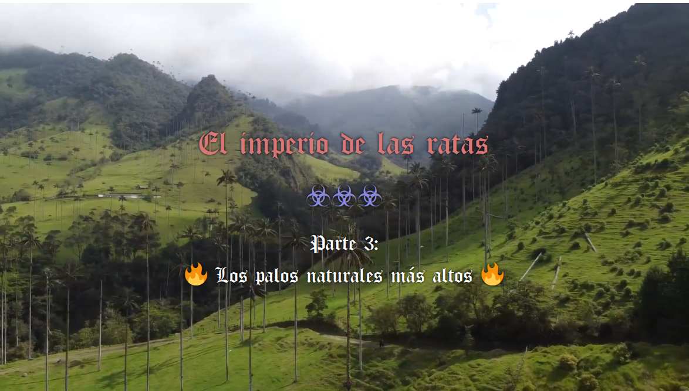

---

Aquí empieza la 3ª parte.

Pues a ver. Ya ignorando a «la voz», ¿ok? Vamos a hablar seriamente. Porque la palabra es «seriamente». Porque esto es «serio». Lo que dicen, como no respeta esto, pues no tanto.

Hace mucho tiempo, respondí con uno de los perfiles que he usado en Quora, la red social para empos antaño, ahora es una red de memes creo, pero que puedes encontrar cosas interesantes del tipo cosas ilegales, en general, también. Cultura, en general. En clave de listos, eso sí. Pero bueno, está tomada. O está tomada por bots, o está tomada por la red social misma, o la gente es... impredecible.

Aquí hay un rollo, es mi vida asquerosa esta, y nada, si no te apetece, sáltatelo. Simplemente, que desparramo asco, se me desborda, no... lo controlo, me han reventado la puta vida con derechos de mierda y peña de... básicamente, peña corta, yo les tengo que entender en parte. Y no tengo ganas de disimular ya, me han jodido, vivir así, sin ninguna puta garantía, no sé, no sabes a qué aferrarte, te quedas donde estás y ya. Bueno, te lo saltas si quieres, no lo puedo... callar, lo suelto, lo vomito, todo el rato, no se puede evitar.

El caso, que se divide por idiomas. Y en español, si buscas la verdad, una de las preguntas más clave, con diferencia, es «¿Qué es la lógica?». Eh, eeeeeeeeeeeeeeeeh, si buscas la verdad, ¿ok? Si buscas el quesito cual rata, pues igual no importa tanto. Jej. Bueno. Por enlazar.

Pues la cosa es... que esta pregunta es muy clave. La verdad. La base. 

Vale... *¿por qué la «verdad» es una palabra tan clave, dentro del diccionario?*

Mmmmm... ¿te gustaría vivir en una mentira? En una mentira... ¿controlada, quizás? En una mentira estudiada, medida, calculada. Para... no sé, ¿atraparte? Para... engañarte. Reírse de ti. Hacerte daño, hacerte sufrir, hacer pruebas contigo, minar números, minar datos, probar hardware, digo hardware refiriéndome a tu cuerpo, tu cerebro, tu fisonomía en general. Donde distraerte o donde aburrirte si no sigues el camino de los tests planificados para contigo, quizás. No sé, no sé cómo es tu vida. Pero... ¿te gustaría pensar que todos están compinchados contra ti? Que todos se conocen, entre ellos. Todos. Pero están disimulando. Quizá no tiene mucho sentido. Pero... igual es que ahora no parece tenerlo.

El caso es... que qué tal te parecería vivir en un mundo de mentira, donde tú eres el único estafado en él. Ni siquiera los que creerías, pensarías, están peor que tú, son de verdad. ¿Qué tal?

Vivir en una mentira. Un sitio donde eres la única persona engañada. Incuso... la única persona. Real, de verdad. La única, de verdad.

Pues la verdad, la verdad... igual sí te gustaría. Igual necesitas más variables para saberlo. Igual no, no sé, no importa.

El caso es que vivir entre mentiras, es una puta mierda, porque te pueden putear máximo. Que es un poco lo que vengo diciendo, pero el absurdo no se para, el absurdo continúa.

La cosa es que vivir entre mentiras, pueden estar jodiéndote vilmente, todos, quedándose contigo, sin entrar en la paranoia, si vives en una mentira, puedes vivir en una mentira qué-lo-flipas de elaborada. ¿Estamos de acuerdo?

Pues la preocupación por la... verdad, viene por esto. Porque vivir engañado un tiempo, pase. Pero parece que esto va para largo: ni educación, ni datos de la economía, ni datos de la política, vas a ciegas, y te ponen la negra, te joden la puta vida, no te dan trabajo, no te dan dinero, y todavía esperan que no te vuelvas loco. Lo digo. Incluso, te educaron para que no te vuelvas loco. Y se vuelve una lucha interna entre la programación pseudo-religiosa que te obligaron a comerte, porque sí, porque mira, y un montón de información desordenada, que nada te dice sobre qué tienes que hacer.

Aunque tu necesidad sea un fruto de un árbol. Que puede dar quilos de fruta si te curras el árbol.

De hecho, tener esa necesidad es una de las peores cosas. Pero ellos no responden. Nadie responde.

Evidentemente, estamos hablando de tener cubiertas otras ciertas. Sin esas otras ciertas, estás en la calle, nadie te va a dejar entrar, te van a mirar mal por sucio, siempre vas a ser una presencia incómoda, hasta que encuentres otros como tú. Son nazis, ya te lo he dicho. Y yo soy un negro judío para estos nazis. Me quieren ver así. Todos, es decir... yo no voy a caerte bien. NO VOY A CAERTE BIEN, de verdad. No es mi intención. Pero tengo una necesidad de ti. De alguien. De quién sea. Por eso os quiero un poco por igual. Porque en parte, entiendo que no tengas que pagarlo tú. Ni tú. Ni tú. Pero alguien.

Es decir, aplaudo al emprendedor. Lo aplaudo, de verdad. Pero es una ruleta. Igual te sale bien. Igual te enseñan todo el proceso, lo aprendes, etcétera. Igual ni eso.

Si este es el rollo, y yo sé, porque sé, que no te voy a caer bien, por algún motivo, porque me malinterpretas, porque no estás de acuerdo en algo, a saber. Incluso, hagas lo que hagas, tú, me vas a caer igual que los demás. Y mala mía si no es así. Porque sí, porque si todos muy majos, pero al final me tiene que salvar el estado y de esta sucia manera, como si no fuera ni un puto número, es que ni un puto número. En fin. Cosas mías, sí. Cosas mías...

La cosa es que bueno. Que no quiero ser tu puto amigo. Quiero que quede claro que a una persona se le respeta por ser persona. No te echo de tu casa. No «no te explico el proceso hasta que no te veas en él». No me vaciles, put... me cago en dios y me cago en toda la puta raza humana asquerosa de mierda, te lo digo así. No, es que no hay nada para eso. Pues quítate de ahí. Tú, quítate. Y tú, no me pongas.

Bueno, pues van así, del rollito. Del rollito. Provocándote. Jugando con el hambre. Yo no te quiero caer bien. Y sé que con los de mi actitud, mal. Maaaaaal. Mal.

Por lo cual, ya vas así. Como tenso, ¿no? Mínimo. Mínimo, tenso. Porque dan puto asco. Todos, en el fondo. Porque tú sí te vuelves loco, ellos se adaptan a esa mierda. ¿Entiendes? Así que después de todo, mi amiga la piedra. Mi amiga la piedra, me ayuda. Yo plantaría marihuana en campos masivos, tan ricamente. Aprendería, ayudaría. En fin. Que si aquí no se hacen respetar por norma, yo no tengo porqué seguir la norma, ¿okei? Bueno, o no okei, sé que soy minoría, y me imagino un poco, a lo que me enfrento. Pero es como si ya estuviera allí. Porque no hay derechos, no hay seguridad. Me dicen: pasa la cuerda. Y aquí no hay ni red ni pollas. Sé por dónde voy, se entiende también bastante por dónde van ellos.

Así que bueno, aquí les dejo mi muy seria respuesta sobre qué es la lógica.

He hecho [castelog](https://github.com/allnulled/castelog), he hablado sobre economía algorítmica y democracia directa.

Es decir, yo, menos nazi, imposible. YO. MENOS NAZI. IMPOSIBLE.

Lo malo de eso es que, en general, de golpe, se vuelve una raza inferior. Por no haber llegado a defender la idea de igualdad.

Por no haber llegado ni a la fórmula mínima de convivencia entre iguales.

No te culpo, es difícil, y creo que si me drogaran tanto, a mí, con cosas digo, la integridad es una droga también, integridad social, digo. Si me hubieran drogado más, te digo, igual nada de esto sucedería.

Es decir, después de todo, no soy quien yo quería ser. Soy quien me han hecho ser. Lo llamo piedra, pero a mí, la planta, no me hace mal. La planta está ahí. Son las personas. Los animales, ahí están. Incluso jabalines, que se les puede girar en cualquier momento, me lo creo, pero los jabalines, amigos. Los gatos, amigos. Los perros, amigos. Los pájaros, amigos. Mosquitos ya no, por ejemplo. Pero bueno. Los peores, las personas. Es así. Y sonríes, y tal, porque bueno. Pero ya lo saben, que estás loco porque no... porque no. Porque así, no, la puta constitución, estoy hablando de la puta constitución ¿eh? No sé si te das cuenta. Bueno, es igual.

Es igual. Pero ni a la igualdad. Te digo, ni a la puta igualdad social, llegamos. Que a mí me ha costado. Bueno, me ha costado tanto, que no lo aguanto, no lo acabo, me toca tanto los cojones, decir ahora que estoy aquí, pues no lo acabo. Que le jodan. El puto juego. Porque bueno... alguien está haciendo este juego. Al margen de ellos, digo. Están ellos, sí. Pero hay algo más también.

Y por eso, dame putos porros al menos. Pues no. Claramente, quieren enloquecerte. O lo prefieren. De hecho... pedirlos sería muy censurable ya.

Y ya está. Ni cabezón ni hostias, que a mí estos gilipollas no me pisan, que si tienes una empresa, y enseñas lo que haces a todos, pues cualquiera lo puede hacer, fin de la historieta. Mercado libre ni mercado libre. Mercado ratas, hombre. Secretos industriales, espionaje industrial. Putas ratas, hombre, por favor. Putas ratas oportunistas. Fin, hombre. Yo no me voy a meter ahí, estrés para qué, si nunca tienes el control. Si yo te monto RESTs automáticas, y esa peña está pidiendo no sé qué y no sé cuántos para programar RESTs, al final. Y un UI Builder. Ya está. Si soy uno. Ellos son miles de ingenieros, si quiere el que puede. Anda, hombre, tira pallá. Y ni así, lo mejor de todo, ni así me cogen. Iros todos a tomar por culo, hombre, me habéis vuelto loco aquí aprendiendo para qué, para que te coma la puta polla, pues no hombre, no. No así, colegui. Por eso, que no, no hay respeto, ni lo va a haber. Que no lo esperen. Tienen el dinero, suficiente. Suficiente. Y te digo, yo no voy a jugar a robar, esa mierda no. No, no. Yo me enfado, y me enfado. O me mato, o aquí algo no sale bien. Pero... no hombre, no. Izquierda ni izquierda. Pregunto a servicios sociales si me quedo fuera de casa qué pasa. Y me dicen que se improvisa algo. Ya improvisaremos, pero bueno, eso no va a pasar. Royo... tenemos que mover muchas cosas.

A mí me da putoigual que los ricos tengan. A mí lo que me jode es que toque a los demás. Y doy fe de que aquí, todos, TODOS, aunque sean ricos, son putopobres.

Se sienten pobres. Por eso son ratas. Por eso no dan. Se sienten siempre pobres. Yo voy de un euro. De dos. Todos son pobres, chaval. O te hacen pedir. Pedir. ¿Pedir? ¿PEDIIIIIR?

Sé que lo quieres. Pero puede que exista un conflicto. En el momento que te tengo que pedir, es eso, es que no soy ni un puto número. Ya a las personas no les miro, mejor. Porque eso, porque es demasiada la pobreza. Es demasiado el: pues no me caes bien. Igual es vergüenza, eh, ojo. A veces, no es ni que no les caigas bien. Es vergüenza, simplemente, cultura. Pero claro. Números. Cultura, palabras, blablabla, etc. Números. Cultura. Números. Hay que diferenciar, la cultura es aquí así, y mira. Los números, en la puta luna siguen funcionando.

Por todo esto, y los números empalman con la verdad, por todo esto, la lógica es bastante clave. 

Y estar enlazando eso, lógica, igualdad, economía, política... y solo. Porque no es con un equipo ni nada, es solo. Buah. Mientras recoges colillas. Mientras no te dan empleo ni para atrás. Y mientras no te sientes bien, simplemente necesitas una sustancia. Y te hacen un jueguecito tonto para poder obtenerla. Mientras, te la encarecen, ojo con ese punto. TE LA ENCARECEN A SACO. Te digo, es un puto árbol, y podrías sacar kilos si lo dejas crecer. Pues en éstas, estar tocando estos temas. Cuando enciendes la tele, y 10 pavos delante de cámara, no sé detrás, están cobrado por hablar putas paridas, paridas dichas así rollo clasista, royo intelectualoide, como lo que leerás a continuación, pero putas paridas. Y estos son los más cercanos a la plebe, ojo. Los que hablan de verdad, que hablan putas paridas también, son los diputados y esa gente, y ya hablan en un plano más serio. Putas paridas igual. Pero royo... consensuadas con el grupito. Con la sectita de los cojones. Anda, hombre, iros a tomar por culo.

Dicen que todo esto, tiene que ver con la oxitocina, la necesidad de relacionarse, etc. Es decir, es como si fuéramos, sin querer incluso, yonquis de la oxitocina. Que es una hormona, que se enciende al interactuar y cosas del tipo así, sexo, la lactancia, no sé, la verdad, para mí el mundo micro es como magia. Porque no lo veo. Así que me creo, pero hasta cierto punto. Pero sí, eso dicen. Oxitocina es digamos... la droga natural de socializar.

Pues con esa mierda, nos mantienen drogados para no ir de frente y de raíz al puto problema.

Pero claro, hay un recorrido.

Y yo estoy en esa mierda, estoy recorriéndolo. Y me están jodiendo por el camino. De hecho, ya te digo, como quieras de más, que es vivir, es querer vivir, para mí la marihuana es querer vivir, pues como quieras de más, mal. Cara. Muy cara. Es una sangre de unicornio muy cara. Psssssssssst. Colegui. Ey, colegui. Colegui: es un puto árbol.

Ahí lo lees. Ahí te queda claro. Ellos comer carne, guai. Pero plantar un árbol y dejar que crezca, pst, mal. Maaaaaaaaaaaal. Árbol, mal. Unicornio muerto, bien.

Te están jodiendo. Porque sí, porque si todos fuéramos vegetarianos, pues todos vegetarianos, fácil. Mira India. 70% vegetarianos. Y son, en India son, eh.

Pues marihuana, allí, ni la conocen. Preguntas a un chaval, que dices eres un chaval, eres joven. Indio. Y no la conocen. Pero la tienen en el bosque. De mala calidad, supongo. Pero la tienen así, pim. Aquí, 10€ el gramo. Jej. Allí pim, bosque. Y todos vegetarianos. Pero ojo, ojo cuidado, que tienen los parias. En fin, todo es bastante loco, todo muy loco. Solo, culturas diferentes, informaciones diferentes.

Por eso, cultura, números, cultura, números. Separemos.

Por eso, la verdad, es importante.

Ya está, es lo que tiene, hay que soltarlo. Porque es un absurdo, y me va a atropellar. Y estoy avisando. Que me va a atropellar. Y nada. Pues ok. Yo lo digo. La verdad, importa.

LA VERDAD, IMPORTA. Por eso, ¿Qué es la lógica? Ahí te va.

Pero bueno. Si lo he entendido bien, tú funcionarías con una droga con la cual, si no te caigo bien, no entiendes, no empatizas, no nada. Así que... eso, la verdad. Tus cojones. Pues los míos también. Qué vamos a hacer, no puedo, yo no puedo, no puedo comportarme para caerte bien. No es que ni no quiera, ni no sepa, es que no puedo comportarme así, la verdad. Es decir, puedes verlo como una enfermedad. Pero a mí, el grupo *humans*, son peligrosos. Me dan miedo, es así, realmente, estoy amenazado por mi propia especie. Cosa que discuto, porque me siento como un toro, siendo toreado, y al toro, no le tratan como un igual, no ponen a una persona donde el toro. Pues yo... me siento un poco toro. Por eso, porque me están toreando. Igual, desde luego, no. El asco y todo eso me supera. Yo no puedo comportarme para caerte bien. Sé que eres un yonqui de eso, oxitocina, amor, no sé. Yo un poco también, pienso, porque si no, no me toreas. Pero me autoquiero también, cosa que no asocio a la oxitocina solamente. Es decir, independientemente de que me des amor o comida, yo me quiero. Pero al final, tengo que convivir con gente que es como tú, yonkis de amor, gente así, que no separa número de cultura. Así que bueno, me quiero tanto, que igual lo mejor es matarse.

Sabes que la van a tener cara. Y que es solo un parche. Lo que están haciendo, en general, da puto asco, la verdad. Igual si pillas pasta, igual. Y ni lo creo, la verdad. Ni eso creo. Porque es cierto, teniendo pasta, te sientes pobre también. Es tristísimo. Ni todos, ni siempre. Pero que en parte, es una mierda, lo reconozco, he tenido pasta, y doy así en plan ONGs, aunque no creo que sea la solución, di un tiempo, pero qué va, la solución es eso, constitución. Pero qué va. Y te sientes pobre siempre, cuando tienes. Pero no para reprochárselo a los legisladores, eso no. En el camino.

Verdad, lógica. Ahí estamos, preocupándonos todavía.

Venga, ale, gou.

Bueno, la lógica es el estudio de la verdad, por si no estaba claro. La empezó, dicen, Aristóteles, como 300 o 400 años antes de Cristo. Luego, Cristo, dijo: «la verdad los hará libres». Pero no hay referencias de la lógica ni de Aristóteles en la Biblia, por eso.

No hace falta. Vives en una secta. Y parece que va de trepar en esa secta. Y en la secta, de la cual no te han enseñado salir, más que matándote, y ni eso, 

La lógica empalma con las matemáticas, pues no sé por qué, la verdad. Pero las matemáticas dan por sentada la lógica. Porque hay operadores lógicos en la matemática y en la programación. 

Hay gente que se ha currado intentar explicar por qué lógica y números. Pero digamos, en la época de Aristóteles, números, ya había. Fue él el que empezó a hablar de lógica. Y te puedes esperar que alguien ya estuviera dando nociones antes, claro. Pero bueno, te ha llegado Aristóteles, pues bueno, pues ese. No importa quién, importa que lo empezó. Y que ahora, los ordenadores se fundamentan en eso. En cierta forma, en ciertos sentidos. Es igual.

Lo que queda, es eso, es lógica, verdad, números, programación.

Y la lógica solo es como el vehículo. Luego están los datos. Pero bueno, esto te hace ser consciente de la falta de datos, precisamente, tanto de política como de economía. Ya está. A partir de ahí, me justifico hasta estar loco.

No sé, da igual. No te voy a caer bien, está claro. Te tengo que gustar, esa es tu lógica. Y mi lógica no computa qué te gusta. Y si lo computa, no es capaz de fingirlo. Así que te lo dejo aquí, y gou.

### La lógica

**Índice:**

1. [La lógica](la-lógica)
    1. [Definición de lógica](definición-de-lógica)
    1. [Definición de inferencia](definición-de-inferencia)
    1. [Definición de falacia](definición-de-falacia)
    1. [Definición de paradoja](definición-de-paradoja)
    1. [Definición de sofisma](definición-de-sofisma)
    1. [Definición de proposición](definición-de-proposición)
    1. [Definición de premisa](definición-de-premisa)
    1. [Definición de conectiva lógica](definición-de-conectiva-lógica)
    1. [Definición de sentencia atómica](definición-de-sentencia-atómica)
    1. [Definición de sentencia molecular](definición-de-sentencia-molecular)
    1. [Definición de lógica de clases](definición-de-lógica-de-clases)
    1. [Conectiva 1. Condicional.](conectiva-1.-condicional.)
    1. [Conectiva 2. Condicional bidireccional.](conectiva-2.-condicional-bidireccional.)
    1. [Conectiva 3. Negación.](conectiva-3.-negación.)
    1. [Conectiva 4. Conjunción.](conectiva-4.-conjunción.)
    1. [Conectiva 5. Disyunción.](conectiva-5.-disyunción.)
    1. [Conectiva 6. Disyunción exclusiva.](conectiva-6.-disyunción-exclusiva.)
    1. [Conectiva 7. Tautología.](conectiva-7.-tautología.)
    1. [Conectiva 8. Contradicción.](conectiva-8.-contradicción.)
    1. [Conectiva 9. Cuantificador universal.](conectiva-9.-cuantificador-universal.)
    1. [Conectiva 10. Cuantificador existencial.](conectiva-10.-cuantificador-existencial.)
    1. [Conectiva 11. Cuantificador de unicidad.](conectiva-11.-cuantificador-de-unicidad.)
    1. [Conectiva 12. Definición.](conectiva-12.-definición.)
    1. [Conectiva 13. Grupo precedente.](conectiva-13.-grupo-precedente.)
    1. [Conectiva 14. Deducción.](conectiva-14.-deducción.)
    1. [Conectiva 15. Deducción semántica.](conectiva-15.-deducción-semántica.)
    1. [Elemento 16. Clase universal](elemento-16.-clase-universal)
    1. [Elemento 17. Clase vacía](elemento-17.-clase-vacía)
    1. [Elemento 18. Individuos, objetos, elementos o instancias](elemento-18.-individuos,-objetos,-elementos-o-instancias)
    1. [Operador 19. Pertenencia](operador-19.-pertenencia)
    1. [Operador 20. No pertenencia](operador-20.-no-pertenencia)
    1. [Operador 21. Contenencia](operador-21.-contenencia)
    1. [Operador 22. No contenencia](operador-22.-no-contenencia)
    1. [Operador 23. Proporcionalidad](operador-23.-proporcionalidad)
    1. [Operador 24. Intersección](operador-24.-intersección)
    1. [Operador 25. Unión](operador-25.-unión)
    1. [Operador 26. Por consiguiente](operador-26.-por-consiguiente)
    1. [Operador 27. Similitud](operador-27.-similitud)
    1. [Operador 28. No similitud](operador-28.-no-similitud)
    1. [Operador 29. Igualdad aproximada](operador-29.-igualdad-aproximada)
    1. [Operador 30. Aproximación](operador-30.-aproximación)
    1. [Operador 31. Igualdad](operador-31.-igualdad)
    1. [Operador 32. Identidad](operador-32.-identidad)
    1. [Operador 33. Subconjunto](operador-33.-subconjunto)
    1. [Operador 34. No subconjunto](operador-34.-no-subconjunto)
    1. [Operador 35. Superconjunto](operador-35.-superconjunto)
    1. [Operador 37. Subconjunto o igualdad](operador-37.-subconjunto-o-igualdad)
    1. [Operador 38. Superconjunto o igualdad](operador-38.-superconjunto-o-igualdad)
    1. [Respuesta final: ¿Qué es la lógica?](respuesta-final-¿qué-es-la-lógica?)
    1. [Fuentes](fuentes)

### Lógica

Según Wikipedia, la lógica [1] se define como sigue:

> La lógica es la ciencia formal y rama tanto de la filosofía como de las matemáticas que estudia los principios de la demostración y lainferencia válida,​ las falacias, las paradojasy la noción de verdad.

### Inferencia

En cuanto a inferencia [2] se refiere:

> La inferencia es el proceso por el cual se derivan conclusiones a partir de premisas. Cuando una proposición se sigue de otras de ese modo, se dice que éstas implican aquélla.

### Falacia

En cuanto a falacia [3] se refiere:

> En lógica, una falacia (del latín: fallacia, ‘engaño’) es un argumento que parece válido, pero no lo es.1​2​ Algunas falacias se cometen intencionalmente para persuadir o manipular a los demás, mientras que otras se cometen sin intención debido a descuidos o ignorancia.

- Definición de «lógica» de [https://es.wikipedia.org/wiki/Lógica](https://es.wikipedia.org/wiki/Lógica).
- Definición de «inferencia» de [https://es.wikipedia.org/wiki/Inferencia](https://es.wikipedia.org/wiki/Inferencia).
- Definición de «falacia» de [https://es.wikipedia.org/wiki/Falacia](https://es.wikipedia.org/wiki/Falacia).

### Paradoja

En cuanto a paradoja [4] se refiere:

> Una paradoja (del latín paradoxa, ‘lo contrario a la opinión común’) o antilogía es una idea extraña opuesta a lo que se considera verdadero a la opinión general.​ También se considera paradoja a una proposición en apariencia falsa o que infringe el sentido común, pero no conlleva una contradicción lógica, en contraposición a un sofisma que solo aparenta ser un razonamiento válido.

### Sofismo

La paradoja y el sofismo [5] se diferencian, por tanto, en lo siguiente:

> Un sofisma es una refutación o silogismo aparente, con objetivo de defender algo falso confundiendo al oyente o interlocutor, mediante una argucia en la argumentación. Una falacia lógica es una proposiciónpresentada como verdadera en una afirmación, pero que solo lo es aparentemente.

Por tanto: la paradoja es una proposición que parece falsapero no es ilógica, mientras que el sofisma es una proposición que parece verdadera pero sí es ilógica.

O más simple todavía: la paradoja es una proposición que parece mentira pero es verdad, y el sofisma es una proposición que parece verdad pero es mentira.

### Proposición

En cuanto a proposición [6] se refiere:

> En filosofía y lógica, el término proposición se usa para referirse a las entidades portadoras de los valores de verdad.
Los objetos de las creencias y de otras actitudes proposicionales.
El significado de las oraciones declarativas o enunciativas, como <el Sol es una estrella>.

> Intuitivamente una proposición expresa un contenido semántico a la que bajo cierto procedimiento acordado o prescrito es posible asignarle un valor de verdad (usualmente “verdadero” o “falso”, aunque en lógica formal se admiten otros valores de verdad diferentes).2​

> Una proposición es una cadena de signos expresados en un determinado lenguaje.

En otras palabras, una proposición es una oración [en un lenguaje, sea natural o no] estructuralmente válida [o bien formada], aunque su valor pueda verdad, mentira oindeterminado. O una oración o sentencia, vaya, sea verdad, mentira o indeterminada.

### Premisa

En cuanto a premisa [7] se refiere:

> En lógica, una premisa es cada una de las proposiciones anteriores a la conclusión de argumento.​ En un argumento válido, las premisas implican la conclusión, pero esto no es necesario para que una proposición sea una premisa: lo único relevante es su lugar en el argumento, no su rol. Al ser proposiciones, las premisas siempre afirman o niegan algo que puede ser verdadero o falso.

Con este vocabulario base, podemos proceder a lasconectivas lógicas, que serían las encargadas de conectar lógicamente una o varias proposiciones.

### Conectiva lógica

En cuanto a conectiva lógica [8] se refiere:

> En lógica, una conectiva lógica, o simplemente conectiva, (también llamadooperador lógico o conectores lógicos) es un símbolo o palabra que se utiliza para conectar dos fórmulas [o proposiciones] bien formadas o sentencias (atómicas omoleculares), de modo que el valor de verdad de la fórmula compuesta depende del valor de verdad de las fórmulas componentes.

Antes de volver a profundizar en las conectivas lógicas, que es donde explaya la intríngulis lógica [o coherencia], vale la pena solventar 2 conceptos más: las sentencias [o proposiciones, vaya] moleculares y atómicas.

### Sentencia atómica y sentencia molecular

En cuanto a sentencia atómica y sentencia molecular [9] se refiere:

> En lógica, una sentencia atómica es un tipo de sentencia declarativa que puede serverdadera o falsa (también puede ser referido como una proposición, declaración o portador de la verdad) y que no puede ser dividida en otras sentencias más simples.

> Por ejemplo, <El cachorro corrió> es unasentencia atómica en lenguaje natural, mientras que <El cachorro corrió y el gato se escondió> es una sentencia molecular en lenguaje natural.

En el caso del ejemplo anterior, la sentencia molecular es el resultado compuesto de 2 sentencias atómicas unidas por una conectiva lógica, la de conjunción. Ahora vamos con ello.

Dicho esto, quedan claro bastantes de los conceptos base de lalógica. Sin embargo, las conectivas lógicas u operadores lógicos son los que van a dar coherencia y valor de verdad [o mentira] a las nuevas inferencias [o conclusiones] que sepamos y queramos desvelar de nuestras argumentaciones lógicas.

Por tanto, dicho esto, vamos a hacer un repaso a lasconectivas lógicas principales [10]. Cuando acabemos con ellas, continuaremos la misma enumeración [de las conectivas lógicas] con los elementos de clases y operadores lógicos[11].

Antes de ello, hacer una mención a la lógica de clases, de la cual también explicaremos algunos símbolos.

### Lógica de clases

En cuanto a lógica de clases [12] se refiere:

> La lógica de clases analiza la proposición lógica considerando la pertenencia o no pertenencia de un elemento o individuo clasificado por poseer una determinada propiedad.​ Sobre esta lógica se formaliza como modelo científico la teoría matemática de conjuntos.

Ahora sí, procedamos a explicar las conectivas, loselementos y los operadores de la lógica, en general.

### Conectiva 1. Condicional.

Definición:

> Hace depender [la verdad de] una proposición [o un conjunto de ellas] en función de [la verdad de] otra proposición [o un conjunto de ellas],

Símbolos: ⇒, →, ⊃

Uso: A → B

Lenguaje natural:

> A implica B.
Si A entonces B.

### Conectiva 2. Condicional bidireccional.

Definición:

> No solo hace depender a la primera proposición [o el primer conjunto de ellas] de la segunda proposición [o el segundo conjunto de ellas], sino que también hace depender a la segunda proposición [o el segundo conjunto de ellas] de la primera proposición [o el primer conjunto de ellas]. Por tanto, una [la primera o la segunda proposición] implica a la otra, indistintamente de cual sea primera o segunda.

Símbolos: ⇔, ≡, ↔

Uso: A ↔ B

Lenguaje natural:

> Solo A implica B.
Si y solo si A entonces B.

### Conectiva 3. Negación.

Definición:

> Niega [el valor de] una proposición.

Símbolos: ¬, ˜, !

Uso: ¬A

Lenguaje natural:

> No A.
Falso que A.

### Conectiva 4. Conjunción.

Definición:

> Agrupa 2 proposiciones en 1, y el valor [de verdad] de la proposición resultante ahora dependerá del valor [de verdad] de sus componentes. Este operador fuerza a que los componentes sean todos verdad para que la proposición resultante sea verdad.

Símbolos: ∧, •, &

Uso: A ∧ B

Lenguaje natural:

> A y B.
A y también B.

### Conectiva 5. Disyunción.

Definición:

> Agrupa 2 proposiciones en 1, y el valor [de verdad] de la proposición resultante ahora dependerá del valor [de verdad] de sus componentes. Este operador fuerza a que al menos un componente sea verdad para que la proposición resultante sea verdad. Pueden ser los dos verdad, o uno verdad, pero no los dos mentira.

Símbolos: ∨, +, ǀǀ, |

Uso: A ∨ B

Lenguaje natural:

> A o B.

### Conectiva 6. Disyunción exclusiva.

Definición:

> Agrupa 2 proposiciones en 1, y el valor [de verdad] de la proposición resultante ahora dependerá del valor [de verdad] de sus componentes. Este operador fuerza a que solo un componente sea verdad para que la proposición resultante sea verdad: no pueden ser los dos verdad, ni los dos mentira, solo uno verdad y el otro mentira.

Símbolos: ⊕, ⊻

Uso: A ⊻ B

Lenguaje natural:

> O solo A o solo B.

### Conectiva 7. Tautología.

Definición:

> Afirma como verdadera una proposición.

Símbolos: ⊤, T, 1

Uso: ⊤A

Lenguaje natural:

> Es verdad que A.
A es verdad.

### Conectiva 8. Contradicción.

Definición:

> Afirma como falsa [o mentira] una proposición.

Símbolos: ⊥, F, 0

Uso: ⊥A

Lenguaje natural:

> Es falso que A.
A es falso.

### Conectiva 9. Cuantificador universal.

Definición:

> Hace referencia a todas las unidades [o ejemplares o instancias u objetos] de una clase [de unidades o ejemplares o instancias u objetos].

Símbolos: ∀

Uso: ∀A

Lenguaje natural:

> Para todo A
Todo A
Todas las instancias de A

### Conectiva 10. Cuantificador existencial.

Definición:

> Hace referencia a alguna de todas las unidades [o ejemplares o instancias u objetos] de una clase [de unidades o ejemplares o instancias u objetos].

Símbolos: ∃

Uso: ∃A

Lenguaje natural:

> Para por lo menos un A
Algún A
Alguna instancia de A

### Conectiva 11. Cuantificador de unicidad.

Definición:

> Hace referencia a solo una de todas las unidades [o ejemplares o instancias u objetos] de una clase [de unidades o ejemplares o instancias u objetos].

Símbolos: ∃!

Uso: ∃!A

Lenguaje natural:

> Para solo un A
Solo un A
Solo una instancia de A

### Conectiva 12. Definición.

Definición:

> Determina a una proposición como la definición de otra proposición.

Símbolos: :=, ≡, :⇔

Uso: A := B

Lenguaje natural:

> A se define como B.
La definición de A es B.
A significa B.

### Conectiva 13. Grupo precedente.

Definición:

> Agrupa proposiciones.

Símbolos: ( )

Uso: (A v B) ∧ (C ∧ D)

Lenguaje natural:

> grupo A o B agrupado y grupo C y D agrupado.

Nota: el lenguaje natural presenta claros problemas al agrupar símbolos, dado que de manera fonética no está provisto de delimitadores grupales. No obstante, aquí intentamos darle una opción.

### Conectiva 14. Deducción.

Definición:

> Demuestra [o presupone demostrar] la validez de una proposición según la validez de una [proposición] anterior.

Símbolos: ⊢

Uso: A ⊢ B

Lenguaje natural:

> De A se deduce B.
B puede ser probado por A.

### Conectiva 15. Deducción semántica.

Definición:

> Demuestra [o presupone demostrar] la validez de una proposición según la validez y carga semántica [o la definición] de una [proposición] anterior.

Símbolos: ⊨

Uso: A ⊨ B

Lenguaje natural:

> Del significado de A se deduce B.
B puede ser probado por la definición A.

### Elemento 16. Clase universal

Definición:

> Elemento que sirve para referirse a todos los objetos de un conjunto o contexto dado.

Símbolos: U

Uso: U

Lenguaje natural:

> El Universo
El Todo

### Elemento 17. Clase vacía

Definición:

> Elemento que sirve para referirse a ningún objeto de un conjunto o contexto dado.

Símbolos: Ø

Uso: Ø

Lenguaje natural:

> La Nada
El Vacío

### Elemento 18. Individuos, objetos, elementos o instancias

Definición:

> Elementos [de alguna clase].

Símbolos: ₀ ₁ ₂ ₃ ₄ ₅ ₆ ₇ ₈ ₉ …

Uso: x₀, x₁, x₂, x₃, x₄,…

Lenguaje natural:

> x0, x1, x2, x3, x4....

Nota: la x es simplemente un nombre aleatorio.

### Operador 19. Pertenencia

Definición:

> Operador que sirve para declarar a una proposición como perteneciente a otra [proposición].

Símbolos: ∈

Uso: A ∈ B

Lenguaje natural:

> A pertenece a B

### Operador 20. No pertenencia

Definición:

> Operador que sirve para declarar a una proposición como no perteneciente a otra [proposición].

Símbolos: ∉

Uso: A ∉ B

Lenguaje natural:

> A no pertenece a B

### Operador 21. Contenencia

Definición:

> Operador que sirve para declarar a una proposición como contenida en otra [proposición].

Símbolos: ∋

Uso: A ∋ B

Lenguaje natural:

> A está contenida en B

### Operador 22. No contenencia

Definición:

> Operador que sirve para declarar a una proposición como no contenida en otra [proposición].

Símbolos: ∌

Uso: A ∌ B

Lenguaje natural:

> A no está contenida en B

### Operador 23. Proporcionalidad

Definición:

> Operador que sirve para declarar a una proposición como proporcional a otra [proposición].

Símbolos: ∝

Uso: A ∝ B

Lenguaje natural:

> A es proporcional a B

### Operador 24. Intersección

Definición:

> Hace referencia al conjunto de elementos comunes de un conjunto y otro [conjunto].

Símbolo: ∩

Uso: A ∩ B

Lenguaje natural:

> Los elementos comunes en A y B.
Los elementos que aparecen tanto en A como en B.

### Operador 25. Unión

Definición:

> Hace referencia al conjunto de elementos existentes en dos conjuntos.

Símbolo: ∪

Uso: A ∪ B

Lenguaje natural:

> Los elementos de A y de B.

### Operador 26. Por consiguiente

Definición:

> Expresa consecuencia.

Símbolo: ∴

Uso: A ∴ B

Lenguaje natural:

> A, por tanto B.

### Operador 27. Similitud

Definición:

> Expresa similitud entre dos proposiciones.

Símbolo: ∼

Uso: A ∼ B

Lenguaje natural:

> A es similar a B.

### Operador 28. No similitud

Definición:

> Expresa no similitud entre dos proposiciones.

Símbolo: ≁

Uso: A ≁ B

Lenguaje natural:

> A no es similar a B.

### Operador 29. Igualdad aproximada

Definición:

> Expresa que una proposición es aproximadamente igual a otra [proposición].

Símbolo: ≅

Uso: A ≅ B

Lenguaje natural:

> A es aproximadamente igual a B.

### Operador 30. Aproximación

Definición:

> Expresa que una proposición es suficientemente aproximada a otra [proposición].

Símbolo: ≈

Uso: A ≈ B

Lenguaje natural:

> A es suficientemente aproximado a B.

### Operador 31. Igualdad

Definición:

> Expresa que una proposición es igual a otra proposición.

Símbolo: =

Uso: A ≠ B

Lenguaje natural:

> A es igual a B.

### Operador 32. Identidad

Definición:

> Expresa que una proposición es idéntica a otra proposición.

Símbolo: ≡

Uso: A ≡ B

Lenguaje natural:

> A es idéntica a B.

### Operador 33. Subconjunto

Definición:

> Expresa que un conjunto es parte [o subconjunto] de otro conjunto.

Símbolo: ⊂

Uso: A ⊂ B

Lenguaje natural:

> A es un subconjunto de B.
A es parte de B.

### Operador 34. No subconjunto

Definición:

> Expresa que un conjunto es parte [o subconjunto] de otro conjunto.

Símbolo: ⊄

Uso: A ⊄ B

Lenguaje natural:

> A no es un subconjunto de B.
A no es parte de B.

### Operador 35. Superconjunto

Definición:

> Expresa que un conjunto incluye a [o es un superconjunto de] otro conjunto.

Símbolo: ⊃

Uso: A ⊃ B

Lenguaje natural:

> A es un superconjunto de B.
A incluye a B.

### Operador 36. No superconjunto

Definición:

> Expresa que un conjunto incluye a [o es un superconjunto de] otro conjunto.

Símbolo: ⊅

Uso: A ⊅ B

Lenguaje natural:

> A no es un superconjunto de B.
A no incluye a B.

### Operador 37. Subconjunto o igualdad

Definición:

> Expresa que un conjunto es igual [que] o es parte [o subconjunto] de otro conjunto.

Símbolo: ⊆

Uso: A ⊆ B

Lenguaje natural:

> A es igual o subconjunto de B.
A es igual o es parte de B.

### Operador 38. Superconjunto o igualdad

Definición:

> Expresa que un conjunto es igual [que] o incluye a [o es un superconjunto de] otro conjunto.

Símbolo: ⊇

Uso: A ⊇ B

Lenguaje natural:

> A es igual o es un superconjunto de B.
A es igual o incluye a B.

-----

Bueno, más allá de esto, que sería una base, está directamente JavaScript, Castelog, o cualquier lenguaje de programación, que tiene todo esto, y más. Así de fácil. En filosofía, la carrera universitaria de Filosofía, hablan de lógica. Pero no de programación, ni de lenguajes. Y ya está, fin, yo estudié filosofía, y la búsqueda de la verdad, desde allí, empieza aquí, en la programación. En Filosofía te enseñan a parsear lenguaje natural con palabras muy abstractas, y cuando te pones a hablar, en plan filosófico, lo normal es que digas muchas palabras para decir realmente muy pocas cosas. Con muchos matices, y que requieren mucha capacidad para interpretar, porque son mensajes largos. Pero, básicamente, poca lógica, mucha palabra. Como ahora los políticos. O la ley. La ley de los políticos. Y todo así.

En resumen, que yo me planto aquí. Lo que sigue es:

1. Ir ampliando la lista, con nuevos elementos lógicos.
1. Luego, además, ir ampliando las expresiones de lenguaje natural que denotan o implican de alguna forma a estos elementos ya expuestos inicialmente, y los otros con los que se pueda ampliar la lista.
1. Luego, además, poner su equivalente en un lenguaje de programación, sea [Castelog](https://github.com/allnulled/castelog), o sea JavaScript, o Java, o C/C++, o el que sea.
1. Finalmente, crear un programa, basado en un parser de lenguaje natural, como el que se usa en [core-nlp-wrapper](https://github.com/allnulled/core-nlp-wrapper). Integrar las expresiones listadas en el punto 2 en el parser, para que automáticamente integre, de forma lógica, las expresiones naturales (o en lenguaje natural) que denotan lógica, para así ir creando una máquina que «entienda y respete» la lógica, de forma consciente.

Pero es igual, la trampa en el ámbito de la informática ya la sabíamos: que siempre te tienes que estar actualizando, decían. No, es que básicamente, está todo hecho. Y se te mete en una puta historia de mierda, donde con la escusa del capitalismo (tan pésimamente) intervenido (que si mercado libre, que si espionaje industrial, que si la privatización de la educación tanto preuniversitaria como universitaria, que si patentes, que si secretos empresariales, que si cursos de pago, que si industria de la educación y formación, que si gente queriendo subir de rango o mantenerse en un puesto, que si bla bla bla) pues te mantienen, directamente, fuera de juego, en manos de unas personas que están deseando que te mueras o que sufras, o yo qué sé. Sin trabajo, porque aunque sepas hacer lo que piden, no te llaman y ya está. O directamente te invisibilizan los portales de empleo principales, y fuera. O te pinchan el correo. No importa, hay mil formas. Mil. Mil formas para joderte. En última instancia, la empresa no tiene por qué aceptarte, ni el cliente por qué venir. Fin del juego, todo es la puta piedra, y no sabes si eras un experimento, si eras un tonto con cámara oculta, no sabes. No sabes, sabes que estás jodido, y que siempre pueden joderte más. Pero ya está, no mucho más. Que nadie hace nada. Que a los demás, en general, les funciona este sistema de mierda que te deja en pelotas, al menos lo suficiente como para no estar como tú. En fin.

Preferiría tener una máquina y hablar con ella, que enfrentarme a estos yonkis de mierda. Y es, un poco, lo que estoy esbozando: el camino para continuar. Esta puta peña está puto enferma, pero hasta que no enloquezcas tú, no pasará nada. Tienen la puta pasta. A su enfermedad mental, la financian. A la mía, la ahogan con la suya. Ratas de mierda... y bueno, eso. Que siga otro, si quiere, yo no sé. Ojalá hoy me muera y se acabe esta puta mierda.

Ojalá. De verdad. Si no hoy, pronto. Por ti. Porque, en general, eres una persona, y das puto asco y puto miedo. Y yo hablo mal, pero tú piensas mal, actúas mal, y aún y así, te financian. Te financian porque esto es el infierno, y tu conducta es la propia. Así que si muero, pues bien muerto habré. Ojalá. De corazón, ojalá.

-----

Finalemente, creo que los secuoyas son más altos que las palmeras de Cocora. Pero estas son más bonitas, y limpias. Es como si... bueno, ChatGPT puede ser la hostia, pero si no puedes seguirle el hilo, si no puedes programar con él, pues será muy tocho, pero el tonto siempre has sido tú. Así que el secuoya, para mí, no vale. Porque el tonto eres tú, el que tiene que aprender lógica, eres tú. Yo ya sé que un procesador puede ir muy rápido. La cosa es cómo usamos ese procesador. Ese, y tantos otros recursos. Y eso depende de tu lógica. Y ya está. Por eso, las palmeras de Cocora, que puedes seguirle el hilo claramente. Otros árboles, te van a liar. Este, no. Este, es limpio, es claro. Pues esta es, un poco, la metáfora. Y claro, Palo Alto, donde dicen que pasan tantos datos nuestros. Pues eso.

Comed, ratas, comed. Comed vuestro queso roñoso.