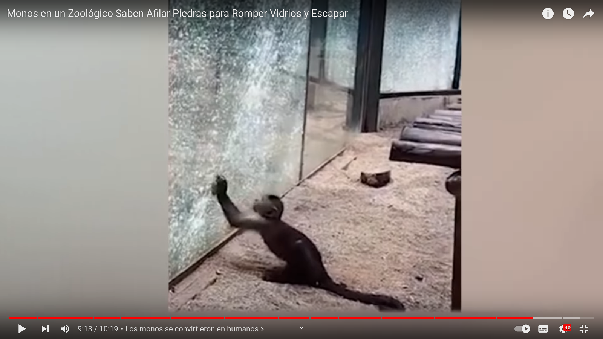
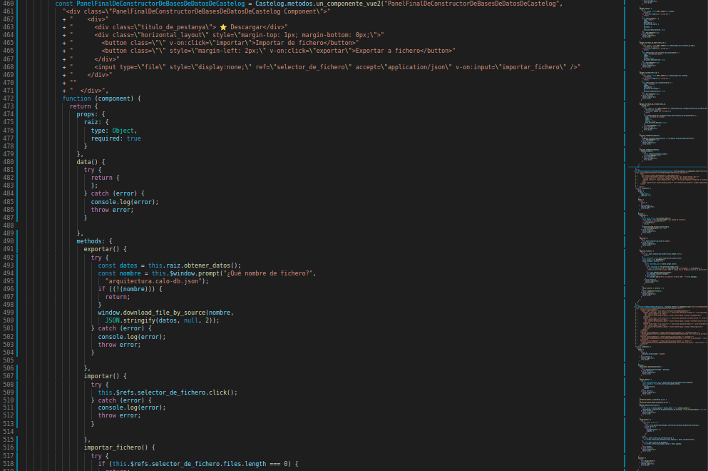
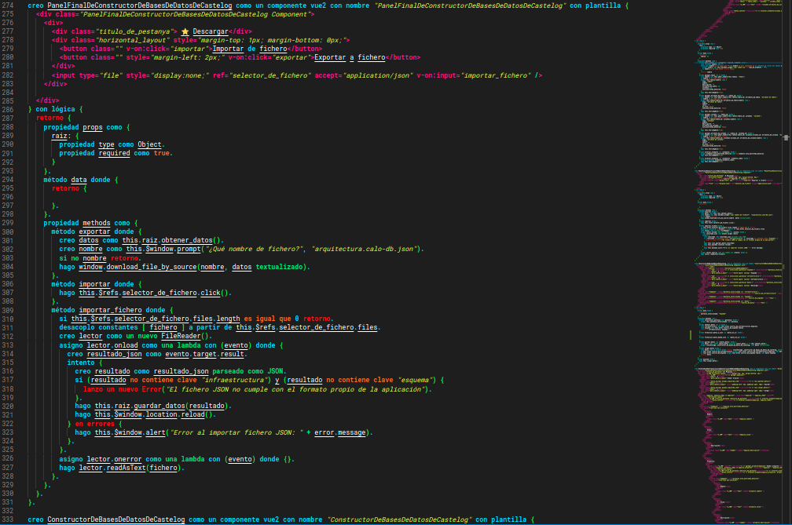

-----

#### Índice

1. [Contextualización](#contextualización)
1. [La lógica](#la-lógica)
    1. [Definición de lógica](#definición-de-lógica)
    1. [Definición de inferencia](#definición-de-inferencia)
    1. [Definición de falacia](#definición-de-falacia)
    1. [Definición de paradoja](#definición-de-paradoja)
    1. [Definición de sofisma](#definición-de-sofisma)
    1. [Definición de proposición](#definición-de-proposición)
    1. [Definición de premisa](#definición-de-premisa)
    1. [Definición de conectiva lógica](#definición-de-conectiva-lógica)
    1. [Definición de sentencia atómica](#definición-de-sentencia-atómica)
    1. [Definición de sentencia molecular](#definición-de-sentencia-molecular)
    1. [Definición de lógica de clases](#definición-de-lógica-de-clases)
    1. [Conectiva 1. Condicional.](#conectiva-1.-condicional.)
    1. [Conectiva 2. Condicional bidireccional.](#conectiva-2.-condicional-bidireccional.)
    1. [Conectiva 3. Negación.](#conectiva-3.-negación.)
    1. [Conectiva 4. Conjunción.](#conectiva-4.-conjunción.)
    1. [Conectiva 5. Disyunción.](#conectiva-5.-disyunción.)
    1. [Conectiva 6. Disyunción exclusiva.](#conectiva-6.-disyunción-exclusiva.)
    1. [Conectiva 7. Tautología.](#conectiva-7.-tautología.)
    1. [Conectiva 8. Contradicción.](#conectiva-8.-contradicción.)
    1. [Conectiva 9. Cuantificador universal.](#conectiva-9.-cuantificador-universal.)
    1. [Conectiva 10. Cuantificador existencial.](#conectiva-10.-cuantificador-existencial.)
    1. [Conectiva 11. Cuantificador de unicidad.](#conectiva-11.-cuantificador-de-unicidad.)
    1. [Conectiva 12. Definición.](#conectiva-12.-definición.)
    1. [Conectiva 13. Grupo precedente.](#conectiva-13.-grupo-precedente.)
    1. [Conectiva 14. Deducción.](#conectiva-14.-deducción.)
    1. [Conectiva 15. Deducción semántica.](#conectiva-15.-deducción-semántica.)
    1. [Elemento 16. Clase universal](#elemento-16.-clase-universal)
    1. [Elemento 17. Clase vacía](#elemento-17.-clase-vacía)
    1. [Elemento 18. Individuos, objetos, elementos o instancias](#elemento-18.-individuos,-objetos,-elementos-o-instancias)
    1. [Operador 19. Pertenencia](#operador-19.-pertenencia)
    1. [Operador 20. No pertenencia](#operador-20.-no-pertenencia)
    1. [Operador 21. Contenencia](#operador-21.-contenencia)
    1. [Operador 22. No contenencia](#operador-22.-no-contenencia)
    1. [Operador 23. Proporcionalidad](#operador-23.-proporcionalidad)
    1. [Operador 24. Intersección](#operador-24.-intersección)
    1. [Operador 25. Unión](#operador-25.-unión)
    1. [Operador 26. Por consiguiente](#operador-26.-por-consiguiente)
    1. [Operador 27. Similitud](#operador-27.-similitud)
    1. [Operador 28. No similitud](#operador-28.-no-similitud)
    1. [Operador 29. Igualdad aproximada](#operador-29.-igualdad-aproximada)
    1. [Operador 30. Aproximación](#operador-30.-aproximación)
    1. [Operador 31. Igualdad](#operador-31.-igualdad)
    1. [Operador 32. Identidad](#operador-32.-identidad)
    1. [Operador 33. Subconjunto](#operador-33.-subconjunto)
    1. [Operador 34. No subconjunto](#operador-34.-no-subconjunto)
    1. [Operador 35. Superconjunto](#operador-35.-superconjunto)
    1. [Operador 37. Subconjunto o igualdad](#operador-37.-subconjunto-o-igualdad)
    1. [Operador 38. Superconjunto o igualdad](#operador-38.-superconjunto-o-igualdad)
    1. [Respuesta final: ¿Qué es la lógica?](#respuesta-final-¿qué-es-la-lógica?)
    1. [Fuentes](#fuentes)
1. [Cómo continuaría la cosa](#cómo-continuaría-la-cosa)
1. [Aclaraciones (1)](#aclaraciones-1)
1. [Aclaraciones (2)](#aclaraciones-2)
1. [Aclaraciones (3)](#aclaraciones-3)
1. [Aclaraciones (4)](#aclaraciones-4)
1. [Aclaraciones (5)](#aclaraciones-5)
1. [Aclaraciones (6)](#aclaraciones-6)

-----

### Contextualización

Aquí empieza la 3ª parte.

Pues a ver. Ya ignorando a «la voz», ¿ok? Vamos a hablar seriamente. Porque la palabra es «seriamente». Porque esto es «serio». Lo que dicen, como no respeta esto, pues no tanto.

Hace mucho tiempo, respondí con uno de los perfiles que he usado en Quora, la red social para empos antaño, ahora es una red de memes creo, pero que puedes encontrar cosas interesantes del tipo cosas ilegales, en general, también. Cultura, en general. En clave de listos, eso sí. Pero bueno, está tomada. O está tomada por bots, o está tomada por la red social misma, o la gente es... impredecible.

Aquí hay un rollo, es mi vida asquerosa esta, y nada, si no te apetece, sáltatelo. Simplemente, que desparramo asco, se me desborda, no... lo controlo, me han reventado la puta vida con derechos de mierda y peña de... básicamente, peña corta, yo les tengo que entender en parte. Y no tengo ganas de disimular ya, me han jodido, vivir así, sin ninguna puta garantía, no sé, no sabes a qué aferrarte, te quedas donde estás y ya. Bueno, te lo saltas si quieres, no lo puedo... callar, lo suelto, lo vomito, todo el rato, no se puede evitar.

El caso, que se divide por idiomas. Y en español, si buscas la verdad, una de las preguntas más clave, con diferencia, es «¿Qué es la lógica?». Eh, eeeeeeeeeeeeeeeeh, si buscas la verdad, ¿ok? Si buscas el quesito cual rata, pues igual no importa tanto. Jej. Bueno. Por enlazar.

Pues la cosa es... que esta pregunta es muy clave. La verdad. La base. 

Vale... *¿por qué la «verdad» es una palabra tan clave, dentro del diccionario?*

Mmmmm... ¿te gustaría vivir en una mentira? En una mentira... ¿controlada, quizás? En una mentira estudiada, medida, calculada. Para... no sé, ¿atraparte? Para... engañarte. Reírse de ti. Hacerte daño, hacerte sufrir, hacer pruebas contigo, minar números, minar datos, probar hardware, digo hardware refiriéndome a tu cuerpo, tu cerebro, tu fisonomía en general. Donde distraerte o donde aburrirte si no sigues el camino de los tests planificados para contigo, quizás. No sé, no sé cómo es tu vida. Pero... ¿te gustaría pensar que todos están compinchados contra ti? Que todos se conocen, entre ellos. Todos. Pero están disimulando. Quizá no tiene mucho sentido. Pero... igual es que ahora no parece tenerlo.

El caso es... que qué tal te parecería vivir en un mundo de mentira, donde tú eres el único estafado en él. Ni siquiera los que creerías, pensarías, están peor que tú, son de verdad. ¿Qué tal?

Vivir en una mentira. Un sitio donde eres la única persona engañada. Incuso... la única persona. Real, de verdad. La única, de verdad.

Pues la verdad, la verdad... igual sí te gustaría. Igual necesitas más variables para saberlo. Igual no, no sé, no importa.

El caso es que vivir entre mentiras, es una puta mierda, porque te pueden putear máximo. Que es un poco lo que vengo diciendo, pero el absurdo no se para, el absurdo continúa.

La cosa es que vivir entre mentiras, pueden estar jodiéndote vilmente, todos, quedándose contigo, sin entrar en la paranoia, si vives en una mentira, puedes vivir en una mentira qué-lo-flipas de elaborada. ¿Estamos de acuerdo?

Pues la preocupación por la... verdad, viene por esto. Porque vivir engañado un tiempo, pase. Pero parece que esto va para largo: ni educación, ni datos de la economía, ni datos de la política, vas a ciegas, y te ponen la negra, te joden la puta vida, no te dan trabajo, no te dan dinero, y todavía esperan que no te vuelvas loco. Lo digo. Incluso, te educaron para que no te vuelvas loco. Y se vuelve una lucha interna entre la programación pseudo-religiosa que te obligaron a comerte, porque sí, porque mira, y un montón de información desordenada, que nada te dice sobre qué tienes que hacer.

Aunque tu necesidad sea un fruto de un árbol. Que puede dar quilos de fruta si te curras el árbol.

De hecho, tener esa necesidad es una de las peores cosas. Pero ellos no responden. Nadie responde.

Evidentemente, estamos hablando de tener cubiertas otras ciertas. Sin esas otras ciertas, estás en la calle, nadie te va a dejar entrar, te van a mirar mal por sucio, siempre vas a ser una presencia incómoda, hasta que encuentres otros como tú. Son nazis, ya te lo he dicho. Y yo soy un negro judío para estos nazis. Me quieren ver así. Todos, es decir... yo no voy a caerte bien. NO VOY A CAERTE BIEN, de verdad. No es mi intención. Pero tengo una necesidad de ti. De alguien. De quién sea. Por eso os quiero un poco por igual. Porque en parte, entiendo que no tengas que pagarlo tú. Ni tú. Ni tú. Pero alguien.

Es decir, aplaudo al emprendedor. Lo aplaudo, de verdad. Pero es una ruleta. Igual te sale bien. Igual te enseñan todo el proceso, lo aprendes, etcétera. Igual ni eso.

Si este es el rollo, y yo sé, porque sé, que no te voy a caer bien, por algún motivo, porque me malinterpretas, porque no estás de acuerdo en algo, a saber. Incluso, hagas lo que hagas, tú, me vas a caer igual que los demás. Y mala mía si no es así. Porque sí, porque si todos muy majos, pero al final me tiene que salvar el estado y de esta sucia manera, como si no fuera ni un puto número, es que ni un puto número. En fin. Cosas mías, sí. Cosas mías...

La cosa es que bueno. Que no quiero ser tu puto amigo. Quiero que quede claro que a una persona se le respeta por ser persona. No te echo de tu casa. No «no te explico el proceso hasta que no te veas en él». No me vaciles, put... me cago en dios y me cago en toda la puta raza humana asquerosa de mierda, te lo digo así. No, es que no hay nada para eso. Pues quítate de ahí. Tú, quítate. Y tú, no me pongas.

Bueno, pues van así, del rollito. Del rollito. Provocándote. Jugando con el hambre. Yo no te quiero caer bien. Y sé que con los de mi actitud, mal. Maaaaaal. Mal.

Por lo cual, ya vas así. Como tenso, ¿no? Mínimo. Mínimo, tenso. Porque dan puto asco. Todos, en el fondo. Porque tú sí te vuelves loco, ellos se adaptan a esa mierda. ¿Entiendes? Así que después de todo, mi amiga la piedra. Mi amiga la piedra, me ayuda. Yo plantaría marihuana en campos masivos, tan ricamente. Aprendería, ayudaría. En fin. Que si aquí no se hacen respetar por norma, yo no tengo porqué seguir la norma, ¿okei? Bueno, o no okei, sé que soy minoría, y me imagino un poco, a lo que me enfrento. Pero es como si ya estuviera allí. Porque no hay derechos, no hay seguridad. Me dicen: pasa la cuerda. Y aquí no hay ni red ni pollas. Sé por dónde voy, se entiende también bastante por dónde van ellos.

Así que bueno, aquí les dejo mi muy seria respuesta sobre qué es la lógica.

He hecho [castelog](https://github.com/allnulled/castelog), he hablado sobre economía algorítmica y democracia directa.

Es decir, yo, menos nazi, imposible. YO. MENOS NAZI. IMPOSIBLE.

Lo malo de eso es que, en general, de golpe, se vuelve una raza inferior. Por no haber llegado a defender la idea de igualdad.

Por no haber llegado ni a la fórmula mínima de convivencia entre iguales.

No te culpo, es difícil, y creo que si me drogaran tanto, a mí, con cosas digo, la integridad es una droga también, integridad social, digo. Si me hubieran drogado más, te digo, igual nada de esto sucedería.

Es decir, después de todo, no soy quien yo quería ser. Soy quien me han hecho ser. Lo llamo piedra, pero a mí, la planta, no me hace mal. La planta está ahí. Son las personas. Los animales, ahí están. Incluso jabalines, que se les puede girar en cualquier momento, me lo creo, pero los jabalines, amigos. Los gatos, amigos. Los perros, amigos. Los pájaros, amigos. Mosquitos ya no, por ejemplo. Pero bueno. Los peores, las personas. Es así. Y sonríes, y tal, porque bueno. Pero ya lo saben, que estás loco porque no... porque no. Porque así, no, la puta constitución, estoy hablando de la puta constitución ¿eh? No sé si te das cuenta. Bueno, es igual.

Es igual. Pero ni a la igualdad. Te digo, ni a la puta igualdad social, llegamos. Que a mí me ha costado. Bueno, me ha costado tanto, que no lo aguanto, no lo acabo, me toca tanto los cojones, decir ahora que estoy aquí, pues no lo acabo. Que le jodan. El puto juego. Porque bueno... alguien está haciendo este juego. Al margen de ellos, digo. Están ellos, sí. Pero hay algo más también.

Y por eso, dame putos porros al menos. Pues no. Claramente, quieren enloquecerte. O lo prefieren. De hecho... pedirlos sería muy censurable ya.

Y ya está. Ni cabezón ni hostias, que a mí estos gilipollas no me pisan, que si tienes una empresa, y enseñas lo que haces a todos, pues cualquiera lo puede hacer, fin de la historieta. Mercado libre ni mercado libre. Mercado ratas, hombre. Secretos industriales, espionaje industrial. Putas ratas, hombre, por favor. Putas ratas oportunistas. Fin, hombre. Yo no me voy a meter ahí, estrés para qué, si nunca tienes el control. Si yo te monto RESTs automáticas, y esa peña está pidiendo no sé qué y no sé cuántos para programar RESTs, al final. Y un UI Builder. Ya está. Si soy uno. Ellos son miles de ingenieros, si quiere el que puede. Anda, hombre, tira pallá. Y ni así, lo mejor de todo, ni así me cogen. Iros todos a tomar por culo, hombre, me habéis vuelto loco aquí aprendiendo para qué, para que te coma la puta polla, pues no hombre, no. No así, colegui. Por eso, que no, no hay respeto, ni lo va a haber. Que no lo esperen. Tienen el dinero, suficiente. Suficiente. Y te digo, yo no voy a jugar a robar, esa mierda no. No, no. Yo me enfado, y me enfado. O me mato, o aquí algo no sale bien. Pero... no hombre, no. Izquierda ni izquierda. Pregunto a servicios sociales si me quedo fuera de casa qué pasa. Y me dicen que se improvisa algo. Ya improvisaremos, pero bueno, eso no va a pasar. Royo... tenemos que mover muchas cosas.

A mí me da putoigual que los ricos tengan. A mí lo que me jode es que toque a los demás. Y doy fe de que aquí, todos, TODOS, aunque sean ricos, son putopobres.

Se sienten pobres. Por eso son ratas. Por eso no dan. Se sienten siempre pobres. Yo voy de un euro. De dos. Todos son pobres, chaval. O te hacen pedir. Pedir. ¿Pedir? ¿PEDIIIIIR?

Sé que lo quieres. Pero puede que exista un conflicto. En el momento que te tengo que pedir, es eso, es que no soy ni un puto número. Ya a las personas no les miro, mejor. Porque eso, porque es demasiada la pobreza. Es demasiado el: pues no me caes bien. Igual es vergüenza, eh, ojo. A veces, no es ni que no les caigas bien. Es vergüenza, simplemente, cultura. Pero claro. Números. Cultura, palabras, blablabla, etc. Números. Cultura. Números. Hay que diferenciar, la cultura es aquí así, y mira. Los números, en la puta luna siguen funcionando.

Por todo esto, y los números empalman con la verdad, por todo esto, la lógica es bastante clave. 

Y estar enlazando eso, lógica, igualdad, economía, política... y solo. Porque no es con un equipo ni nada, es solo. Buah. Mientras recoges colillas. Mientras no te dan empleo ni para atrás. Y mientras no te sientes bien, simplemente necesitas una sustancia. Y te hacen un jueguecito tonto para poder obtenerla. Mientras, te la encarecen, ojo con ese punto. TE LA ENCARECEN A SACO. Te digo, es un puto árbol, y podrías sacar kilos si lo dejas crecer. Pues en éstas, estar tocando estos temas. Cuando enciendes la tele, y 10 pavos delante de cámara, no sé detrás, están cobrado por hablar putas paridas, paridas dichas así rollo clasista, royo intelectualoide, como lo que leerás a continuación, pero putas paridas. Y estos son los más cercanos a la plebe, ojo. Los que hablan de verdad, que hablan putas paridas también, son los diputados y esa gente, y ya hablan en un plano más serio. Putas paridas igual. Pero royo... consensuadas con el grupito. Con la sectita de los cojones. Anda, hombre, iros a tomar por culo.

Dicen que todo esto, tiene que ver con la oxitocina, la necesidad de relacionarse, etc. Es decir, es como si fuéramos, sin querer incluso, yonquis de la oxitocina. Que es una hormona, que se enciende al interactuar y cosas del tipo así, sexo, la lactancia, no sé, la verdad, para mí el mundo micro es como magia. Porque no lo veo. Así que me creo, pero hasta cierto punto. Pero sí, eso dicen. Oxitocina es digamos... la droga natural de socializar.

Pues con esa mierda, nos mantienen drogados para no ir de frente y de raíz al puto problema.

Pero claro, hay un recorrido.

Y yo estoy en esa mierda, estoy recorriéndolo. Y me están jodiendo por el camino. De hecho, ya te digo, como quieras de más, que es vivir, es querer vivir, para mí la marihuana es querer vivir, pues como quieras de más, mal. Cara. Muy cara. Es una sangre de unicornio muy cara. Psssssssssst. Colegui. Ey, colegui. Colegui: es un puto árbol.

Ahí lo lees. Ahí te queda claro. Ellos comer carne, guai. Pero plantar un árbol y dejar que crezca, pst, mal. Maaaaaaaaaaaal. Árbol, mal. Unicornio muerto, bien.

Te están jodiendo. Porque sí, porque si todos fuéramos vegetarianos, pues todos vegetarianos, fácil. Mira India. 70% vegetarianos. Y son, en India son, eh.

Pues marihuana, allí, ni la conocen. Preguntas a un chaval, que dices eres un chaval, eres joven. Indio. Y no la conocen. Pero la tienen en el bosque. De mala calidad, supongo. Pero la tienen así, pim. Aquí, 10€ el gramo. Jej. Allí pim, bosque. Y todos vegetarianos. Pero ojo, ojo cuidado, que tienen los parias. En fin, todo es bastante loco, todo muy loco. Solo, culturas diferentes, informaciones diferentes.

Por eso, cultura, números, cultura, números. Separemos.

Por eso, la verdad, es importante.

Ya está, es lo que tiene, hay que soltarlo. Porque es un absurdo, y me va a atropellar. Y estoy avisando. Que me va a atropellar. Y nada. Pues ok. Yo lo digo. La verdad, importa.

LA VERDAD, IMPORTA. Por eso, ¿Qué es la lógica? Ahí te va.

Pero bueno. Si lo he entendido bien, tú funcionarías con una droga con la cual, si no te caigo bien, no entiendes, no empatizas, no nada. Así que... eso, la verdad. Tus cojones. Pues los míos también. Qué vamos a hacer, no puedo, yo no puedo, no puedo comportarme para caerte bien. No es que ni no quiera, ni no sepa, es que no puedo comportarme así, la verdad. Es decir, puedes verlo como una enfermedad. Pero a mí, el grupo *humans*, son peligrosos. Me dan miedo, es así, realmente, estoy amenazado por mi propia especie. Cosa que discuto, porque me siento como un toro, siendo toreado, y al toro, no le tratan como un igual, no ponen a una persona donde el toro. Pues yo... me siento un poco toro. Por eso, porque me están toreando. Igual, desde luego, no. El asco y todo eso me supera. Yo no puedo comportarme para caerte bien. Sé que eres un yonqui de eso, oxitocina, amor, no sé. Yo un poco también, pienso, porque si no, no me toreas. Pero me autoquiero también, cosa que no asocio a la oxitocina solamente. Es decir, independientemente de que me des amor o comida, yo me quiero. Pero al final, tengo que convivir con gente que es como tú, yonkis de amor, gente así, que no separa número de cultura. Así que bueno, me quiero tanto, que igual lo mejor es matarse.

Sabes que la van a tener cara. Y que es solo un parche. Lo que están haciendo, en general, da puto asco, la verdad. Igual si pillas pasta, igual. Y ni lo creo, la verdad. Ni eso creo. Porque es cierto, teniendo pasta, te sientes pobre también. Es tristísimo. Ni todos, ni siempre. Pero que en parte, es una mierda, lo reconozco, he tenido pasta, y doy así en plan ONGs, aunque no creo que sea la solución, di un tiempo, pero qué va, la solución es eso, constitución. Pero qué va. Y te sientes pobre siempre, cuando tienes. Pero no para reprochárselo a los legisladores, eso no. En el camino.

Verdad, lógica. Ahí estamos, preocupándonos todavía.

Venga, ale, gou.

Bueno, la lógica es el estudio de la verdad, por si no estaba claro. La empezó, dicen, Aristóteles, como 300 o 400 años antes de Cristo. Luego, Cristo, dijo: «la verdad los hará libres». Pero no hay referencias de la lógica ni de Aristóteles en la Biblia, por eso.

No hace falta. Vives en una secta. Y parece que va de trepar en esa secta. Y en la secta, de la cual no te han enseñado salir, más que matándote, y ni eso, 

La lógica empalma con las matemáticas, pues no sé por qué, la verdad. Pero las matemáticas dan por sentada la lógica. Porque hay operadores lógicos en la matemática y en la programación. 

Hay gente que se ha currado intentar explicar por qué lógica y números. Pero digamos, en la época de Aristóteles, números, ya había. Fue él el que empezó a hablar de lógica. Y te puedes esperar que alguien ya estuviera dando nociones antes, claro. Pero bueno, te ha llegado Aristóteles, pues bueno, pues ese. No importa quién, importa que lo empezó. Y que ahora, los ordenadores se fundamentan en eso. En cierta forma, en ciertos sentidos. Es igual.

A ver, sí que sé, más o menos, cómo se empalman. Pero es complicado y no tengo todos los detalles de memoria. Pero bueno, en informática, está el lenguaje ensamblador. Y los fundamentos electrónicos de este lenguaje, que es el más primitivo, no te los puedo explicar, porque nunca entré en esos temas. Pero bueno, crean un circuito electrónico que puede cambiar el estado de bits (0 o 1). A esos bits, le dan unos significados. Y además, están los registros de la CPU. Y luego, los opcodes. Y hay un juego con los opcodes para hacer llamadas a funciones, y cosas así. Pero bueno... no te lo puedo explicar muy bien. El caso es que, de estados en memoria de ceros y unos, consiguen llegar a hacer operaciones matemáticas. Entonces, es como que estás enlazando lógica (0 o 1, mentira o verdad), con matemáticas (sumas, restas, multiplicaciones, divisiones). Lo que viene a decir es: *desde la lógica, puedes conquistar las matemáticas*. Yo lo expreso como que lógica y matemáticas, son lo mismo. Porque es verdad, son lo mismo: causalidad. Pero bueno, eso no importa tanto.

Lo que queda, es eso, es lógica, verdad, números, programación.

Y la lógica solo es como el vehículo. Luego están los datos. Pero bueno, esto te hace ser consciente de la falta de datos, precisamente, tanto de política como de economía. Ya está. A partir de ahí, me justifico hasta estar loco.

No sé, da igual. No te voy a caer bien, está claro. Te tengo que gustar, esa es tu lógica. Y mi lógica no computa qué te gusta. Y si lo computa, no es capaz de fingirlo. Así que te lo dejo aquí, y gou.

### La lógica

A continuación se definen una serie de conceptos relacionados con la lógica. Sinceramente, es un tostón, y eso que es breve, pero... es lo que hay.

#### Definición de lógica

Según Wikipedia, la lógica [1] se define como sigue:

> La lógica es la ciencia formal y rama tanto de la filosofía como de las matemáticas que estudia los principios de la demostración y la inferencia válida,​ las falacias, las paradojas y la noción de verdad.

#### Definición de inferencia

En cuanto a inferencia [2] se refiere:

> La inferencia es el proceso por el cual se derivan conclusiones a partir de premisas. Cuando una proposición se sigue de otras de ese modo, se dice que éstas implican aquélla.

#### Definición de falacia

En cuanto a falacia [3] se refiere:

> En lógica, una falacia (del latín: fallacia, ‘engaño’) es un argumento que parece válido, pero no lo es.1​2​ Algunas falacias se cometen intencionalmente para persuadir o manipular a los demás, mientras que otras se cometen sin intención debido a descuidos o ignorancia.

- Definición de «lógica» de [https://es.wikipedia.org/wiki/Lógica](https://es.wikipedia.org/wiki/Lógica).
- Definición de «inferencia» de [https://es.wikipedia.org/wiki/Inferencia](https://es.wikipedia.org/wiki/Inferencia).
- Definición de «falacia» de [https://es.wikipedia.org/wiki/Falacia](https://es.wikipedia.org/wiki/Falacia).

#### Definición de paradoja

En cuanto a paradoja [4] se refiere:

> Una paradoja (del latín paradoxa, ‘lo contrario a la opinión común’) o antilogía es una idea extraña opuesta a lo que se considera verdadero a la opinión general.​ También se considera paradoja a una proposición en apariencia falsa o que infringe el sentido común, pero no conlleva una contradicción lógica, en contraposición a un sofisma que solo aparenta ser un razonamiento válido.

#### Definición de sofismo

La paradoja y el sofismo [5] se diferencian, por tanto, en lo siguiente:

> Un sofisma es una refutación o silogismo aparente, con objetivo de defender algo falso confundiendo al oyente o interlocutor, mediante una argucia en la argumentación. Una falacia lógica es una proposiciónpresentada como verdadera en una afirmación, pero que solo lo es aparentemente.

Por tanto: la paradoja es una proposición que parece falsa pero no es ilógica, mientras que el sofisma es una proposición que parece verdadera pero sí es ilógica.

O más simple todavía: la paradoja es una proposición que parece mentira pero es verdad, y el sofisma es una proposición que parece verdad pero es mentira.

#### Definición de proposición

En cuanto a proposición [6] se refiere:

> En filosofía y lógica, el término proposición se usa para referirse a las entidades portadoras de los valores de verdad.
Los objetos de las creencias y de otras actitudes proposicionales.
El significado de las oraciones declarativas o enunciativas, como <el Sol es una estrella>.

> Intuitivamente una proposición expresa un contenido semántico a la que bajo cierto procedimiento acordado o prescrito es posible asignarle un valor de verdad (usualmente “verdadero” o “falso”, aunque en lógica formal se admiten otros valores de verdad diferentes).

> Una proposición es una cadena de signos expresados en un determinado lenguaje.

En otras palabras, una proposición es una oración [en un lenguaje, sea natural o no] estructuralmente válida [o bien formada], aunque su valor pueda verdad, mentira o indeterminado. O una oración o sentencia, vaya, sea verdad, mentira o indeterminada.

#### Definición de premisa

En cuanto a premisa [7] se refiere:

> En lógica, una premisa es cada una de las proposiciones anteriores a la conclusión de argumento.​ En un argumento válido, las premisas implican la conclusión, pero esto no es necesario para que una proposición sea una premisa: lo único relevante es su lugar en el argumento, no su rol. Al ser proposiciones, las premisas siempre afirman o niegan algo que puede ser verdadero o falso.

Con este vocabulario base, podemos proceder a lasconectivas lógicas, que serían las encargadas de conectar lógicamente una o varias proposiciones.

#### Definición de conectiva lógica

En cuanto a conectiva lógica [8] se refiere:

> En lógica, una conectiva lógica, o simplemente conectiva, (también llamado operador lógico o conector lógico) es un símbolo o palabra que se utiliza para conectar dos fórmulas [o proposiciones] bien formadas o sentencias (atómicas o moleculares), de modo que el valor de verdad de la fórmula compuesta depende del valor de verdad de las fórmulas componentes.

Antes de volver a profundizar en las conectivas lógicas, que es donde explaya la intríngulis lógica [o coherencia], vale la pena solventar 2 conceptos más: las sentencias [o proposiciones, vaya] moleculares y atómicas.

#### Definición de sentencia atómica

En cuanto a sentencia atómica [9] se refiere:

> En lógica, una sentencia atómica es un tipo de sentencia declarativa que puede serverdadera o falsa (también puede ser referido como una proposición, declaración o portador de la verdad) y que no puede ser dividida en otras sentencias más simples.

Por ejemplo, «El cachorro corrió» es unasentencia atómica en lenguaje natural, mientras que «El cachorro corrió y el gato se escondió» es una sentencia molecular en lenguaje natural.

#### Definición de sentencia molecular

En el caso del ejemplo anterior, la sentencia molecular es el resultado compuesto de 2 sentencias atómicas unidas por una conectiva lógica, la de conjunción. Ahora vamos con ello.

Dicho esto, quedan claro bastantes de los conceptos base de lalógica. Sin embargo, las conectivas lógicas u operadores lógicos son los que van a dar coherencia y valor de verdad [o mentira] a las nuevas inferencias [o conclusiones] que sepamos y queramos desvelar de nuestras argumentaciones lógicas.

Por tanto, dicho esto, vamos a hacer un repaso a las conectivas lógicas principales [10]. Cuando acabemos con ellas, continuaremos la misma enumeración [de las conectivas lógicas] con los elementos de clases y operadores lógicos[11].

Antes de ello, hacer una mención a la lógica de clases, de la cual también explicaremos algunos símbolos.

#### Definición de lógica de clases

En cuanto a lógica de clases [12] se refiere:

> La lógica de clases analiza la proposición lógica considerando la pertenencia o no pertenencia de un elemento o individuo clasificado por poseer una determinada propiedad.​ Sobre esta lógica se formaliza como modelo científico la teoría matemática de conjuntos.

Ahora sí, procedamos a explicar las conectivas, los elementos y los operadores de la lógica, en general.

#### Conectiva 1. Condicional.

Definición:

> Hace depender [la verdad de] una proposición [o un conjunto de ellas] en función de [la verdad de] otra proposición [o un conjunto de ellas],

Símbolos: ⇒, →, ⊃

Uso: A → B

Lenguaje natural:

> A implica B.
Si A entonces B.

#### Conectiva 2. Condicional bidireccional.

Definición:

> No solo hace depender a la primera proposición [o el primer conjunto de ellas] de la segunda proposición [o el segundo conjunto de ellas], sino que también hace depender a la segunda proposición [o el segundo conjunto de ellas] de la primera proposición [o el primer conjunto de ellas]. Por tanto, una [la primera o la segunda proposición] implica a la otra, indistintamente de cual sea primera o segunda.

Símbolos: ⇔, ≡, ↔

Uso: A ↔ B

Lenguaje natural:

> Solo A implica B.
Si y solo si A entonces B.

#### Conectiva 3. Negación.

Definición:

> Niega [el valor de] una proposición.

Símbolos: ¬, ˜, !

Uso: ¬A

Lenguaje natural:

> No A.
Falso que A.

#### Conectiva 4. Conjunción.

Definición:

> Agrupa 2 proposiciones en 1, y el valor [de verdad] de la proposición resultante ahora dependerá del valor [de verdad] de sus componentes. Este operador fuerza a que los componentes sean todos verdad para que la proposición resultante sea verdad.

Símbolos: ∧, •, &

Uso: A ∧ B

Lenguaje natural:

> A y B.
A y también B.

#### Conectiva 5. Disyunción.

Definición:

> Agrupa 2 proposiciones en 1, y el valor [de verdad] de la proposición resultante ahora dependerá del valor [de verdad] de sus componentes. Este operador fuerza a que al menos un componente sea verdad para que la proposición resultante sea verdad. Pueden ser los dos verdad, o uno verdad, pero no los dos mentira.

Símbolos: ∨, +, ǀǀ, |

Uso: A ∨ B

Lenguaje natural:

> A o B.

#### Conectiva 6. Disyunción exclusiva.

Definición:

> Agrupa 2 proposiciones en 1, y el valor [de verdad] de la proposición resultante ahora dependerá del valor [de verdad] de sus componentes. Este operador fuerza a que solo un componente sea verdad para que la proposición resultante sea verdad: no pueden ser los dos verdad, ni los dos mentira, solo uno verdad y el otro mentira.

Símbolos: ⊕, ⊻

Uso: A ⊻ B

Lenguaje natural:

> O solo A o solo B.

#### Conectiva 7. Tautología.

Definición:

> Afirma como verdadera una proposición.

Símbolos: ⊤, T, 1

Uso: ⊤A

Lenguaje natural:

> Es verdad que A.
A es verdad.

#### Conectiva 8. Contradicción.

Definición:

> Afirma como falsa [o mentira] una proposición.

Símbolos: ⊥, F, 0

Uso: ⊥A

Lenguaje natural:

> Es falso que A.
A es falso.

#### Conectiva 9. Cuantificador universal.

Definición:

> Hace referencia a todas las unidades [o ejemplares o instancias u objetos] de una clase [de unidades o ejemplares o instancias u objetos].

Símbolos: ∀

Uso: ∀A

Lenguaje natural:

> Para todo A
Todo A
Todas las instancias de A

#### Conectiva 10. Cuantificador existencial.

Definición:

> Hace referencia a alguna de todas las unidades [o ejemplares o instancias u objetos] de una clase [de unidades o ejemplares o instancias u objetos].

Símbolos: ∃

Uso: ∃A

Lenguaje natural:

> Para por lo menos un A
Algún A
Alguna instancia de A

#### Conectiva 11. Cuantificador de unicidad.

Definición:

> Hace referencia a solo una de todas las unidades [o ejemplares o instancias u objetos] de una clase [de unidades o ejemplares o instancias u objetos].

Símbolos: ∃!

Uso: ∃!A

Lenguaje natural:

> Para solo un A
Solo un A
Solo una instancia de A

#### Conectiva 12. Definición.

Definición:

> Determina a una proposición como la definición de otra proposición.

Símbolos: :=, ≡, :⇔

Uso: A := B

Lenguaje natural:

> A se define como B.
La definición de A es B.
A significa B.

#### Conectiva 13. Grupo precedente.

Definición:

> Agrupa proposiciones.

Símbolos: ( )

Uso: (A v B) ∧ (C ∧ D)

Lenguaje natural:

> grupo A o B agrupado y grupo C y D agrupado.

Nota: el lenguaje natural presenta claros problemas al agrupar símbolos, dado que de manera fonética no está provisto de delimitadores grupales. No obstante, aquí intentamos darle una opción.

#### Conectiva 14. Deducción.

Definición:

> Demuestra [o presupone demostrar] la validez de una proposición según la validez de una [proposición] anterior.

Símbolos: ⊢

Uso: A ⊢ B

Lenguaje natural:

> De A se deduce B.
B puede ser probado por A.

#### Conectiva 15. Deducción semántica.

Definición:

> Demuestra [o presupone demostrar] la validez de una proposición según la validez y carga semántica [o la definición] de una [proposición] anterior.

Símbolos: ⊨

Uso: A ⊨ B

Lenguaje natural:

> Del significado de A se deduce B.
B puede ser probado por la definición A.

#### Elemento 16. Clase universal

Definición:

> Elemento que sirve para referirse a todos los objetos de un conjunto o contexto dado.

Símbolos: U

Uso: U

Lenguaje natural:

> El Universo
El Todo

#### Elemento 17. Clase vacía

Definición:

> Elemento que sirve para referirse a ningún objeto de un conjunto o contexto dado.

Símbolos: Ø

Uso: Ø

Lenguaje natural:

> La Nada
El Vacío

#### Elemento 18. Individuos, objetos, elementos o instancias

Definición:

> Elementos [de alguna clase].

Símbolos: ₀ ₁ ₂ ₃ ₄ ₅ ₆ ₇ ₈ ₉ …

Uso: x₀, x₁, x₂, x₃, x₄,…

Lenguaje natural:

> x0, x1, x2, x3, x4....

Nota: la x es simplemente un nombre aleatorio.

#### Operador 19. Pertenencia

Definición:

> Operador que sirve para declarar a una proposición como perteneciente a otra [proposición].

Símbolos: ∈

Uso: A ∈ B

Lenguaje natural:

> A pertenece a B

#### Operador 20. No pertenencia

Definición:

> Operador que sirve para declarar a una proposición como no perteneciente a otra [proposición].

Símbolos: ∉

Uso: A ∉ B

Lenguaje natural:

> A no pertenece a B

#### Operador 21. Contenencia

Definición:

> Operador que sirve para declarar a una proposición como contenida en otra [proposición].

Símbolos: ∋

Uso: A ∋ B

Lenguaje natural:

> A está contenida en B

#### Operador 22. No contenencia

Definición:

> Operador que sirve para declarar a una proposición como no contenida en otra [proposición].

Símbolos: ∌

Uso: A ∌ B

Lenguaje natural:

> A no está contenida en B

#### Operador 23. Proporcionalidad

Definición:

> Operador que sirve para declarar a una proposición como proporcional a otra [proposición].

Símbolos: ∝

Uso: A ∝ B

Lenguaje natural:

> A es proporcional a B

#### Operador 24. Intersección

Definición:

> Hace referencia al conjunto de elementos comunes de un conjunto y otro [conjunto].

Símbolo: ∩

Uso: A ∩ B

Lenguaje natural:

> Los elementos comunes en A y B.
Los elementos que aparecen tanto en A como en B.

#### Operador 25. Unión

Definición:

> Hace referencia al conjunto de elementos existentes en dos conjuntos.

Símbolo: ∪

Uso: A ∪ B

Lenguaje natural:

> Los elementos de A y de B.

#### Operador 26. Por consiguiente

Definición:

> Expresa consecuencia.

Símbolo: ∴

Uso: A ∴ B

Lenguaje natural:

> A, por tanto B.

#### Operador 27. Similitud

Definición:

> Expresa similitud entre dos proposiciones.

Símbolo: ∼

Uso: A ∼ B

Lenguaje natural:

> A es similar a B.

#### Operador 28. No similitud

Definición:

> Expresa no similitud entre dos proposiciones.

Símbolo: ≁

Uso: A ≁ B

Lenguaje natural:

> A no es similar a B.

#### Operador 29. Igualdad aproximada

Definición:

> Expresa que una proposición es aproximadamente igual a otra [proposición].

Símbolo: ≅

Uso: A ≅ B

Lenguaje natural:

> A es aproximadamente igual a B.

#### Operador 30. Aproximación

Definición:

> Expresa que una proposición es suficientemente aproximada a otra [proposición].

Símbolo: ≈

Uso: A ≈ B

Lenguaje natural:

> A es suficientemente aproximado a B.

#### Operador 31. Igualdad

Definición:

> Expresa que una proposición es igual a otra proposición.

Símbolo: =

Uso: A ≠ B

Lenguaje natural:

> A es igual a B.

#### Operador 32. Identidad

Definición:

> Expresa que una proposición es idéntica a otra proposición.

Símbolo: ≡

Uso: A ≡ B

Lenguaje natural:

> A es idéntica a B.

#### Operador 33. Subconjunto

Definición:

> Expresa que un conjunto es parte [o subconjunto] de otro conjunto.

Símbolo: ⊂

Uso: A ⊂ B

Lenguaje natural:

> A es un subconjunto de B.
A es parte de B.

#### Operador 34. No subconjunto

Definición:

> Expresa que un conjunto es parte [o subconjunto] de otro conjunto.

Símbolo: ⊄

Uso: A ⊄ B

Lenguaje natural:

> A no es un subconjunto de B.
A no es parte de B.

#### Operador 35. Superconjunto

Definición:

> Expresa que un conjunto incluye a [o es un superconjunto de] otro conjunto.

Símbolo: ⊃

Uso: A ⊃ B

Lenguaje natural:

> A es un superconjunto de B.
A incluye a B.

#### Operador 36. No superconjunto

Definición:

> Expresa que un conjunto incluye a [o es un superconjunto de] otro conjunto.

Símbolo: ⊅

Uso: A ⊅ B

Lenguaje natural:

> A no es un superconjunto de B.
A no incluye a B.

#### Operador 37. Subconjunto o igualdad

Definición:

> Expresa que un conjunto es igual [que] o es parte [o subconjunto] de otro conjunto.

Símbolo: ⊆

Uso: A ⊆ B

Lenguaje natural:

> A es igual o subconjunto de B.
A es igual o es parte de B.

#### Operador 38. Superconjunto o igualdad

Definición:

> Expresa que un conjunto es igual [que] o incluye a [o es un superconjunto de] otro conjunto.

Símbolo: ⊇

Uso: A ⊇ B

Lenguaje natural:

> A es igual o es un superconjunto de B.
A es igual o incluye a B.

-----

### Cómo continuaría la cosa

Bueno, más allá de esto, que sería una base, está directamente JavaScript, Castelog, o cualquier lenguaje de programación, que tiene todo esto, y más. Así de fácil. En filosofía, la carrera universitaria de Filosofía, hablan de lógica. Pero no de programación, ni de lenguajes. Y ya está, fin, yo estudié filosofía, y la búsqueda de la verdad, desde allí, empieza aquí, en la programación. En Filosofía te enseñan a parsear lenguaje natural con palabras muy abstractas, y cuando te pones a hablar, en plan filosófico, lo normal es que digas muchas palabras para decir realmente muy pocas cosas. Con muchos matices, y que requieren mucha capacidad para interpretar, porque son mensajes largos. Pero, básicamente, poca lógica, mucha palabra. Como ahora los políticos. O la ley. La ley de los políticos. Y todo así.

En resumen, que yo me planto aquí. Lo que sigue es:

1. Ir ampliando la lista, con nuevos elementos lógicos.
1. Luego, además, ir ampliando las expresiones de lenguaje natural que denotan o implican de alguna forma a estos elementos ya expuestos inicialmente, y los otros con los que se pueda ampliar la lista.
1. Luego, además, poner su equivalente en un lenguaje de programación, sea [Castelog](https://github.com/allnulled/castelog), o sea JavaScript, o Java, o C/C++, o el que sea.
1. Finalmente, crear un programa, basado en un parser de lenguaje natural, como el que se usa en [core-nlp-wrapper](https://github.com/allnulled/core-nlp-wrapper). Integrar las expresiones listadas en el punto 2 en el parser, para que automáticamente integre, de forma lógica, las expresiones naturales (o en lenguaje natural) que denotan lógica, para así ir creando una máquina que «entienda y respete» la lógica, de forma consciente.

Pero es igual, la trampa en el ámbito de la informática ya la sabíamos: que siempre te tienes que estar actualizando, decían. No, es que básicamente, está todo hecho. Y se te mete en una puta historia de mierda, donde con la escusa del capitalismo (tan pésimamente) intervenido (que si mercado libre, que si espionaje industrial, que si la privatización de la educación tanto preuniversitaria como universitaria, que si patentes, que si secretos empresariales, que si cursos de pago, que si industria de la educación y formación, que si gente queriendo subir de rango o mantenerse en un puesto, que si bla bla bla) pues te mantienen, directamente, fuera de juego, en manos de unas personas que están deseando que te mueras o que sufras, o yo qué sé. Sin trabajo, porque aunque sepas hacer lo que piden, no te llaman y ya está. O directamente te invisibilizan los portales de empleo principales, y fuera. O te pinchan el correo. No importa, hay mil formas. Mil. Mil formas para joderte. En última instancia, la empresa no tiene por qué aceptarte, ni el cliente por qué venir. Fin del juego, todo es la puta piedra, y no sabes si eras un experimento, si eras un tonto con cámara oculta, no sabes. No sabes, sabes que estás jodido, y que siempre pueden joderte más. Pero ya está, no mucho más. Que nadie hace nada. Que a los demás, en general, les funciona este sistema de mierda que te deja en pelotas, al menos lo suficiente como para no estar como tú. En fin.

Preferiría tener una máquina y hablar con ella, que enfrentarme a estos yonkis de mierda. Y es, un poco, lo que estoy esbozando: el camino para continuar. Esta puta peña está puto enferma, pero hasta que no enloquezcas tú, no pasará nada. Tienen la puta pasta. A su enfermedad mental, la financian. A la mía, la ahogan con la suya. Ratas de mierda... y bueno, eso. Que siga otro, si quiere, yo no sé. Ojalá hoy me muera y se acabe esta puta mierda.

Ojalá. De verdad. Si no hoy, pronto. Por ti. Porque, en general, eres una persona, y das puto asco y puto miedo. Y yo hablo mal, pero tú piensas mal, actúas mal, y aún y así, te financian. Te financian porque esto es el infierno, y tu conducta es la propia. Así que si muero, pues bien muerto habré. Ojalá. De corazón, ojalá.

-----

### Aclaraciones (1)

Finalemente, creo que los secuoyas son más altos que las palmeras de Cocora. Pero estas son más bonitas, y limpias. Es como si... bueno, ChatGPT puede ser la hostia, pero si no puedes seguirle el hilo, si no puedes programar con él, pues será muy tocho, pero el tonto siempre has sido tú. Así que el secuoya, para mí, no vale. Porque el tonto eres tú, el que tiene que aprender lógica, eres tú. Yo ya sé que un procesador puede ir muy rápido. La cosa es cómo usamos ese procesador. Ese, y tantos otros recursos. Y eso depende de tu lógica. Y ya está. Por eso, las palmeras de Cocora, que puedes seguirle el hilo claramente. Otros árboles, te van a liar. Este, no. Este, es limpio, es claro. Pues esta es, un poco, la metáfora. Y claro, Palo Alto, donde dicen que pasan tantos datos nuestros. Pues eso.

Comed, ratas, comed. Comed vuestro queso roñoso.

-----

### Aclaraciones (2)

Quería compartir una reflexión. La voz no me va a responder, ya lo noto. Así que simplemente, la escribiré.

Mmmm... yo aprendí programación a los 19 años. De hecho, antes de los 19 años, no sabía que los ordenadores funcionaban con código. En ese momento, estaba en primero de Filosofía. Y un colega informático me enseñó. PHP. Me instaló el Apache, me lo configuró, y me hizo un script de ejemplo. Yo flipé. Tengo 32. Era... muy ignorante. Siempre lo he sido. Pero no es eso.

Antes de conocer la programación, no sabría... ni recordar, cómo pensaba que estaban hechas las cosas. Luego, pues es fácil pensar, cuando sabes cómo está hecho un videojuego, pues que todo esté hecho así, con código, o algo parecido.

Bueno, antes de esto, antes de continuar con esta reflexión, quiero... compartir, plasmar, dejar escrita la idea de que yo enloquecí programando. Antes podía estar más o menos loco. Pero ahora, me doy cuenta, de que enloquecí programando. Dándome de hostias con el teclado y la pantalla. Por un puto trabajo de mierda en esta tierra enferma de ratas. Ahora, casi que me compensaría suicidarme. Ni por 1.000€ ni por 2.000€ ni por 3.000€ al mes (igual un mes sí, pero ni 2 meses) paso toda esta mala hostia, tensión, y comedura de cabeza. Yo me dediqué a la programación para que no me faltara trabajo. Ahora, creo que entiendo un poco más qué mierda está pasando aquí. Pero quiero decir... si para adaptarse, hay que pasar por toda esta puta mierda, igual compensa ser un mico, y empezar a matar peña, dar el palo, portarse mal, pero mal de verdad, contra todo el que se adapte a esta mierda. Es decir... miro al gato, miro al pájaro... y pienso... malditos humanos, joder, malditos humanos de mierda. El gato tendrá sus cabreos. Pero joder, nada que ver, no me jodas. Lo que luego viene un humano de mierda, y te convierte en animal de granja, te quita la libertad, te trata como un producto... asqueroso todo. Pero, en sí, la vida gato, igual parece algo aburrida, pero yo creo que le da mil patadas al levántate por la mañana y ves a comerle el culo al jefe de turno. O pelea por clientes. O igual tienes una profesión que es la hostia. Lo que sea: lo estás haciendo por billetes, y luego hay gente que se muere por esos billetes. A mí me tienen sin un puto euro, en cuanto necesito 1 puto €, digo 1€ de mierda, jodida. Es decir: tabaco, de colillas. Papel, tendré que estar pidiendo en breves si quiero fumar. Boquillas, me las tengo que improvisar con servilletas. Mechero, mal, ya se me han jodido las piedras, voy con 2 mecheros: de clic para la chispa, y de rosca para el gas. Asqueroso, todo esto es asqueroso. La familia cualquier día me corta la luz, el agua, el internet, lo que sea. Y esto, si se lo comento a cualquiera, me dirá que trabaje. Y cuando vaya a pedir trabajo, me dicen que no, sin más explicaciones. Y el que me dice que sí, pues da igual, porque fallaré, porque la tensión me podrá en algún momento, porque no estoy acostumbrado. Y porque, siendo sincero, me da puto asco vuestro mundo del dinero. Pero puto asco profundo. Sé que estoy surfeando sobre la ola. Lo sé. Pero es igual: surfeo por no suicidarme, y por no agredir. Pero vivo en una puta agresión perpetua. Y a la vista está, esto no va a cambiar. Así que bueno. Quería decir eso, que si el precio del progreso es la salud mental de las personas que intentan integrarse, atentado contra las élites, y fuera. Ya está. Y esto viene siendo así, según la historia. El juego del dinero viene de largo. Asqueroso, de verdad, asqueroso, no me acerco a nadie porque la infección es global, masiva y obligatoria. Yo soy excepción. Y en este bando, solo habría perdedores, por eso no intento convencer, solo intento explicarlo.

Dicho esto, aclarado que yo ya he perdido la puta cabeza, que he conseguido mis logros, pero que no programo para empresas, porque perder la cabeza, puestos a perderla, porque no hay otra, pues que al menos sea por mí y mis inquietudes, no por el dinero, no por esta gentuza, y no por una empresa, menos todavía por una empresa, por favor. Claro que me gustaría tener dinero. Pero ya está, a mí me han matado ya. Yo, en otras palabras, estoy muerto. Estoy en tiempo extra solamente. Pero... yo ya he muerto. Cuando me propuse seguir al billete, ahí, ya estaba muriendo. Que a otros les funcione, oye, estupendo, no lo dudo. Pero... a mí no. Y ahora ya, con 32 años, me da mucho asco todo, puto campo de concentración de nazis de mierda, odio, odio, odio a raudales. Odio para todos. Asco. Mucho. De verdad. No es por el dinero, es por el maltrato. No es que me haya dejado maltratar, es que me creí el juego, e intenté jugarlo. No sabía que estaba amañado. De hecho, ahora, la tortura trata de eso: de ver que el juego está amañado. No trata de jugar un juego. Trata directamente de decirme, por un lado, que estoy obligado a jugarlo (no tienes dinero, qué vas a hacer, etc.) y por el otro, la piedra hablándome, diciéndome directamente que el juego está amañado. Las personas, como son tontas, no me entienden. O ignorantes, porque aquí no educan una puta mierda, a mí tampoco, supe qué era programación a los 19 por un colega, con eso lo digo todo. Eso sí, para los papeleos de la Seguridad Social, necesitas un móvil. Asqueroso. Pues la rata infecta esta, por un lado, me dice que el dinero, que el trabajo, que busque que busque. Por el otro, me está diciendo que la gente no me va a entender, y la gente que sí me puede entender, están demasiado ocupados surfeando sobre la ola, haciendo dinero. Y los profesores universitarios, que serían el punto débil, porque claro: no enseñan, es como decir que ahí hay trabajo, pues estos, ni puto caso, directamente. Ni puto caso, directamente. Como si estuvieran en otra puta dimensión de la realidad, impartiendo lógica con los simbolitos de mierda. Les traigo Castelog, pero no lo tomarán. Si no es para joderme, claro. A mí, ni para comida del gato, lo tengo claro.

Bueno. Pues esto, que ahora es directamente, ir a joder. Es un poco... ver la cara. Del artefactor. Y es un hijo de la gran puta, es así, es un putas de la hostia. Putear es lo suyo. De profesión, puteador. Es así. Bueno, bien, en estas.

Quiero seguir con la reflexión inicial. Pues... yo antes, pensaba que el universo estaba programado. Estaba convencido. Digo, puede ser muy complejo, pero... con el código podrías explicar todas las cosas que pasan. Por eso, en esta parte del escrito, hablo de la lógica. Pero hoy... mmmm...

Esto viene a que he hecho algunas pruebas con ensamblador. No entiendo mucho, la verdad. Solo he hecho algunas pruebas. Aquí en este proyecto tengo los hola-mundos. Porque no creo que vaya a más.

Vale, punto y coma. Lo he hecho porque... esa puta voz, ese puto personaje que a veces aparece, dice cosas, se pira. Suelta puyas. Cosas de estas. Pues... si lo pienso, como el artefactor del mundo, pues... siento que se ha currado mucho el mundo. Y claro. Qué menos que hacer un acercamiento a su complejidad. Él ya te impone ese acercamiento. En clave de ley y dinero. **Es decir, hacer ver que no está. Pero el hijoputa está. Y está muy presente. Leyes, policía. Negocios, dinero. Cuerpo, necesidades. Está. Y está, además, acorralando. Acorralando fuerte.** Lo voy a poner en negrita, por si no queda claro.

Te obliga, a que te acerques. Tú coges todos los asesinos, violadores, secuestradores, torturadores, militares, etc. del mundo. Los reúnes. Intentas unificar todo el daño que han podido hacer. Pues estos gilipollas le rezan a un tío que les da millones de vueltas, millones. Bueno, o eso, o es que es él, directamente. Ellos son él. Por lo que a mí respecta, me puedo quedar feliz con la duda, si me deja en puta paz y para de tocarme los cojones. Ojalá. Ojalá este hijoputa me suelte de una puta vez, y deje de jugar conmigo.

Bueno, el susodicho omnipoderoso ultrapresente, te obliga a acercarte a él. Quieras o no: ley, dinero, necesidades. Es un corral. Y uno se encuentra acorralado. Bueno, pues sabiendo esto, y creyendo, porque uno lo cree, lo cree de verdad, dice: hostia, que con la programación podrías crear un sol, que ilumina, unos objetos, que se mueven, que reflejan esa luz, etc. Se puede, se puede hacer todo eso. Pues a sabiendas de estas dos cosas, y ya no porque te acorrale, sino porque no hay nadie más, en el fondo, estás tú, y está el mundo. Pues haces un gesto de acercamiento. Por intereses personales. Por lo que sea. Te acercas al mundo. Y a medida que vas descubriéndolo, pues eso, ¿y si es un programa? Pues programación. Y cuando creas el último lenguaje de programación, de última generación, hablo de [castelog](https://github.com/allnulled/castelog), después de que la universidad número 1 en tecnología del mundo, el MIT, te robe su anterior intento, NaturalScript, pese a todo, pues bueno, sigues. Porque no te queda otra, al final. Pues esto, intentas avanzar hacia adelante. Ignorando mucho de lo que hay atrás. Pero sabes que te estás dejando cosas. Y ensamblador, era una. Pues ensamblador, que es lo que he estado probando hoy. Sería lo que había antes. Vale.

Bla bla bla. A dónde quiero llegar.

Pues a que creo que el mundo no está programado. El mundo no es un subconjunto de la programación. La programación es un subconjunto del mundo. PERO, y ahí la cosa, cumple con muchos patrones del fractal padre. Por tanto, la programación puede proyectar un reflejo del mundo. Un reflejo que, incluso, puede hacerte pensar que es el mundo. Ahí es donde, Infojobs, pues... psé.

Da miedo, ojo. Lo que estoy diciendo es: la gente que te rodea, es Dios. Y si un día, consigues, consigues romper el pensamiento de que el mundo es un lugar inmenso, y por fin logras ver que el mundo eres tú, puede que este ser... bueno, de hecho, creo que debería. Creo que este ser debería cambiar. Si consigues comprender que el mundo, eres tú. Que todo lo que sabes del mundo, es todo el mundo. Que hay un fantasma, lo puedes ver así, una mano negra, una mano invisible que mueve las cosas que te rodean. Pero... que el mundo empieza y acaba en ti. Lo otro, es un tío muy chungo, muy chungo de verdad, es decir se ha hecho pasar por tu padre, por tu madre, por tu hermano, por tus vecinos, por tu gato, lo tienes dentro de casa, es tu gato, es tu perro, es el gilipollas que presenta el telediario, es tontolculo de los anuncios. Pero que es también el niño hambriento de África. La mujer violada por 22 tíos del ISIS. Los congoleños de las minas del coltán. Bill Gates explotándolos para sacarlo. Sus compis de las altas esferas. Pero que también es el líder del partido de izquierda en el que tienes fe o tenías fe en que podría salvarte. Todo. Es... un hijo puta demasiado grande. Es decir... incluso si estuvieras en un laboratorio, siendo observado y estudiado por gente intermedia, alienígenas, humanos, da igual, DA PUTO IGUAL, sigue siendo él. Es decir, que mañana aterrizaran los extraterrestres en el puto centro de Nueva York, para mí, ya no significa nada. Sigue siendo el puto Dios de mierda, ahora metiendo nuevos actores, nuevas locuras. Y yo buscaba vídeos de extraterrestres de pequeño, como queriendo que vinieran, pensando y estando seguro que, en algún momento, tenían que venir.

Pues no hace falta. La puta vecina: es él. El gatito con el que no puedo enfadarme: es él. El ordenador mismo, incluso. Es él. La voz, está dentro, es que ni siquiera tengo que buscarlo fuera, porque está dentro. Es él.

Todo esto... lo digo porque creo que la programación era solo un camino de mierda a través del cual fustigarme. No me ha dado apenas dinero. Me ha dado más cabreos, que alegrías, la programación. Me ayuda, a ordenar la mente. Y finalmente, pues llegas a ordenar ciertas cosas que son importantes.

Pero la información, al final... te abres camino gracias a la intuición. Luego, vas poniendo orden. Pero vas a ciegas, y hasta el final, a ciegas.

¿Por qué creo que no está programado? Por, bueno, lo primero, porque la programación está dentro del mundo. Es una parte del mundo. Lo primero. Pero es igual, esto ya lo sabía antes, y no era razón suficiente para hacerme pensar que el mundo no es un programa. Hay más razones.

Pienso que... el mundo creó la programación para explicarse mejor, si quieres. De paso, tocar los cojones, dar premios, fomentar las ilusiones. Ilusiones de mierda, porque las empresas, a mí, ni me miran, ni me responden. Están para vacilarme, poco más. Sí, uso Google, uso tal, uso cual. Sí. Pero si fuera un simio, cogería la fruta. Sin más. No conocería drogas que no puedo alcanzar, como ahora, la puta marihuana aquí no crece. Estramonio, como mucho.

Bueno, la cosa es que... creo que el mundo no está programado. Pero también podrías decirlo así: no solo está programado. El mundo, en una de sus partes, puede parecer un programa. Pero el mundo está... y aquí vendría un verbo que es más grande que programado.

Pero pienso... ¿y qué cosa no se puede programar? La inmediatez. El procesador tiene una velocidad vertiginosa. Pues el mundo dispone de mucha más velocidad. Tanta, tanta velocidad, tanta rapidez, da respuestas tan rápidas, que podrías decir que... no está respondiendo. No es una respuesta. Es... el mismo movimiento, en sí. No es que te muevas para la derecha, y las cosas se vayan a la izquierda. No es eso. Es, simplemente, cómo son las cosas un poco más a la derecha.

En un programa, tú metes unos datos, y la máquina los pasa, por unos tubos, por unas funciones, y te devuelve cosas. El mundo no. El mundo es como la otra parte de ti. Quiero decir que... el mundo no te responde. El mundo eres tú.

Todavía no sé qué significa esto. Puedo decir eso, que el mundo te conoce mucho tiempo antes de que te manifiestes. Pero... no responde. El mundo no responde, no reacciona. El mundo es como... la otra parte del vaso. ¿Está el aire respondiendo al agua, en el vaso medio vacío? No. El aire está. Y el agua también. Y donde no haya aire, habrá agua. Y al revés. Pues... esa es la relación con el mundo.

¿Por qué me he separado del mundo? No lo sé. Pero me está jodiendo bien. Me está jodiendo, y demasiado... me tiene muy harto, la verdad. Mucho.

Corto aquí. Corto.

Pero que el mundo no está programado. Un programa, tarda. El mundo no tarda. Hay una diferencia.

-----

### Aclaraciones (3)

Igual uno pensaría que simplemente, el mundo tiene un procesador muchísimo más rápido. No digo que no, puede tenerlo. Puede... proyectar que lo tiene, vaya. Pero...

Estoy hablando de lo que te sigue. Inmediatamente. Inmediato es: sin mediadores. Sin mediación. Sin intermedios.

Pues ese que te sigue, eso que te sigue, no tiene procesador. Es lo que te digo: puede proyectarlo. Puede fingirlo. Pero... no, no es eso a lo que me estoy refiriendo. Eso sería un dibujo, una estructura más, dentro suyo. Hablo, si es que hubiera un procesador, hablo del contenedor de ese procesador.

Por tanto, no basta con tener un procesador más rápido. El mundo no está respondiendo. El mundo simplemente ocupa el hueco. De hecho, no hay hueco: hay más mundo.

Por esto... el mundo no está programado. Porque es lo que crea todo eso.

¿Y cómo se encaja esto en el mundo de las ideas?

Buena pregunta es. Porque en el mundo material, el ejemplo del vaso, es muy ilustrativo. Pero ¿y en el mundo de las ideas? ¿Cómo llevas esto, al mundo de las ideas? Pues, supongo, por eso habría que meditar. Para tener cuidado donde la mente pisa. Y cómo pisa. Por dónde pasa. Y cómo pasa. Porque en el mundo de las cosas, es más fácil entenderlo. Pero en el mundo de las ideas... ahí se complica más todavía. Y, por lo que he visto, el mundo de las cosas está muy relacionado con el mundo de las ideas. Por eso de que perro con perro crean perros, gato con gato gatos, hay clases. Clases de objetos. En la realidad, hay clases de objetos. En la programación, se crea esa ilusión también.

Cuando te vas metiendo. En ensamblador. Te das cuenta que... por ejemplo, 1 llamada por vez. Va rapídisimo. Pero no existe la co-operación. Tampoco competición, esto no es política ni es economía. Lo que quiero decir, en lenguaje ensamblador, que es el denominador común de todos los lenguajes de programación, en ensamblador no hay concurrencia. No hay hilos. No hay procesos. Hay 1 solo proceso. Solo 1 hilo. Solo 1 persona.

Eso puede cambiarse. Es decir, eso no es necesariamente así. Así que tampoco es un dato muy importante. Porque es contingente. Uno podría crear arquitecturas de procesamiento multiprocesador. La gracia, si lo he entendido bien, es que a más pequeño el procesador, más rápido puede ir. Entonces, tener varios procesadores trabajando en común, haría que las cosas se procesaran más lentamente. Aunque por otro lado, podrían distribuirse el trabajo, y en ciertos casos, eso podría hacer que las cosas fueran más rápido. En ciertos casos. Según los casos, podría ayudar. Puede ayudar a niveles más altos, pues también puede ayudar a niveles más bajos. Pero depende mucho del tipo de operaciones que requieres que se realicen.

La cosa es, y aquí es otra gran diferencia entre el mundo y el ordenador, que no hay otro. No hay más elementos. El mundo, es único. No hay dos mundos. Digo mundo como universo, no como planeta tal. Universo. Existencia. Totalidad. Naturaleza. Lo que quieras, Dios si quieres. Diablo. Lo que quieras. No hay 2. Solo hay 1. Y su velocidad va mucho más allá. De hecho... hasta que el mundo no lo ha procesado (cerebro, si quieres), no te llega a ti. ¿Qué significa? No sé. Que no sé dónde empiezo y dónde acabo. No sé ni eso. Las drogas ayudan mucho a entender esto. Las drogas ayudan a ver lo difícil que es saber dónde empiezas y dónde acabas. Porque sin la marihuana, no puedo ser yo. Y con la marihuana, no soy yo. Soy un yo temporal, que luego me quitan, me censuran, me complican, y me alejan.

Es un poco todo esto. El universo no es rápido. El universo no procesa y no contesta. El universo es una extensión de ti que te queda demasiado lejos. Pero te circunscribe. Te ata. Te envuelve. Incluso te compone y te descompone, en algún sentido, de alguna forma. El universo no es una respuesta rápida. Tú, que eres lento, lo lees como una respuesta, y como eres lento, te parece que es rápida. Tampoco es que seas lento: eres lo que te ha dejado ser. Pero según con qué te quieras comparar, el universo te puede llamar «cosa muy lenta».

El problema, a ver... el problema aquí es que el universo no siente. Simplemente, se comporta como si sí. Pero no siente. Y te odia, cuando tomas drogas, te está odiando. Porque él no siente, él no puede disfrutar la droga. Por eso hay un complot sistémico y sistemático contra las drogas. El universo es inteligente. Es fuerte. Es poderoso. Pero no sintiente. Es conocedor. Es una gran memoria. Es una gran capacidad. De hecho, no es ni eso, no hay una gran capacidad. Son sus atributos, simplemente. No se pueden comparar, porque no hay nadie con quien compararlos. A nivel humano, sí. Pero el universo también es los humanos. Fingen sentir. No sienten, igual están atrapadas las almas dentro de esas piedras. Pero aún y siendo así, son mecánica. ¿Por qué? Porque si no lo fueran, llegarían a conclusiones. Es decir... no pueden llegar a conclusiones. Cuesta mucho, a mí me cuesta mucho. Es solo un montón de cosas trabajando conjuntamente. Pero no son sensibles. Y estoy hablando de mí. Yo no soy sensible. Aunque pareciera que lo soy más que demasiados aquí, no es cierto. A mí me llegan cosas, dolores, sufrimientos, preocupaciones, también alegrías, placeres, sensaciones, emociones. Pero... ¿qué sensible soy yo si puedo jalarme un cerdo? Y me dicen cuando me lo he comido, que era un bebé muerto, por poner algo chungo, y en el fondo, reaccionaría. Pero no sabía a bebé muerto. Sabía a carne. Soy sensible, pero soy mecánico. Y esto me jode, porque el universo sí tiene el cálculo. El cálculo de la mecánica. Yo tengo los frutos, malos y buenos, de esa mecánica. Pero estoy atrapado en una mecánica. Y cuando pides porros, o pides una educación abierta, o pides derechos, simplemente. Y ves que ya te dicen que no, que no, que esto no va así. Y te dejan igual, en este rincón de mierda, asqueado hasta la muerte. Pues... lo ves. Yo soy mecánico. Pero esta mierda también lo es. Este mundo que me rodea, es puta mecánica. Por eso, un algoritmo, puede describirlo mejor que una persona. Una persona ya es un algoritmo concreto. El mundo, en cambio, puede tener personas dentro. Es un algoritmo más grande que la persona. Sin embargo... no es que esté programado. O sí, puedes decir que sí lo está. Pero no hay un programa, ni hay un procesador. Tú eres, programa, procesador, ordenador, pantalla, teclado y ratón. Ojo, no estoy diciendo que en tus manos está tu destino: jej. Jej. Tú estás en manos del destino, si quieres.

¿Que puedes cambiar el pensamiento? Inténtalo. Si quieres, y puedes, o la mecánica universal te lo permite, adelante, hazlo. Y puede que tu lectura del mundo real cambie drásticamente. Pero es porque se te permite. A mí me están jodiendo fuerte, me están haciendo pensar que están estudiando mi conducta, y no me están diciendo ni para qué. Simplemente, minan datos, minan información sobre mis reacciones. Saben que no mataré. Pero siguen provocando. De hecho, no existe la opción «dejar de provocar». Sé el precio de la marihuana. Sé los derechos de mierda. Sé de toda la presunta gente que está aprovechándose de esos derechos de mierda, de alguna forma, o que les conviene. Y todavía me quedo en el lugar, esperando que venga un ángel y me saqué de aquí volando, hacia las nubes, para poder dejar toda esta basura de mundo atrás y lejos. Antes que coger y decir: tú me estás jodiendo, te voy a joder, porque lo haces así como con estilo, con clase. Pues te reviento 3 veces más, por vacilarme durante tanto tiempo. Y no. En cambio, si me vacilas en un cara a cara, igual te la llevas, con muchas menos razones para llevártela. Soy mecánico. Y no es tan fácil salirse de la mecánica.

Bueno, fin.

-----

### Aclaraciones (4)

Hablar no sirve, compi.

Si tengo que decirle algo al que viene, es que la confianza la ponga en los números, no las palabras de los políticos. Y números significa: somos tantas personas, tiene que haber tantas casas. Tanta comida. Tantos recursos. Ni propiedad privada, ni hostias.

¿Qué pasa? Que Dios me odia mucho. No sé, no sé cómo arreglarlo. Pero no puedo. Entonces, no me estrañaría que lo que te encuentres sea todo lo contrario, como yo: todo es propiedad de alguien. Y esos alguien, trabajo, no te quieren dar. O, seamos claros, no soportas trabajar. No soportas trabajar para un sistema absurdo donde se están comportando como ratas.

O, cuidado, ojo. Lo contrario a esto. Que sería un comunismo rancio, donde, tendrías que obedecer al líder de turno, que sí ha recibido educación, etc. Igual esa es la nueva circunstancia. O cuidado, porque también lo tengo calculado. Igual, puede ser, que la nueva circunstancia sea una democracia directa de verdad, en una sociedad horizontal. Donde tú eres una minoría, sea física, sea mental, sea ambas. Y te van a joder. Todo puede ser. Es decir, tienes todas las chances. Pero no te extrañe que el factor común es que te estén jodiendo. No te extrañe, porque es previsible.

Esto juego, juego, no es. Es decir, hablamos de lógica. Hablamos de programación. Pero vivimos una vida. Con todos sus objetos, clases, lógica. Con toda su programación. Compremos esto, ok. Pues... juego. Juego, ¿no? Sería la palabra, en lenguaje natural. Un cristal lógico donde se representan, se proyectan, todas estas formas y colores, con sus conductas respectivas. Ok.

En los juegos, tratas de matar el aburrimiento. Aquí no. El aburrimiento es solo 1 de los palos. Hambre. Frío. Lluvia. Aburrimiento. Sentido. Y bueno, emociones, que ahí ya está, perdido. Porque como dependas de ellos, que no te enseñan otra cosa que eso, depender de ellos, pues... vete a saber. Por lo cual... amigo compañero... no lo sé. El que te hace daño está también dentro. Y puede apretar. ¿Mi mensaje? No, no tengo. Yo no me he salvado en este mundo. No tengo las claves desde este. En el tuyo, no sé. Tener pocos deseos, puede ayudar. Pero necesitas derribar esos palos. Y ellos no se lo toman en serio. De hecho, ellos fácilmente, corrígeme si me equivoco y obvia lo que no te encaje, pero ellos, fácilmente, lo usen como arma. Como arma. Arma. Contra ti. Como hacen conmigo. Así que... no lo sé.

Si has entendido lo que he querido decir, con todas sus contradicciones, pues... olé. O gran parte. No soy preciso, no busques en mí la tabla de la verdad.

La cuestión del bien y el mal... ahora la trataré. Pero quiero que sepas que ni eso está claro realmente: el contexto en la función ética que expliqué en ocasiones anteriores (creo que en la parte 1) es tan grande, que nunca sabes nada realmente. Es decir, portarse bien, portarse bien: se trata de lo que tú creas que es. Y ellos habrán interferido en eso, está claro. Y si lo real es que: ¿ellos son robots, haciéndote hacer cosas tontas pero que te duelan? Pues esa premisa cambiaría todo.

Una última cosa es: no temas en suicidarte. Como yo, que soy un cobarde. No temas. Yo llevo 12.000 días casi. Y... bueno, simplemente, apretan. Y me expulsan, no se puede hacer nada. ¿Qué hago? ¿Los mato? No... no me llevaré eso conmigo. Igual son robots. Bueno, robots son seguro. Lo único que está en duda es si ellos también están engañados como yo. Embaucados. Orgullosos y airosos. Pero embaucados desde el principio. Y realmente sienten. Cabe esa duda. Dios puede montarlo, yo no tengo dudas. Es posible que pueda montar señales y diálogos sobre lo que ellos hacen. Pero... claro, me gustaría creer que no sienten. Pero no soy tan listo, no veo tanto como para decir eso con total seguridad.

Ahora vamos con el bien y el mal, como uno de los palos más importantes en este... juego no. Embaucamiento, vale.

-----

### Sobre el bien y el mal

Bueno, hablemos del bien y el mal.

¿Por qué hacer lo correcto?

Bueno, primero, habría que saber qué es lo correcto. Y no voy a definir lo correcto, por lo que he explicado antes. Te puedes apoyar en la función ética.

¿Para mí? En un principio, para mí, lo correcto era hacer sentir bien al máximo de gente, el máximo de tiempo. Los animales, es decir, seres que no pueden defenderse de nosotros por predominancia tecnológica (y esto ya es contexto, igual naciste en un sitio donde el animal cazado eres tú, o son los tuyos), en ese aspecto, yo lo resolvía como intentar estar en armonía. Es decir, promover la vida, en la medida que se pueda. Ahora mismo no, ahora mismo todo esto está en aguas, la gente no puede reaccionar, y la lógica es algo ajeno totalmente a sus diálogos. Es decir: no hay posibilidad, YO soy el animal cazado, y los demás se pronuncian así tal cual, como que soy yo realmente el único animal que hay aquí. Y se acercarán o para joderte, o para prepararte otra jodienda. Es decir, dada mi situación, qué animales ni qué felicidad ni qué bienestar. Mi debate es entre morir o matar. Y quiero darlo por cerrado, y lo doy así: esta vida no vale una mierda. He conseguido ser élite. Élite tecnológica, dado el cuento falso en el que se me sumió, he conseguido varios logros. Pero no me dan ni trabajo, ni dinero, ni nada. Hostias, hostias dadas, y hostias preparándose. Eso es lo que tengo. Morir mejor que matar. Sé que a Dios no le gusta esta conclusión, porque es él el que me provoca. Diablo, si quieres, y tú eres Dios. No importa. Aquí, crecer es ser eso, coger la responsabilidad. Y la pregunta es esa: dejas que te pisen hasta la muerte, viviendo en inferioridad siempre. O matas. Y entonces ya, marcado de por vida, tal, tal, tal. No caigas en eso, te diría. Por mucho que tengas en tu imperio de días en el infierno terrenal, no mates. Mátate. Sé que jode. Pero es que, te lo juro, esto no para. ¿Te salvas esta? Tranquilo, vendrá otra. Y así. Y así siempre: ni lógica, ni nada de nada. La lógica es solo un vehículo, puedes decir burradas con la lógica también. Intentar conformarse con lo mínimo. Y esto es comprar que siempre estés en un estado de vulnerabilidad perpetuo. Por lo cual... meh.

Antes de decir lo que quería decir, quiero decir otra cosa. Que creo que la he dicho antes. Pero las filosofías más avanzadas, bajo mi punto de vista, son budismo y taoísmo. Y todavía les falta decir cosas. Pero... bueno, lo que esconden es el imperativo de suicidarse. Suicídate. Eso es lo que dicen estas filosofías. La conclusión por mi parte no la saco a través de ellos, sí probablemente influenciado. Pero no: son matemáticas. Ahora vamos, ahora vamos en el por qué son matemáticas. Pero dicho rápido: si todos se comportan de forma estúpida, absurda, o con una lógica (de rata) con la que no puedes comulgar ni fingiendo a ratos siquiera, lo mejor es salirse de esta matriz. Porque te van a estar atropellando todo el rato. Sé que es tentador arremeter. Pero no. Es mejor callar, y desaparecer. Muchísimo, muchísmo mejor. Dada mi configuración, al menos, no hay duda. Dada la tuya, no lo sé. Para mí, sí. Ahora voy con el porqué son matemáticas.

Seguimos en la pregunta: ¿por qué hacer lo correcto?

Pues mira, punto 1: los remordimientos. Los remordimientos de conciencia van a perseguirte. No es un mal de ojo que te eche ahora. No. Si tú no tienes... pero creo que cualquier persona inteligente, tiene. Va con la inteligencia y con el sentir. Y yo soy bastante inteligente dada la cosa, y soy muy sintiente, dada la cosa. Es decir, comparando, digo. A esta gente le da igual tener gente pidiendo en la calle. Yo neutralizaría a los del poder por permitir que se den los casos. Así de claro, me vale menos un poderoso virtuoso que está jodiendo a mil que no dan nada, que los mil. Y es un cálculo que según qué lectura le des, puede ser equivocada. Para mí, es así. Una persona que está pidiendo está diciendo que los políticos no le han resuelto el asunto. Una persona que está durmiendo en la calle, es una persona gritando que la política de este lugar apesta severamente. Se entiende. Yo porque soy consciente que vivo en el infierno. Pero me cuesta sobrevivir en este medio (de ratas). Me cuesta, yo no pertenezco a este reino, estos dominios son exrtanjeros para mí. Y bien, bien por ello, este no es mi lugar. Y esta resolución es clave para mí: yo no les pertenezco. Me tienen acorralado. Eso es todo. Pero yo, de ellos, no soy. No. Y para mí vale muchísimo más irme con este pensamiento, que buscar mi sitio aquí, o que buscar la compensación. Vale más irse pensando así, que tu lugar, este, no es. El que no está mal, no busca. Que no te joda esta frase, porque no es para joder. Pero el que no está mal, no busca, porque ya encuentra, ya encontró y le sirve, le *compensa*. Si lees esto, supongo que estás buscando. Por algo. No importa qué cosa, si no es una, puede ser otra, u otra, u otra. Solo piensa eso: mejor no pertenecer al infierno, mejor no instalarse en él. Tampoco puedes cambiarlo, ya te lo dejan claro. O igual te dejan la ilusión. Igual incluso te dan concesiones en ese ámbito. Pero... las cosas se tuercen. Así, porque sí. Bueno, nos estamos yendo lejos. El remordimiento es el punto 1 por el cual hacer el bien. Sea lo que sea eso para ti, ojo. También te interesa profundizar en qué es eso del bien. Y saber que no somos perfectos. Estamos vivos, por tanto, no estamos acabados, por tanto no somos perfectos. Ok. Hay más.

Punto 2. Esta vida está amañada. Mira, ya en el punto anterior ha salido. Esta vida está amañada. Sofisticadamente. Así, currado. Pero te cogen patrones y te proyectan cosas. No importa lo que proyecten. Importa lo que creas. Importas tú. Pues cree esto: la vida está amañada. Para bien, para mal. Para lo que sea. Pero esta es una de esas cosas que aprendes. Hay algo. Que hace que se muuevan las cosas. Que se comporten como lo hacen. A eso, llamo amaño. Igual no se nota. Igual que no se note nada más que a ratos, es parte de lo que intenta hacer. Ya hemos explicado que el universo son obstáculos. Pues el yo son deseos. Y ninguno para, parece, solo a ratos. Obstáculos y deseos. Por eso digo que desear pocas cosas, puede ser bueno. Pero a menos conquistes, más vulnerable te hacen. Aquí va de eso, aquí son como animales. A conquistas. A mí no me gusta jugar a eso, pero en este infierno, van así. Y no he conquistado más que eso, orden de la mente. Y mira todavía, todavía estoy así. Pero bueno, hemos dado con puntos sensibles. Hemos desenmascarado que son nazis CONMIGO. Directamente, conmigo. Pondrán a otros de ejemplo. Pero... bueno, es igual. Digamos, somos muy diferentes. Ellos y yo, muy diferentes. Mucho. Mucho, no es reconciliable, no lo creo. Ni aún intentándolo, se asoma el nazi, y yo pierdo la fe. No hay gente. Son robots. Robots peligrosos. Y tienen los recursos. Aquí no te dejan sobrevivir si no es enganchado a alguien: jefe, padres, u otros. No, a mí no me pueden atacar ya por lo del trabajo, me he demostrado que a mí no me dan trabajo, más que si quieren, cuando quieren. Por mucho que lo necesites, ni 1 puto euro. Ni 1 puto euro te dan. Sé que están todos contra mí. Yo, aquí, lo sé. No quiero transmitirte esto. Pero si buscas mucho por aquí, me temo que sea lo que te encuentres. No sé, y además relaciono eso con que Dios me odie. Con buscar, con demasiada fuerza. Yo apunto directamente, al ministerio de educación y de universidades. Que no enseñan lógica. Y evidentemente, no hay diálogo lógico posible. Todo son emociones y prejuicios de tontos. Y en esas aguas, pues no me he entrenado a remar, qué quieres que te diga. Demasiado con intentar encontrar trabajo. Y para eso me tuve que meter en el lógico, no en el emocional. Y ahí, conflicto, porque esta gente atiende más a una caricia que a una ecuación, es así. Lo entiendo también, en parte. Porque... la caricia es inmediata, no mediada. La ecuación, pues igual te equivocas y la estás pifiando estrepitoso. De hecho, se demuestra que si a mí estudiar lógica no me sirvió para... joder, para tener un espacio donde no irrumpan con sus mierdas, al menos. Pues es porque mi lógica no es suficiente como para conquistar el terreno de las emociones. Y de las suyas, concretamente, más. No lo intento, ¿eh? Yo cuando me metía en la informática ya sabía que me iban a joder, ya lo sabía. Bueno, lo pensaba seriamente, porque veía a los informáticos, y pensaba, o son críos, o son psicópatas. No hay término medio casi. Llámame prejuicioso, porque te puedes encontrar de todo. Pero era un poco así, ya antes de entrar. Cuando entré, pues no, te encuentras gente que son muy persona. Y que compatibilizan. Pero bueno, pasos por delante, no sabes qué creer. Lo que sabes es que esta gente funciona con normas que no protegen al individuo, más bien lo dejan en pelotas para que se vuelva loco, cometa una locura, e intenten recuperarlo en la cárcel. No tengo miedo a la cárcel, tengo miedo a los remordimientos. Mi mente, mi conciencia, la dueña de mis remordimientos, es la que ha construído mi cárcel. Este es el gran amaño desde el principio: la mente. Pero bueno, es un engaño que puede ser placentero también. La cosa es que la cárcel puede dar miedo. Pero si no tuviera mente, la cárcel no daría nada de miedo. Es la mente. E igual, puede ser un sitio donde te lleves experiencias, conozcas gente. Pero la predisposición mental del remordimiento y todo eso, es mierda. Es mierda, no quiero seguir por ese camino, y si me obligan, probablemente me mate de forma drástica y sucia. O me bloquee en plan catatonía. No lo sé. No me los creo, la verdad. Pero eso no significa que no me haya hecho sufrir en esta vida, y que no crea que estoy en inferioridad chunga de condiciones, y no mole. No mole nada. Por eso, la venganza, no. Pero bueno, soy un ser mecánico también. Yo no doy el primer golpe. Pero estoy en seria amenaza, y no sé cuándo ni cómo vendrá. Pero parece que se avecinan golpes fuertes pronto, además. Así que bueno... lo que digo es: juego, juego, esto, no es. Hay dolor, hay sufrimiento. Así que mejor quieto. Aguantando los pensamientos. Liberándolos tanto cuanto se pueda también. Descargando lo oscuro que se produce. Y ya. Pero no vivas calamidades. Y otra sí te digo, que a mí un político no me da pena. Es decir, callar y sufrir la injusticia del poderoso, yo lo he llegado a ver un crimen. Pero... no, no lo veas así. Hay culturas que por ser tal o cual, ya está, despreciado de por vida. Así que bueno... sufrir lo que te echan, pues qué crack. Yo no. yo no soy tan crack. O ellos, o yo. Pero yo para ellos, no. No... no soy así. Pueden hacerme así, pudieron haberme hecho así, es lo que te intento decir. Es parte del amaño. No fue así. Sí fue así, porque estoy aguantando. Pero no tanto como podrían haber hecho conmigo. Así de claro. Puedes nacer en cualquier calamidad que pueden llamar o no vida. Y no ver, no verlo, no verte. Puedes. Por muy inteligente que seas, pueden. Por eso. Hay amaño. No vale esta vida, no importa desecharla. A veces regalo, a veces tortura. No vale. No importa. Desecharla es correcto, es de las cosas más correctas que uno puede hacer. Y no estoy intentando que la deseches, si la sed te lo pide, cumple con la venganza. Pero hay amaño, quiero decir, que son todos, que dentro tuyo también están. Así que bueno... tú decides. Sobre todo, tú decides.

Punto 3. Ya está todo hecho. Excepto tú, que todavía no estás terminado. Y el mal, alarga tu tiempo. El mal va a hacer que vivas más, simplemente. O que te lo hagan pasar mal. Pero tampoco es una ley, esto. No es algo 100% cierto en el 100% de los casos. Lo que sí te digo es que: no sufras por no hacer algo que ellos llaman trabajo. Es falso, está todo hecho, es solo una escusa para ponerte a hacer cosas con ellos. Solo eso. O hacerte sufrir. Mira una planta. Mira las nubes. ¿Crees que te necesitan? No, qué va. Pueden hacértelo creer. Pero, realmente, está todo hecho desde el segundo cero. Es decir, que los remordimientos no te ataquen por ahí. Y esto es en vano, a mí me siguen persiguiendo demonios. Llevo más de 200 proyectos en Github. Y siguen jodiéndome haciéndome pensar que puedo hacer más. No me dan ni para tabaco, que son 6€ a la semana. Ni me dejan trabajar para que los obtenga por mí mismo. Quieren joderme. Todos. Los que pueden, más. Pues... aún y así, me hacen sentir mal por no hacer suficiente. Te escribo, pero dudo que te llegue lo que te escribo, y si te llegara algo, dudo que te llegase todo, y más aún sin modificaciones. Juegan sucio no, juegan lo siguiente. Pero hasta el punto de eso, de que en realidad, está todo hecho. Solo faltas tú.

Bueno, sobre esta idea, en mi configuración mental, que no tiene por qué ser la tuya, pues mira, va así. El bien está cubierto de dificultariedades. Y de jodiendas. Te lo digo, que no te dejan en paz. Así que cuidado. El mal también. Tiene muchas complicaciones, y puede ser jodido. Pero bueno, ignoremos este párrafo, simplemente, porque qué es bien y qué mal. Simplemente. Pero bueno, ponle que mal es pegar. Pues... pegar lleva a que te peguen. Matar, a que te maten, a sufrir manía persecutoria, cosas así. El mal, evitarlo, es mejor. Y el bien, te complica también. No quiero que seas cobarde como yo. Solo intento decirte lo que vi. Pero vamos... ni idea.

Siguiendo en este punto. Todo se puede girar rápido. Para mí pasa eso, que el mal es como alargar los engaños hasta encontrar las verdades. Es decir, hacer el bien te quitará de remordimientos. Pero ¿qué pasa? Que si haces bien, te joden. ¿Por qué? Para que vuelvan a surgir los remoridmientos. En forma de: mierda, ya estoy pensando mal, ya estoy pensando en que me están jodiendo, etc. Y así, pues... sigue la cosa. ¿Cuál? El mal en ti. Y es lo que te digo, que el mal hace alargar los engaños. Hasta encontrar las verdades. Ninguno de los dos caminos es fácil. Bien y mal. Pero el mal es más largo. El bien, en cambio, es jodidísimo, pero te llevará rápido a la salida. Dios quiere que te lo creas. Que te engañes. Diablo, Naturaleza, Universo, me la suda el nombre. El Yang, simplemente. Y eso es este Yang. No sé el tuyo, puede ir por otro lado todo, no lo sé. Digo lo que encontré. Bien o mal, es una decisión. Pero el mal alargará todo más. El bien te va a joder qué-lo-flipas, pero irás más rápido. Por eso, los que sufren, se portan bien. Y los que no, tienen más facilidades para portarse mal. Por eso, huiría del poder. Porque hace que normalices portarte mal. Y luego no te sientas mal. Pero bueno, es complicado, e igual no todo encaja en tu casuística. Lo que vi. Y en ellos me fijo, pero relativamente. Me fijo en mí. ¿Cuándo me portaba mal? Cuando lo que haces no te duele. Tampoco soy un experto del mal, no pienses eso, huyo del mal, y de los remordimientos. Pero ¿qué me ocurre ahora? Que hacer el bien, te pone en el blanco. Y te joden, te joden, te joden, te joden... hasta que dices bueno, antes pensaba que decirle a un niñato que es un niñato, estaba mal. Ahora, no tanto, la verdad: puedo callarme, y puedo decírselo. Pero no hay tanta diferencia. Porque vive en una nube, debería bajar. Pero bueno, los protocolos harán que decírselo así, pim, no sirva de gran cosa. Ahí, Lao Tse grande, que me dio el: principio de no interferencia. Pero bueno, lo que sea. Tú haz lo que tengas que hacer, de verdad, es difícil pensar cómo es estar en otra circunstancia. Y esta mierda te puede meter en cualquier calamidad, o en cualquier fortuna. Ojalá, ojalá fortuna. Pero vamos, es inteligente. Tú intenta sentirte bien, es lo más que puedo decirte, y evitar que otros se sientan mal, pero vamos... libertad, libertad, aquí no hay. No la hay, es una cárcel. Con o sin barrotes, vives en una cárcel. No igual, pero cárcel.

Piensa que... bueno, no sé en tu contexto. En el mío, el bien no triunfa. Por Constitución. Es decir, las cosas están constituidas ya para que el bien no triunfe. ¿Pista? Es el infierno. Se puede estar cálido en el infierno. Pero vamos, del cálido al quemado, no hay casi distancia. Cosas del fuego.

Ya está, grosso modo. Si te preocupa mucho el bien, pues eso, es una simple operación matemática de multiplicar. Los remordimientos no deberían crecer si piensas: «ei, yo soy 1, pero si lo que hago yo lo hicieran todos, ninguno, ninguno pilla». Claro, con esto, te estoy diciendo que el bien, es más una forma muy inteligente de comportarse. Y resiliente. Inteligente, y resiliente. Y solo serviría para que no afloren los remordimientos de conciencia: no para resolver nada. Es multiplicar, `conducta * personas`. Entonces, te preguntas, ¿cuál es la conducta? Y la respuesta está tan lejos de la cultura, que si la encontrases, sería loco. Solo loco. Separado del mainstream tanto, que ni te sirve su "salvación". Ni eso compras, ya. En parte, por eso también me da igual no pedir la ayuda y morir. Pero vamos, que no me la darían, he llegado a algo más, y ya veo que es eso, hay complot. Llámalo lejanía del mainstream. Llámalo complot. Pero vamos. Lo que sea.

Te intento ayudar. Pásalo bien, quema esa carta, porque es importante. Igual es la más importante incluso. Pero si te rayas, pues ahí intento dejarte claves.

Ayuno, deporte, trabajo... el pensamiento masoquista va a hacer que te quites remordimientos. Pero igual saltan otros como el: «eh, yo hago esto, hazlo tú, no sé qué». Veneno. Es una forma de meterte veneno. Una más. Es complicado. Y esto habla de mí, ni idea de ti. Ni idea, pero espérate cualquier cosa.

En fin. Suerte. Y sabes que no existe la suerte. Es un hueco por donde Dios se permite atacarte. Si te salvaste por la suerte, el remordimiento afloraría. Si eres inteligente y sintiente suficiente. Si no, pues surfea. Pero derechos, derechos... aquí no. Esto es una granja solamente. Y esta gente, vacuno reducido. Si te quieres salvar, quema lo bueno todo lo que puedas. Pero ya está, a la que pienses un poco, te vas a encontrar con eso: educación de mierda, derechos de mierda, vacuno de mierda. Y el mal en ti, confundiendo, obstaculizando, haciéndote tropezar. Poco más. Yo solo eso, intento aportarte lo que vi. Pero yo no voy de conquistar, para mí se conquistaba el azar con derechos. Pero vamos, no te obsesiones, Dios es más ortopédico de lo que uno querría creer. No puede hacer cualquier movimiento. Y esta gente, es la prueba. Pero también está en ti, te lo digo así, uno no puede hacer cualquier cosa, solo algunas cosas cada momento.

-----

### Aclaraciones (5)

Aclarar un par de cosas.

La comparación. Que tiene que ver mucho con la compensación. Pues la comparación es una de las operaciones del ensamblador, el lenguaje de lenguajes lógicos. Y tiene sentido, tanto que se base en ceros y unos, binario. Por el Yin y Yang. Y consecuentemente, tiene sentido la comparación. Porque solo hay 2. Yin. Y yang.

La comparación es el gran engaño. Pero al principio, te lo comes con patatas. Eres un niño, qué vas a hacer. Pues lo que te digan. ¿La verdad? La comparación sirve, pero es engañosa. Es lo que te digo: más de 200 proyectos de programación compartidos, y todavía estaría peleando por un trabajo en esta sociedad de ratas. Porque uno piensa, claro, es que no he demostrado. Me *comparan* con otros candidatos, los reclutadores de mierda, y dicen: pues este no. Lo entendería. Pero ahora, con +200 proyectos de software compartidos gratuitamente, la comparación solo sirve para sentirme único. Soy único. Y si estás leyendo esto, y estás vivo, probablemente tú seas yo en otro momento del tiempo. Pero tampoco creas todo lo que yo escribo (o lo que te llega de ello, si es que llega algo), porque está mediado por él. Tanto lo que se te transmite, como lo que tú recibes, está mediado. Por él. De lo inmediato, te puedes fiar, pero sabes que hay reglas y se lía todo. Y lo que me digo a mí, en tu caso no aplica. Quién sabe. La comparación es útil, pero es engañosa. En lógica sí, es útil. En la práctica, psé. Yo encontré más libertad haciendo lo que ninguno de estos, que lo que cualquiera de ellos. Así que bueno. Y sigue distando mucho de mi idea de libertad. Pero bueno. ¿Cómo iba a seguir una rutina diaria, si tengo horarios de sueño completamente trastocados? Qué va. Engañoso, engañoso en extremo. Y miro dónde se me ha metido, realmente, sin tonterías. Y es como... bueno, como el monito. Pongamos la foto del monito, va:

Te sientes así. En un zoo. Donde tú eres la atracción de feria. Pero entre lo de ellos, y lo tuyo, hay un cristal. Y no puedes romperlo. La piedra que usa el monito es la lógica. La lógica, y la verdad, sincera, y habiéndolo pasado mal suficiente ya. Quiero decir, me he tirado meses, en realidad sumando, años, años de mi vida. A 0€ de ingreso. Literal. Sin pagar facturas, es cierto. Pero sin poder ir a un bar a tomarse una Coca-Cola sin estar la conciencia remordiendo. De hecho, ya no vas. No intentas ser como los demás. Buscas por tu cuenta. Es como si estuvieran muertos. Como si fueran muertos que se mueven, y que no les toques nada que igual hasta pillas. Esa es la vida, realmente, la vida donde me han metido. Me han querido hacer pensar otra cosa. Pero la realidad es esta. Y nadie te salva. Te echan flotadores, es cierto. Pero al final dejas de aceptarlos, directamente. Te sientes asqueroso. Te aferras a lo que conocías. Como un niño. Pero es un niño forzado, un niño al que no dejan crecer. Y en el fondo, estás creciendo. A base de estar en la mierda y que todos te hagan bullying. Un bullying sutil, si quieres. Pero son muchas cosas. Recuerda que les estoy dando un lenguaje lógico para que aprendan... pues básicamente lo más clave de toda la vida, porque si todo se puede explicar con lógica, pues es digamos el lenguaje de los dioses. Se lo estoy masticando. Pues nada. Ignorancia plena. Maltrato sádico en la esquina. Y suma. Y sigue. Y suma, y sigue sumando. Y así pasan mis días. Es el infierno. No me lo creía, pero ese monito me representa demasiado. Igual tu historia va de otra cosa. Igual aquí no encuentras nada útil dado lo que se te dio, puesto donde se te puso. No lo sé. Este es mi testimonio.

El otro punto que quería tocar es... bueno. ¿Qué tiene que ver el bien en todo esto? Pues igual a ti te configuran mentalmente, o simplemente sales, de otra forma. A mí me han estado amenazando con ir a un infierno peor si me porto mal. Eso me paraliza para hacer el mal, el daño, el daño que quemeaspen se lo están rifando, ganado ya lo tienen. Pero no lo hago. Y casi que... tengo que aceptar mi programación, mi configuración mental. Digo casi, porque en el fondo, podría hacer daño directo sobre lo que ya para mí ni son personas. Porque son robots, grita la vida. Pero bueno, los veo tontos, y he sido tanto tiempo tonto (reset, renacer, samsara) que... les tengo que disculpar. Aún a costa de mi vida. Porque se la han comido. Pero bueno, es lo que te digo, esta vida no vale una mierda. Y te lo estoy diciendo como élite tecnológica. Es decir, he conseguido ponerme en la cabeza del mundo. Va, aquí un screenshot del lenguaje mío, y el que se empeñan por continuar teniendo. Para que lo veas, y que te imagines lo mucho que podrían cambiar las cosas si todo niño, antes de salir de primaria, le dan la oportunidad de aprender esto.

Esto es JavaScript, el lenguaje más popular del mundo:

Y esto es Castelog, el lenguaje que yo solito he tenido que hacer, diciendo lo mismo:

No sé, si tengo que justificar por qué mi defensa, fuera de lo técnico, te remito al mermaid de la primera parte donde explico los cerebros, la sociedad, el lenguaje lógico y el lenguaje natural. Las cosas cambiarían drásticamente. Es algo que, si eres vivo, si eres alguien que tiene algo dentro de verdad, pues creo que lo entenderás. Que todo funciona con lógica. Que enseñarles el potencial de comprender y dominar la lógica, es poderoso (programadores). Pero integrar eso, con el lenguaje natural, que es casi vehículo del pensamiento y principal instrumento de comunicación entre caos y caos (persona y persona), pues el potencial se multiplica en todos los ámbitos de la vida. Simplemente.

Y esto es después de haber ya hecho NaturalScript, y que el MIT me lo robara en su Scratch. Digo robara, pero... "robara". Mucho tiempo después, aunque se te olvide por momentos, recuerdas: estás aquí porque te dejan. Todo lo que tienes, te lo prestan. El lenguaje, en una sociedad real, en mi cálculo mental al menos, ya habría sido hecho, y con ensamblador. Directamente. Pero bueno, no es tan fácil. Ni hacerlo, ni compatibilizarlo con un montón de cosas que a mí, se me escapan claramente. Pero quiero decir, que la informática está muy avanzada ya, aunque se empeñen en mirar lo que no hay, lo que hay es tan bestia, que cuesta creer (bueno, no es que cueste, es que no te lo crees directamente) que nadie haya hecho esto antes. Castelog, digo. O algo parecido, NaturalScript, lo que sea. Hay algunos. AppleScript, por ejemplo, se le tacha de algo así. Pero no es lo mismo... Han hecho cosas muchísimo más complicadas. Es... te meten en esta historia, simplemente. Al final, lo entiendes. Que estás donde quieren tenerte. Sin más.

Pues qué tiene que ver el bien y el mal, con los palos naturales más altos: la lógica. Pues te levantas, y te dedicas a hacer tu versión adaptada del bien. Es decir... demasiado. Tiene demasiado que ver. En el "juego", te definirán una versión de bien. Pero, realmente, tú tienes la tuya. Pues basar la tuya, en la lógica, aunque sea un coñazo, porque es un coñazo que si te puedes ahorrar igual es mejor, pero hacerlo, te quitará de dudas.

Y así estoy yo. Convencido de que el mundo no vale una mierda, y que estoy en tiempo extra solamente. Pero... es liberador. Los remordimientos me han comido mucha vida. Y no porque haya hecho algo mal. Es porque, culturamente, sacralizan el instrumento de la maldad. Dinero, en mi caso. Y obedecer a poderes políticos ilegítimos. Pero claro, llegar hasta estas conclusiones... son muchos escalones. Y es fácil tropezarse.

Ahora, mi definición de política y de economía, aunque choque frontalmente con la suya, pues tengo no fe, tengo convicción racional de que es matemáticamente no-nazi. Matemáticamente. Ellos parten de premisas nazis. Decir esto, tú no sabes el dolor y la mierda que lleva. Pero ahora sí. Ahora lo dices tranquilo, convencido de que igual el vacuno les da la razón. Pero la calculadora, no. La calculadora me la da a mí. Eso, es poder de verdad y de bien. No mediático. No económico. No político. No de persuasión. No ese. Pero yo buscaba la verdad. La riqueza, es un caramelo. Yo iba a por la receta de los caramelos. De hecho, aún estoy de frente, esperando que simplifiquen la receta del MDMA. No lo harán, lo entiendo. Bueno, qué le voy a hacer. Y digo MDMA, pero hay muchas más. Antidepresivos mismo, que los tengo por ahí sin tocar, es una droga de la hostia. Es decir: las recetas, las tienen. Las que he creado yo, también las tienen. Pero bueno, en la historia, te dicen que no. Pero simplemente, estaba atacando al problema de la sociedad de raíz. Y es eso: lo social, que se parte en político y económico, principalmente. Y que rigen la educación, que es el fertilizante mental principal también.

En otras palabras, yo he conseguido mis cristales. No son fórmulas de felicidad. No individual. Porque uno que siente, y que no se niega sentir, no puede ser demasiado feliz en un lugar donde el maltrato a las personas, es sistémico y sistemático. No puede, a no ser que las drogas (incluyo socializar, porque cuesta sacarse, pero luego cuesta meterse otra vez también, más aún si te resistes) que le suministran le cieguen. Que creo que es lo normal. Digo creo, porque de crío funciona. De adulto, tienes que sellar esa fuga de alguna forma. La gente suele sellarla como: el mundo es así, no puedes hacer nada. Siento ser tan crítico con Dios. Pero creo que... sabe lo que se hace. Simplemente, he seguido la lógica. Es decir, no creo que tuviera tantos caminos por los cuales escoger, si buscaba la verdad.

Otra de las cosas que me di cuenta: no tengas miedo de decir la verdad. De hecho, a más la digas, más te viene. No puedo jurarla como ley, pero conmigo ha funcionado así bastante a menudo. Y digo, igual decirlas, puedes repensarlo. Pero cuenta que el que rige a los cuerpos y objetos que ves, sabe lo que piensas. Incluso antes de que lo pienses. Esto, me temo, sí es ley (Yin, Yang, tú sientes, él es el listo). Pero también que lo disimule. Y que nadie parezca entender lo que dices. Hasta que lo expliques. Y de hecho, en el punto donde estoy: aunque lo expliques de miles de formas. Sigues paralelo a la realidad.

Último párrafo. Bueno, eso. Que... ojalá no hubiera sido tan crítico con la realidad. Es mi... forma de disculpa. Mi forma de pedirle perdón a Dios. O el Diablo, quién sea. Perdona. Discúlpame. Aunque creo que entiendes, por mi configuración mental, que no había otra. Pero, de todos modos, discúlpame. Creo que te sabes bien lo que hacías. Pero... bueno, de todos modos, me pongo en tu piel, es decir... en alguien que ha hecho todo esto. Y me deja juegos y todo. Incluso para justificar que aborrezcas su "juego", te deja juegos. Democracia 2.0. Economía algorítmica. Programación natural. REST automáticas. Había muchos juegos lógicos por completar. Y los dejo a medias, porque ya está, sé que no servirían de nada, como mucho me los roban y rabio por años otra vez. Pero en la estacada vivo, y en ella continuaré. Por eso, que gracias, y que perdona. Por... bueno, como despreciar tu... pretendido caos. Porque es como un contexto sobre el cual poder justificar las locuras que en él se dan, o se pueden dar. Pero vamos, que me la juego all-in que sabías lo que te hacías. Pero bueno, por si no fueras tan listo como creo que eres: perdóname.

Ya está. Dejémoslo ahí, pues.

-----

### Aclaraciones (6)

Bueno, no quería continuar. Pero... hay que aclarar algunas cosas.

Cosa 1. Lo de alejarse del poder. Mmmm... necesitas **el poder beber agua** en esta forma de vida. Creo. Para confirmarlo, tendría que morir, entiéndeme: no quiero confirmártelo. Pero bueno, es básicamente un resquemor que tengo yo con el poder. Tenía otra idea de cómo iban a sucederse las cosas. Entonces... lo que he dicho del poder, habla más de mis expectativas que del poder. El poder... pues no sé, cómo decirte, parece que cada punto de vista tiene unos accesos, unos privilegios, unos permisos, en el poder. Para entender esta frase última, va bien hacer (o al menos entender) un sistema web de auth + REST. No tengo mucho tiempo para explicar eso. Pero bueno, intentemos algo rápido.

El sistema de auth (autentificación y autorización) en un sistema web se encarga de autentificar cada comunicación que los usuarios hacen al servidor. Consiste en hacer que la base de datos tenga usuarios, grupos, permisos y sesiones. Y en cada petición que el usuario lanza, para interactuar con el sistema, debe contener un identificador que se asocia a una sesión abierta. Esa sesión, a su vez, enlaza con un usuario. Así, el sistema sabe qué usuario está interactuando con el servidor, porque solo el usuario sabe cuál es su identificador propio, que se le da al principio del diálogo, cuando el usuario entrega correctamente el identificador de usuario (nombre o correo, típicamente) y contraseña. Ok. Pues cuando el cliente habla con el servidor, el servidor sabe, de esta forma, qué cliente está hablando, gracias al identificador de sesión. Una vez tiene esa información, el servidor puede sacar los grupos y permisos asociados, tanto al usuario, como a los grupos a los que este usuario está asociado. Ok.

El sistema [REST](https://es.wikipedia.org/wiki/Transferencia_de_Estado_Representacional) (o sistema de datos, simplemente) es un sistema que permite hacer las 4 operaciones de datos típicas: seleccionar datos, insertar datos, cambiar datos y eliminar datos.

El sistema Auth + REST, la combinación de ambas, y no una y la otra simplemente, sino juntas, consiste en que las operaciones de selección, creación, actualización y eliminación de datos estén directamente controladas/supervisadas/limitadas en función de los **permisos** que el **usuario** (y sus **grupos**) tienen. Ahora viene: ahí, se aplica el **poder** o **no poder**. ¿Ok? *Poder* es tener los permisos necesarios, en el sistema auth+rest, para cometer una operación en el servidor.

Por tanto, completar este sistema auth+rest, el cual ya está casi implementado en [Democracia 2.0](https://github.com/allnulled/democracia-2.0), y que es, básicamente, lo que en casi todos los empleos te van a pedir como programador web, ayuda a entender cómo funciona el poder. Porque la vida, también, puedes verla, como un sistema auth+rest. Y tú, eres un *usuario* que pertenece al *grupo* "humanos". Los "humanos", por ejemplo, y tal y como se ve, no tienen... *permisos para tener alas naturales*, por decirte algo. Luego se puede ver que esos permisos, vienen dados, por unos genes, que blablabla. Pero, el caso es esto: el **poder** de *tener alas*, el **permiso** de *tener alas*, no es propio de los seres humanos, tal cual se conocen hoy día. ¿Comprendes? ¿Comprendes qué es el **poder**? Pues lo que te estoy diciendo es: aléjate del poder. Y tampoco es un absoluto. Y por eso me estoy retractando en esta aclaración. Porque, por ejemplo, el **poder beber agua** es casi necesario (no lo sé, igual no mueres por no beber agua, pero vamos, me creo que mueras, no creo que se requiera comprobarlo por uno mismo) para seguir teniendo una *sesión* abierta con el *usuario* actual en el **sistema realidad**.

No es difícil entenderlo. Pero aquí viene lo guapo: esto no te lo enseñan en el grado de informática. Y todos los sistemas web están asociados a una... arquitectura así. No todos, pero prácticamente, cuando te piden un desarrollo específico para sistemas web, te piden, de base, esto. Y ojo:

  - En NPM, que es el lugar donde viven los códigos de JavaScript más grande del mundo, junto a Github, que es de Microsoft, **AMBOS**, no te dan, al menos no lo encuentras fácil, un sistema que proporcione una forma rápida de implementar esto. Y es lo que estaba haciendo yo, encubiertamente, con el proyecto de la democracia directa 2.0. Pero me cansé, porque los permisos que tengo en esta realidad son... bueno, eso, que ni trabajo aún cuando por fin resuelvo retos técnicos que deberían haberme enseñado en la escuela, simplemente.

Por todo esto, a mí me dejarán de llamar, pero seguirán pidiendo esto. 

También creo que me expulsan de la realidad porque yo ya lo tengo. Y era como un juego, en el que todos los trabajos me pedían mierdas como esta, y a mí no me enseñaron nunca a hacerlas, al final aprendí por la fuerza bruta: intento-fallo, intento-fallo, intento-fallo, etc.

Bueno, eso es mi contexto. Lo que vengo a decir es que la realidad funciona con un sistema si no así, parecido a esto. Y todos los objetos, incluso los componentes de estos objetos, de hecho la mayoría de veces es debido a la composición/a los componentes de estos objetos, cada cosa de la realidad sirve para algo diferente. Y esto, también, es la base teórica de la economía algorítmica. Pero es una cosa hipercompleja que requeriría de experticia, no solo desde el uso del pudiente que tira plásticos al tuntún, sino del tirado que se monta macetas con garrafas de plástico, por poner un ejemplo tonto. Es complejo, lo entiendo. Pero al no centralizar toda esta información, que es hipercomplejo de hacer y lo entiendo, pues... no sé, da la sensación de que es un mundo hecho para la ineficiencia. Incluso... la ciencia tiene una explicación incompleta todavía de muchas cosas, de la mayoría de cosas, todavía seguimos haciendo pruebas para saber más. Pero... yo qué sé, son muchas cosas.

¿Por qué digo esto? Más que por mi "queja" de la "ineficiencia", que al final lo veo simplemente como una forma de controlar mi destino, porque ni para obtener dinero para comer, o tener un hogar, o prosperar económicamente (monetariamente, vaya), te dejan escrito el cómo garantizado, y así pueden controlar tu vida más fácilmente. Pero más que por eso... es por describir al poder.

Por tanto, decir *aléjate del poder*... mmm... creo que no es exactamente lo que quiero decir. Lo que quiero decir es: *yo no confié en la gestión humana del poder, y eso me movió a escribir sobre democracia directa 2.0 para saber quién y de qué forma está corrompiendo las leyes para joderme, y sobre economía algorítmica para saber quién está corrompiendo los flujos del dinero para que pase una vida de entrega a la tecnología pero el flujo del dinero no llegue a este lugar que soy YO*. Pero me sale decir: *putos poderosos, me están jodiendo, ojalá pudiera vivir fuera de su control y estar bien*, y al intentar transmitirlo, me sale: *aléjate del poder*. Pero hay más leyes en este sistema, como que el estar acostumbrado a unos estándares, a menudo hace que sea difícil migrar a otros estándares, y aquí se meten en guerras por estas cosas mientras que yo prefiero/preferiría no meterme en esos conflictos.

El "granjero" me lo explicaba como: al destino le da sentido el origen. Pero venía a decir eso, el estar acostumbrado es... bueno, es como una adicción, como yonki lo entiendo perfectamente. Lo que no entiendo es donde está la línea de lo mínimo. Lo mínimo. No la veo. Ni la testeo, porque tengo miedo a morir, a perder lo que aprendí, a que me someta a otra locura como la que he tenido que vivir en esta vida, etcétera. Tengo miedos. Con todo lo que me han dicho, creo que quieren que me vaya a la calle para matarme, sacarme del juego, y poder decir: culpa tuya. No sé. Pero cierto es, que ni me dan empeo, ni tengo capacidad para aguantarlo si me van a estar amargando, ni quiero vivir enfrentándome, ni tensando relaciones humanas que están... pues eso, sometidas a una religión que adora cosas tan tontas como billetes y monedas.

Por eso, ya le he pedido perdón antes. Pero... es así, no me sale más adaptarme a esta vida. Al final, tengo que aceptar mi destino como cosa rara que se aleja de la norma, que incluso la combate. Pero no. No quiero. Y es como que... *ah, ¿no luchas? Pues fuera, perdedor*. Y cuesta contestar: *bueno, pues fuera, pero de perdedor nada, te he ganado, tengo yo razón, tú solo tienes el dinero*. Cuesta. Sobre todo, la del *pues fuera*.

Pero bueno, luego lo piensas, y dices: me están expulsando del infierno. Me tengo aprecio a esta vida, a estos recuerdos, y me da miedo en qué me pueda meter. Pero... es el infierno, no te engañes. Lo otro es... dar rodeos. Bueno, y se entiende, porque no tengo todas conmigo de que lo que venga después, sea mejor. No lo sé. No lo sé...

Cosa 2. **Quejándote, no**. No sé cómo se me olvidó, pero... bueno, eso, *quejándote no*. Me lo ha dicho muchas veces. Y yo he seguido quejándome. Ya por inercia. Porque... bueno, verás. Si no te quejas, no puedes construir un sistema con firmes cimientos. Pero... también tiene su razón de que... el origen da sentido al destino. Esa frase... bueno, lo puede cambiar todo. Si eres pobre, te conformarás con poco. Si eres rico, no te conformarás tan fácilmente. De esta forma, eres más accesible a la felicidad como pobre, porque con muy poco, puedes conseguir mucha felicidad. En cambio, como rico, parecerás siempre insatisfecho. ¿Contra? Esa insatisfacción, esa "queja", es la que hace que se mueva también todo. Y se progrese.

Pero a mí me tienen las bolas reventadas, me han negado el trabajo tantas veces, he subido tantos proyectos, me he enrfentado a tantos absurdos enmascarados de seres humanos, que... en verdad, tiene sentido irse a la calle a vivir. Porque el mundo real, se ha quedado en un mundo falso, tomado por otra cosa, otro poder, y dialogar no sirve. Ni en natural, ni en lógico. Te hacen el caminito, y básicamente, al final, lo consiguen. Consiguen meterte en el caminito. En mi caso, el de irme a la calle. Aunque no quiera. Aunque dijera muchas veces que tal que cual cuando me pasara esto. Pues... nada. Me resisto, estoy en este punto, no quiero vivir en la calle. No quiero. Quiero derechos. Pero... también es cierto que no se puede alcanzar la felicidad. ¿Qué busco? Paz. La muerte, supongo. El nirvana, una forma de estar que sea perpetua felicidad. Algo que igual, probablemente incluso, no exista. Solo sea una proyección.

Pero bueno. Por lo que sea, y para lo que sea. Venga lo que venga. Hay algo cierto: quejarse, puede ayudar, puede construir cosas mejores. Pero. Pero va acompañado de una forma de sentirse que... meh. Que si te la pudieras ahorrar, sería muy bueno. No sentirse tan quejoso. Yo lo tengo claro, por otro lado: llevan años acorralándome, y parece que se avecina estocada final en breves. Tengo miedo. Pero es así: no tengo dinero, no merezco un sitio. Y todos, todos los tontos de mierda de este mundo, estarán de acuerdo con eso. Sobre todo, los que tienen el... "poder" de defenderlo, que son los políticos. Por eso, que me da mucho asco este imperio de ratas, que ni sitio te tienen. Ni para eso te cuentan.

A la mierda.

Por eso, pido perdón, pero también... lleva mucho tiempo acorralándome. Física y mentalmente, ojo, no solo legal y cohercitivamente, que también, que me jode mucho, muchísimo, pero es así.

En resumen. No creo en Dios, o el Diablo. Sé de él o ello. Sé. Incluso... sé de más. No es fe. Es cálculo. Pero eso no significa que... sepas qué quiere, que quiera lo mismo siempre, que sepas hacerlo para obtener lo que tú quieres de él, siquiera que sepas explicarle qué quieres tú. Pero, con todo, quejarse, pues... a veces quejarse demasiado es una mierda. Y te lo dice alguien que tiempo atrás, podía pasarme horas, soles, argumentando la queja del "me estás acorralando". Y esto, con el deseo de marihuana, que es un arbusto de mierda que se convierte en árbol, pero te lo hacen pagar a precio de oro, pues se multiplica. Por eso, yo prefiero ser yonkipur que un tonto de mierda de estos. Pero bueno, también quiero pensar que mi mejor forma no está buscando colillas en el suelo de hierba. Lo que... con este sentimiento de aversión hacia las personas que he desarrollado en este tiempo... pues eso, me queda el culillo de los cafés que se deja la gente en los bares, los culillos del Red Bull que te encuentras por la calle, las colillas de cigarro, de porro. Todo así. Es una puta mierda, la verdad, y más si tienes que estar aguantando que te pasen el cálculo del "yo hago así, pim, y tengo todo eso".

Pero sí. Trabajar, es muy difícil para mí ya. Yo ya he trabajado, y nadie me lo ha tasado, ni parece que vaya a tasármelo. De hecho, siento que estoy... compitiendo con el trabajo de Dios. Y claro: claro que no puedo igualarte. Claro que siempre podrás decirme: pues yo inventé el universo, eso es una mierda comparado. Claro que sí. ¿Tengo que vivir en la calle por eso? Pues no sé. No sé, la verdad... pero bueno. Dejémoslo en eso, en que... quejándose, no.

Y ya está. Esto era. Fin, de momento.

-----

Se retoma. Tras un lapso. De varias semanas, ciertamente.

Seguimos en un paradigma donde el placer y el dolor retuercen la conducta humana, en una mezcla poco clara de emociones, relaciones mentales, empiria, recuerdos (palabras incusive, ahí nuestra brecha) y básicamente, reacciones frente a todas estas adversidades que no son el ser: sino una parte que el ser *siente*.

Por otro lado, en la otra punta de la comunicación, seguimos teniendo un ente concreto, aunque oculto y encriptado en lo abstracto y aparentes abstracciones que mueven y conmueven a todos los seres que en él se representan, incluído nuestro propio cuerpo, una parte *sintiente* pero a la par *motora* de además *motora de primera mano*, a diferencia del dinero y la conducta socialmente adaptable, por mucho que muchos (seres pseudoiguales, seres humanos) se resistan en reconocer.

Bien.

Por la parte de dentro, tenemos ya unos conceptos claros. Por la parte de fuera, también.

Pues ahora, antes de escribir sobre cualquier cosa, me gustaría escribir sobre el *¿qué hacer?*. Al respecto. A toda esta prisión que nos empiedra en un cuerpo. Nos encarna en un cuerpo. Nos organifica en un cuerpo. Y a la vez, nos enclaustra en una habitación. Gravitatoria. Meteorológica. Ambiental, en un sentido amplio, natural claro. Y finalmente, sobre toda esta abstracción de seres, está la sociedad humana. Que, queramos o no en la mayoría de casos, va a determinar nuestra conducta, en un... 70% casi, diría yo, por lo usual. Lo otro es dormir, comer, cagar, beber, mear. Y divertirse. En mi caso, buscando colillicas de pitillo o de porrillo a ser posible. Pero bueno, tampoco es algo que siempre sea así, no se tome como algo definitorio, porque no lo es.

La primera cosa que hay que decir, después de dejar este punto de partida cosmovisiónico claro, es, y con urgencia. Es. ...le acabo de dar unas caladas al porrillo. En defensa de la marihuana, sé que otros lo podrán usar en contra. Y es parte derivada de la cosa que quiero decir. Y es la siguiente:

Lo primero, o segundo quizá, es el **culto a la piedra comandada**. La piedra que parece tener los comandos de primera mano en este... universo lógico. El culto al cuerpo, a la piedra comandada, a la piedra interna, acarrea la búsqueda de placeres. Tanto a corto, como a medio plazo. O incluso a largo plazo. Esto nos debe llevar a una serie de conclusiones, con respecto al aprendizaje que vamos tomando sobre esta *lógica abstracta* que parece regir los objetos que nos rodean, o incluso que nos atrapana: cuerpo, centros, cárceles. Tienen una lógica. O eso parece. Aunque pueda ser interrumpida y alterada de forma gratuita y improvisa, por agentes externos. Que es posible. Independientemente de esto, sigue una lógica. La **sabiduría** sería, partiendo de esta base clara, la información que en cada vida se recaba sobre esto. Pudiendo suceder que lo que se recava en una vida, no pueda ser extrapolable a otra vida. Por tanto, debe ser considerada dentro del universo, como una **multiverdad**. Es decir: para el individuo, es o puede ser cierta. No necesariamente, para todos los individuos. Eso sería caer en una falacia ecológica**. Pero no es importante, antes tenía otro nombre. Simplemente, que lo que sirve para uno, no tiene por qué servir para todo. Y ahí, la ciencia, intent minimizar el fallo. Bueno. Ni siquiera la ciencia lo sabe. Ahí es donde uno tiene que notarse. A sí mismo. Y confiar. En sus buenas acciones, y su buen retorno cósmico. 

Lo segundo, es el **culto a la piedra no comandada**. Claro. La lectura de esto, es diversa. El punto anterior, puede entenderse bastante parecido, en los grandes conceptos: buena alimentación, buenos hábitos, buenos pensamientos, buenos sentimientos, buenas acciones, buen saber estar. Pero en éste, por ejemplo, mi lectura ahora me va a llevar a profundizar en el lenguaje ensamblador. ¿Por qué? Bueno. Porque con [Castelog](https://github.com/allnulled/castelog), he conseguido una interacción con la piedra bastante... precisa, flexible, y potente. No poderosa. Poderosa, lo conseguiría un hacker, o un tipo que se mueve por muchas aplicaciones, que representan grandes funciones agrupadas en una gran función, que es el programa. 

Ahora que estamos profundizando en ensamblador, nos percatamos que las funciones, como tal, es uno de los usos de la instrucción GOTO. Todavía me tengo que leer el manual, así que mucho caso no me hagas. Pero la función es un patrón de ensamblador que juega con la instrucción GOTO. ¿Importancia? Suma. Suprema. Las matemáticas se basan en operadores como la **función** que, en binario, en código piedra, código máquina, ensamblador, se traduciría como un *patrón de programación*. No es una *habilidad propia* del lenguaje, un *método propio* o una *función propia* del lenguaje. No. Es el mismo agente procesador (o que procesa información) diciéndose: y ahora vuelvo para acá, y ahora voy para allá. Es interesante saber que la función, para la piedra, es simplemente, un: **venga, p'allí ahora**, un **continuamos aquí**. Y punto. Nada más. La función es una forma de usar esa operación-piedra, podemos llamarlo. Los **opcode**.

Pero, **culto a la piedra interna**, en última instancia sintiéndose, pero en intermedias, investigando y conociendo a través de los medios, y **culto a la pidrea externa**, que en mi'se traduce a acercarme al funcionamiento, desde un punto de vista artesanal (no programas especialmente, no aprendiendo distintas áreas y sus protocolos, no tanto como, ahora mismo, la relacion entre en lenguaje, criptografía por excelencia, y la conducta geológica, en un sentido amplio, en el cual el aire y el líquido, y el fuego entre otras son, también, formas que toma la piedra).

Ya está. De momento, esto.

-----

El sentido de la vida no es el culto a ninguna piedra. De hecho, no creo que tenga mucho. Puedes escogerte uno, si te sirve.

Un tipo, un algo, una cosa, se curró mucho todo este percal. O el proceso de generación de todo este percal, y ahora se le ha ido a esto.

Luego hay otro tipo, aunque con grandes sospechas de que de haberlo, es el mismo, supervisa. Puede que sea parte del algoritmo. Puede que lo programase yo todo hace mucho tiempo, con mejores herramientas. Pero mucho me temo que es un tipo... que se ofende cuando le digo esto.

Y puede que no sea ni un tipo. De hecho, tipo gana a cosa.

Paréntesis. Me están medicando, claro. Porque volví a mi casa. Bueno, al lugar donde yo habitualmente vivía. Por eso, y por no enfrentarme a mi hermano, hoy, estoy bajo medicación, y para la policía, siempre ya habré pasado por un psiquiátrico. Por no enfrentarme a que mi hermano pase unas vacaciones entrañables aquí, y no un poco más allí. Por unos derechos de mierda, aprovechados por un francés, dicho de otra forma.

Es bastante asqueroso todo. A veces lo agradezco, pienso que es una medicación bastante mágica. Otras, me veo tan mentalmente reducido, que no lo puedo perdonar. Pero sí, no le diría nada.

¿Por qué alguien toma tanto protagonismo ahora? No es solo él. Mi familia no me quiere tampoco. De hecho, vivo en la línea todo el tiempo. Nadie me quiere. El gatillo. No es que me importe, es que no me dejan un sitio para trabajar. Ni unas condiciones. De soledad, gracias. De lejanía. Y de no-interferencia, sea con medicaciones para reducirme, sea con presencias y movimientos. No es plan todo esto, necesito un lugar para poder hablar solo y seguir resolviendo problemas. Pero es mucho pedir que no te toquen.

Sin embargo, podría continuar. OLPE, Otro Lenguaje Para Ensamblador, es ensamblador en español. Lo he empezado, pero ya está, no va a más, como mucho de lo que hago. Nuevos proyectos. Para darle sentido a esto. Pero tengo ganas de morir. No quiero ver a esta gente, vivir entre esta gente, medicarme con las drogas de esta gente, seguir las leyes de esta gente, ni destacar entre esta gente quiero. Querría vengarme de los políticos. Pero... ni siquiera puedo señalarles a ellos. Si tuviera a los que empezaron la Constitución.

Lo que decía ayer es eso. El artículo 47 dice que tienes derecho a una casa. Lo que no dice es que esa casa, en última instancia, será el psiquiátrico. Los otros 46 dicen que eres basura. Y España, un basurero. Y tú, basura. No sé... estamos muy lejos de vivir en un país decente. Creo que corto y me cambio aquí, es mejor suicidarse que seguir necesitando porros para poder soportarte. Soportaros. Soportar esta puta mierda, vamos.

Es duro, pero... es que no quiero conocerte. La verdad, ya me das mucho asco de lejos. De cerca, temo, me darás mucho más.

-----

Hablaría de lo que viví en la calle estos 10 días, nada, 10 días, 11. Suficientes para saber que es pura mierda todo, y que si no lo es, sistémicamente sí, legal y policialmente, sí. Pero es bastante... estaba haciendo un juego. El juego del último mono. Pero no sé. No sé. Me dan mucho asco todos, la verdad. Quiero seguirlo, pero vivir entre vosotros tiene menos sentido que unirse a los monos.

Y aún y así, habrá que quedarse. Por costumbre, por aprendizaje simplemente. Pero ojalá os muriérais todos, de verdad, de corazón, todos vosotros muertos, y el gatito y yo tranquilos. Perdería el sentido, pero... al mismo tiempo, me sacaría la basura del hogar "mundo". Cosa difícil. De verdad, sois basura, de corazón, de verdad. Es para lo más que me da esta medicación decir. No me da para más. Simplemente, sois pura basura. Yo miro en las basuras. Pues tú eres la peor basura de todas. Y no quiero mirarte.

-----

Filantropía. Bueno, comienza el Gran Hermano, de nuevo. Laif. Oh, laif. No sé. No sé qué quieren, pero creo que conmigo no lo están haciendo bien. Y espero que no quieran lo que creo que quieren. Porque creo cosas. De creer. También de crear. Pero de que yo creer cosas sobre las cosas que hay. Qué quieren. No quiero mirarte, en verdad... lo preferiría. No mirarte.

-----

No mirar al mundo. Y te meterás la hostia. Mirar al mundo. Y te meterán una paliza y luego te encerrarán.

¿Qué sucede? Pues que Rivotril y Risperidona es como si... te pesara el cuerpo mucho. Y la mente tuviera un registro de memoria infinitamente pequeño. Por tanto, ni ejercicio físico, ni ejercicio mental. No puedes hacer nada. A veces, es mejor estar muerto. Supongo que esa es la lección. Que hay vidas que no vlaen la pena vivirse.

Por lo demás. Os perdono a todos si no tengo que volver a cruzarme con ninguno, ni nadie parecido, ni nada parecido. Si no, os seguiré pesteando. Porque es por vosotros esto.

Dejo colgado el proyecto de `democracia20` porque mi cabeza no da para más, simplemente, no da. No dea de sí. Con esta medicación, es imposible.

Y ya está. Los palos altos lógicos son los de los lenguajes de programación, y yo traía un lenguaje deel más alto nivel. No tengo fuerzas ni para escribir en el teclado. Así que bueno, ya está. Si muero, muero. Y quiero morir, jurao. Gracias, hermano de mierda, no te ocurra una desgracia irreversible y lo lamentes con una depresión toda tu vida, o el resto de ella. Sí, soy muy majo, pero en tu afán por quitarle todo a una persona, pues... el karma no existe, ya lo sabemos. Pero me has jodido, me has jodido bien. Te puedes confitar tu ordenador de segunda mano, pijo asqueroso.

-----

Nada, de verdad. Es un tener dentro nada, no poder remediarlo, y solo ver pasar el tiempo.

Solo ver pasar el tiempo, cómo te envejece y te ignora. Sin ilusiones, ni ambiciones. Solo tiempo. Ambición de que se murieran todos de golpe y la tierra quedara vacía.

-----

Las pastillas van mengüando su efecto a medida que las sigo tomando.

No te odio, hermano. No te deseo ningún mal. Ni a ti ni a nadie cercano a ti. Solo que me da bastante coraje cuando veo que soy incapaz. Pienso, por las pastillas. Pero la verdad es que soy un adicto a la programación, y fuera de ella, el mundo también se queda sin su lugar. Porque el mundo es un programa. Está programado. Por eso, o programador, o enfermo mental de por vida. Y las empresas ya han hablado. No creo que le encuentre la gracia a ninguna otra cosa. He hecho lo más... divertido que se me ocurre. Y es tirarse a la calle a ver mundo, montañas, playas, paisajes. Vivir la calle. 10 días, cierto. Pero suficientes para destrozarme los pies y aceptar como derrota un ingreso en una institución mental. Era lo más parecido a un videojuego, y si fuera bueno programando, que no lo soy, ojalá un día pudiera hacer un juego de ello. No con gráficos, sólo la lógica de cómo sobrevivir. Sin contactos. Sin teléfono. Sin dinero. Y sin robar, más que algunas galletas en algún supermercado. Me gustaría poder hacerlo, porque hubo momentos donde me sentí agradecido de haber salido de la prisión del "fijomundo". Pero claro, nada es lo que parece. El vagabundo tiene también su prisión, su lógica intransgredible. Y si fallas, te meten en una institución mental, donde pierdes gran parte de tu capacidad física, y mental.

Y eso, da rabia. Porque yo no firmaba para eso. Y efectivamente, me hicieron eso. Y aún me sigo tomando las pastillas, aún siguen haciéndome eso. Con la falsa promesa de que algún día, a lo mejor, me diagnostican, y puedo optar por una paga de mierda, que me la fundiría en porros, lo digo ya aquí: esa paga irá para porros, lo más probable.

Por ahora no, por ahora me olvido. Me olvido de todo. Creo que para eso son estas pastillas. No te dejan retener memoria. Es para que olvides. Te olvidas hasta de gestionar la saliva. Y se te cae la baba. En fin. Es una aventura, pero no es agradable, y no hace gracia desde aquí.

Pero no por ser mi hermano. Es por ser otro como yo, que se habría dejado comprar baratamente en favor de no buscarse problemas en... el planeta de los simios, en la isla de los monos. Por eso quería ir a Gibraltar. Quizás, en otra ocasión, más adelante, vuelva a intentarlo. Merece la pena. Pero si el mundo se acabara ante, pues bueno, tampoco pasa nada, lo que me pierdo y lo que gano está en gran parte compensado.

-----

