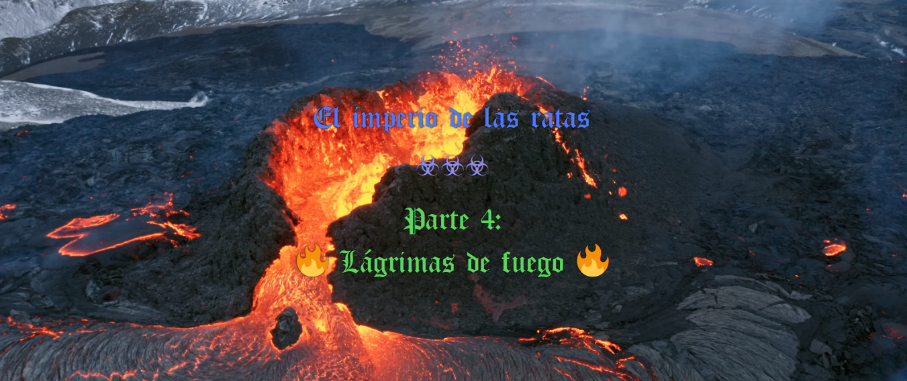

----

#### Índice

1. [Moción y emoción (I)](#moción-y-emoción)
1. [Moción y emoción (II)](#moción-y-emoción)

----

### Moción y emoción (I)

Este libro quería dedicarlo a la exploración racional de las emociones. Pero no sé qué saldrá, la verdad. De todos modos, primero, hay que decir algunas cosas para situar la reflexión.

La primera, mundo externo y mundo interno, conforman la realidad. Re-alidad. Ya lo dice el nombre: 2 alidades. Pues este patrón dual o polar se va repitiendo. 

Lo sentido y lo movido. Lo sentido se divide en varias, pero lo empírico y lo abstracto. Lo abstracto, entre lo racional y lo emocional. Lo empírico, entre lo interno o corpóreo, y lo externo. En última instancia, todo está unido, aliado. Re-aliado.

Bueno, pues en este pequeño mapa de las divisiones de la realidad, me centro en lo emocional y lo racional.

Desde hace un tiempo, y aunque me olvido, seguramente por razones de adaptación, mantengo que las emociones tienen una razón racional de ser, que podemos sublimar (o hacer consciente), o se puede quedar en ese plano inconsciente, y seguir operando en nuestros procesos igualmente.

Un momento. Antes que nada, y como yonki, yo sé que las emociones son producto de números. No digo que pueda controlar esos números, pero es lo que el yonki intenta indirecta o directamente. ¿Por qué las emociones son números? En el último apartado del libro anterior, se menciona la razón: endodrogas. Las endodrogas: dopamina, serotonina, feromonas, no sé, disto mucho de ser un experto en el tema. Sustancias. Adrenalina. No sé, varias. Hay más, estas son las más populares. Hay opioides endógenos, opioides que se generan dentro de nuestro cuerpo. Endodrogas es un buen nombre. Y un neurólogo sabrá decir más sobre ellas.

Las emociones son números. Y su repercusión, tiene un fin matemático también. Eso es otra tesis, hipótesis. Pero... bueno, a ver, no se me da muy bien ordenar ahora mismo.

El **amor** procura la unión del grupo. El **odio** procura la división del grupo, la desunión del individuo. La **rabia** procura que el uso de la fuerza no sea un impedimento para la división, para la separación. La **venganza** procura una compensación por daños. La **nostalgia** es producto de una comparación entre lo actual y lo anterior, y procura una valoración de lo anterior. La **pena** procura que la rabia no tome el control, es decir, la fuerza no tome el control, y también anuncia que algo no está bien con las cosas como están. La **avaricia**, procura un almacenamiento de recursos previsorio, una protección ante la escasez. La **alegría** procura una inyección de motivación, de energía, y un recuerdo para posteriores ocasiones.

Ahora no me vienen más.

¿Por qué nacen las emociones?

Bueno, antes de eso, que no lo sé yo, pero antes que eso, las emociones son el producto de un laboratorio de drogas, llamado cuerpo. Este laboratorio es racional. Es decir, el que domina los números de la realidad, sabía qué estaba haciendo con un *cuerpo*, un *laboratorio de drogas portátil e inseparable*. Parecen un... controlador.

El controlador, en servidores, programación, es una función que sirve para dar respuestas a los clientes, a las peticiones externas. Aquí no lo uso en ese sentido, lo uso en el sentido de: *algo que sirve para controlar*. Por eso, las emociones, convendría controlarlas si quieres... no ser víctima de ellas. Dejarse controlar por controladores instalados por el que controla los números de la realidad, parece no tan mala idea. Parece hasta buena idea.

Yo, como yonki, también quiero enfatizar lo bueno de las emociones sin más. Es decir, de las buenas, de todas también, pero de las buenas sobre todo. Es decir, ¿para qué sirve sentir alegría? Pues para disfrutarla, sin más, es uno de sus usos, y uno de los más importantes. Eso es lo que quiero enfatizar con este párrafo.

Ya está. Me cuesta mucho entrar en todo esto intentando pisar donde ya tengo algo de experiencia demostrándome certeza. Rápidamente podría pisar terreno pantanoso, donde aventuro cosas que pueden cumplirse a veces, pero no siempre. De hecho, seguro que ya lo he hecho.

Pero, en última instancia, y hablando con un pueblo tomado por la yonkicidad del dinero (ya lo hemos hablado en el último apartado del libro anterior), vale la pena resaltar que las emociones tienen una utilidad racional. Y conviene comprenderla para que no te engañen, porque mucho es engañarte con eso, la televisión son expertos, las religiones y sectas son estrellas, y demás. Ahora, paro de escribir, por prudencia.

----

### Moción y emoción (II)

El **miedo**, por ejemplo, puede ser un instrumento muy útil para salir corriendo en ciertos casos. También para quedarse paralizado. La **prudencia**, que sería un sucedáneo ligero del miedo, también puede resultar útil en muchos casos. La **satisfacción** es una sensación, ni siquiera emoción, nos indica que hemos hecho algo bien o que estamos obteniendo algo bueno. El **orgullo** puede tener distintas acepciones, una puede ser un signo de identidad y al mismo tiempo, satisfacción. Identidad satisfactoria. También orgullo puede usarse como preventor de actos altruistas, generosos o simplemente bondadosos. El **altruismo** o **generosidad** sirven para dar de más de lo compensatorio. La **bondad** sirve para actuar conforme a unas normas morales o éticas. 

Toda emoción puede desmenuzarse en más palabras. Pero, sobre todo, consiste en desembocar en conductas concretas que reportan un patrón homogéneo del movimiento.

Voy a ir apuntando una lista:

  - Decepción
  - Apatía
  - Desilusión
  - Desprecio
  - Rechazo
  - Aceptación
  - Ilusión
  - Motivación
  - Tristeza
  - Desaprobación
  - Autoestima
  - Ira
  - Confusión
  - Somnolencia
  - Aburrimiento
  - Diversión
  - Tranquilidad
  - Plenitud
  - ...