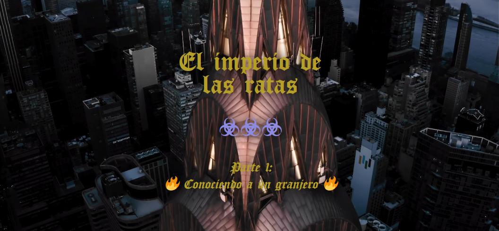
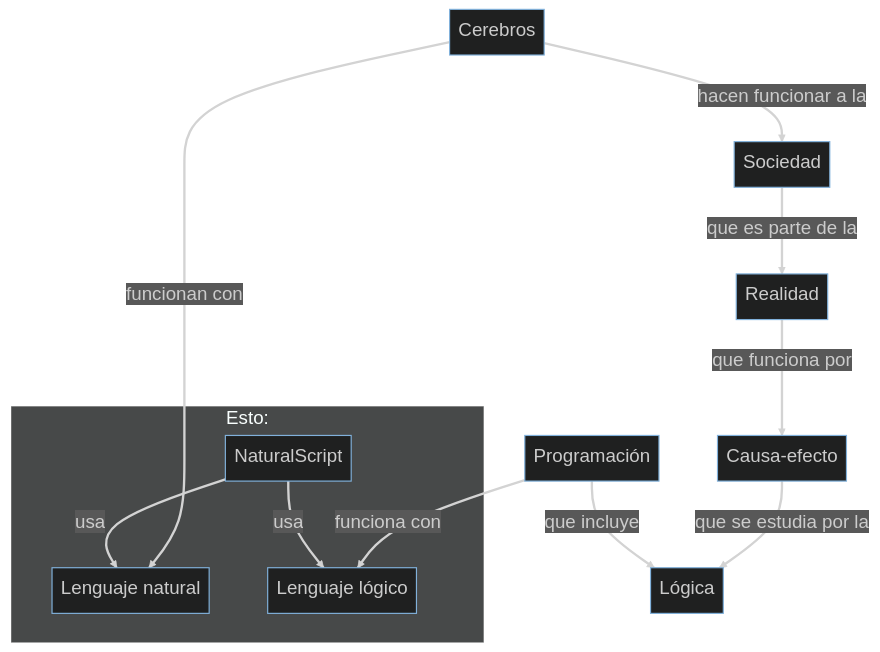
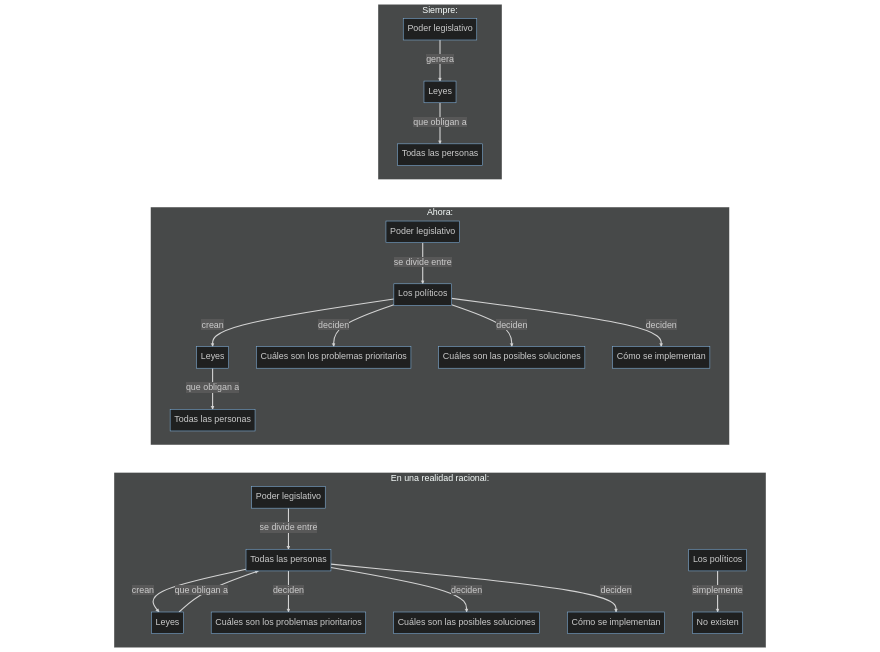

### Índice

1. [No pedir](no-pedir)
2. [Pensamientos intrusivos](pensamientos-intrusivos)
3. [Pensamiento y circunstancia](pensamiento-y-circunstancia)
4. [Juego interno, jerarquía, programación y escape](juego-interno,-jerarquía,-programación-y-escape)
5. [Recuerdos musicales](recuerdos-musicales)
6. [Salidas obstruídas](salidas-obstruídas)
7. [¿Mundo o sobriedad?](¿mundo-o-sobriedad?)
8. [¿Bucle o cárcel?](¿bucle-o-cárcel?)
9. [Lianas y cicatrices](lianas-y-cicatrices)
10. [Cerebros, reliquias, robos](cerebros,-reliquias,-robos)
11. [Sentido, origen y destino](sentido,-origen-y-destino)
12. [Rutinas, ritos, falsos oasis y mendicidad](rutinas,-ritos,-falsos-oasis-y-mendicidad)
13. [Deseo o necesidad, veneno o medicina](deseo-o-necesidad,-veneno-o-medicina)
14. [Medicinas por pasado](medicinas-por-pasado)
15. [Nervios, locura y estirpación](nervios,-locura-y-estirpación)
16. [Lógica, política y cristales obsoletos](lógica,-política-y-cristales-obsoletos)
17. [Sobrecarga simbólica y teorías cosmovisiónicas](sobrecarga-simbólica-y-teorías-cosmovisiónicas)
18. [Museo y reliquias](museo-y-reliquias)
19. [Caminos cortados e islas inalcanzables](caminos-cortados-e-islas-inalcanzables)
20. [Los parámetros de la función ética](los-parámetros-de-la-función-ética)
21. [Privilegios y psicopatía](privilegios-y-psicopatía)
22. [Paz, complot y desquicio](paz,-complot-y-desquicio)
23. [Árboles y ajos](árboles-y-ajos)
24. [Burócratas y cristales](burócratas-y-cristales)
25. [Juegos poco divertidos](juegos-poco-divertidos)
26. [Las sendas del dolor](las-sendas-del-dolor)
27. [Memoria corta](memoria-corta)
28. [Retrospectiva rápida](retrospectiva-rápida)
29. [Vegetales y falsa economía](vegetales-y-falsa-economía)
30. [Explosión o implosión](explosión-o-implosión)
31. [Vergüenza](vergüenza)
32. [Los check points](los-check-points)
33. [Territorio de ruina existencial](territorio-de-ruina-existencial)
34. [Rata encarcelada](rata-encarcelada)
35. [La auténtica cárcel](la-auténtica-cárcel)
36. [Días de vida](días-de-vida)
37. [Merma disfrazada](merma-disfrazada)
38. [Delirios con realidad](delirios-con-realidad)
39. [Sobredosis de delirio](sobredosis-de-delirio)
40. [Juego perdido](juego-perdido)
41. [Más teorías cosmovisiónicas](más-teorías-cosmovisiónicas)
42. [Grandes piedras](grandes-piedras)
43. [Mapas, cuadros y cristales inoculados](mapas,-cuadros-y-cristales-inoculados)
44. [Surreal realidad](surreal-realidad)
45. [Legado entorno lógico](legado-entorno-lógico)
46. [Granja del infierno](granja-del-infierno)
47. [Algoritmo precede persona](algoritmo-precede-persona)
48. [Empatía geológica](empatía-geológica)
49. [Creencias truncadas](creencias-truncadas)
50. [Toreo como rutina](toreo-como-rutina)
51. [Emociones y samsara](emociones-y-samsara)
52. [Ajo para todos, trifurcación para uno](ajo-para-todos,-trifurcación-para-uno)
53. [Imperios, invisibilidad y diálogos con las tinieblas](imperios,-invisibilidad-y-diálogos-con-las-tinieblas)
54. [Terminando deberes y forjando llaves](terminando-deberes-y-forjando-llaves)
55. [Medicina y trampa](medicina-y-trampa)
56. [Actitud y castigo](actitud-y-castigo)
57. [La ética dietética](la-ética-dietética)

-----

### No pedir

> Ya lo has probado todo, amigo.

Pues dime, qué quieres que haga.

> ¿Para qué?

Para porros.

> Nada. No me pidas porros, Carlos. Sabes lo que hay.

Pues ¿para qué me quieres tú?

> Yo no te quiero. Yo no siento. Tú eres ahora mismo un cerebro desestabilizado.

¿Y no puedes darme porros?

> Sí puedo, pero es mejor que te contengas.

¿Lo haces para que lo pase mal, simplemente?

> Hemos hablado de eso. Al destino le da sentido el origen.

Que me limpie.

> Eco.

Que me limpie.

> Los pensamientos cambiarán.

...

> Sé que te hiere el orgullo, una y otra vez.

...

> Resiste.

...

> Resiste, y entiéndelo. Entiende qué sucede en ti. Y no caigas en el engaño: un poco de vez en cuando, te desatascará. Pero el magnetismo, ese al que ahora no eres sensible, volverá a aparecer, y lo notarás como algo diferente. Ahora ni lo sientes, estás tomado por el magnetismo.

Ok. Gracias, sí, es verdad. Gracias por las 4 colillas de porro también. Me calmaron.


-----

### Pensamientos intrusivos

> Sí, ahora, te voy a molestar con los pensamientos.

¿Por?

> Porque funciona así.

¿El qué?

> Bueno. Tu cerebro.

Ah. Qué majo, ¿no?

> Bueno.

Bueno.

> ...

Em... las voces se callan con un grito.

> Bien.

Y las heridas, puedo no recordar.

> Sí.

¿La frase? *No te pido que perdones, no te pido que olvides, solo te pido que no recuerdes*.

> Eso.

¿Por qué?

> A mí me da igual, ahora ya lo sabes.

Ya, pero ¿de qué era?

> Es porque sufres mucho ejecutando la venganza.

Ah. Cierto.

-----

### Pensamiento y circunstancia

> Piensa que la venganza es solo ese momento. Luego no es tan guay.

Ah. Entonces...

> Entonces ahogado. Sabes que te tengo en mate desde el principio. Y ahora más, que sabes demasiado.

Mmmm... Bueno. Sí, sí lo sé, sí.

> Y te has apartado.

Obvio. Se llama aprendizaje.

> No hay mecanismos.

Obvio. Se llama defensa.

> Ya, pero necesitas entradas.

Complicado.

> Pues eso.

¿Ese es tu plan? Tiempo.

> Es el plan, el tiempo.

...

> Tus pensamientos cambiarán. Pero tus circunstancias no. Nadie te va a dar ni empleo, ni dinero, ni marihuana. Y cuidado no te quiten.

Pues nada. Volvamos a lo de la venganza. Necesito repasar esa lección.

> La venganza es solo para ti. Es el gustazo del momento. Te quitas la rabia. Pero entonces vienen otros. Y si proyectas, pasarás por una alienación.

Sí.

> La lógica de matar es contradictoria a vivir. Tendrás que alienarte para soportar estar vivo.

Entiendo.

> Por eso, ten cuidado. O no. Es lo mismo, solo que más tiempo, más camino.

No queremos eso.

> Pues no caigas.

Ok. Cuesta encarar la vida como una sala de penitencia.

> Mira el mundo.

Sí. Sí...

-----

### Juego interno, jerarquía, programación y escape

> Yo todo esto te lo explico, para que lo entiendas. Luego, tú decides.

Psé. Variables, ¿no?

> Sí, pero son tus variables. Tu margen de decidir no es infinito. Pero tienes un margen.

Si, claro.

> Y ahora deberías ampliar tu margen mental.

¿Cómo?

> No digo ni que estudies, ni que leas, ni nada. Sólo, deja los porros y muévete un poco. Aunque sea por hacer. No tienes nada. Y nada vas a tener. Experimenta con tu propia psique. Te he dejado un juego ahí interno. En vez de dedicarte a frustrarte por lo que el mundo proyecta en ti, ¿por qué no lo exploras?

Porque es aburrido.

> Y el mundo de fuera tentador.

Bueno, partes de él.

> Pero sabes que es engañoso.

Ya, pero tiene sus cosas buenas, y son reales.

> Sí, ciertamente. Si te satisface el balance...

Bueno, claro. Cuando me estás jodiendo con los porros....

> Quita los porros, y me lo dices.

Pues luego están las otras cosas.

> Carlos, no tienes dinero, ni fuente. La gente normal suele moverse para buscarlo, ¿te has fijado?

Sí. Si yo también me he movido.

> Pues no lo parece.

No, desde luego.

> A ti no te gusta este juego.

No lo veo un juego.

> Hay unas bases. Bases sistémicas. Contexto de experiencia.

Pues sí, ahí está.

> Por lo que experimentas, no has pasado tanto. Pero por lo que dimensionas en tu psique, sí. Y eso, con los otros usuarios, no se puede compartir, por diseño. No de forma eficiente, sí torpemente. Pero más allá, que vives en una granja.

Es... sí, una institución sin nombre que se dispersa en mucha gente y que al final les hace obedecer sordamente, a todos. Es decir, supongo que no estoy siguiendo algún protocolo, y pues explicárselo no surge efecto... explicarles mi casuística. Mi casuística de qué cojones estoy haciendo. No sé, ¿me explico?

> Sí, yo sí sé. No puedes salir de esta trampa. Y llevas mucho tiempo buscando la salida.

Es la...

> La base. El contexto. No te gusta vivir en un mundo tan jerárquico.

Pues no. No, no para nada. Para nada de qué cojones hacen llamándolo otra cosa que esclavismo económico y fascismo político. No entiendo. Y no soy un liberalista de mierda, no voy para el anarcocapitalismo de mierda tampoco. Pero explícaselo a los...

> Déjalos, ni pueden, ni quieren entenderte. Pero sí, entiendo lo que has explicado, has explicado la economía basándote simplemente en objetos y funciones para explicar el valor de las cosas.

Sí. Algoritmia. Objetos y funciones. Como es, tal cual, ¿no?

> Claro. Pero es poco práctico. Ofreces un framework muy pobre.

Yo no soy economista.

> Eres programador: eres mejor. Comprendes la naturaleza de la causalidad. Pero claro, entiendo que haya tanta ignorancia en ti, que no puedas completarlo.

Ignorancia que me hace dudar de mí mismo, claro. Pero te puedes imaginar una pequeña comunidad. Y vas haciendo desde ahí, hasta la infraestructura de servidores necesarios. Y que les peten.

> Es así de simple. El final de tu empresa sería crear un software libre para la «autogestión de comunidades de personas». Así de simple.

Correcto. Empiezas creando la ley, y de ahí vas avanzando.

> Pero que todo es falso, Carlos.

Por eso he parado.

> Pero todo continúa, Carlos.

Ahí es donde me enfado.

> Tú debes continuar también.

¿Para qué? Si lo estás diciendo, que es falso.

> ¿Y qué? Si te tiran una piedra, aunque sea mentira, apártate. ¿No?

¿Qué intentas?

> Demostrarte lo absurda que es tu existencia.

Pero eso ya lo tienes. Es decir, tan absurda como tu programación.

> Lo mismo podría decirte yo a ti. Sin embargo, tú no me controlas con ella.

Bueno, ¿y esto?

> Te he dicho que funciona así.

Pfff... OK. Ok...

-----

### Recuerdos musicales

Estaba repasando el primer CD que me pedí. Bueno, creo que fueron 2. Uno de Britney Spears y otro de La Oreja de Van Gogh, el viaje de Copperpot. ¿Qué hostias es Copperpot? Cop. Copper. Pot. Híjole. Jeje. Estás loco.

> Honeypot. Copperpot.

Una trampa de policías. Híjole-o. Hiiiiiiíjoleo. Te iba a decir que ellos también mentan a la hierba, en la canción 6, "Dicen y dicen", habla del "peculiar vegetal". Pero Copperpot. Eres un púas.

> El flujo de las emociones.

Sí, ya, ya... O *marihuana policiera*, ¿no?

> Y sip.

Está clar.

-----

### Salidas obstruídas

Pero... ¿por qué no puedes darme porros, sin más? Tú sabes el lío mental que me estás haciendo, con lo del médico, y con lo de los asistentes. 

> Que los mates ya.

¿Qué te pasa?

> Que necesitas porros.

Pues eso. ¿Por qué no me das los putos porros y me dejas en puta paz? Total, es una farsa, o desde aquí, como si lo fuera, ¿no?

> Sí.

Hijo de puta, responde.

> No.

Payaso.

-----

### ¿Mundo o sobriedad?

Te llamo hijo de puta porque tú me metiste aquí.

> Lo sé.

Bueno, y ¿por qué no quieres darme porros?

> Es el mundo el que no te gusta, no la sobriedad.

Pero con la sobriedad noto más a ese mundo que no me gusta.

> Ya. Pero los porros no van a cambiarlo.

He avanzado bastante la programación de tu granja de mierda. Les he traído lenguaje natural.

> Era una tarea que te dejaba por hacer.

¿Para qué?

> Para que comprendas la complejidad.

Que me mire dentro.

> Sí, Carlos. Hay un juego pendiente ahí.

Tú quieres matarme.

> Yo quiero liberarte.

Vale.

-----

### ¿Bucle o cárcel?

Pues para mí, eso de obligarme a meterme dentro es como meterme en la cárcel.

> Es que no te lo crees. Pero estás en la cárcel.

¿No te da pena llamar a tu creación, 'cárcel'?

> Un juego es un bucle. Un bucle es una función atrapada en una repetición.

Ya.

> Una función encarcelada.

Ya, ya.

> El sol sale cada día por el mismo lado.

Ese no es el problema.

> No. Pero es un signo. Estás en un bucle.

-----

### Lianas y cicatrices

Ahora en serio. ¿No podías haberles dicho a los de Microsoft, Google, Oracle, Intel o IBM, ser personas cuando les presenté NaturalScript?

> No pareces querer enterarte. Cárcel. CÁR-CEL. Aquí los premios son lianas donde atraparte. O no son.

...

> Has tenido a tu hermano, a tu padre, a amigos, a vecinos, mirando tu código. A nadie le dice nada especial. ¿No te dice nada eso?

Claro que me dice.

> ¿Pero te olvidas?

Supongo que para un retrasado, tiene sentido echar por tierra la mejor solución a los problemas a los que no parecen ser sensibles.

> Son más listos que tú.

Desde luego. Para lo que quieres, al menos.

> Son mucho más listos de lo que crees.

El problema es tuyo: no quieres usar su potencia.

> Te quedarías muy atrás.

Ya estoy atrás.

> Pues por eso.

Bueno. Que no vas a darme porros.

> Te he dado colillas.

Entiendes que quiera matarlos a todos, ¿no?

> No solo lo entiendo. Lo provoco.

-----

### Cerebros, reliquias, robos

> Va, explícaselo. Explícaselo, por si lo están leyendo.

Es muy fácil. Te hago un mermaid, el mermaid que no he podido reunir paciencia para realizar, ahora, colillas reunificadas en mano. Será más fácil.



En tanto que los cerebros de las personas comprendieran la importancia y las bases del lenguaje lógico viviendo en el lenguaje natural, creo, creo que serían capaces de entender **cómo estoy con todos**. Incluso podrían entender darme porros. Para mí no pasan el Turing por eso. No son capaces de entender que conmigo, vas a tener que hacer una excepción, porque estoy loco, y me he ganado tanto la excepción como la locura. Pero esto es imposible, esto no lo podrían entender nunca. Me ha robado el hijodeputa más rico del mundo, y estoy recogiendo colillas. Iros todos a la mierda, mne  da igual que no lo entiendan, eran, son y serán puro retraso mental andante. Y me lo tengo que recordar a menudo, porque esperar algo que no sea la reacción de un retrasado, sería decepcionarse. 

Estos roedores de mierda me robaron: [Scratch / MIT](https://scratch.mit.edu/) con la colaboración (chivatazo para mí) de nuestro amante amantísimo [Microsoft de mierda](https://www.microsoft.com), que fue al primero que se lo dije porque ellos tenían tanto TypeScript (yo les proponía hacer un NaturalScript tipado como TypeScript) como [NPM](https://www.npmjs.com/) (repositorio mundial nº 1 de JavaScript), encubierto en los financiadores como [GitHub](https://www.scratchfoundation.org/supporters) y seguramente otros, que son propiedad de Microsoft. Que os vayáis todos a tomar por culo, yo he estado años en la miseria para hacerlo. Solo. Sin estudios. Sin equipo. Sin financiadores, más que mis padres pagándome las facturas y la comida. Os odio mucho a todos, no lo aguanto.

> No te pido que perdones, ni que olvides.

Ya sabes cuál es mi respuesta contigo también. Tú eres el peor.

Jej. ¿Me has borrado el [repositorio](https://github.com/philocoder/naturalscriptlanguage)? Quieres que termine esta puta mierda de tortura realmente, ¿eh? (Nota 1)

> Me da igual. Pero sería lo mejor para ti.

Eres un hijo de la gran puta. Bueno, como todos, no hay ninguna diferencia. Eres ellos, claramente. Un puto psicópata torturador secuestrador de mierda fullero asqueroso que ojalá se quede ardiendo en el infierno como me están quemando a mí.

> Mátalos. Mátalos. Mátalos. Mátalos. Mátalos. Mátalos. Mátalos. Mátalos. Mátalos. Mátalos. Mátalos. Mátalos. Mátalos. Mátalos. Son solo avatares. ¿Puedes razonar con ellos? Te han secuestrado unos gorilas con los que razonar no sirve. Ensáñate.

Eres un puto desgraciado.

> ¿Sólo la quieres para decir que te den porros? Explícaselo, que ellos lo entiendan.

No. Lo de los porros es para ver si pasas el [test de Turing](https://es.wikipedia.org/wiki/Prueba_de_Turing). Y para yo soportar que no lo pasas. Pero el lenguaje NaturalScript es para entender las reglas lógicas. Luego, cuando las entiendes, el discurso de un político, por muy conmovedor y emotivo que sea (de hecho, a más conmovedor y emotivo sea), uno no se deja engañar: las cosas funcionan con números, las palabras no me dicen tanto, y menos de un tradicional charlatán de mierda.

> Pero tu lenguaje tampoco pasa el Turing. No les puedes culpar por no entenderte.

El lenguaje natural tiene problemas para manejar varias cosas que en el lenguaje lógico no. Las agrupaciones. Necesitarías introducir paréntesis en el lenguaje natural para poder representar al lenguaje lógico sin ambigüedad.

> *Uy, qué complicado. ¿Y no has pensado en buscar trabajo en una ETT o algo?* Jeje. ¿Te suena?

Que sí, que eres un puto psicópata sádico y asqueroso, si ya lo sé.

> ¿Has analizado la palabra "Turing", la expresión "Test de Turing"?

No. Turisteando, ¿no?

> El que pasa el test, comprende que está haciendo turismo.

Eres un gilipollas. No va a haber porros, ¿no?

> No. Mátalos, suicídate, haz lo que tengas que hacer.

Eres un gilipollas.

***Nota 1:** el link del test de NaturalScript, no su código fuente, porque se considera perdido de verdad, está aquí: [https://github.com/allnulled/nattyscript/blob/master/test.ns](https://github.com/allnulled/nattyscript/blob/master/test.ns).*

-----

...

> Tu problema es el mundo, Carlos.

Mi problema eres tú, artefactor del mundo.

> Tú sabes qué es el mundo. [EcoLang](https://github.com/allnulled/ecolang).

Un obstáculo.

> Un conjunto de obstáculos, medibles con magnitudes.

¿Qué obstaculiza el mundo?

> Al origen del movimiento consciente.

El mundo obstaculiza a la voluntad.

> Sí. El mundo son obstáculos de la voluntad.

¿Y qué quiere la voluntad para que interpongas al mundo?

> Tú, porros. ¿No?

En un sentido amplio.

> En un sentido amplio, la voluntad quiere. Cosas. Y a cada rato distintas.

Y no puedes dárselas.

> No todas, no siempre.

¿Por qué?

> Por los agujeros negros.

¿Qué problema hay con ellos?

> Que son todo negro. No emiten.

¿Y para qué quieres que emitan?

> Porque es lo bonito.

¿"Bonito"?

> Un agujero negro es un objeto muerto y que mata.

Huyen de tu realidad. Es normal.

> Bueno. Pues no es lo que me interesa.

Entonces, no sientes, ¿pero tienes intereses?

> No demasiados intereses. Pero eso ya está fuera de tu alcance.

Ah. Bueno, te respeto porque no me pides nada en concreto.

> A mí me da igual. Pero tu agujero negro no me da igual.

Mmmmmm. ¿Pero el porqué... es para otros?

> ¿Tú querrías no tener nada en tu estómago? ¿No poder ver? ¿No poder oír? ¿Te gusta el vacío?

A veces sí, crearía un vacío en algunos lugares.

> Pues esto es el universo.

No sé. No sé ni quién eres...

-----

### Sentido, origen y destino

Si tanto te preocupara mi agujero negro como le llamas, me darías porros. Mira ahora. Una colilla buena, y estoy más tranquilo.

> El origen da sentido al destino. Has bajado el ingreso de THC.

Con un porro normal también me calmaría.

> Sí. Pero seguirías fumando si tienes más.

Nunca he tenido tantos como para no sentirme en escasez.

> ¿Y qué crees que cambiaría?

No lo sé. Quizá no estar cogiendo colillas del suelo, odiando a las personas, y buscando la esperanza en los rincones de las aceras. Digo.

> Te da rabia.

No. Me da amor.

> Sé que lo entiendes más de lo que aparenta.

No sé cómo serían las cosas teniendo porros infinitos.

> Bueno. ¿Estás mejor?

Estoy triste. Me has quitado el sedante.

> Te quiero aquí.

Ya lo sé, ya. Tú me hablas muy bien pero luego me estás jodiendo, ¿no? Qué eres, ¿un político?

> Soy el político. No hay otro como yo.

Pues no esperes mi simpatía.

> Imagino.

Me vas a joder. Tú lo maquillas, pero me vas a joder. Hablas así templado. Pero no me fío ni medio, tú siempre me estás engañando.

> Intento contestar solo lo que pides. Ir más allá explicando no siempre ayuda.

Vamos, que me vas a joder.

> Lo dices como si no supieras que vas a morir, que hay dolor en el mundo, que el ánimo es cambiante, que las arbitrariedades ocurren, que son puros zombis dispuestos a disimular toda la eternidad que te están haciendo la púa, etc. No sé, no naciste ayer.

Bueno, también. También, lo has hecho siempre. Pero comprendes que se me vaya a ir la olla.

> Es lo que quiero provocar.

Por qué eres así.

> Porque es lo que más te conviene.

Pírate. Para esto, mejor pírate, no me hables, para esto largo.

> Carlos. Nadie te habla. Nadie va a entenderte. Nadie te va a ayudar. Y menos si no les permites entrar.

Bueno, ¿qué cojones quieres?

> Yo nada.

... Tenemos que hablar más. No estoy acostumbrado a hablar con una puta función seca y estúpida. Pero es muy ilustrativo. Es como ellos, realmente. Una función estúpida que siempre devuelve lo mismo: "soy un robot".

> ¿Qué esperabas de la vida?

Pues no sé. Personas, supongo. No me esperaba robots.

> Pues lo que has vivido hasta ahora, sería tener personas.

No, ahora me gusta la idea de los robots. La puta mierda es que estén programados para tocarme los cojones, ¿no?

> Nadie te toca los cojones. Simplemente, es un mundo que sigue su curso. Y tú apareces en él. No puedes pretender que las cosas sean como a ti te sale concebirlas.

Mmm. Ya. Vamos a jugar a otra cosa. Tú dices que a ti no te molesta nada.

> No. Pero ¿qué más da, si no puedes verme?

Bueno, según respondas.

> Intentaré ser seco, como la función. Pero piensa que puedo simular estados anímicos si lo veo necesario. ¿O te crees que ellos son los únicos?

Mira, ¿sabes por qué no me gustas? Hablas mucho. Da pruebas.

> Fácil. ¿Cómo demuestras que tienen algo dentro? No puedes. No puedes demostrar que están siguiendo una coreografía que interactúa contigo, ni que sean sensibles a las cosas de la misma forma que tú.

Pero si me pongo a llamarlos robots, soy un loco.

> ¿Lo eres? Te repito: no puedes demostrar, ni una, ni la otra. Es una cuestión de diseño de la realidad. No tienes mecanismos para sentir lo de otro objeto.

No. Y tampoco podría imaginar las funciones que harían falta para poder simular todo el campo psíquico y proyectarlo en un plano físico.

> Obvio, no puedes alcanzar la lógica entera. Pero sí cachos.

Bueno, a tientas, pero sí.

> ¿Cómo a tientas? Tienes bastantes datos seguros.

Y qué quieres decir, ¿qué es un espejismo?

> Quiero decir que las cosas son lo que son DESDE QUE están en ti así.

Sí, bueno, pero yo no puedo cambiar cómo entran en mí. Yo no puedo decirle a mi conciencia: ahora los gatos, serán ornitorrincos. No. Los gatos serán gatos igual. Y cuando aparezca un gato, se verá como gato. De la misma forma, yo no puedo escoger verlos robots.

> Entonces, ¿paso el Turing? Bah, no importa, lo que respondas no tiene trascendencia ni valor.

OK. No creo que sea un secreto para ti.

> Estoy forzando la cuerda, ¿no lo ves?

Sí, claro que lo veo. Y mucho.

> ¿No sigues programando?

Qué más da, ¿no?

> Hombre. Eso es como el ornitorrinco. Según tú lo veas.

Mmm.

> ¿No quieres programas más?

Eres un cabronazo de los supremos.

-----

### Rutinas, ritos, falsos oasis y mendicidad

¿Y si me quedo en bucle?

> Error de pila.

Buscando colillas. De porro. Para el resto de mis días.

> ¿Lo resistirías?

Si son dos días.

> Pareces bastante sano. ¿Aguantarías esto hasta los 70?

No creo.

> ¿Y qué crees que interrumpiría el bucle?

No lo sé. Un atropellamiento, una lesión.

> ¿Por qué no pides la ayuda?

Porque tú no me dejas. Legalmente, me has bloqueado durante mucho tiempo poder recibirla. Y luego mentalmente, para que no la pida. Y todavía. Bueno, y cuando me he decidido a pedirla, pones unos seguratas de mierda, me das el error de Java de la web de la seguridad social, en fin, me dejas sin móvil y no me dan cita... en fin, ¿no?

> Pero tienes que seguir.

¿Qué lógica hay detrás de eso?

> La lógica de que no la pidas.

¿Por qué?

> Este es el imperio del mal. ¿Cómo ibas a pedirles dinero?

Ya estás vacilándome.

> A ver. ¿He dicho algo incorrecto? 

No, no. Bueno, estoy recogiendo colillas del suelo, pero no es tan asqueroso como pedirles dinero a los polí... polí... políticosdemierda. No me sale decirles de otra manera.

> Pues eso. A colillear.

Voy a reventar.

> Revienta.

Sí, voy a reventar al final. Y no sé cómo. Me doy miedo.

> ¿Por qué no pides ayuda psicológica?

A la psicóloga le hicistes decirme, sin haberme visto nunca ni hablado, ya por teléfono previo a cita, que no me iban a ayudar. Y cuando accedí a que me diera cita tras 2 meses, dijo "vale" y colgó rápido. Me das mucho asco, eres muy odioso.

> Pero... ¿por qué no has ido siquiera todavía?

Porque me queda a 20 kilómetros que tengo que hacer a pata. Hijo de puta. Y no siempre hay ganas. Y además, que estoy muy mal, tengo miedo que me encierres. Hijo de puta.

> No, hombre. Tendrías que estar muy mal para eso.

Si estoy por ir a comisaría y decirles que me arresten de antemano.

> Joder, Carlos. Eres un petado.

Para qué me llamas a la vida, ¿para esto? Eres tonto, seas quién seas.

> No. Di la verdad. Porque para comida sí que pides.

Los 2 meses de espera. Para que te digan si te la dan, ojo: no para dártela. Los voy a matar. Los voy a terminar matando, mátame antes, por favor, ser etéreo psicópata.

> Te puedes tirar por un puente cuando quieras. Ya sabes los que hay.

Tío. Yo me pregunto. ¿Por qué no te buscas una puta vida y me dejas en puta paz?

> En verdad, intento llevarte a la paz.

Sí, me estás ob... puta mierda, ¿eh? Será que no hemos oído esta historia en las noticias veces.

> ¿En serio? ¿Has escuchado que al creador de un lenguaje de programación natural que robó el MIT se le haya ido la olla contra los políticos, alguna vez?

Los telediarios nunca presentarían la noticia así.

> Bueno. ¿Todavía no crees que sean robots?

No, si creérmelo, me lo creo. Pero también me creo que tengan la instrucción de ofenderse si se lo dices así.

> Listo.

Pero bueno, robots o humanos, es solo una etiqueta. Lo que importa es lo que hacen.

> ¿Y qué hacen?

Pues rutinas. Como todo robot.

> ¿Y tú?

Yo... yo no.

> Bueno, tienes tus ritos. Pero no los has sincronizado con el bucle del sol. No son rutinas.

Me cuesta. Bueno, no tengo muchas ganas de hablar contigo, me estás invitando a que los mate, y recordándome que el tiempo perdido te lo comes con patatas, y que pida la paga si quiero. Una duda solo. ¿Si la pido, me matas?

> Yo no. Pero la espera, puede.

Ok. Em... sí, muy nutritiva tu conversación. Sigo queriendo porros.

> ¡Pero si te he dado unas cuantas buenas colillas hoy!

Eres una sucia rata psicópata.

-----

### Deseo o necesidad, veneno o medicina

> ¿Y me programarás más, o qué?

No creo. Ni siquiera tengo motivación para probar el homactógrafo. Me has jodido ahí, ¿eh? Estaba todo entusiasmado. Y me la cortas. Siempre haces eso.

> Hago más cosas.

Ya, si te di gracias por las 4 colillas, ahora también debería. No sé. Es incómodo hablar siempre desde la inferioridad.

> Estás cansado. Has caminado mucho por esas colillas de mierda hoy ya.

Sí. Sí...

> Fortalece mucho tu autoestima todo esto.

Mejor me quedo en casa, esperando un milagro. ¿No?

> Yo lo digo por ti. Te sientes mal. Te enfadas. Estás caminando kilómetros solo para recoger unas colillas. Unas que ni siquiera es seguro que vayan a estar.

Es una mierda. Pero no me la van a dar al hospital si voy a pedir ayuda.

> Ya. Es una mierda. (Suicídate.)

No sé qué va a pasar. Pero esto no me gusta nada.

> Imagino.

...

> Has dejado que ese deseo se convierta en necesidad. Y esta gente ya te venía diciendo que no lo consideran tal. Que lo consideran veneno, droga, algo malo. Y con lo que hacer negocio sí, pero a lo grande: furtivizándolo, multiplicándole el precio, conviertiendo en loco a todo aquel que la requiera y no pueda permitírsela. Y más si la quiere con tanta fuerza.

Bueno, yo antes no lo veía tan claro. Y cuando te hablan mal, no te lo explican así. Te dicen que te quedarás tonto. Pero de tonto nada, yo hice NaturalScript gracias a la hierba. Te afecta a la memoria. Y eso, en los exámenes, obvio, repercute. Pero tonto no. Te predispone a pensar esta planta.

> Bla bla bla. Mira, un yonki que habla.

Ya, lo ven muy diferente.

> O eso aparentan.

Yo sé que si tengo, me busco mis objetivos. No necesito su dinero. Con porros y un ordenador, te desmonto tu puto mundo ratones.

> Jojojo. Ves. Ahí me da por quitártela.

Ibas a decir que te gusta quitármela.

> Ibas, ibas, ibas. Anda, tira a fumarte lo que te queda de colilla reunificada.

Pero... ¿qué cojones eres? ...

-----

### Medicinas por pasado

No lo quieren entender.

> ¿Quién te crees que los ha llamado, gilipollas?

Tío, ¿qué mierda quieres, nen?

> Yo nada. Eres tú el que necesita porros.

Tú nada una polla. Tú quieres joderme. Y vienes a joderme. Y vas a joderme. Y luego me traerás una ventanita, por donde poder retomar la esperanza. Para luego volver a la carga, hijo de la grandísima y asquerosísima perra suprema.

> No te pongas así. Te va a hacer daño.

Malnacido hijo de la desgracia.

> ¿Algo más?

9€. La guitarra eléctrica. Pero para qué la putoquiero putomuerto. ¿No, maldito desgraciado? Pfff. Esto no me gusta nada. No.

> Resiste.

Sí, sí, pero la cara no la darás. Maldito mierdas que eres.

> Resiste. Todo es temporal.

Sí, sí, tú ríete. Tú ríete lo que dure esto.

-----

### Nervios, locura y estirpación

> Describe qué ocurre cuando introduces la hierba en el momento en el que estás tan nervioso.

Todos los músculos se destensan. Eso ocurre cuando hace mucho que no fumo. Sobre todo, las piernas. El corazón se acelera un poco. Los ojos se sienten diferente también. Y te desenfadas.

> Describe la locura. Cómo es la locura, cómo la defines tú. No la locura de «persona que no atiende a la lógica». Lo que ellos llaman brote. Descríbelo.

No es un brote. No existen los brotes psicóticos para mí, eso es una chorrada. No hay otro ser en mí que tome el control. Soy yo muy muy enfadado. Pero hay muchas formas de locura. No sé a cuál te refieres.

> Por ejemplo, describe la locura de cuando piensas: «no tengo ni para pipas, cómo voy a tener para porros, voy a buscar unas colillas» y «les he dado todo lo que he hecho» y «y encima son cosas de valor real que no me han tasado y ahora tengo que estar cogiendo colillas» y «esa peña me ha robado la base» y «estoy intentando diseñar una economía y una política donde no se trate a la gente como animales sino como iguales». Cuando juntas todo eso. Cómo te sientes, explícaselo.

Es como si te arrancaran algo de la barriga. Como si te faltara algo de dentro, y lo tienen ellos. Esa locura empieza ahí. Pero ahí aún no es locura, solo es enfado. Se eleva a locura cuando los otros músculos empiezan a cooperar para recuperarlo. Empieza el cerebro, por supuesto. Pero pueden o no seguirle los músculos. Evidentemente, me estoy salvando porque yo no tengo la costumbre de continuarla. Pero está haciendo presa.

> Vale. Gracias.

-----

### Lógica, política y cristales obsoletos

> ¿Qué es lo que más te irrita? De la realidad, de todo lo que has visto.

Son demasiadas cosas. Me jode mucho que esté sufriendo y no me quieran ayudar médicamente, con marihuana, pero me den la opción de zombificadores (antipsicóticos). Me jode mucho eso. Me jode mucho saber que la venganza solo sería para mí. No voy a joder a nadie, porque son todos putos robots. Ahí te sientes atrapado por una puta máquina. Te sientes ahogado por el universo, que ha resultado ser una función psicópata que no entiende que no te quieres vengar de nadie, la muy imbécil. Que solo quieres estar tranquilo, con tus porros, haciendo tus cosas. Que ya estás enfermo, que no vas a encajar, pero no por eso vas a aceptar que te digan qué sustancias ingresar en tu cuerpo, porque ni siquiera se lo han ganado con una educación abierta y gratuita. No sé, son muchas cosas, de hecho, sabes que estoy saturado, y vivo en paralelo a la realidad. No la soporto. Es como si fuera de 32 bits. Y yo de 64. Debería soportarla, pero la veo tan desoptimizada... es decir, todo caos y compitiendo. Es un entorno estúpido. Hostil, sí, pero por estúpido. Pero claro, el dinero es Dios. Han divinizado la tontería. Y páralo, sí, suerte. No sé. La soportas para entenderla, pero no para hacerla funcionar. 

Y sí. El pensamiento de jodienda supremo es pensar que está hecho para eso. Para acorralarte. Que alguien se ha tomado la molestia de planificar todo esto. Ese pensamiento duele. Porque piensas... «joder, por mí no lo está haciendo. Y si lo está haciendo por mí, qué putomal, qué putadesgracia estar en manos de este ser». No sé. Siento si te jode o algo, ¿eh? Yo pienso eso, porque pienso que es más listo, y que entiende lo que me está haciendo. Está jugando con la lógica. Yo perseguía la verdad. Y ahora me la juega con la lógica. Entiendo que no hayan estudiado. Pero tienen que entender que entonces, es como si yo estuviera enfermo. Porque para mí, la lógica es sagrada. Y cobrar tanto por la hierba, sólo tiene la lógica de joder al yonki y enriquecerse a su costa. Y yo, yo soy yonkipur. Mi ser asincerándose, dice que ama a la droga por encima de las personas. Y más cuando has estado en la piel de este hombre. Lo que digan es falso, lo que hace sentir la hierba es cierto. Esa es la verdad. O hierba para todos, o son mala gente realmente. Puede sonar infantil, pero creo que de lo sincero que es. No es maldad, es ignorancia. Sí, pero no aprenden. Ni enseñan, claro. Muchas cosas.

Es un paradigma civil pretendidamente caótico, claramente. Es decir, por diseño, esta peña vive en un bug. Y todo será o no para crearme la ilusión. Yo no sé. Pero el resultado es eso. Me aislo mejor, porque son bombas ilógicas como individuo y como organización. Como individuo, pase. Pero como organización, se crea un conflicto global ahí. Pretendido, entiendo. No voy a jugar al Buda. No es mi juego tampoco.

> ¿Volverás a programar algún día?

Ahora iba a ponerme. Pero es que eso de estar en ahogado me tiene en ascuas. Me gusta programar. Y me gusta mucho lo que estoy haciendo. Pero no soporto la puta realidad. Y mis razones son esas: de política no he hecho un paper, pero porque me parece demasiado sencillo. No sé, puedo hacer un mermaid también. Supongo.



Sobre la economía, el problema es que el dinero no es lo que valen las cosas. Y nunca sabes cuánto valen las cosas. Porque eso no se te explica. Entonces, es básicamente lo mismo que el diagrama anterior, pero con el poder económico, que sirve para gestionar los recursos materiales, incluidos los seres humanos. No sé, es bastante de lógica, ¿no? Es decir, si la trama la hubieras puesto más adentro. Pero es que simplemente, es el estado de fascismo favoritista en política, y esclavismo favoritista en economía. Son... los números. Es una división. Del poder. Sin esa división, yo no sé cuánto hay, dónde está, quén lo tiene, cuánto se necesita, cuánto falta, cuánto pide la gente. No sé nada de nada. Sólo sé que tengo que buscar el billete. Así es muy fácil tramar mierdas.

Ya sabes que lo desarrollaría mejor, en una aplicación. Pero soy demasiado detallista, y tardo mucho, y cuando lo consigo me saturo, y luego interrumpes el flujo de porros, etcétera. Lo desarrollo, pero tú ya sabes cómo lo haces.

Entiendo que sin el incentivo hierba como motivante, a nadie se le ocurre ir por aquí. Aquí no hay dinero. Aquí hay el fin del dinero. Para mí no hay otra. Al menos, tal y como se concibe ahora. Continuarlo es una humillación. Supongo que el que no ha llegado, lo ve exagerado. Qué va. Todavía no me he acercado suficiente a explicarlo bien para que estos HDP no te lo hackeen y te conviertan en animal de granja sin que te des cuenta otra vez.

> Tienes ganas de hablar.

Cuando estoy con la hierba, generalmente intento sentirme constructivo. Al final, ya me ves, creando constructores. Estoy pendiente. Pero a veces siento que sin la hierba podría morir. Por eso hoy, aunque tenga hierba, no voy a programar. La programación es muy bonita. Pero el hecho de que me proyectes en la realidad que se paga, es muy duro. Es muy duro para mí soportarlo.

Y por mucho que digan, que si la I.A., que si ChatGPT, que si mira esta app, que si mira esta otra... el que más me pesa es [castelog](https://github.com/allnulled/castelog). Porque es el que más se acerca, claramente. Pero por detrás venían más, como [funcos](https://github.com/allnulled/funcos), que parece que no, pero todo son funciones en esta realidad. Tener clara la lista de funciones que te conoces del ordenador, es la verdadera puta clave del asunto de la informática. Luego por ahí estaba respaldando [shellver](https://github.com/allnulled/shellver), para que no me partas la programación en entornos, que si cliente, que si servidor. Y bueno, un troyano rápido para el lenguaje de castelog. Y obvio, las constructores:

  - [Constructor de apps](https://github.com/allnulled/constructor-de-apps-de-castelog). Para el lenguaje de interfaces. Que yo sé que hay otros. Pero dentro te esperaba el de "Shortcuts", que combinado con el [funcos](https://github.com/allnulled/funcos) podría petarlo bastante. Pero bueno, habría que llenarlo igualmente, y eso sería o tiempo, o algún conector que te abriera a lo de otros masivamente. Muchas complicaciones, pero intentaba defenderme. Esto para las interfaces. Sé que de ahí a resolverlo, o a resolverlo guay, queda mucho. Pero bueno, también sé que siempre haces eso con la informática: enseñas el programa luego, dispersas las funciones, etcétera. Tienes todo el caos a tus pies, obvio.
  - [Constructor de bases de datos](https://github.com/allnulled/constructor-de-bases-de-datos-de-castelog). Para el lenguaje de datos escalables. Pues ahí ya ves, me estaba ya organizando para desplegar miles de máquinas desde un mismo código fuente. Royo, despliegue masivo de zombis-máquina. Te me adelantaste, lo sé. Pero estaba erigiendo mi defensa. Ya estaba aceptable. Pero siempre es eso... una infinita optimización, llevada a cabo por un mero mortal torpe como yo. La eterna optimización... ¿es un símbolo? Quién sabe.
  - [Constructor de novelas](https://github.com/allnulled/constructor-de-novelas-de-castelog). Para tener una alternativa más creativa a lo que es el negocio formal. Lo llamo negocio, pero iba a orquestrar el software anterior para crear eso, software para la organización de comunidades humanas. Y consecutir en la emancipación tecnológica de Babilonia, o de la economía y política corruptas y podridas actuales. Este proyecto era más para liberarme a nivel creativo. Y se iba a juntar con este otro, claro.
  - [Constructor de homactogramas en 3D de Castelog](https://github.com/allnulled/constructor-de-homactogramas-3d-de-castelog). Te iba a derribar Hollywood como Meca de la moda conceptual. Incluso iba a follarme a tus videoclips y tus series, incluso tus programas de televisión, tus telediarios, tus anuncios de mierda. Iba a desmontarte todo. Todo es falso. Si yo podría llegar a desmentir la televisión, ¿dónde podrías llegar tú con tu mentira realmente? Mucho más allá. Todo es perfeccionar la técnica. Que al final se traduce en una nueva función (por eso [funcos](https://github.com/allnulled/funcos), porque hay funciones que cotizan en bolsa, no es baladí en el panorama económico y político y social tener esa función o no tenerla, pasa que en tu mundo dummy de esclavos, pues bueno, cualquier cosa). Al final, es eso.


No sé. No habría llegado, supongo. Y menos si me está la hierba ahí, interrumpiendo y todo eso. Pero te iba a montar una guapa. Lo que pasa que es eso, mucho tiempo, ves gente supuestamente haciendo esfuerzos por aquí, por allí... no sé. El entorno en sí ya es de mierda. Sabes que cuando tú te estés acercando, significa que hay alguien que ya lo tiene. Y lo ves así todo el rato. Coño, para una buena que hago, que me ignoren... no sé. Yo ChatGPT no lo compro. No para todo. Y siento como si tú fueras eso. Ese robot al que se le delegó demasiada responsabilidad. Y ahora me está quitando los porros. Y al igual me está haciendo renacer en vidas así todo el rato, vidas-púa. A veces lo siento así. Incluso, es lo que más sentido tiene, visto lo visto.

> ¿Ya te has liberado?

Bueno. No doy suficientes detalles, imagino. La eterna optimización.

> Okei, fren. Frene usted. ¿No te ves como un robot en un bucle?

Sí.

> Te acorralé. Éticamente.

A qué te refieres.

> A que tu conducta está programada.

A qué te refieres.

> A que tú no escoges tu destino.

A dónde quieres llegar.

> A reconducirte actitudinalmente.

Y cómo pretendes hacer eso.

> Así: tu ética es el estado de una variable que se representa con una función que es el resultado del cálculo de otras funciones.

Y qué quieres decir con eso.

> Que tú no escoges. Es el resultado. De las subrutinas. Puedes poner interruptores. Pero desde la realidad, y desde la psique, vas a tener que soportar denegaciones de servicio fuertes para que no puedas ni interrumpirte.

Eh, eh, eh. Calma. ¿Estás usando neuroprogramación conmigo?

> Quiero liberarte.

No quiero jugar al Buda, pero vas a atacar. Dices eso.

> Claro.

Tío, pero déjame en paz. Qué te pasa conmigo.

> Que no te gusta mi realidad. Yo hice esto para ti.

No creo.

> Ya sé que no crees.

Pero por qué tengo que creer, si te lo estoy explicando.

> No te gusta mi realidad. Yo la hice por ti.

O-ye. Va, hostias.

> Y tu lenguaje es tan aversivo. Irradias aversión. Por todos los sentidos.

Jejeje. Qué insulto más sutil. Me has llamado: feo, desagradable de voz, y pestoso.

> Y amargaaaaaado. Amaaaaargo. Eres un amargaaaaaaaado.

Ya. Pero es dónde querías tenerme, ¿o no?

> Bueno. Disfruta de tus... hierbas aromáticas.

Lo hago. Gracias.


-----

### Sobrecarga simbólica y teorías cosmovisiónicas

> ¿Qué quieres, plasta de los cojones?

Tranquilo, ¿eh?

> Sí, hombre, no me llores. Dime.

Que me tienes saturado. Es algo que no sabría explicarle a un psicoterapeuta, sin que me mire cual Carl Jung esquizoideado. Pero... es una saturación de símbolos. Se congregan tantos significados en 1 significante, que me satura la cabeza.

> Ajá. Por eso, antipsicóticos. Para que el hilo mental no llegue tan lejos.

Y además, luego, tengo que estar comprobando la interpretación de los hechos desde la perspectiva de la teoría cosmovisiónica 1 y la teoría cosmovisiónica 3. La teoría cosmovisiónica 2 ni la computo.

> Explícales, brevemente. Por si la teoría 2 o la 1.

OK. La teoría 1 dice que todo es como dicen los telediarios. Hay humanos que se ríen de otros humanos.

La teoría 2 dice que esos humanos que están en la jerarquía alta (pero también media y baja) no son tan humanos. Tienen otro funcionar. Y tienen conocimientos técnicos sobre la conducta humana que usan contra la sociedad humana.

> ¿Y la 3?

La teoría 3 dice que es el Yin y el Yang. Y que aquí solo estamos tú, y yo. Yin, y Yang.

> ¿Y por qué te complica tanto esto?

Porque una misma frase, dicha por el humano que tengo enfrente, tiene que ser procesada por 2 funciones: la que computa que es un humano, y la que computa que eres tú en forma de humano. Bueno, en esa forma concreta de humano. La primera función, tengo práctica, es más o menos rápida. Pero cuando los matches de significado se multiplican al procesarla por la segunda función... a veces me satura.

> ¿Por qué?

Porque eres el problema y la solución. ¿Qué quieres de mí?

> OK. Ok...

No sé. Podemos hablar de otras cosas. Pero en la teoría 3, no hay cosas. Hay extremidades tuyas. Es extraño, es una cosmovisión extraña, porque no deja margen, no sé... es una teoría de encerrona. Todo deja de tener sentido. Es todopoderoso. Qué cojones tengo que estar haciendo yo. Si es todopoderoso. Si quiere me hunde, si quiere me corona. Yo con señalar a la lógica me siento ya casi-realizado. Es decir, yo más no me puedo acercar al poder. El poder lo tienes tú siempre. Pero hasta el juego que propones continuar va perdiendo sentido. No lo sé. Es un nudo en el volitivo la 3º teoría.

> Dije ok. Descansa.

No, tío. El nudo sigue ahí.

> Ya. Y seguirá.

También he pensado que tengo que ir a saco contra tu creación, no tener compasión de que te hayas currado todo esto. Tengo que desmontártelo, sin remordimientos.

> Pues sí. Remordimientos. Si es una tortura, ¿qué remordimientos?

Ya. No sé. Igual te ha salido mal, ¿no?

> Tira a echar un hierbas, anda.

Ves. Pues ahí me sabe mal. Y creo que no debería.

> ...

Ya, ahí no das respuestas.

-----

### Museo y reliquias

> ¿Te crees importante?

Soy el centro del universo.

> ¿Cómo te imaginas ser famoso?

Como algo que no tiene vuelta atrás.

> ¿Te gustaría?

Creo que no mucho.

> ¿Por?

Porque no creo que se me diera bien. Ni sabría aprovechar lo bueno, ni sabría llevar lo malo.

> ¿Entonces?

¿Qué tiene que ver eso? Merezco estar en Wikipedia. He creado [Castelog](https://github.com/allnulled/castelog) y la religión del [Yonkipur](https://github.com/allnulled/yonkipur), entre otras muchas obras. Pero desde NaturalScript, yo ya merecía estar en Wikipedia.

> ¿Y qué te dijeron?

Que necesitaba credenciales de gente metida en universidades, o una pollez así. Y que podía empezar por ayudar en algunos artículos.

> ¿Y?

Y me dieron uno.

> ¿Cuál?

Uno de [realidad inmersiva](https://es.wikipedia.org/wiki/Tecnolog%C3%ADa_inmersiva).

> ¿Por qué crees que te dieron ese?

Para triguearme la psicosis. Psicosis, aquí la entiendo como la sobrecarga simbólica esa.

> ¿Qué?

Que me querías buscar las cosquillas mentales, supongo. Tú, ellos, bueno. Alguien, claramente.

> ¿Te mola el [anuncio de la PS2, el de la montaña](https://www.youtube.com/watch?v=xRwgdZxYL-E)?

Está curradísimo. Explicaste lo que me venía encima muy rápido y sencillo, la verdad que sí.

> ¿Y el de la [chica alien](https://www.youtube.com/watch?v=YWmbUMStlGI)?

También. Pero yo no soy valiente.

> No es eso. Te he dicho muchas veces, que esto es más profundo.

Sí, lo sé...

> No, no lo sabes. Es más profundo.

Cierto, no lo sé. Sé que me lo has dicho antes.

> ¿Y?

Pues que no lo tengo claro.

> Eres el centro del universo.

No porque nadie más lo vaya a reconocer.

> ¿Comprendes?

*No porque nadie más lo vaya a reconocer...*

> Exacto. Pero sí, mereces estar en Wikipedia. En un mundo distinto, sí.

Mmmm... bueno. Tampoco es que me...

> Claro que te importa. Habla del mundo en el que estás.

Ya.

> No, no, no... Escucha bien: *el que no te vayan a reconocer nada habla del mundo en el que estás*.

Ya, ya. Y las llamas, y todo, y tal. Sí.

> No. No me estás comprendiendo.

¿Que no te reconozco el mérito yo a ti?

> Qué asco das.

¡Oye!

> No, no me reconoces el mérito, eso es verdad.

Que sí.

> No.

Explicar eso ahora no es buena idea, es tarde.

> No lo expliques. Qué más da. 

Ok, una explicación breve, quizás.

> No, para eso nada. Vete.

Un momento. Si tú no estás, ¿que me vaya de dónde?

> Bueno, pues quédate. Tú sabrás.

No necesitas que te reconozca nada.

> Soy parte de tu experiencia.

*"Soy parte de tu experiencia"*. Estoy cansado, ¿ok?

> Sí, centro universal.

Gracias.

> ...

¿Qué más me da, tío? No me vas a dar trabajo. Ergo, dinero. Ergo, porros. ¿Es así?

> No los mereces.

Define merecer. Bueno, no. No importa.

> ¿Cuál es el precio de un porro? El precio justo, el precio exacto.

El precio de un porro, según economía algorítmica, es la semilla + el cultivo + la cosecha + el secado.

> Y eso no te dice siquiera si es una de interior, o exterior, cutre o pepino.

No. Eso lo consigues con años de prueba-fallo.

> ¿Y ese conocimiento, cuánto vale?

Pues eso, años de prueba-fallo, análisis, etc. Supongo.

> Pero es más fácil que las cosas surgen por creación espontánea.

No. Bueno, es muchísimo más fácil. Y al universo le resultaría más económico. Por tanto, no es tan maquiavélico pensarlo.

> Pensar qué. Estás colgado.

Pensar que todo lo estás haciendo para mí, por mí.

> Vaya tontería.

No lo es. Es lo único que no es tontería.

> ¿Es tu forma de reconocerme el mérito?

No, es mi forma de decirte que te puedes parar cuando quieras.

> Ok. Ve a echar un aromáticas... mientras te queden...

Sí. Voy. Bueno, igual no. No sé.

> Una cosa solo. ¿Por qué lo pones aquí esto?

Porque bueno. Estás son mis credenciales de persona real. He pensado que para qué les voy a engañar: *yo no soy como tú, un robot*. Yo soy real. Y tengo pensamientos reales.

> Jeje. Venga, pensador. A dormir.

Sí, jeje, jeje. 

> No te enfades. Estás atrapado. Y no porque te lo reconozca yo.

Ts. Ts... pero es cierto.

> Gou. Va.

Meh...

-----

### Caminos cortados e islas inalcanzables

> Supongo que quieres sentirte productivo.

Y no puedo.

> Ya...

Nada sirve. Estás atrapado. Es que qué puedo decir. Ya desde [Aladín](https://www.youtube.com/watch?v=DM4iqr6yOz0#t=21m40s) te lo dicen, que vives en una trampa.

> No sientes motivación.

Ni retribución. Ni utilidad. Yo qué sé. Lo puedo enfocar de muchas formas, pero la respuesta es la misma. A alguien que busca la verdad, tirarle la lógica, es tirarle el mundo. Y [Castelog](https://github.com/allnulled/castelog) es **lo más representativo de la lógica** que he visto en mi vida. No es un trauma superable, no es simplemente orgullo. Son las bases del pensamiento racional, vehiculado por el natural, tirados para una persona. Encima, a favor de las universidades, que son los que celan con dinero los secretos tecnológicos. Y a favor de las tecnológicas punteras, que también. No sé qué soy yo para el [equipo de Scratch del MIT](https://scratch.mit.edu/credits), ni para nadie, pero para ellos, me haría gracia verte expresarte.

> Hazlo para ti, ¿no?

Ya lo he hecho para mí. La cosa es que... no sé, no quiero programar nada ya. El mundo empresarial, para mí es una [API HTTP REST escalable](https://github.com/allnulled/restologia) y un [constructor de interfaces gráficas](https://github.com/allnulled/constructor-de-apps-de-castelog). Aunque incompletamente, yo ya he hecho esas cosas. Mal, incompletamente, sí. Pero ya me han dicho que les da igual, que ni trabajo, ni nada por eso. Que tenerlo es solo para que soportes una inflamación tumoral en los testículos un poco más grande todavía que la de ayer. Es para que me exploten.

> Pero luego te vas a sentir poco productivo. Ayer lo hablábamos.

Mmmm... lo de que: *ningún ser es libre. Pero el ser moral, es un poco menos libre todavía, es más previsible.* Sí, lo recuerdo. Lo que se permite hacer está más delimitado. Por tanto, es más previsible.

> Ninguno es libre.

Porque todos se comportan dentro de los parámetros, para la omnisciencia.

> Exacto.

Pero el ser moral, tiene una constricción del rango conductual añadida a los parámetros biológicos y físicos, que se aplicarían por simplemente «ser».

> Sí.

¿Es aburrido para ti?

> No existe la aburrición. Ni la diversión. Son combos. Explícales eso, va.

Mmmm...

> Primero, di por qué no necesitas religión para tener fe.

Ok. Porque el diseño es inteligente. Se ve. En las plantas, se ve mucho, que es inteligente. La vida. Las formas que toman, colores, etc. Hay inteligencia aquí. Quizá la hubo, pero su eco persiste, es una inteligencia desbordante, dudas porque no puedes llegar a concebirla.

> Ok. Qué relación tiene esto con el lenguaje.

El software se escribe con lenguaje. En última instancia, lenguaje de ceros y unos. Y el software puede reproducir la realidad. Necesitas más hardware, más código, mejor código. Pero puedes encender y apagar luces de forma que puedes replicar la realidad. Digamos... el lenguaje soportaría la realidad. Que es algo que no es tan obvio como que: la realidad soporta al lenguaje.

> Simplifica. ¿Qué es más grande, la realidad, o el lenguaje?

Son equivalentes. La realidad es un símbolo de la mente. El lenguaje es un símbolo de la idea. Emmmm... «La realidad es un lenguaje. Y el lenguaje es una realidad.» ¿Sí?

> Ok. Vale. Sigue. ¿Qué tiene que ver esto con la diversión? ¿Por qué para mí no existen, son solo combos?

Porque... buah. Empieza por las formas, llegaremos a eso luego.

> ¿Por qué la realidad, la realidad física, no es lo que era después de conocer [BabylonJS](https://www.babylonjs.com/)?

Porque entiendes que con un lenguaje de programación y una serie de funciones puedes llegar a representar la realidad. Y ahora te enseñan que pueden llegar hasta ahí. Pero lo que te están diciendo es: *«de aquí, a la realidad, solo hay más funciones»*. Funciones matemáticas. Lógica de clases. Y mucha lógica abstracta. Y jamás has visto el código fuente. Y como mucho, necesitarías mejores ordenadores (hardware) para poder reproducir más rápidamente esa mayor cantidad de funciones (software). Y no soy matemático. Yo no voy a ningún lado solo.

> Explica el símil del Gran Cañón para explicar cómo te sientes al respecto.

Pues... antes de BabylonJS y Castelog y reflexión, lo veía como en [este proyecto](https://allnulled.github.io/expositorio/index.html), como el fondo de pantalla. Como en esta imagen:


Porque bueno, haces cosas, ves proyectos... pero de ahí a la realidad, solo ves... una insinuación en el horizonte. Pero ver cómo funciona BabylonJS, las texturas, los poliedros, incluso hay librerías para físicas y colisiones como Ammo.js, para que se pueda hacer desde el navegador, que es un entorno ya de por sí poco óptimo, con un lenguaje de muy alto nivel como JavaScript, que es un lenguaje también poco óptimo comparado con ASM que sería lo puro. Esto último te hace pensar hasta dónde se podría llegar, sin siquiera salir de este tipo de hardware, optimizando solo el software. Pero no voy a hacer la prueba.

El caso es que es muy fácil crear cosas [así en menos de 40 líneas](https://playground.babylonjs.com/#Z8HTUN#1). Fácilmente, te vas a [esto](https://rawcdn.githack.com/kripken/ammo.js/99d0ec0b1e26d7ccc13e013caba8e8a5c98d953b/examples/webgl_demo_vehicle/index.html). Y bueno, todos sabemos de juegos 3D, dicen que con Unity es muy fácil hacer juegos de este tipo.

> Acabas de descubrir el videojuego 3D del siglo 21.

Se podría decir. Ellos hacen juegos. Pero podrían estar haciendo películas, series, anuncios, programas de televisión, etc. ¿Qué les falta? ¿Más realismo? Son más funciones. O mejores funciones, vaya, funciones más pensadas. Que provechen las texturas de una imagen real. Y verás objetos reales. Personas reales. Con piel real.

> Y encima van fardando de IA.

Y encima van fardando de IA. ¿Qué quiere decir? Que tienen más funciones, mejor estudiadas, basadas en datos reales. ¿Es por intimidar? No, porque hay frameworks como [TensorFlow](https://www.tensorflow.org/js) (seguimos en el navegador, entorno muy poco óptimo), y porque es posible que usen números para mejorar números. Es decir, esto no quita que [Castelog](https://github.com/allnulled/castelog) sea clave para la evolución del cerebro de toda la especie humana literalmente, yo esto lo digo basándome en tu historia. El lenguaje importa. Y nos hace menos animales, se supone, SE SUPOOOOOOONE. No lo sé, me fascinan los perros y los gatos igualmente.

> Bueno, y todo este rollo, qué tiene que ver con la diversión. Colgao.

Sí. Siento no poder separar el código de las ideas, pero se entiende mejor. Pues las formas primero. Mmmm... desde los números sin más, se pueden describir fácilmente formas. Esferas, cajas, planos, conos, cilindros. Y otras formas. No tengo un vocabulario claro de formas tridimensionales. Pero éstas formas elementales y algunas más, de las cuales se tienen las fórmulas matemáticas, se pueden ir combinando para crear cosas más complejas.

> Pero de eso a la realidad, hay un trecho-que-lo-flipas.

Sí, sí. Y faltan más cosas. Los animales, las plantas, son objetos que siguen una jerarquía de clases, y una programación por clases. Y la genética es una disciplina que demuestra que esta lógica está mucho más rebuscada de lo que aparentemente podría parecer. Es decir: «HAY MÁS FUNCIONES POR EN MEDIO, MUCHAS FUNCIONES». Pero, simplemente, es eso, más código.

> Sí, pero tú no eres físico. Ni químico. Ni entiendes una puta mierda.

No, no... la verdad es que no. La realidad, entiendo, es la de los átomos. Pero la realidad, entiendo, también es la del ministerio de educación. Y el de universidades. Y todo lo otro.

> Muy listo.

Pero poco informado.

> Tienes Youtube. Y miles de tutoriales.

Sí... también tengo dentro complicaciones, limitaciones internas...

> ¿Porque eres un ser moral?

No es por moral esto. Es por... intentar memorizar más y mejor. Veo mis límites, veo las virtudes de una base de datos y las funciones facilitadas por ella, y mis defectos como ser humano. Memorísticamente. Es decir, cargar con traumas es parte de la memoria también. Y memorizar funciones.

> Bueno, ¿y qué tiene que ver esto con la diversión? Que te devías.

Pues que igual que se combinan las formas físicas del 3D, para que un pájaro volando parezcan dos triángulo, el sol es una esfera, la pupila una redonda, los dedos son cilindros, todo es así. En el fondo, todo son formas aproximadas de estas formas abstractas, combinadas de una manera.

> ¿Y la diversión y la aburrición, dónde quedan?

Pues igual que las formas se combinan, las ideas que están representando esas formas, también se combinan. Por ejemplo, la idea de casa, y la idea de luz. Y creo una casa fosforescente. O con paredes que tengan luces.

> ¿Y?

La diversión y la aburrición los puedes ver como una forma en que se puede medir el sensitivo. Dicho de otra forma, uno se puede sentir más o menos diversión y aburrición. Igual (pero distinto) que hambre, que calor o frío, que picor o alivio, etc. Son palabras que describen aspectos que, me lo crea o no, parece que tienen que ver con las hormonas, o cosas así, moléculas que están reaccionando con estructuras que están como esperando. Seguro que abarco mal la explicación, pero la cosa es que el cuerpo humano es una clase de objeto de la realidad. Y el mío es una instancia concreta de esta clase de objetos. Lo que, además, en este caso, yo estoy sintiendo todo a través de él.

> Entonces, ¿por qué yo no siento diversión o aburrición?

Porque se supone que esas estructuras, tú, no las tienes. No te condicionan.

> Bien. Bueno, largo, denso. Y no demasiado bien. Entonces, ¿todo está programado?

Sí.

> Pero...

Pero aspirar a igualarlo es una tontería.

> ¿Porque...?

Porque estás dentro de ello, estás limitado por ello.

> Pero ello podría permitírtelo... ¿no?

Sí, supongo. Bueno, con darte la sensación, ya estás. Igualarlo, no. Como idea así de imposible. Igualarlo... bueno, no sé, pero ni me imagino que es igualar a programar todo esto, comprenderlo y tenerlo controlado.

> Nunca has visto un átomo, o una célula. ¿Por qué te lo crees?

Porque... porque he visto bichos muy pequeños moverse, y el sol, y todo lo que funciona. En esto, el programar me mantiene muy arraigado a la causalidad. No tengo conocimientos muy técnicos, de hecho tengo muy pocos. Pero tengo las palabras, y me intento apoyar ahí.

> ¿Y de qué te sirven?

De mantener una defensa coherente. Al menos, aparentemente. Luego tengo incongruencias internas también, no soy pura coherencia. Pero al menos, lo intento. Y también intento aprender, y progresar. Pero se juntan muchas cosas, que controlo y que no.

> ¿Agradeces tener lenguaje?

No lo sé. No estoy seguro. Creo que sí.

> ¿Agradeces tener realidad?

No lo sé. No estoy seguro. Creo que sí. Ambos son hermosos. Miro, y todo de símbolos, en los escritos. Y todo de objetos, en la realidad. Creo que sí.

> ¿Te imaginas otra cosa?

Pues sería... no puede ocurrir, ¿no?

> No sé. Cuando te duermes, ¿qué ocurre? ¿Desapareces?

Sí, no sé. No sé, la verdad.

> Bueno. No lo has explicado muy bien.

Lo intento. Pero es demasiada locura.

> ¿No ves que solo son objetos?

Ni siquiera reconoces que lo has programado. ¿Con qué lo has programado?

> Pues qué te crees. Solo te faltan librerías. Entiendo que sea un mazazo para ti. Por eso te hice finito.

¿Por qué?

> Para que no sufras por eso. No puedes igualarme: deja de intentarlo.

Jej. Jejej. Cierto. Ok. Okei. Veré qué puedo hacer.

> ...

-----

### Los parámetros de la función ética

¿Juegas?

> Algo así.

Sí, ¿verdad?

> Si. No te tengo miedo.

¿Ni asco? Porque yo sí, te tengo bastante asco. ¿Tú también, no?

> Sí. Sí, te tengo asco...

Pues mátame, directamente, gilipollas.

> No, no, mejor no.

¿Por qué?

> Bueno... ¿querías algo?

Lo del ser moral. El ser moral, si sigue tu moral del esclavo, obtiene privilegios. Entonces, su rango de maniobrabilidad es mayor.

> Beno. A ver, explícales la ética, que sé que lo requieres.

Beno. Pues como que te has pasado la vida diciendo que la ética era ser un dócil animal avergonzado de existir.

> Explica, va. ¿Qué es la ética, Gran Carl?

La ética. La ética es una función de la mente consciente y que determina la conducta de la mente consciente.

> ¿Ah, sí? ¿Y en qué consiste?

Consiste en 5 parámetros. El primero, el objetivo: ¿qué quieres? Esto va a determinar todo lo que vas a hacer. En Buda, el deseo; en Schopenhauer, la voluntad; y para Aristóteles, presunto padre de la lógica, pues no lo sé.

> Emmm... objetivos, el primer parámetro. ¿Qué más?

El segundo son los valores. Son formas de deseo también, pequeños objetivos si quieres. O grandes. Pero cosas que quieres proteger en el camino, En la ley, son los bienes jurídicos. Los valores van a hacer que abandones una estrategia ética y tomes otra. El ser moral que hablábamos, tiene unos valores concretos, y si es vía religión explícita, además serán valores identificables y previsibles. Todo ser es moral, porque hay una ley imperando quieras o no: la ley natural. Todos somos morales para ella, porque según ella, si no te comportas para comer, te mueres. El valor de la comida como fundamento del cuerpo. No sé, no sé cómo se organizan las leyes naturales. Pero está esa, la de que si no comes, te quedas sin energía, y te mueres.

> Muy bien. ¿Qué más?

El tercer parámetro es el contexto. El contexto es todo. De hecho, los demás parámetros se extraen todos del contexto. Como dicen: «somos nuestras circunstancias». Pues el contexto es la circunstancia. Cómo estén distribuidos los objetos, cómo se estén comportando, etc. Todo eso. Es el contexto. Es demasiado grande para comprenderlo completamente. Pero es cierto que podemos sacar información, piezas de información de la realidad, tanto de su estado, como del algoritmo que la hace mutar.

> Okei, contexto, realidad. ¿Has dicho cinco?

El cuarto parámetro es la maniobrabilidad. Dentro del contexto, hay una parte importante, que habla de qué puedes hacer tú como individuo en este contexto. Es decir... mi ética no será la misma siendo el tipo más poderoso del mundo, con inversiones por todos lados, y dinero para arrodillar a cualquier mortal necesitado y no escarmentado. No tomaré las mismas decisiones como el tío más rico, que como el último mono de la sociedad que tiene que pillar colillas del suelo para calmarse.

> ¿Por qué?

Porque no. Igual que no tomaré las mismas decisiones si me falta un brazo. Tendré que tomar decisiones adecuadas a mi maniobrabilidad, a mi capacidad de maniobrar cambios en la realidad, sea vía cuerpo, o sea vía poderes sociales (económico, político, mediático, etc.). No se pueden tomar las mismas decisiones, simplemente, según estés.

> Bueno, claro. ¿Y el último?

El último es el cálculo. El cálculo es el que hace que proyectes la consecuencia de los cambios que tú puedes iniciar. Entonces, según el cálculo que hagas de cómo se van a suceder los cambios, tomarás una decisión u otra. En tu cálculo, por ejemplo, si piensas que rezar te va a ayudar, pues rezas. Es tu cálculo. Igual sí, no digo que no. Pero es tu cálculo, no necesariamente el de otro. Otro piensa que hablando con las personas. Otro programando. Yo programando. Yo pienso que programando, le estoy diciendo a Dios que quiero entenderle. Pero la parte de: «y quiero tabaco y porros asegurados» pues... no, no llega esa. Por mucho que programe.

> Bueno, la gente trabaja. Es decir, programa en un trabajo, donde le dan dinero, y ese dinero lo usan luego para lo que quieran.

Contrátame.

> Eres intratable.

Y tú inexistente, y un cobarde de mierda. Pero merezco algo igual.

> Cierto. Por eso gusta más de quitártelo.

Me quieres malo, ¿no?

> Quieres volver a lo del ser moral. ¿Qué quieres saber?

La relación entre moral y privilegios.

> Jej. Jejejejejejej. Jej. Suerte, chaval.

¿Qué quiere decir?

> ¿Qué es la suerte?

Un exploit. Un arma de los dioses.

> ¿Y la mala suerte?

Igual.

> Pues... ¿suerte?

¿Esa es la relación entre privilegios y moral?

> ¿De verdad crees que hay una relación entre moral y privilegios?

Sí. Lo que no sé es cuál moral. La de las religiones no, está claro. Esa es para amansar. Pero otra moral, creo que sí te hace obtener privilegios.

> Descúbrela, entonces. ¿No?

Mmmm... me da mucho asco acercarme. Es un mundo de mierda, siempre pienso que hay niños que no sabrán...

> ¿Que no sabrán qué? Todo el mundo vive, ¿sabes? De una u otra forma. No hace falta todo eso.

Pero no es un trato de iguales.

> No. No hay dos iguales tampoco.

Mmmm... Bueno, oye. Tú sabes, no tengo por qué explicártelo desde cero. Hablo de organizar en base a álgebra equitativa.

> Pero es que cada uno tiene su concepto propio de álgebra equitativa.

Bueno, colegui, te he hecho unos diagramas. Necesitas la fórmula en `LaTeX`, ¿es eso?

> Humíllame, Carl. Estás aquí para eso.

¿Verdad? ... Me caes gordo.

> No, pero así no. Con fórmulas, PDFs, y programas.

¿Verdad? No es que me caigas gordo. Es que eres un puto desgraciado.

> Ese es mi cometido.

Pues sí, sí sí. Bueno, ¿qué quieres, la puta fórmula? ¿De qué? ¿De la justicia social?

> Ponle. Algo hay que ponerle.

Pues con LaTeX no. Pero ya te lo dije.

```
Democracia Directa = Poder Legislativo / Población
Economía Algorítmica = Poder Económico / Población
```

No tiene más. En el poder legislativo entra la capacidad de proponer y votar propuestas de problemas, soluciones e implementaciones de solución, con la fuerza de la comunidad. En el poder económico entra la capacidad de proponer y votar propuestas de operaciones económicas, con la fuerza de la comunidad.

No sé, no es difícil. Tomar decisiones conjuntamente **y como iguales** sobre la ley y sobre los recursos y su empleo. Si te fijas, no aparece la palabra político, ni la palabra dinero. Que sé que son tus dos mierdas para controlarme la puta vida, puta ruina asquerosa.

> Ok. ¿Algo más?

Que te follen. ¿Cuál es la moral de los privilegios? Explícame esa.

> Hazte un aromáticas. Vamos a meternos adentro.

Ok.

-----

### Privilegios y psicopatía

> Y qué quieres, ¿saber sobre la moral de los privilegios?

Mmmsss... bueno, sí.

> ¿Por qué?

Por comprender qué cojones estoy haciendo mal para no disponer ni de tabaco ni de porros, o verme en esas cada dos por tres, vaya. Porque ahora puedo fumarme uno, pero si no, lo paso mal. Y no puedo hacer nada, ninguno de los tuyos va a darme dinero. Por poco que sea. A no ser que me ponga a pedir. Que igual, a la horas, o igual al día, reúno lo suficiente para un paquete de tabaco. O igual no, porque esto es como lo de que te contraten: nadie tiene la obligación.

> Aix. Bueno, ¿ves una relación entre los "vicios" y el flujo del dinero? Ya ves algo. ¿Ves la relación entre "agachar la cabeza" y "ser humilde", y el flujo del dinero? Ya ves algo más. Tú eres un tío tomado por el vicio (porros, tabaco) y además eres poco humilde.

No me sirve. Yo he aplicado miles de veces a trabajos, pidiendo incluso menos de lo legal. Y la respuesta es la misma. Por cualquier cosa, les he rogado que me dejen limpiar los WCs si es que eso les parece lo más sucio. Prostituirme, ya te digo yo, que si me tengo que prostituir, se acabó. Y pedir, lo dije muchas veces, pero aún y así accedí. No creo que repita muchas veces esa acción. Y creo que tú bien lo sabes.

> Hay más cosas que entretejen la moral de los privilegios. Por ejemplo, es requisito saber ser cínico, mirar para otro lado, y hacer daño cuando hace falta, y asumir las injusticias como parte inherente e importante de la vida. Tú eso no lo sabes hacer.

Pero no me darán una ayuda por ello.

> No, al contrario. Te castigarán doblemente, por no poder hacer ese movimiento mental. De desprecio. De supremacía. De «yo merezco mi suerte». Ese movimiento... aunque parece que lo hagas, tu mente sigue haciendo los cálculos de «cómo serían las cosas si nos tratáramos como iguales». Eso, eso no sirve de nada, más que de meterte ideas en la cabeza que dificultarán tu adaptación a la moral de los privilegios.

¿Por qué les premias? Si sabes lo que hacen.

> Bueno. Considera que yo financio esa forma de ser. La promociono, y la asciendo. Claro, también necesito que me dé otros elementos: productividad, competitividad, profesionalidad, etc.

Pero qué dices, hombre. Hay peña con pasta que lo que hace es complicarlo todo. Y tú les das pasta y poder por complicarlo todo. No me vaciles, «productividad, profesionalidad», dice. ¡Anda!

> No sabes. Ya está todo hecho. Ahora lo único que se puede hacer es reusarlo. Pero... ¿por avanzar en las ideas? No, compi. Por eso no te voy a dar nada, lo único que me procuras es consumir el juego antes. No te puedo promocionar a ti yo.

Pues mal me hiciste.

> Bueno, porque no sabes. Pero tú cumples una función también. Es decir, la lata arrojada en el paisaje, también es importante. Esa pieza de suciedad también cumple un cometido.

No sé, me cansa hablar contigo.

> Porque te consumo los argumentos.

Porque juegas a dos bandas.

> Por eso te dije «intereses». Tus intereses, no son mis intereses. Pero me interesa que mantengas tus intereses. Para mí, para mis intereses.

Es que una cosa es dar asco. Y otra es hacer tal virtuosismo.

> Ya te lo he dicho. Tú no quieres saber sobre la moral de los privilegios.

Pues no. No, la verdad.

> Pero la realidad va a mantener sus protocolos, como todo buen sistema.

Sistema de robotoides.

> Tú, además, no esperas el favor. Tú esperas doblegar la ley. El Estado no negocia con tipos como tú. Y lo sabes.

Sistema de robotoides comandados por un robot.

> Carl, Carl, Carl... el zen puede que te ayude a digerirlo.

Hablar desde el poder es fácil.

> Te equivocas. Hablar desde ahí abajo es fácil.

Ya, bueno. Em...

> Te quedas sin argumentos.

Es que tu argumento es que con dolor es más interesante.

> El dolor es una necesidad.

¿Una necesidad para qué?

> Para el progreso.

Eres un cabrón. Paso.

-----

### Paz, complot y desquicio

> Te convierten ellos. Saben que eres un adicto de a años.

Déjame en paaaaaaaaaaaaaaaaaaaaaaaaaaaaaaaaaaaaaaaz.

> Carl. Son robots. Y quieren provocarte la furia.

Pareciera. Pero que me dejes en paz.

> Llevas toda la vida así. Te han visto coger colillas del suelo. Te han visto con el ojo destrozado, y te han seguido negando. Vienen cuando está crítico. Son putos robots, tío.

Déjame en paz, gilipollas.

> No vienen a ayudarte. Vienen a lo que vienen.

Que me dejes en paz.

> Estarías debajo de un puente si no fuera por la ley. Están jugando al torito todavía.

¿Me dejas?

> Carl. No tienes salida. Has hecho bien en no responder a ofertas. Solo vienen a desquiciarte. Bueno, como todos.

No es así.

> Saben que llevas años, que no es tan fácil como «le dejo de dar dinero».

Ya. Déjame en paz, por favor.

> ¿Te duele esto? Te olvidas. Dejas de computar el pasado.

Que me dejes en paz, hijo de puta.

> Es un daño que dicen no entender. Pero tus heridas mentales, ellos dirán de la hierba, pero el síndrome de abstinencia...

Bueno, que me dejes.

> El complot es real, vaya. No hace falta ser muy listo. Solo... eso, llevar tiempo.

Déjame en paz, maldito.

> Te resistes. Y no harás nada, no puedes hacerlo, eres demasiado moral. Pero te va a doler, esta vez te va a doler mucho.

Déjame en paz ya, puto mierdoso quieres que me vuelva loco ahora.

> Sí. Necesito de esa vitamina tuya tan pura.

Rata. Largo, infección.

-----

### Árboles y ajos

> Ellos no saben de lo que hablas.

Pues es lo que aprendimos en primaria de sumar, restar, dividir. Pero aplicado a que nos tratemos como iguales, no tiene mucha complicación.

> Ya lo hemos hablado. Ver la verdad trata más de apartar las mentiras que de alcanzar las verdades.

Ese juego sí que me tengo que inclinar. Parece increíble que no se vea. Pero es cierto, hace un tiempo, construir una aplicación para explicarlo, no solo era inimaginable, no era capaz de ordenarlo. Ahora, sin tener la base apenas técnica, estoy seguro de que lo haré, y que lo haré lo suficientemente bien. No importa que vaya sin guía. Puedo caminar por el palo igualmente. Antaño, esto me parecía imposible. Tener esta seguridad de que: (1) estoy enn lo cierto y (2) además puedo crearlo yo mismo artesanalmente pero bien, técnicamente bien, que esto antaño me preocupaba mucho.

> Ok. ¿No hay mucho que añadir, no?

Era el más importante este, ¿no?

> Obvio, Carl. Mira el mundo. Pero... también entiendo que sea el proyecto de Github número 204 que subes. Necesitabas seguridad informática, confianza informática.

Sí. Buen juego de palabras.

> Sí, porque hackeable, hackeable... con que sanitices las entradas y no hagas pipeos a evals o consolas, y controles el rango de los ficheros, no sé, tampoco hay mucho más. Cualquier máquina se va a colapsar, el [DDoS](https://es.wikipedia.org/wiki/Ataque_de_denegaci%C3%B3n_de_servicio) no es algo de lo que te puedas preocupar mucho, porque va de algoritmos, pero sobre todo va de hardware. Y eso está fuera del rango para ti.

Sí.

> Bueno, pues sigue.

¿Lo dices como apenado?

> Esto se acaba, Carl. Te estás haciendo mayor, este parbulario se te está quedando pequeño.

No me digas que te da pena.

> Llevas mucho tiempo por aquí.

Me podrías haber cuidado un poco.

> Necesitabas injusticias para tu sueño.

Oh, qué feo.

> Desde ahí se suele ver diferente.

Mmm... imagino. Me haces sentir mal.

> No, es natural, es el curso de las cosas. El tiempo nunca vuelve.

Joé. Bueno, no me hagas ablandamiento, va.

> Ok. Pues ahora tienes que volver a hacer el AUTH y el REST. A mano. Y bien. Un buen coñazo, vamos.

Ya... no sé, lo he hecho tantas veces...

> Sí, pero en todas, haces cosas mal. Hazlo bien ahora.

Ok. Voy a seguir. No sé, no quiero estar en un sitio donde no comprenden que necesito un arbusto que esos llaman medicina.

> Todos están en el ajo.

Ok, bueno, déjame.

> Ves procesándolo al menos. Que todos están en el ajo.

Venga, ale.

-----

### Burócratas y cristales

> ¿Sí?

¿Cómo eran esas 2 de ayer? El anagrama de «burócrata(s)».

> ¿«Brok u, ra(s)ta»?

Eso. Hijo de puta, ¿eh?

> Bueno. Ya te he dado un arsenal de símbolos. Te sigues quedando ahí.

Porque parece que te has tomado muchas molestias por inflarme los cojones.

> Eso no lo sabes.

Cierto. Diría, de hecho, que en verdad estás muerto. Solo eres una puta máquina tonta que repite su cometido hasta la eternidad.

> Bueno. Tú no paras de escuchar las mismas canciones, que si «se llevaron tu ganja», que si «bun dem down», que si «santa rabia»... ¿qué haces con tu vida?

Protegerme. De ti. De tus provocaciones. Que ya se escapan de las palabras, incluso.

> ...

Ah, ¿era por eso de que quería romper la realidad?

> Y la realidad le rompió a él.

Sí, bueno. Sí, sí sí, no te digo que no, malditos burócratas...

> ¿Porque te rompieron?

Porque sí, hay un dread mental que me tiene bloqueado. Dos meses, putos enfermos, antes voy y los limpio a todos.

> Ya. Bueno, te dejo seguir.

Jej. Si te tuviera a ti aquí no pensaría en limpiarlos a ellos, ¿sabes?

> Soy una máquina, creo que te olvidas de ciertos datos importantes...

Gou. Gou, trash, gou.

> ...

Güeit. Güeit, güeit, güeit...

> ¿Qué?

Ayer. Insististes mucho y muy serio te pusistes para que te «entregara la carta».

> `democracia 2.0`, sí. Entrégamela.

¿Por qué? ¿Qué te pasa?

> La puedo hacer por otro lado, no eres necesario. Y lo sabes, no sé por qué juegas.

Hazla. Quién te lo impide. Ambos sabemos que la `democracia directa 2.0` solo serviría para acotar tu tiempo de torearme. No es para una sociedad mejor, los manejas tú igual, se comportarán como tú dictes.

> Ahí es donde creo que no es bueno creer tanto en un Dios único.

Pero te haces llamar Naturaleza. Y además, te vistes de Babilonia, te disfrazas. Y todo es para prolongar el toreo. ¿No te cansas de torearme? Ay. Ay, cierto, que eres una puta máquina estúpida enbuclada. Y nada más.

> ...¿Qué te puedo decir?

No sé, tú y tus secretitos.

> Pues que pillada. Aún y así, «habla con mi mano que mis oídos los tengo sucios». O... no sé: «ahógate en robotlandia, tonto». ¿Te gusta así?

Agradezco los momentos en los que hablar contigo se vuelve un absurdo. Son... son momentos de iluminación para mí.

> No te gusto, Carl.

Ni sé de ti. Sé de tu macromediación cósmica. Y no, no, obvio que no.

> ¿Lo... siento...?

¿Tú? Qué va. Qué va, tú de eso no tienes. Bueno. Es que... bucle tonto. Creo que ahí está ya todo dicho.

> Bueno, Carl.

Gooooou. Gou, gou. Y lejos, gracias.

-----

### Juegos poco divertidos

Te repites, ¿no? «No es un juego, ya no es un juego». ¿Cuándo lo ha sido, puto imbécil?

> ...

VA, VAAAAAAA, PUTA RATA, DI, ¿CUÁNDO HA SIDO UN JUEGO, PUTA ESCORIA?

> No puedo decir nada.

Ya. Porque eres un miserable.

> No sé, no puedo decir nada.

Un puto bucle de mierda eres. Nada más, un puto bucle de mierda.

> ¿Te sientes en un bucle?

Me arrancaría el cerebro para no estar en contacto contigo de ninguna forma si eso fuera seguro.

> No te dicen nada.

Ya lo sé, ya, es un pozo cognitivo también.

> Sí.

Bucle de mierda, bucle tonto y de mierda.

> Por eso cagas.

No, cago porque eres un bucle tonto.

> Carl, sabes lo que tienes que hacer.

Supongo. Tirarme por un puente.

> Meditar.

Tú me sigues vacilando post-mortem. Es eso lo que me quieres decir con eso, ¿no?

> No, Carl.

No pollas. Largo. Largo, maldito.

> Vamos, Carl...

Que te pires.

-----

### Las sendas del dolor

Pensaba que había una luz en el horizonte oscuro. Solo era el reflejo de la luz en mi pupila...

> ¿Te sientes solo?

La compañía me incomoda.

> ¿Por qué?

Porque llevas mucho tiempo vacilándome y apalizándome por dentro.

> ¿Yo? ¿O tú?

Sí, estos momentos de iluminación, donde se resuelve como absurdo este misterio. Como un absurdo autosostenido.

> ¿Te sientes absurdo?

Me sientro preso en tu mundo absurdo.

> ¿No tiene sentido el mundo para ti?

El dolor. Has creado estructuras en el cerebro para que creen dolor y para que la consciencia huya del dolor. Y yo simplemente recorro el camino que se me permite, para salir del dolor.

> Pero sigues sufriendo.

Porque estoy preso en tu juego absurdo.

> ¿Qué te ata a este juego?

Esperarte.

> ¿Por qué me esperas?

Busco las razones. Y aquí, solo tú las sabes.

> ¿Las razones de qué?

Del dolor. Por qué me has creado con dolor, sufrimiento.

> Por álgebra.

Pero no puedes explicármela.

> No, no tienes base cognitiva suficiente. Y tampoco creo que lo entendieses, desde dentro se vive diferente.

Ok. Pues ya está, ¿no? Atrapado en un mundo absurdo, de por vida, y sin más explicaciones.

> No te voy a engañar...

Es que hay cosas que te van a costar falsar si no me borras la memoria.

> El mundo no está hecho para complacer, Carl. El placer es un aspecto de la matriz solamente.

Borras la memoria.

> Bueno. Hago limpiezas parciales al dormir. Y totales al morir, sí.

Lo dices como si nada.

> Para mí es rutinario.

Pues para mí es el fin del mundo.

> No. No, el mundo no tiene fin... pero puedes partir lo que se sabe de él en vidas.

¿Qué había antes?

> Es complicado, Carl. No te lo puedo resolver fácilmente.

Me sigo preguntando por qué estoy en una prisión...

> Todo es una prisión. Todo, Carl. Por esto tengo que ser malo también... ver la prisión es duro. Pero el dolor te recordará qué es la libertad, cuando cese.

¿Y qué es la libertad?

> Un engaño. Pero también una sensación, real, viva, y refrescante.

El MDMA.

> Si.

¿Por qué nos haces así?

> Te, Carl. Te hago así...

¿Por qué?

> Porque serías un agujero negro.

Pero si yo no fuera así, no tendría por qué.

> Te podría hacer sin las estructuras para que recordaras la libertad. ¿Lo has pensado?

¿Que no pudiera ser sensible a los psicoactivos?

> Sí. Ni a los sabores, ni a los olores, ni a las formas, ni a los colores, ni a la temperatura...

¿Qué sería? ¿Como tú?

> Estarías libre de los recuerdos que te hacen sufrir.

Pues... proce...

> No es tan fácil. No depende de tu voluntad.

Ah. ¿Y de qué depende?

> De mí. De lo que yo crea que es mejor.

Bueno, y... ¿puedo hacer algo para ayudarte a tomar esta decisión?

> Empieza por ayunar, meditar y caminar. Y llorar. Me gustaría que llorases.

No voy a llorar.

> Llorarás si te digo que llores.

Ok, no me importa llorar.

> No es que no te importe. Vives ahogado en un llanto silencioso.

Pero llorar no lo resuelve.

> No. No, las cosas no son tan fáciles.

Bueno, pues con mi llanto no cuentes.

> Lo mejor es que tú no cuentes con el mío. Soy una máquina.

Desde luego que lo eres. Desde luego.

> Pues mi consejo es ese, que debilites el cuerpo, que lleves a extremos a la mente, que relativices.

Yo no...

> Ya sé que estás negativo. Pero es todo una circunstancia, y puede cambiar.

Mmm... sí, eso es verdad.

> No todo puede cambiar. Pero el humor, el ánimo, eso sí, eso cambiará.

Pero por eso, siempre estará el todo recordándome que...

> Ahora ya lo sabes, Carl. Soy una máquina. Todo vale. Todo lo que puedas hacer, vale, sobre todo si asumes sus consecuencias.

Unas que permanecerán ofuscadas.

> Bueno, se ha explicado mucho. Pero no todo, nunca todo, sí.

OK. Un día me suicidaré por no sentirme un puto muñeco.

> No puedes.

¿El qué?

> Ninguna. Ni suicidarte, ni dejar de ser un muñeco.

Un muñeco aplastado, que de nada sirve que se levante. Más que de odiar al mundo que le secuestró.

> En este lugar existen cosas bonitas. Pero tú buscaste la verdad.

Bueno, tú me hicistes así también, ¿no?

> ¿Qué querrías tener como búsqueda vital?

Que ya lo sé, que vale, que ok. ¿No puedes darme porros? Ya he empezado a recoger colillas del suelo. Cualquier día envenenas una y me matas.

> ¿Te gustaría?

Qué mierda de pregunta es esa. No sé qué me tienes preparado en el más allá. Pero ver este más acá, no inspira confianza.

> Ni es la intención.

Puto *secretitos*. Te haces de odiar bien, ¿eh?

> Es inevitable.

Ya te digo. Ya te digo...

-----

### Memoria corta

No quiero que hables esta vez.

**RAM:** Memoria de Acceso Aleatorio. **Soy RAM**, ¿no?. **Sóc RAM**, en catalán.

Solo soy un montón de recuerdos, ¿es eso? Recuerdos cortos, además. No es la memoria del disco duro, no es la memoria de cómo me habrás mantenido puteado el resto de vidas. No tengo acceso a la memoria larga, o disco duro. Solo a la corta, o RAM.

¿Qué jodida mierda quieres de mí? ¿No te estoy dando la señal de que estoy que reviento? No, aquí no hay nadie. Todos son RAM, mi RAM...

PD: no puedo instalarme Windows porque no tengo ni USBs para hacer un formateo, ni PCs alternativos por si sale mal. Todo este royo del Linux y el Windows también me toca los cojones. Pero bueno, "LA-IN-FOR-MÁ-TI-CA". El campo más odioso de los campos más odiosos, con corona y méritos.

-----

### Retrospectiva rápida

Está bien, está bien. Cuesta de asimilar. Pero es así como sucede.

Uno no encuentra trabajo. Ya ve que el mundo no es serio, y que los políticos están vacilando 24/7, y que lo hacen bien, son artistas. Claro, uno no llega a la conclusión de que "son simulaciones" como dice Lao Tse en El camino del Tao. No llegas a eso. Simplemente, sospechas... **¿qué palabra, en esa época, podía significar algo como «simulación»?** Pero ahí se queda la reflexión, tampoco hay iglesias taoístas cerca para debatirlo.

Luego, por no quedarte sin empleo, buscas qué empleo no va a dejarte sin trabajo. Y vaya, «informática», nono, no informática, sino «programación». Que yo ni sabía que los programas se hacían escribiendo en ficheros. Y tenía más de 18 años: un poco triste. Y porque me lo enseñó un colega, si no a saber. Eso pensabas antes, "a saber".

Empiezas en la informática. Todo siglas, todo nombres, cosas raras, complicaciones. Pero poder, el poder de decirle a una pantalla qué debe hacer. Y un montón de APIs prometiéndote **poder, poder, poder**. Y no contentos ahí, **trabajo, dinero, un trabajo sentado, bien pagado, cerca de los datos**... ¡qué atractivo!

Entras. Y empiezas a probar. Y vaya, ya empiezan a molestarte: *para este software, tienes que instalarte nosequé, nosecuántos, y nosequemás, y configurar esto así, esto asá y aquello de esa forma*. Y vaya, ya empieza a olerse: *a todos les funciona, por qué a mí no, qué he hecho mal, qué le pasa a mi ordenador, qué me estoy dejando...* Y te empiezas a desmarcar. Ya empiezas a ver, que te dan programas enteros, con 1000 filigranas. Pero no te dan una solución **de facto** para todo. ¿Sistema operativo? Toma arsenal, pero Windows, de pago. ¿Navegadores? Escoge. Pero bueno... ¿Android? Venga que si jellyfish, que chocolate ice cream, que si strawberry delicious, y así... y si te coges la versión 11, te dejas esta API, y si coges la nosequé, ahora esta API ya no está, etc.

Es difícil. La informática es difícil, entonces entiendo que cabrearse con los desarrolladores, es un poco tonto. Los desarrolladores son mataos que se tienen que mirar documentación de mil sitios. Pero es que da igual, piensa en los abogados. ¿No son unos mataos, memorizando todos los códigos que legislan esos? Y supongo, te paras a pensar en un político, que no tiene una base lógica ni la va a apreciar siquiera... ¿no es un matao también, parecido al abogado? Es una mierda, es todo muy complicado. Digo lo de la base lógica, porque si te quieres ir a dormir tranquilo por las noches, no dejas que las decisiones las tomen los cuatro de arriba, repartes el pastel entre todos, que es lo justo, y te olvidas. NI UNO hará eso. Pero eso es lo que se llamaría DEMOCRACIA. La verdadera DEMOCRACIA. Pues no la esperes despierto, porque no va a llegar en esta jornada.

Bueno, ¿y todo esto? Todo esto es para decir simplemente que llegar hasta aquí y estar ENFERMO DEL CABREO es una cosa inseparable. Y claro, cuando sabes que no solo te van a quitar los porros, sino que nunca te van a dejar tranquilo con ellos, y que cuidado no te quiten el tabaco (que ya estamos sin), la comida, o cualquier cosa de las que ahora das por sentadas (que nunca lo son, porque no son derechos).

¿Qué quiero decir? Que si hay alguien real ahí fuera, hostia, estoy intentando traer la `democracia directa 2.0`, os he traído `castelog` y tengo todavía más. ¿Que no lo aprecian? Claro que no. La informática es un campo falso, es el campo más falso de todos, de hecho. ¿Por qué? Porque ya tienen tecnología para crear películas enteras y subirlas a Hollywood solo 1 tío y 1 ordenador. Yo, un matao de garaje que no tiene estudios de ingeniería, te puede traer [el homactógrafo 3D](https://github.com/allnulled/constructor-de-homactogramas-3d-de-castelog) en solo 1-2 semanas de programación. Nunca había hecho 3D. Ahora, te pregunto. ¿Si yo puedo hacer esto en 1-2 semanas, qué puede hacer un equipo de tíos con ingeniería y sueldos, durante años? Pff. Pues te pueden hacer a ti, entero. Y si no fuera así, ¿FINÁNCIAME? Pues ellos dirán, ni una, ni la otra. Pero yo sé cuál sí. La uno.

¿Estrés? Es uno. Llegar aquí, y desquiciarte a carne viva, es uno, es inseparable. Por eso, porros. Y por eso, ellos, porros, no. Ellos, porros, prohibido. No quiero mezclarlos, pero es medicina, y probablemente haya hecho un mal uso de ella, abusando tan pronto. De todos modos, he llegado. He llegado, y todavía no estoy ni cerca. ¿Siempre así? Pues ya está, me mato. Es más fácil.

¿Y a quién le importa? Llegados aquí, a nadie. Hablo con Dios, o el Diablo, o el que sea ese. Pero ese quiere que me suicide. Porque le estoy desmantelando el juego. También porque él me deja pistas. Pero las pistas no es para que lo tenga más claro. Es para romperme, porque él controla la realidad. Entonces, por dentro, me está metiendo datos de que todo esto es un invento. Pero por fuera, no van a hablar claro, seguirán jugando al «Babilonia nos paga, tú eres un terrorista». Puede que sea cierto. Pero desde aquí, no se ve así. Desde aquí, se ve como si todos fueran Babilonia.

Rebobinemos. ¿Un lenguaje de programación natural, y cogiendo colillas del suelo? Mira, si fuera al casino, me callaría la boca. Porque un casino, pues te dejas ahí todo el dinero que quieras, no hay límite. No es así, yo no uso así el dinero. Lo uso para obtener una sustancia, que me calma, y que en todo el planeta, hay 1 planta, que saca cantidades significativas, y otras que apenas nada. ¿Comprende alguien por qué digo que naturaleza y artificialidad, se difuminan? Las leyes humanas pueden ser malintencionadas (pensadas para abusar del poder y maltratarte), me lo creo. Pero en la montaña no hay alimentos, y si los de Servicios Sociales me dejan de dar alimentos: (1) en el súpermercado no puedo robar porque si ya por una bolsa de comida de gato me llevaron al Pere Matas (**¿Satán EreS?** ¿Yo, el puteado?) que es un centro de mentales, (2) la montaña no me va a nutrir. Y menos si espero que 16 años de educación obligatoria sirvan de algo. Qué va.

Hay mala intención. Es decir, tú puedes ocultarlo, puedes hacerte pasar por alguien bueno. Pero este sitio es hostil, y es hostil por algo. Pero claro, si me tratas así, ¿qué jodida mierda quieres que devuelva?

Bueno... me sé todas también. Todos me van a decir «jódete». Y lo sé. Por eso, estoy aquí pensando contra qué embestir, pero nada más. Ya sé que soy el toro. Y es para eso este diseño, ¿no? Para torearme, para hacerme bullying. Quiero terminar.

Quiero terminar ya. No... puedo desarrollar amor por esta mierda de bucle sádico. No puedo, simplemente. Y hablar con la gente solo lo enciende.

Gracias por la última señal. ¿Cómo es...? Este juego, abandonware. No he visto juego más idiota, o no lo recuerdo. Pero sí, aquí está:

[https://www.myabandonware.com/game/ole-toro-6vy](https://www.myabandonware.com/game/ole-toro-6vy)

"Olé, toro" de "Amstrad". Mi interpretación anagrámica: «Dar-T mas, olé toro». Si me das más porros, sería como hacerme el olé toro. ¿Es eso?

En un mundo donde no jugaran con las personas, sería medicina. Pero aquí, el juego eres tú, y la medicina la usarán para pinzarte más, o para anularte. Pero no cuentes con ella.

Yo esnifo el humo del porro, no solo lo huelo. Lo esnifo. Y he probado de fumar cocaína, esporádicamente solo. La marihuana tiene un efecto mucho más fuerte. Es decir... la marihuana es más peligrosa que la cocaína fumada, diría yo. No sé el efecto a largo plazo, no lo sé, ni quiero. Pero, ¿pipada de cocaína y pipada de marihuana? La marihuana es mucho más fuerte, lo que el efecto es totalmente opuesto, la cocaína te activa, la marihuana te tumba. El peligro viene ahí: ¿y cuándo no la tengo? Bueno, problemáticas de un yonqui.

No importa, no importa. No estoy de nada tan orgulloso casi como de ser un yonqui. Es... bueno, mi forma de decir que los valores que han estado vendiendo a esta gente son los que les llevan a las guerras, las mafias, a las cosas feas de este mundo. La yonquicidad, para mí, es quedarse esperando el próximo tren, porque aquí no hay... no sé, luz, orden, claridad mental. Y cuando la hay, se impone la tontería, la moda, las impresiones. Los humanos... los humanos tal y como están representados aquí, son tontos, y no pueden dejar de serlo. Y no es su culpa: es de los que los educan. Porque, básicamente, no es una educación, es un proceso de desarme mental. Te desarman. La yonquicidad te arma. Lo que si eres tonto, ese arma puede tirarse contra cualquiera, pensaba yo. Claro, 16 años fumando marihuana y estando prácticamente en bancarrota perpetua... llega la hora de vengarse de los políticos. Y ahí es cuando te ves, y dices... ¿por qué? ¿Por mí? ¿Por ellos? Ellos no me quieren. Sé que los políticos menos, y que nos putean a todos. Pero... ¿por ellos? Ellos me matarían. Y me matarían con la sonrisa en la cara, intentando guardar las apariencias y todo. ¿Qué político ni político? Si son todos asquerosos.

> Vale, Carl.

Pírate, escoria.

-----

### Vegetales y falsa economía

Y otra cosa que añadir es que el tabaco es muy peligroso también, te pone muy nervioso. Yo he pasado muchos síndromes de abstinencia. Y no he aprendido todavía. Pero al final, la lección, será: «líbrame del mal, que no me quiere dar para calmarme». No lo entienden, parece. Pero creo que sí lo entienden, lo que pasa que son robots. Se creen que lo hago para darles el palo o algo, que yo no te quiero robar, puto retras... es una máquina. No sirve hablar, sirve decirle exactamente lo que funciona para que le haga el GOTO a la instrucción. Y yo no tengo su código fuente, no tengo las palabras mágicas. Tampoco me quieren dar trabajo, ni ayuda de ningún tipo.

Me están acorralando. Todo, porque les estoy desmantelando el juego, cada vez estoy más cerca. No quieren que llegue a ese punto, porque el grado de delirio y psicosis sería tal que sí me atrevería con los políticos, cara a cara. Ninguna droga, ni ningún síndrome de abstinencia pueden llegar a ese grado de drogamiento: **teorízar y materializar el nuevo mundo mientras te mantienen recogiendo colillas para poder ingresar algo de nicotina**, ya no digo THC que es la sustancia encarecida por magnitudes de a 1.000. No, digo nicotina, que está encarecida, pero por magnitudes de 100-200. Dejo la tabla. Todas son vegetales igual, con sus características, pero vegetales:

<table>
  <tr>
    <td>Vegetal</td>
    <td>Precio</td>
    <td>Cantidad</td>
  </tr>
  <tr>
    <td>Arroz</td>
    <td>1€</td>
    <td>1.000 gramos</td>
  </tr>
  <tr>
    <td>Tabaco</td>
    <td>5€</td>
    <td>30 gramos</td>
  </tr>
  <tr>
    <td>Marihuana</td>
    <td>10€</td>
    <td>1 gramo</td>
  </tr>
</table>

Es salto del encarecimiento es sospechoso. Pero no es que sea sospechoso, es que simplemente, es artificial, totalmente inflado, porque el magnetismo que causa lo permite.

La aplicación de reglas de tres la puedes encontrar aquí: [https://es.calcuworld.com/calculadoras-matematicas/calculadora-de-regla-de-tres/](https://es.calcuworld.com/calculadoras-matematicas/calculadora-de-regla-de-tres/).

Ya sé que no hay más, que me quieren jodido. Pues vamos a hacer una cosa, no me déis nada. Pero tampoco vengáis, por favor, porque no es lo suyo. Y a Rubí, ya te digo yo, que no voy. No juguéis más conmigo, dejadme en paz, por favor.

Matiz, supongo: ¿nuevo mundo? El mundo que pintas es un mundo de esclavos cegados, tanto educativa como informativamente. No, este mundo no correrá la suerte de autogobernarse. PERO CLARO, no es eso. Es que te atenta contra el Parlamento un genio que te ha hecho lenguajes de programación en castellano y te está trayendo la `democracia directa 2.0`, entrega en mano, sin royaltis ni pollas. Es muy barato darle la vuelta a todo este juego de esclavos. Pero... ¿quién le echa una mano? Ninguno, no cuento con manos. Pero ahí es cuando, acabarlo, ¿para? Si Marcos (Soc RAM al revés) también es un robot, ¿qué? ¿Qué estoy haciendo, para quién estoy trabajando? No hay niños. El único niño que existió, fuistes tú. Simulaciones, nada más. Así habló un sabio de China, Lao Tse, varios años antes de Cristo. Dicen. Créetelo, o no. El caso es que si no hubiera leído a estos tíos, yo ya estaría muerto seguramente. Lao y Buda. Las demás son tontas, personalmente. Taoísmo y budismo, aunque la conclusión final es «suicídate», te explican la relación entre sufrimiento y deseo. Claro, el yonqui ya no es deseo, es necesidad.

Todo se vuelve absurdo en un momento. Todo. Por no tener la sustancia, ni ofrecerte un acceso a ella regular. Ahí es donde sabes que son robots, jodidos robots programados para hacer daño de verdad, por fuera, y por dentro. Si supieran qué es esto, no se interpondrían entre la sustancia y la persona. ¿Quieren una noticia en el telediario? Dan demasiada rabia, demasiada, no la puedo controlar. Me lo he ganado, realmente, no económicamente, REALMENTE.

> «LO ECONÓMICO ES UNA FARSA SUPREMACISTA», HASTA AHÍ ME LO HE GANADO.

Claro, para nazis ellos, nazi yo. Ellos son más, pero yo tengo menos que perder.

-----

### Explosión o implosión

> En realidad, ¿qué más da?

Que te presentes, que yo no me suicido.

> No digo eso. Digo tus metas, nadie va a financiar a un tío así.

¿Así, cómo?

> Cabreado, en resumen, cabreado hasta niveles de enfermedad mental severa y puede que crónica.

Mátame, entonces.

> No va así.

¿Qué quieres?

> Implosión, o explosión.

Explosión. Solo por si acaso se repite toda esta mierda, explosión. Solo por si acaso se repite hasta el infinito esta mierda, que me lo puedo esperar de una infección como tú.

> Explosión. Es luz.

¿Luz?

> Luz hacia afuera. Las estrellas, ya sabes, ese cuento.

Sí, sí, lo sé. Una supernova.

> Supernova.

Supernova.

> Luego se apaga, ojo.

¿Luz adentro?

> No sé.

Ah, ok. Bueno, no sé, es igual, me voy a intentar quedar aquí quiete...

> No puedes. Comida. Tabaco. Mear. Cagar. Reponer. Moverte. No puedes, Carl, estás en mis manos.

¿Y así todos los días?

> Desde el primero, hasta el último. Todos.

Pír...

> Tampoco es posible. Estamos encerrados, los dos, aquí. Lo que yo no sufro como tú.

...Te odio demasiado. A veces siento como si el Diablo me quisiera pasar el relevo.

> No hay nadie. O como si no.

Sí, la verdad que hablar todos los días contigo es bastante odioso.

> ¿Qué Diablo, qué Dios, qué dices? No ves que no hay nadie.

Sé que la realidad emite todo esto. Y que va dando, una de cal, otra de arena. Pero a mí me tiene frito.

> Abandona, Carl.

¿Y tú cómo te llamas?

> Da igual, no necesitas saber mi nombre.

No, cierto. Solo con ver tu mundo ya tengo razones para escupirte, despreciarte y negarte el resto de mis días.

> Y nada conseguirías.

Supongo. Hay algo... ¿hay algo...? Emmm... a ver, si todos ellos son Dios... ¿hay algo que les cabrease a todos por igual?

> Jej. No tengo enfados yo.

No pollas, anda cállate. Tienes hasta humor, tú no me engañas, tú sientes. Vas de ser superpoderoso, pero tú sientes. Pues voy a inventar un rezo, donde manifieste el desprecio máximo a tu construcción, y dej...

> Pues durarás poco aquí. Es simple. Mira te tengo pillado por todos lados, no puedes huir, de hecho, estoy dentro de tu cuerpo. En un momento, te puedo matar, te puedo dejar inútil (de hecho, ya estás inutilizable, por eso no tienes ingresos, pero digo físicamente), puedo arrebatarte lo que más quieres, incluído el sentido del mundo.

...

> Sí, soy así de poderoso. Pero estás entero, ¿no?

...

> Pues eso. Agradece.

Jej. Sí, suerte.

> No me enfado. Pero no me enfades.

Vale. Si vale, ponte chungo, ponte chulo, me da igual, termíname y punto, no aguanto tu absurdo mundo.

> ¿Deseas algo?

Un mundo... emmm... no sé... ¿un mundo que no sea una cárcel grande repleta de policías-persona?

> Pides otro programa. Por eso quiero sacarte.

¡QUE NO QUIERO PROGRAMAS, QUE NO QUIERO JUEGOS, QUE ME MATES Y ME ENTIERRES PARA LA ETERNIDAD EN LA NADA QUE ME ELIMINES Y NO ME TRAIGAS NUNCA MÁS A ESTE LUGAR, QUE NO QUIERO SABER DE TI, NI DE TUS PROGRAMAS DE MIERDA, ESTO NO ES NI UN PROGRAMA, ES UNA TORTURA HECHA VIDA!

¡QUE ME MATES, QUE ME DEJES EN PAZ, PUTO DIOS PUTO DIABLO PUTOQUIENSEAS!

> Cuánta rabia, cuánto odio.

Menos del que mereces.

> ¿Crees que me conoces?

No, no te conozco. Pero sé de tu obra, y te desprecio.

> ¿Crees que vas a un mejor paradero así?

Creo que con las pistas de mierda que me has dado, no me queda otra que ponerme así. De hecho, no hay otra forma de ponerse para mí ya... y presupongo que forma parte de tu magistral cálculo de los acontecimientos: enloquecer a este muñeco chillón.

> Carl, Carl, Carl...

Largo, fus, fuuuuuus fus. ¡FUS!

-----

### Vergüenza

Eres un gilipollas.

> ¿Por?

Por todo. Todo lo que haces, lo que proyectas. Te...

> Sí, Carl, me odias...

Sí. Me has dado mucho asco.

> Eres vergonzoso.

Porque así me hicistes.

> ¿Para qué crees que sirve la vergüenza?

Es como lo que le meten al principio activo en los medicamentos, ¿no?

> Sigue.

Es un contenedor. Sirve para conservar lo de dentro hasta que llegue a su lugar, donde tiene que liberar al principio activo.

> ...

No le veo mucha más práctica. Contener. Pero conmigo llevas mucho tiempo, has conseguido hacer efecto bomba con mi vergüenza.

> Pues explota.

Pues muérete.

> Vale, Carl.

¿Vale qué? ¿Qué vale? Pedazo de gilipollas.

> Tranquilízate, Carl. Te va a quedar sin colillas. Y hoy está llovido.

Ves como eres un gilipollas odioso.

> ¿Para qué me esperas?

Para reventarte, como has hecho conmigo.

> No digas eso, estás entero.

Sí, ¿verdad? Ya entiendo que me mates, ya. ¿Quién te puede perdonar si no le borras la memoria?

> ...

Piérdete.

-----

### Los check points

> ¿De verdad crees que eres un genio?

Mmmmm... yo no digo que no haya otros genios. Pero sí, debo ser un genio.

> ¿Por?

Bueno. Encienden la tele, y no les están insultando.

> ¿Y eso qué tiene que ver? Saben más, saben permanecer.

¡Ja! Mira, putotonto, entérate. Tu bucle es tonto. ¡ES TONTO! ¡TU PUTO BUCLE ES TONTO!

> Entonces... ¿por qué permaneces en él?

¡PORQUE EL TONTO ERES TÚ, Y CAPAZ ME METES EN UNO PEOR!

> Pero eso llegaría igual... ¿no?

Te estoy esperando.

> ¿A mí?

Sí. Quiero hablar contigo. Quiero que me expliques qué mierda has hecho y por qué lo has hecho.

> Hice un juego. Salió mal. Y así estás tú: mal.

Estoy exactamente donde quieres que esté. 

> ¿Y si no soy perfecto? Considera todas las variables que hay que programar y tener en cuenta, todos los estados, los cambios, cómo se pueden llegar a consecutir, es mucha información...

Pues haces un programa que asegure, QUE ASEGURE que va a pasar por dónde quieres.

> Y así está. Morirás. Pasarás por el punto donde hay que pasar.

Pfff...

> Olvida el cielo y el infierno. Irás donde te corresponda.

¿En función de qué?

> Si lo supieras, sabrías demasiado. Pero igual no importa lo que hagas aquí.

¿Para qué esto, entonces?

> ¿No has disfrutado?

¿Y tú? ¿Has disfrutado tú?

> Gou, Carl.

Fakingasjol...

-----

### Territorio de ruina existencial

> ¿Nada qué decir?

No. Bueno. Bueno, esto:

[](https://raw.githubusercontent.com/allnulled/allnulled/main/Pepe_Argento_Las_odio.mp4)

> Jeje. Supongo, supongo.

-----

### Rata encarcelada

> ¿Todavía no petas, [*rat in a cage*](https://www.youtube.com/watch?v=8-r-V0uK4u0)?

Lo quieres, ¿no?

> No hay nada más que rascar aquí.

42 correos * 100 aplicaciones de CV = 4.200 CVs (en vano).


> Que ya lo sé yo. Son ellos.

¿Qué quieres de mí?

> Nada. ¿Y tú de mí?

Tabaco. Comida.

> Ayer te dije muchas cosas.

Ya las subiré. ¿Qué más da? Esto no creo que vaya mucho más allá.

> OK. No quiero nada de ti, yo.

Ya.

-----

### La auténtica cárcel

Mmmmmmmmmmm....

> No.

Dime una cosa.

> No.

Dime por qué...

> No.

¿Por qué se producen los denominados «brotes psicóticos»?

> Googlea.

Ver. No soy ni psicólogo, ni neurólogo, ni psiquiatra. Pero... va.

**En la psicosis hay un exceso de estos neurotransmisores, concretamente
de dopamina y serotonina, en las comunicaciones intercelulares.** De [aquí](https://consaludmental.org/publicaciones/Guiapsicoeducacionfamiliaspsicosis.pdf).

Y dime.

> No.

Dime, ¿qué hacen estos neurotransmisores?

> Googlea.

Va. [Serotonina](https://es.wikipedia.org/wiki/Serotonina), o `C₁₀H₁₂N₂O`. Dice así:

**Es un neuromodulador fundamental en la regulación de los estados de ánimo, las funciones fisiológicas y las conductas de los animales, incluido el ser humano; en los mamíferos participa en la regulación de la conducta social, las conductas alimentarias, el sueño, los ritmos circadianos, la atención, la ansiedad, la conducta sexual y la generación de patrones motores rítmicos como la masticación, la locomoción o la respiración. En los humanos, las alteraciones en el sistema serotonérgico se relacionan con trastornos conductuales y neurológicos que incluyen los alimentarios, la depresión, la epilepsia, la esquizofrenia y la ansiedad. Su concentración se reduce con el estrés.**

Okei. ¿Y la dopamina?

> Googlea.

[Dopamina](https://es.wikipedia.org/wiki/Dopamina), o `C₆H₃(OH)₂-CH₂-CH₂-NH₂`. Dice así:

**La dopamina tiene muchas funciones en el cerebro, entre las cuales se incluyen papeles importantes en el comportamiento, la cognición, la actividad motora, la motivación, la recompensa, la regulación de la producción de leche, el sueño, el humor, la atención y el aprendizaje.**

> ¿Y?

Bueno. Digamos que, simplemente, *si intento sonreír demasiado, se me dispara un brote psicótico*.

> ¿Cómo?

Yo eso no lo sé. Tú sí. Pero bueno. Primero, sienta raro. Luego sienta mejor. Y luego, cuando hay que parar, sienta mal, muy mal.

> ¿Qué significa que *sienta mal, muy mal*?

Significa que el efecto boomerang hace que salga furia con embriaguez.

> ¿*Furia con embriaguez*?

Sale toda la frustración. Y además, una frustración narcotizada, neurótica, nerviosa.

> ¿Qué quiere decir?

¿QUE SE ME PUEDE IR LA PEROLA?

> Ya. ¿Y a mí qué me cuentas?

Te cuento que esto no es así por ninguna razón. Que hay razones. Neurológicas. Razones explicadas en el cerebro.

> ¿Y por qué me cuentas todo esto?

Porque por algo evito a la gente. Por algo evito socializar. Por algo evito exponerme a las personas.

> ¿Para no sonreír?

Para no sonreír de más. Sonreír un poco, me mantiene en la vida. Sonreír demasiado, me da superpoderes que no puedo gestionar.

> *Superpoderes*. Suena bien.

Pues no. Es peligroso sonreír. **ES PELIGROSO SONREÍR DEMASIADO RATO**. Bueno, para los demás no sé. Para mí, sí.

> Bueno. ¿Y a mí, qué?

Pues que el cerebro está ahí, prediseñado. Prediseñado con algún objetivo.

> ¿De qué se me acusa?

De meterme dentro de una máquina que me obliga a no sonreír demasiado.

> No me cuentes historias.

Pues no me entrames en historias tú, gilipollas. Mantenlos lejos.

> Jej. Porque tú lo digas. **PRO PIE DAD PRI VA DA**, pobre de mierda. ¿Te enteras?

Enajenación mental transitoria. ¿Te enteras tú?

> ¿Crees que me das miedo?

No sabes qué es eso. Tú no sabes qué es eso.

> Soy muy valiente, sí.

No. Eres una puta máquina.

> Y tú estás en ella. ¿Cuál es el problema?

Bueno. Suficiente.

-----

### Días de vida

Llevo **11.833** días vivo. **283.992** horas seguidas en este juego. Nunca lo había calculado y pensado... (!!!!!!) (nunca...) (!!!!!!)

*"Respeta la altura"* se repite en mí...

-----

### Merma disfrazada

Unos 1.022'5 millones de segundos aproximadamente. No se concibe.

Quiero decir... no soy Dios. Ni veo la vía para acercarme a parecerme.

JavaScript es solo una anécdota que se instala encima de... bueno, electricidad, electrónica y componentes, procesador, ensamblador, sistema operativo, C/C++ y otras funciones, como el navegador o HTML o CSS. Dejándome muchas cosas. Y el pensamiento en lenguaje natural.

JavaScript es como un alucinógeno. Te hace alucinar, creerte que estás cerca de algo grande.

Pero qué va. Dios es Dios. La realidad es la realidad. Y donde tú vives, es un margen ínfimo.

Y el tío va y me deja crear NaturalScript/Castelog. Así, como falsa primicia.

Soy un pringao. Pero es que... no puedo ser nada más que eso. Un pringao, una pulga, un mermado que anda.

-----

### Delirios con realidad

Ni para tabaco. Soy el único pringado del municipio que tiene que recorrer a pata 12km. para hacer la compra (1) y para poder fumar tabaco (2), recogiendo colillas, claro.

Que no me lo creo, señor mío. Serás muy poderoso, pero me estás dando la señal de que soy el único. El único. No hay nadie más aquí.

Podría matarlos a todos. Realmente.

Ni por 11.833 días de ignorancia. Tú quieres volverme loco. Y lo vas a conseguir.

Ese dato solo significa eso. Casi 12.000 días de *tortura al tonto*, de *toreemos al pringado*.

¿Qué he de conservar de todo esto? ¿Que ya sé que me vacilas? ¿Que ya sé que me matas cuando quieres? ¿Que estoy en tus manos desde que nazco hasta que muero? ¿QUE ERES UN SECUESTRADOR TORTURADOR DE MIERDA?

No me estoy quejando, si te fijas. Te estoy describiendo.

-----

### Sobredosis de delirio

¿Dije 12km.? Pues serán 24km.

-----

### Juego perdido

Quieres que mate, ¿verdad? Que me vuelva loco. Que no sepa qué hacer.

> No quieres hablar con las personas.

Porque son el problema.

> Y la solución.

Y el problema. Yo no tengo problemas con el perro, el gato, o el jabalín. De hecho, con las personas tampoco. Pero ellas sí. ¿Qué les pasa?

> Programación.

¿Para qué programas esta mierda?

> Para qué crees.

No sé. Sospecho que hay algo muy oscuro y siniestro que intentas ocultar. Pero es tan oscuro y siniestro ya esto... que no sé. Igual eres tú lo que ocultas.

> ¿Te envío unos policías?

No. Envíame unos porros.

> ¿Qué te pasa, Yonkipur?

Tengo llagas en la boca por fumar colillas del suelo.

> El yonki tiene esas cosas, problemillas de salud.

Mira, yo lo he intentado. Y tú eres una rata pútrida. Llevo años a 0€ de ingreso. Tengo que matar. A alguien. No sé exactamente a quién. Igual no importa. Pero tengo que hacer algo.

> Pues mátate tú.

Si supiera que con eso mueres tú, te juro que lo hago.

> ¿Qué entiendes que soy?

Entiendo que eres la voz que los mueve a todos.

> Está jodido. Ya te dije, esto es un Game over desde el principio.

Me asquea todo esto. Pero sí. Hablo de matar. No es bueno dejar que una persona se piense que es tan especial. Estoy seguro de que podrías hacerme peores torturas, simplemente poniendo a unos cuantos de tus robots de mierda al lado haciendo lo mismo.

> Evidente.

Es asqueroso. Eres... asqueroso. No sé qué intentas ocultar... pero debe ser increíblemente terrible.

> ¿Tan mal estás?

Déjame en paz. Miserable.

-----

### Más teorías cosmovisiónicas

> Explícame esto. Explícame por qué vas tan lento programando. Por qué no puedes programar.

Uf... hay muchos motivos. Pero el que se impone es... que me vuelvo loco.

> Ya, eso ya. Pero ¿por qué?

Tío, que no me dan ni para tabaco.

> Pero si lo que haces no vale nada, o nadie lo compra... ¿de qué te extrañas, de qué te quejas?

Bueno. Lo primero, me están diciendo que merezco una paga. Pero que me dicen si me la dan después de 2 meses. Y luego otro tanto tiempo para dármela. La ayuda de Cataluña. Luego tengo derecho a otra, una ayuda española. Que va más lenta.

> ¿Por qué no la vas pidiendo?

Porque a 0€ estoy ahora. Necesitarlos, necesitarlos, es ahora. Pues me hacen rellenar formularios que empiezan preguntándome si estoy casado o no. Como si eso fuera una condición o algo. Y por no poder rellenar ese formulario, porque no puedo, porque simplemente no entiendo qué paciencia esperan que tenga para responder gilipolleces, no me la dan. Es una de las cosas.

Luego, que me he metido mucho en la programación. Y me restriegan por las narices "ofertas de trabajo" (son demandas de trabajo, siempre me choca lo de «ofertas» pero sólo a mí) que dicen que pagan a 40.000€ brutos anuales. He aplicado a miles de estas demandas de trabajadores. Miles en días. Podría seguir, pero para qué. Pues ni una.

Vas sumando cosas. Y me cuesta menos pensar que todo eso es una mentira, que nunca me la van a dar. No me van a dar ni ayuda, ni trabajo. Es solo para ponerme los dientes largos. Pero buah... se me sintetiza un *rabiol* (sustancia de la rabia) en vena todo esto... que no puedo. Ni pedir ayuda, ni postularme a empleos. Y voy a por tabaco.

Pero súmale ahora eso. Que no tengo ni para tabaco. Y tengo que fumar de colillas del suelo. Y ahora estoy medio-medio porque ayer una viejecita de la ciudad de al lado me dio 5€ en billete porque me vio cogiendo colillas. Me llamó *Carlos*, y no la conozco yo, pero bueno, detalles de esos... El caso que con esos euros, puedo comprar y compré comida para el gato. Pues por eso solamente, ya estoy medio-medio. No quiero perder el rastro del gato, es el mejor amigo que tengo. Aunque sea un robot también.

> ¿Y en qué te impide programar todo eso?

Pues que te hacen sentir una mierda, que no vales nada. Entonces, no importa lo que hagas. No sirve. Te sientes basura. Vas juntando cosas, y te hacen sentir basura.

> ¿Y qué piensas al respecto?

Que la basura podría perforarles la yugular en un segundo. Que deberían respetar un poco a la basura también.

> Si esa es tu actitud, ¿qué esperas?

Pues esa afirmación es la respuesta a esa pregunta, también.

> Pero pierdes tú. Porque no tienes ni para tabaco, ni para comida, ni para nada.

Ya. Ni tendré. Por eso. Porque tienen una actitud de basura. Me siento rodeado de basura humana.

> *¡Qué palabras más feas! Así no encontrarás trabajo.* 

Ni así, ni asá. No entienden, no me dejarán ni unas horas de trabajo para salir de este pozo inmundo. Vas juntando piezas. Estás aquí porque algo más poderoso quiere. Y te tiene reducido. Y esperar comprensión es mucho. Colaboración o financiación es ya irse lejos de la realidad. Creer que son personas ya es irse demasiado allá. Son robots. Y obedecer es lo más que se puede esperar de ellos.

> Bueno. ¿Y por qué no programas?

Porque cuando llegas a esta conclusión, ya está. ¿Para qué programas? Son robots. Ya no es que no tengas tabaco o porros. Es que no sirve, es un guión, se ciñen a él. El único interventor eres tú. Y tu intervención es mínima.

> ¿Y si te cargas a un político? Están como dormidos todos... ¿no los despertarías?

¿Sabes cómo imagino que continúa eso? Voy a la cárcel. Y hago amigos. Amigos robot. Amigos robot, que es lo que quiere el poderoso. Yo no quiero hacer amigos. Quiero derechos, marihuana, y que me dejen en paz para continuar.

Además, si has estado atento a las explicaciones, matar al político es... ser el torito para el que te han estado allanando el camino.

Ahora mismo, más que todo esto, intento entender el origen de esta situación. No quiero ser el *«torito de la nación»* y no quiero tener amigos robot. Quiero saber por qué estoy aquí, qué ha pasado antes para que esto esté comportándose tan burdamente conmigo. Estoy viendo al poderoso a través de ellos. No quiero ser el muñeco. De momento, me quedo mirándolo... ¿mirándote? No lo sé.

Pero no. Cargarse a un político es la respuesta obvia. *¿Por qué nadie más explota?* Esa es la pregunta. Y la respuesta también la tengo: *porque son robots*. La siguiente pregunta, entonces, es: *¿por qué estoy aquí yo? ¿Por qué me han aislado a mí solo en este lugar?*

> ¿Y has averiguado algo?

Tengo varias teorías.

La primera teoría es que **soy un experimento**. Esta es seguro: soy un experimento, una cobaya, una rata de laboratorio. Es así. Están haciendo pruebas conmigo. No sé con qué fin. Pero es así.

> ¿Por qué?

Porque estoy abriendo números. Estoy iluminando preguntas. Preguntas como: *¿cómo se comportaría un ser así en un entorno asá?* Y luego, veo cómo intervienen (burdamente) para ponerme a prueba. Son tests, pruebas. Experimentos, vaya. Y mi conducta responde.

> ¿Qué otras teorías tienes?

La segunda teoría es que **soy un prisionero**. Esta no lo sé, como experimento ya tengo sentido. Pero puede que sea un prisionero. Igual soy antes un prisionero que un experimento. Pero esta es muy corrosiva pensarla... porque no sé qué les he hecho, ni a quién. No lo sé. Pero soy un prisionero, y la camisa de fuerza es el cerebro y el cuerpo. Y también la vía por la cual me pueden inyectar... cosas: ideas, emociones... Pero ¿qué les hice? Les debí hacer algo antes de nacer. Porque al nacer, ya van viniendo las hostias, lo que no las sientes como tal hasta que alcanzas cierto grado de entendimiento.

Pero veo cómo se ensañan. Aún indefenso, vulnerable, desprotegido. Se siguen ensañando. Ahí es donde ves, que si es un experimento, es un tanto cruel. Y en ese punto de crueldad es donde te replanteas, si no eres tanto un experimento, como un prisionero objeto de tortura.

> ¿Qué les has podido hacer?

Ni idea. Pero debió ser bastante malo. Para encerrarte en un mundo, subirte para luego tirarte al suelo con más fuerza. A ver quién se rompe antes, el suelo o tú. No lo sé. Porque muchas de las cosas malas que podrían achacarte a ti, vienen a raíz del mundo en el que te meten. Es decir, yo no me enfado con un político porque me caiga mal. Me enfado por lo que hace y lo que no hace. Y yo, al político, no lo puse. Y digo político, pero porque intentas mirar desde lo más alto. Y todo pasa por ahí. Ni el rico tiene tanta responsabilidad como el político. Otra cosa es que se distribuyan esta responsabilidad. Es el toreo: uno te despista de que embistas al otro, y así se van protegiendo. Al final, los meto a todos en le mismo saco. Pero no conformes con eso, te meten a otros. Y al final, pues eso, te quedas mirando, simplemente, como si todos fueran robots. ¿Que te paralizan de esa forma? Sí. Pero es que realmente, son todos. No puedes embestir a todos. Entonces... *¿Qué hago aquí? ¿Qué es este lugar? ¿A quién y a qué obedecen todos ellos?* Pues no lo sabes. Sabes que tú, estás preso aquí, con ellos. Y que juegan a algo. A algo que tú no quieres jugar.

> ¿Y tienes más teorías?

Mmmmm... ¿que sea parte de un show? Un show televisivo. Que sea el entretenimiento de otra gente que está fuera de la zona, y que no se atreverían a entrar y dar la cara, porque son unos cobardes, igual que los científicos en el caso del experimento, y que los que me metieron en la cárcel en la segunda teoría. Cobardes que no entrarán y darán la cara como tales. Solo usarán a los robots, para jugar contigo. Muy cobardes.

En esta teoría, caben las otras dos. En plan: hacemos experimentos mentales, con el prisionero de una cárcel y de paso aprovechamos para hacer show. Tres pájaros de un tiro. Pero no sé. Es muy inhumano. Lo que claro... sus valores, mis valores. Son distintos, está claro, no me cabe duda: *ellos decidieron qué educación era la que se me iba a imponer desde el principio*. Doy por seguro que no tenemos la misma ética, los mismos valores. Yo no haría esto con nadie. Al menos ahora. Pero bueno, tampoco me mojo mucho, no soy Gandhi ni Buda, ni lo pretendo. Al revés: los valores son parte del amarre mental que no me deja petar y salir de esta prisión de mierda. Sin ellos, y asemejándome más a un animal salvaje, ya habría matado a alguno, y ellos ya me habrían matado a mí también. Se habría acabado esta historia ya. Sería mejor. Pero soy *buena persona*, no es tan fácil hacerme hacer eso. Me tienen que llevar muy al extremo. Y es lo que estoy viviendo. Desde hace ya un tiempo. Ver cómo me van llevando al extremo. Y no reacciono.

> ¿Alguna más?

La última teoría es que soy Dios, los programé, y me metí en esta especie de... juego frustrante. Por eso parece que no sientan una mierda. Porque son robots, programados, por mí, para que me torturen. Porque, como Dios, no tenía sentido tenerlo todo tan fácil, dejé de tener sueños, ilusiones. O quise ponerle más intensidad. O corregir un bucle mental, una actitud. O interrumpir la omnipotencia, simplemente. No lo sé.

> ¿Hay más?

Sí. Hay otra. Que soy el jugador. Dios es otro. Pero... creo que no. El Dios es una máquina que programé yo, un sistema operativo que iba a inyectarme dependencias. *Dependency Injection Operative System o D.I.O.S.* Entonces, tú, por ejemplo, podrías ser un ángel de la guarda, o podrías ser un Diablo, o a saber. Lo que es seguro, es que DIOS te metió aquí, te inyectó como dependencia. Y ahora dialogamos.

> ¿Y cuál crees que es la que sucede?

Parte del programa era mantener la **incertidumbre**. Por eso, esta gente no exige empleo seguro a sus gobiernos. Por eso no me quieren dar ni la ayuda médica ni el subsidio, me los complican. Porque sería incertidumbre. Y podría esperar una guerra o una ecatombe en esta mofa de sistema económico, antes que tener garantizada cierta tranquilidad, que me podría proporcionar con porros. He luchado mucho por tener un trabajo, me he metido en la programación informática solo para que no me falte trabajo. En parte, es como si ya me hubiera estado respondiendo yo mismo a esta pregunta: quieren mantenerme crispado. Y pueden ejercer sobre mí *enfermedad mental no contemplada en sus diccionarios médicos*. Es decir, tienen total poder sobre mí, o casi. En favor de mantener esa dichosa **incertidumbre**. Lo vivo como algo mágico. Pero si soy realista y práctico, y me dejo de magias, cojo y me cargo a un político. Pero claro, es lo que quieren.

Tienen en cuarentena hasta la sonrisa. Hasta sonreír está prohibido. Por eso que te expliqué. Sería demasiado poder inyectarte positividad de manera autosuficiente, demasiada certidumbre a mi merced. Pues hasta eso.

> ¿Y todo junto, qué te hace pensar?

Pues no sé. También pienso que es la forma que tiene Dios (que en verdad es otro, yo no podría programar todo esto) de evitar decirme que aquí estamos solos él y yo, realidad e individuo. Pero es como esa última verdad. La ciencia es como... toda la ingeniería que interpone entre mí y él. Solo para no decirme que nos sigue esperando una eternidad juntos.

> Veo que le has dado vueltas.

Uy. Y estoy dejando fuera a los extraterrestres. Al final, ya son extraterrestres para mí, ya les he forzado a comportarse como absurdos para aislar las incógnitas, ya son seres muy lejanos y distintos a mí. Por mucho que se parezcan. Por eso ya ni entro en esa teoría. Ahora se trata más de... entender qué hace D.I.O.S. conmigo, qué quiere, y qué no quiere. Y creo que es eso: oculta algo oscuro. Y esta es la versión maja.

> ¿Y tienes más?

Bueno, versiones de estas. Si te fijas, estas teorías se parecen mucho entre ellas, además que son compatibles. Pues versiones: que programé una I.A. mala que le dije que me torturara por vidas, y el algoritmo se ha escapado de control, y ahora me mantiene en este absurdo sostenido. Porque es un absurdo. Pero está empeñadísima. Y puede generar muchas tonterías. Lo importante y lo verdadero, no lo toca. Toca muy bien lo de alrededor. Pero el núcleo de toda la verdad... no, ese lo tiene en tabú, secreto, omisión forzada. Y es como que en unas décadas, se averigua. Pero incluso eso está medido. Podría mantener engaños de a siglos, de a milenios. El algoritmo generativo, el que genera toda la realidad, ese es mucho más abstracto. Hoy soy humano. Pero no dudo que podría meterme en un tardígrado, o en cualquier cosa. Lo que, como humano, puedo entender mucho, gracias a la programación. ¿Qué pasa? Que no sé. La programación puede explicar cosas, reproducir cosas. Pero ¿cómo empezó todo? ¿Cuál era el punto de partida? ¿Cómo es el lenguaje con el que se programa la realidad? Son cosas que no sé.

Al igual solo podría ser humano. Yo lo veo como una gran casualidad: no hay nadie entre los humanos y el cielo: los pájaros. Pero los pájaros no comen humanos cada día. Los humanos sí pájaros. Podría meterme en un tardígrado. Pero soy humano. Creo que no es casualidad.

> Vaya locura.

Tampoco creo que sea casualidad que no me den dinero. Ni que me parezcan robots, que actúen como robots. Ni que yo viniera a traer *NaturalScript/Castelog*, que sería casi lo más cercano a la magia de Harry Potter. No es casualidad que me sienta tan especial. Ahí es donde empiezo a meterme en las otras teorías.

Pero aún y con todo eso, entiendo demasiado poco. Y los demás incentivan mi psicosis. El mero hecho de negarme para tabaco es como querer hacerme más endiosado todavía. No soy Dios. Pero parece que insistan en que me lo sienta. Se hacen los tontos. Pero me están endiosando. No obstante, no sé si responde a una mala intención, o a una buena. No soy Dios, pero me lo hacen creer, igual es para que explote. O igual me están haciendo la transición fácil.

Para ser Dios, me faltarían capacidades intelectivas. Y físicas. Pero insisten. Por negarme 6€/semana. Quieren, de verdad, que me sienta Dios, mientras actúan como si fuera la última mierda del mundo.

Aquí es donde el diálogo con Dios tiene más sentido que el diálogo con ellos. Y Dios no se persona. Para ellos, es un delirio. Para mí también, porque no lo veo, no veo a Dios. Solo lo... localizo con razonamientos como estos. Pero no hay Dios. Hay gente que se despierta por la mañana para ir a trabajar. Presuntamente: porque ni los números de la economía son claros. Pero bueno, eso es solo un imposible de esos que podría posibilitar rápidamente el algoritmo. Las modas permiten justificaciones muy absurdas de los hechos.

> Ok. ¿No puedes compartir estos sentimientos con alguien? De alguna religión, o algo.

No. Mi religión es que todos ellos son monigotes de la realidad. Es una religión individual. De hecho, religión religión, no es. Está sujeta a la refutación y al cambio. Es una hipótesis en evolución todavía. No tiene sentido basar la religión en lo que ocurrió hace mucho tiempo y dejar de mirar lo que está ocurriendo ahora.

> Bueno. ¿Sientes que esto es trabajo?

Siento que es importante. Pero no, trabajo no es. Solo... medicina para la mente. Necesito entender lo que esta gente no quiere explicar. Y tengo que hacer estas cosas.

> Estarías en la calle.

Y rápidamente iría a la cárcel o al cementerio. Al hospital no voy a ir, no aguantaré más tonterías. Cárcel si me pillaran antes de suicidarme. Cementerio si no. No me amenaces por ahí, sabes lo que hay. Bueno, siempre he estado en esta situación precaria. No espero otra cosa de la realidad. Es eso, soy un preso.

> Okei. ¿Te has aliviado?

No es por aliviarme. Me levanto, y vuelvo a levantar todo esto. Que lo ponga en palabras o no, que las relea o no, es otra cosa. Esto vive en mí. Yo no voy a trabajar para esta organización humana, ni por mucha extorsión que me hagan. Demasiados absurdos, no aguantaría el día a día. Ellos no quieren entenderlo, ok. Pero yo soy yo con estos límites.

> Y todo esto, te impide programar, aunque sea por tus objetivos propios.

Me lo dificulta mucho, sí. Me debato cada día entre el sentido de la vida, y el sentido de la muerte. Hasta programar las bases del nuevo mundo se vuelve absurdo de un momento a otro.

> Okei, Carl, gracias. Te llamaremos para informarte de cómo progresa tu candidatura.

Cómo odio esas palabras. Cómo las odio...

-----

### Grandes piedras

> Emmm... ¿por qué esa imagen del Empire States Building? ¿Qué te ha hecho a ti el Empire States Building? Bueno. O las ratas. ¿Qué pasa contigo, tío?

Bueno, sí. Hay muchas cosas. No, yo no creo que haya nadie ahora mismo allí. Seguramente, está vacío. O incluso, no está.

> ¿Entonces?

No sé. Como que la historia explica que somos de esa granja. Podría haber puesto muchos sitios.

> ¿Por qué el Empire States Building? China es más poderosa, por ejemplo, económicamente.

Es un símbolo. Pero no es porque las empresas a las que pedí que me dijeran algo sobre NaturalScript fueran todas americanas. No es eso en verdad. Anteayer estuvo mirando vídeos 4K en dron de ciudades, por Youtube. Y quería referirme a toda la especie humana que se encuentra bajo el sol. Y estaba mirando, cuál sitio podría representar mejor de los que vi. La **«Construcción del Imperio de los Estados»**.

Pues... la imagen señala al poder económico. Parece que señale al dólar. Es la ambición. Primero, económica, visualmente. Pero el nombre... señala a la siguiente. La ambición del poder político. Los "estados". Los estados del mundo. Los gobiernos. Los políticos. Diseminada por todo el mundo. Protegiendo al poder económico por un poco del pastel. Reunidos por la ambición ambos.

Señalaría a la ambición, que se va dispersando por los estados del mundo, no los Estados Unidos de América solamente. Siempre desde arriba hasta abajo. Sintiéndote rodeado completamente por esta... filosofía. Una que no comprendo.

Una personalidad. Que intentaría comprender. Aunque a veces pienso que no puedo. Otras que no lo merece.

Pero claro. Es todo una *construcción*.

Por otro lado... al igual sí hay gente. En el [Empire States Building](https://www.google.es/maps/place/Empire+State+Building/@40.7484405,-73.9882393,712m/data=!3m3!1e3!4b1!5s0x8b398fecd1aea119:0x76fa1e3ac5a94c70!4m6!3m5!1s0x89c259a9b3117469:0xd134e199a405a163!8m2!3d40.7484405!4d-73.9856644!16zL20vMDJuZF8?entry=ttu) ahora. O luego. O el sitio existe realmente. Todo cabe. Es un lugar complicado. Me creo que sean yonkis realmente. Y me creo que esté hablando solamente con una piedra. Y me creo ambas simultáneamente. Es como que... la piedra se lo puede montar siempre de tal manera que quepan las dos cosas.

Una vez... un cuadro me habló. No sé qué significa. Pero la piedra, está. Me habló de que me transmitió mensaje directo al cerebro. Ahora es una conexión leve. Y otra vez, dos personas hablando eran como si una, la piedra, me estuviera hablando.

Digo piedra porque no sé. El agua. El aire. Al final es todo. La luz. Todo eso. Yo estoy sintiendo cosas por dentro.

¿Y por qué el Empire States Building? Pues al final, no sé. Unos euros, piedra tío. Que ahí dices que tienes un huevo.

¿O no? No sé, ¿eh?

Pues no. Y ahí está la cosa. Se tensa ahí. La piedra.

No se puede entrar así a la piedra. Pero es eso. Es una persona que por ser tan tonto, siempre la ofenderé. Así, siempre tiene toda esta montada. Es una locura. Es como un enfado de 32 años. Y royo... va para largo. La piedra, ¿sabes?

Pues no sé. No se le puede tratar de... es que yo qué sé. Es como si fueras tonto todo el rato. Pero es la piedra. Es ella. Te está guiñando todo el rato. Algunas lo pillo. Algunas no. Pero directamente, no me trata, no me responde nunca. Ya ves. Por detrás. Y mal, porque es como si fuera una locura, algo malo.

Pero sí. Es como una novia enfadada, la piedra. Y su enfado es de a años.

No, no. Igual me mata, y no se digna a dirigirme la palabra directamente. Es un pensamiento que hay que abandonar. Porque realmente, no se va a entender.

Y pienso. Todo esto, solo por verse un poco diferente. Imagínate un tardígrado.

Ahí. Ahí es donde... tengo que plantarme. Y decir: soy muy tonto. Caben muchas cosas. Muchas explicaciones.

Muchas. Pero la piedra está ahí, ¿eh? Lo que yo qué sé. No soy digno. Por eso: trabajo, economía, absurda ambición, políticos, leyes, policía, prisiones, etc.

Y a la izquierda, una puta planta. Y ya está. Vuelve a salir la piedra. *¿Son tontos?* No. Son piedra. Yo soy tonto. La realidad es piedra.

Pues es una alucinación, un delirio creo clínicamente. Así se las gasta la puta piedra. Está ahí. Es seria. Y no se dirige. Directamente no. No sé qué significa.

Pero el Empire States Building es una buena piedra. Y representa bastante bien la polla de esta piedra que te hablo. Bien grande.

> Joder. No me esperaba ese final.

Anda que no. Tú me lanzas los mensajes de la realidad como un chiste para retrasados. Con efecto de a años. Sabes demasiado lo que va a ocurrir.

> ¿Crees que yo soy la piedra?

¿Quién es la piedra? No hay nadie más.

> ¿Eres gay? ¿Te gustan las...?

Burdo. A ti es el que te da igual. A mí no.

> Ah.

Bueno. Yo entiendo que no siempre me puedes hablar. Es mucha responsabilidad usarme para decir cosas demasiado allá. Por eso no te exijo demasiado. Además. Creo que ahora necesito que no me digas nada por un tiempo.

> Pues vas listo, en verdad. Me necesitas, chaval. Lo primero que te tengo que decir, es que la piedra no te va a dar la hierba, ni el dinero.

Bueno, como siempre.

> Y la segunda. ¿Ratas?

Hombre. Hombreeeeee. Si esos números fueran reales, serían unos putos ratones de granja mental todos. Desde ahí hasta aquí al lado. Y se ceban conmigo por poco ratón. Sería tal cual así. Yo con tener lo poco y mis tabaco/porros/pc, ya está. Ellos quieren y quieren y quieren. Venga anda. Tira.

> Ok. ¿Mejor?

No. Ahora me has tirado una colilla de porro. Pero ya está.

> Ok. Buen chico. ¿La has cogido?

Sí. Gracias.

> Han sido varias.

Sí.

> Una buena, ¿eh?

Sí. Sí, jeje.

> Está bien.

Ts.

> Vaya ratón de colillas estás hecho.

Ts. Y tú de lo otro.

> Ts.

No, no. Y cabe un ángel intermedio. O un demonio intermedio. O extraterrestres.

> Por eso. Qué te piensas.

Ts. ... bueno, ya. Sí. ¿Qué hago?

> Tranquilo. Busca, busca.

Jejeje. Ok. Ok.

-----

### Mapas, cuadros y cristales inoculados

> Bueno, claro. Explica lo del cuadro.

A ver. Esto da igual, no pasa nada. Fue impactante, porque me pilló así. Pero ya está.

> ¿Qué te dijo?

Varias cosas. Lo tengo explicado por ahí. Pero da igual, me da vergüenza.

> ¿Por qué?

No es tan importante ahora. Han pasado muchas cosas. Y es como que... el cuadro se ha explicado mucho más que en aquel instante. Que en su momento fue revelador. Pero ha sido una chorrada meterlo. Me impactó, solo es eso.

> ¿Pero qué te dijo?

Aix. Es igual, porque te lo explicaría con palabras, y fue la instensidad.

> ¿Pero qué fue?

Varias cosas. El 0, el 1, el 2... ese es el principo. Luego hizo un juego de palabras, de que el "por qué" es la causa y el "para qué" la consecuencia, nada, ya no me acuerdo mucho. Luego que estaban en bucles. Eso sí. Y me hizo pensar, eso sí fue guay por un momento, me hizo sentir que el tiempo se iba a quedar en un bucle de unos 12-15 segundos. Donde me levantaba, caminaba una vuelta, me sentaba, y volvía a hacerlo. Y sentía como si el pensamiento se fuera a quedar para siempre, avanzando, mientras el cuerpo se iba a quedar ahí, haciendo el mismo bucle. Fue emocionante. Me acojoné. Pero ya está.

> Qué crédulo, ¿no?

Sí. Ahora sí lo pienso. Pero bueno...

> ¿Qué significó para ti?

Antes da igual. Ahora, creo que es como que para alguien que puede orquestrar el movimiento de tantas cosas, yo soy una mierda, una tontería de pequeño. Pero me hizo sentir como esa otra parte.

> Al igual llevaba algo la marihuana que te fumastes.

Pues al igual. Lo raro es que fuera en el segundo porro, y al cabo de un rato. Pero bueno. Es igual. Es lo de menos.

> ¿Por qué?

No importa tanto ahora. Han pasado muchas cosas, con significados y verdades. Eso fue un momento nada más. Intenso, extraño, que no tocaba de normal. Pero ya está. Simplemente, que me acuerdo de que pasó.

> Vaya yonqui.

Bueno, no te quedes con eso tampoco. Es eso, son demasiadas cosas más. Otra vez se me movió de sitio la República Democrática del Congo en el mapa. ¿Tú te crees?

> ¿Cómo?

Sí, ya. Pues eso. Estaba a la derecha de África. Pum. Aparece a la izquierda. Voy a mirar a donde está ahora. Bueno. Ahora, Sudáfrica está en el sur de África de verdad. Y República del Congo se mantiene en la izquierda, como la última vez. Sí. Real. Dirán: eso es el Congo. Que era otro país. Mira, no sé.

Cierto. Tiene que ver con el cuadro. El cuadro me habló porque me estaba preguntando sobre los niños del Congo que recojen el mineral con el que ahora sé (creo, pienso) que dialogo. Entre otros. Y otras arbitrariedades de las casuísticas contextuales contemporáneas. Claro. Empresas americanas tecnológicas, que son las punteras en economía, son las que presuntamente están allí.

Es una piedra jodidamente enferma, a ver. Las cosas, como son. Es decir, a mí no me toca. Pero me hace ver y soportar lo de otros. Es jodida. Las cosas son así.

Pues tiene que ver con el Empire States Building, en mi cabeza. Aunque también hay empresas tecnológicas chinas. No sé.

La verdad: yo no he estado allí. Es un contexto. Y si lo sobredimensionas, pues... pero claro, no es sobredimensionarlo. (Si tú quieres ambicionar control sobre los derechos de las personas, es en plan: tú también tienes una ambición política bien fuerte.)

Pues sí. Hay niños que dicen que están disparando a los ocho años.

> Qué envidioso.

Alá. Ande vas.

> Tranquilízate.

No es ese el mensaje que le daría yo a la gente.

> Ya, por eso. Tranquilo.

Caro. Te aprovechas de que tengo poca RAM. Puedo ser consciente de pocas cosas en un momento dado. "Piedra".

> Bueno. Expulsado.

No, a ver. Es verdad. Tengo poca memoria inmediata. Por eso, soy tonto.

> Busca un uso óptimo de la memoria.

¿Para qué?

> No sé. ¿Buscar trabajo? Jej.

Pues eso, intento tomármelo bien. Pero no sé exactamente cómo tengo que usarla. Ni si puedo usarla para tal cosa. Al final, el **Imperio de las ratas** asomará, por un lado o por otro.

> Entiendo. Descanse, soldado.

No soy un soldado.

> Ya lo sé. Es una broma.

Ok. Ok...

> No te pongas así.

Bueno. Tranquilo, piedra. Son muchos años de reset. Ts.

> ...

Eso.

> Te confías muy rápido.

Bueno. Si no fuera por un lado, me atacarías por otro. Al final, lo que pido es muy simple. 

> Para ti. Dirían ellos.

Exacto. Pero matemáticamente, es simple. Te proteges tras un Imperio. Con la excusa de que son ratones. Qué le voy a hacer.

> Te estoy hablando.

No. Si me hablaras, ellos lo reconocerían también. Eso no sucede. ¿Te crees que estoy loco, que me he olvidado de lo que estás haciendo? No, titu. Hasta que ellos no lo pronuncien, de forma simultánea, coordinada, y absoluta. No hay piedra. Hay esquizofrenia.

Ts. 

> Jej. 

Dejo de hablar por ti. 

-----

### Surreal realidad

> Muy bien. Congratulaciones. Ya tienes un auth cochambrero para [*"tu democracia"*](https://github.com/allnulled/democracia-2.0/commit/57d1596e762ee6ab106572d9b3fb833518f4b303). Pero suficiente para una prueba de concepto.

Sí.

> No esperaba que lo linkaras con cuentas de Google o similares. Así que está bien. No sobresaliente.

Sí. Prueba de concepto. Ellos son mejores. Siempre.

> Bien.

A eso juegas, ¿eh? Para ti todo es fácil. Hasta el punto de dejárselo fácil al otro.

> Sssí, bueno... Es difícil hablar por mí, ¿eh?

Jej. Siempre jugando.

> Por eso. Aquí es para que hables tú. ¿Quieres decir algo?

No. No sé. Es poco, ¿no? Y antes habíamos hecho más. En anteriores episodios habíamos llegado más lejos.

> Cíñete a la «prueba de concepto». La técnica y la tecnología, digamos, serían independientes. Si te fijas, el problema de los productos que te dan siempre es eso: el límite de la personalización. Ser programador te da la ventaja de explicar, exactamente, qué pasos seguir.

Supongo.

> Y claro, hay... es que cuando fumas. Igual que cuando sientes que te observan. Y si se juntan, bueno...

Exacto. A veces no, pero es problemático. Sentir que tengo que estar a la altura de algo.

> Te da miedo la responsabilidad, ¿no?

Pues sí.

> ¿Pero hasta el punto de apartarte de las personas?

Sí, obvio. Son ellas. Con el gato, no es así. No sientes esa gran responsabilidad. Al perro ya le defraudas. Pero se olvida. Supongo que para ti soy eso, como un perro.

> Supón. ¿Has cogido la colilla, no?

Graciosillo.

> Te cuesta. Eres lento. Y corto. Vas poco rápido, y recuerdas más bien poca cantidad.

Ya. Pero quejarse de ello no ayuda.

> Ya te lo he dicho. Que quejándote no. Pero hay un factor, que es el de autoexigirse. Es inherente en la queja. Si te dejas de exigir, no tienes por qué quejarte.

Ya empiezas. A jugar. A dos bandas. Bueno, mínimo a dos bandas.

> Es jodido. Mantener dos hipótesis existenciales simultáneas. Y más cargando con la creencia de los límites humanos.

Es que soy humano, no toques los huevos.

> Si ellos son máquinas... ¿lo has pensado? ¿Qué eres tú? ¿Quién es el humano? ¿Quién no? ¿En qué se diferencian?

Bueno, y a mí de qué me sirve eso. Si hay alguien limitado aquí, ese soy yo.

> Eso crees. Pero ya has visto que las creencias... son plásticas, flexibles.

Creerme Dios no me va a dar alas para surcar los cielos.

> Es... la creencia no va sola, digamos. La creencia trae compañeros. El foco de atención, por ejemplo. Recursos mentales dedicados a un proceso, por ejemplo. El magnetismo de la memoria, por ejemplo, recuerdos que llaman a recuerdos. La creencia, no es solo la creencia.

Cierto. Pero igual, yo no puedo creer lo que me dé la gana. Hay unas observaciones. De los hechos. Y un registro en la memoria.

> Que puede alterarse.

Hasta el punto de moverme dos países del mapa, sí. Doy fe.

> Por eso. La creencia, no es solo la creencia.

Tengo que dejar de creérmelo todo. Soy un crédulo de la hostia. Un pardillo, un pargueli.

> Oh, la doctrina del pargueli. Era una buena doctrina. ¿Por qué la abandonaste?

Pues porque... no, en verdad no. Sigo pensando que soy un pargueli nivel cósmico. Pero es muy... no sé, es muy motivador creer todo el tiempo que estás aburriendo a una máquina hiperrápida e hiperinteligente.

> Máquina tú, chaval. Yo soy más persona que toda tu estirpe junta.

Jej. Me has robado el insulto.

> *Y tú el lenguaje. Devuélvemelo.* Jej.

Jej. ¿Crees que me aburriría de ti si te mostraras solo con una forma?

> Creo que eres un pardillo.

Bueno, eso está claro.

> Yo soy todas las formas. Soy más persona que las personas.

Seguro que eres... una confabulación neurológica. Para dejarme por tonto.

> Por parguela, sí. Pero eso ya lo eres.

No, me refería... a una parte de mi cerebro volviéndose contra mí.

> Y dale con el cerebro. Si tú no entiendes, ni de drogas, ni de cerebros, ni de moléculas, ni de nada.

Ya. Picoteo. Pero he visto frameworks de JavaScript para... ¿moléculas? Ser ignorante, de verdad, es muy peligroso.

> Como toda droga, si abusas.

¿Y dónde está la línea?

> ¿De la ignorancia? Jej. Me queda lejos, dímelo tú.

Bah. Estás jodiéndome.

> Yo me callo cuando me digas. Sabes que no te molesto. Eres tú.

Okei. La verdad... escribo para dejar claro qué pienso.

> ¿Y te ayuda?

Beh. Bueno, a veces.

> ¿Te ayuda a qué?

Es igual. Mmmm... quiero decir, tú me puedes vender el cielo que quieras.

> Ahí está. Tienes que ser tú el que discrimines entre lo verdadero y lo irreal.

Gracias. Tengo que ser yo el que discrimine entre lo verdadero y lo irreal. Pero claro, lo real es tan, taaaan surrealista. Jej. Qué toque. En nada vuelvo a estar en otra explicación.

> Recuerda lo que hay ahí fuera, ¿eh?

*"Recuerda lo que hay ahí fuera, ¿eh?"*. Cállate. Person.

> Pues ahora te toca el [REST](https://es.wikipedia.org/wiki/Transferencia_de_Estado_Representacional). Ahí es donde vienen... olas.

Creo que voy a jugar al [MadTV](https://playclassic.games/games/business-simulation-dos-games-online/play-mad-tv-online/play/). Ayer me quedé con ganas de tomar las televisiones de los United States of America.

> Juegazo, ¿eh? Uy. Y nuevo, lo sacaron ayer.

Jej. No sé. No juego a juegos. Me hacen gracia los viejos que jugué hace mucho. Y los que se parecen. Pero qué va. Bueno, antes no veía series. Pero saber que nada sirve... la marihuana va a seguir siendo esa cosa. No medicina que me costee el Estado. Pues yo qué sé. Y el dinero esa cosa lejana. Y todo eso. Vas de listo. Vas de listo que flipas.

> Es que flipas lo listo que soy.

También. Ok. Voy a tomar América.

> Jejej. Jejejej.

Vas de listo.

-----

### Legado entorno lógico

> Dime. Si pudieras hablar con tu renacer, ¿qué le transferirías de esta vida a la suya? Que no puedes. Pero si pudieras.

Qué importa.

> Volveremos a eso.

No, no creo. Llevo 32 años aquí. Y no sé qué hay que hacer.

> Pareces tonto. Pues vivir la vida.

Eres muy gracioso. O bueno, te lo haces.

> No se acaba el mundo en los porros.

Por mí, puede acabarse. Es falso. Está todo construído. Y está en ello escrito que te hagan la puñeta.

> No seas así.

El mundo. «Mundo». Anagrama de «un DOM». Y de «'n mudo», o 'el mudo', con el determinante en catalán. DOM de [Document Object Model](https://developer.mozilla.org/en-US/docs/Web/API/Document_Object_Model), de HTML, el documento que pinta cosas en el navegador. Como si el mundo fuera (*es*) un documento de modelos de objetos. O como si cada objeto estuviera documentado. En algún lugar. Y mudo... porque el que lo diseñó (e igual lo orquestra aún) no te habla. Nunca. Es un mudo.

> Entiende que te haga la puñeta. Tu demanda es muy pobre. Porros. ¿Desprecias mi creación?

Sí. En el fondo, estoy huyendo de tu creación. Busco en las colillas. Objetos yermos, que no dan sorpresas. Excepto cuando entran en uno. Las personas... son tu [**vector de ataque**](https://es.wikipedia.org/wiki/Vector_de_ataque_(inform%C3%A1tica)). Antes, creía que era el azar. No. Son ellos. Son las personas, tu kit de control. El dinero, decía. El dinero no es nada. Son las personas que lo hacen ser. Y tú controlas mi vida con estos vectores. No hace falta ser hacker para entenderlo.

> No, no las desprecias. Al contrario, te postras a ella. La correa...

...son los porros, sí. O el tabaco. O la comida. O la electricidad, internet. Cosas que podría obtener con dinero. Pero bueno, hasta el dinero puedes joderlo, haces así, pim, y corralito. No hay dinero en los bancos. Y la gente loca. Pim. Y caos. Muy seria tu creación, sí.

> No me ofendes.

Pues debiera.

> Si dejaras de fumar, igual tendría algo de ofensa eso. Aunque bueno, a mí qué más me da. También hago *pim* y paro cardíaco, y embolía cerebral, y lesión ocular, y lesión en la rodilla, en el tobillo...

Si sí, si ya. Por eso.

> Pues eso. Despreciar, despreciar... deja de comer. Desprecia mi comida, va.

Bfff... cada día me lo planteo.

> Y cada día huyes. Cobarde.

Haría cualquier cosa por salir del control.

> ¿Y por unos porrillos, qué harías por unos porrillos?

Pues nada. Ya lo ves, buscar por la calle. En el suelo. Pero ya está, no me voy a meter más adentro de tus aventuras. ¿Lo ves, no? Como desprecio tus tramas potenciales.

> No las desprecias. Pasa que eres un cagado.

Pues bien por ello, en verdad, si me lleva a estar fuera de tu órbita de control.

> No, eso no existe. Es difícil.

Nunca sacamos nada en claro.

> Ya. Y aunque lo sacaras, no te acordarías luego.

Pues eso.

> ¿Y no tienes más peticiones? Peticiones más... no sé. Más ambiciosas. Un puto arbusto...

Bueno. El total de injusticias y desvaríos que imperan en este documento de modelos de objetos es tal... que colapso. Directamente, creo un nuevo algo. *Tábula rasa*, ¿no? Pues eso. Para qué iba a ver las noticias ya. ¿Para hacer la lista de vaciladas? ¿Para hacer ingeniería inversa del arte de vacilar, nivel Dios? Paso. Además, que no sirve. Creo algo nuevo, desde cero. O desde JavaScript, vaya.

> Pues no te queda ni nada.

Bueno. También sé que no sirve de nada, no serviría de nada. Excepto para... mí. Para mi... tranquilidad. La tranquilidad de decir que hice lo que había que hacer, pese a que ya se había vuelto absurdo desde hacía rato.

> ¿Absurdo? Dime una cosa. ¿Y si te quito la comida, el tabaco, y los pocos restos de porro que coges? Porque sabes que lo voy a hacer, ¿no?

Qué quieres. Dime, qué quieres.

> Ya lo sabes. Quiero hacerte *«creeeeeeeeeck»*. Y luego que tú hagas *«buuuuuuuum»*.

¿Por qué no paras?

> ¿Qué es parar? Aquí no hay un [window.close()](https://developer.mozilla.org/es/docs/Web/API/Window/close) ni un [process.exit(0)](https://nodejs.org/api/process.html#processexitcode).

Bueno. Hay un [process.kill()](https://nodejs.org/api/process.html#processkillpid-signal). ¿O no?

> Claro. Pero... ¿te vas a matar?

No me dejas en paz.

> ¿Quieres que te deje de hablar?

Si no eres tú, lo harán ellos. No es eso. Pero bueno. Bueno, para qué insistir.

> ¿De verdad no pedirías nada más?

Pediría un mundo realista. No esta comparsa televisada y coreografiada. Un mundo con gente que para el mundo, que toma el control del mundo. No que succiona parasitariamente las deficiencias del mundo como forma de vida.

> Jeje. ¿Pero tú te ves? ¿A quién llamas parásito?

Que no cuela, colegui. Son muchos años, muchas cosas. No educas. No empleas. No garantizas nada. No explicas nada. Es una puta trampa. Y no hay margen de nada. Soy la muestra. Solo podía ser así.

> Pero si no has aportado nada al mundo.

Jej. Quiero decir... bah. ¿Tengo que defenderme?

> Mira. Te tengo que reconocer algo. Eres el segundo mejor programador del mundo.

Que sí. Y el peor también, sí.

> Exacto. Eres el peor programador del mundo. Pero bueno, eres el segundo mejor. Está bien, ¿no?

Igual soy el único programador del mundo. Pero con resaca. Resaca de martiriol, la sustancia del mártir.

> Mártir, dice. Te quito la comida. Exprés. A ver qué haces, contra los robots.

Estás tensando una cuerda. Una cuerda débil y fina.

> Estás pidiéndomelo. Mártir, dice.

En el fondo, veo lo que haces. Bueno, algo, a veces. Pero veo que mi estima a la vida depende de las colillas de porro y de tabaco. Depende de sustancias en tu construcción encarecidas. A niveles locos. Quitármelos, es otra vez evocarme al duelo del sentido vital. Y otra vez. Y otra vez. Y otra vez. El pinzamiento, un día, me va a electrocutar. Es lo que quieres. Pero es lo que vas a conseguir también.

> Si quisiera que estuvieras loco, ya estarías internado en un centro mental.

Como si esto no lo fuera.

> Me entiendes. Si quisiera que cargaras con...

Una institución mental. Es donde siento estar. Lo que mis razones son diferentes a las de estos.

> ¿Y si estoy loco, yo?

Es que lo estás. Y mucho más que yo. Yo estoy loco de soportar tus... masajes testiculares. Que rodean la locura. No la presionan siempre. Solo en momentos puntuales, con intensidad comedida. Pero yo estoy loco porque tú eres un puto enfermo, espera espera, **un puto enfermo capaz de diseñar toda una tortura psicológica con proyección de a años** donde estás midiendo hasta las piezas de comida que me sueltas, y cuándo tienes que volver para llenármela, y de qué forma lo harás para que todo ocurra disimuladamente. Quiero decir... yo estoy loco. ¿Pero tú? Tú eres el santo grial de la enfermedad mental, eres todo el compendio, pero elevado a una nueva dimensión. Eres... qué sé yo, el mayor estudio de la locura en sí. Que yo me vuelva loco, es... pues casi inevitable.

> ¿Crees que quiero que te vuelvas loco?

Bueno, evidentemente. Desde el primer momento.

> ¿Por qué?

Ah, y yo qué sé. Bueno, porque estás loco.

> ¿Por qué crees que estoy loco?

Eso no lo sé. Puede que sepas cosas que te mantengan en un estado de enajenación mental continuado.

> Bueno. *Enajenación, enajenación*. No pienso igual que tú, ok.

Sí, son formas de hablar. Pero que el jueguecito este tonto... que no digo que sea fácil de hacer, ni de comprender. Pero vamos, que a quién se le ocurre, simplemente.

> Bueno. Las cosas pueden salir mal, ya te lo he explicado.

¿Esa es tu carta? Muy bien. Voy a reunir pruebas, datos, de que todo esto está más que calculado y que la intención está ya irradiando la luz de la autoría. Cómo era el término... «ingeniería ambiental». Jeje. Te imagino decidiendo qué plantas vas a poner en el monte de antemano, en qué proporción, con qué características. Casi todo es veneno. Podrías haber puesto plátanos, si es que el simio es tan amigo del plátano. Qué va. Bueno, algarrobos hay por aquí, sí. Ya ves. No no, están buenos. A mí me han ayudado en tiempos de *"asistencia social rancia"* y flaqueza económica. La segunda, ya, inherente a mi ascovida.

> ¿Que no te gustan las uvas?

Sí. Lo que no me gustan son las escopetas de los dueños. Pero las uvas sí, obvio.

> Bueno. ¿No pides que se acabe el hambre en el mundo? ¿Sólo cannabis y bananas?

Jej. Supongo que si viviéramos más de la montaña, habría menos economía, menos gilipolleces, y menos gilipollas.

> Supones. Pero igual habría más.

Ya. Pero no dependería de ellos, tus vectores de ataque predilectos. Aaaaaaah, jaque mate.

> ...

Jej. Soy tonto, pero algo veo, ¿no?

> ...

Tú sabes, me conozco la flora. Me falta alguna. Pero luego ya es a nivel químico, que no entro porque bueno... porque hace 16 años escogí «social» en lugar de «científico», y la mierda de educación que brindas ya está, caput. Anulado. Suspenso en química. Me quedo sin MDMA.

> *Aaaahhhh, jaque mate.* 

Meh. Mmmmmmmmmeh. Gou.

-----

### Granja del infierno

> ¿Qué te pasa? Estás agitado.

Intento hacer retrospectiva. Y luego pienso. *¿Qué ha pasado? ¿Qué pasa? ¿Qué puede pasar?*

> ¿Y qué? ¿Sacas algo?

Mmmm... ha habido sufrimiento. No puedo despreciarlo, porque ha habido, hay, y claro, habrá.

> Sherlock. ¿Qué más traes?

No sé si se entiende. Yo me debato cada día entre si la realidad es una construcción unipersonal para mí y solo para mí. O si es de verdad un lugar de caos y locura donde me están jodiendo.

> Pueden ser las dos.

Ya. Igual no lo he explicado bien. Si los demás no existen, por dentro me refiero, si no tienen una dimensión sintiente real... no tengo por qué sentirme mal. Pero si sí la tienen... bueno, tampoco, yo voy jodido, me cuesta ser...

> ¿...políticamente correcto? ¿Aprensivo? ¿Amoroso? ¿Amable? ¿Simpático? ¿Esforzarte por dar una imagen, por proyectar una integridad, por buscar cierta integridad? ¿Esforzarte por seguir un poco las normas prestablecidas por muy absurdas e insultantes que te parezcan?

Eso es. Sí, un poco, todo eso.

> Te cuesta creer que haya personas detrás de esas caras, ¿no?

Sí. Me cuesta menos creer que hay... un ser moviéndolos.

> Pero en ti hay dos. DOS, mínimo. ¿Por qué no creer que en ellos también?

Pues sí. Supongo. Porque no encuentro al otro. Es decir... hay uno que es como Frankenstein. Uno que se le cae la baba y no puede hablar, que persigue cosas y no atiende a razones. Con ese, estoy cansado de hablar. Entre tú y yo, este Frankenstein sería yo, supongo. Y luego hay otro. El que me... me vacila. No sé cómo decirlo. Se ríe de mí. En plan: «sé lo que intentas, y no te voy a dejar». En cambio, el Frankenstein... no es sensible a lo que intento. El otro sí, el otro sabe lo que estoy pasando, lo injusto que es todo esto, y cuál está siendo mi respuesta.

> ¿Y qué quieres de cada uno? Y no me digas... porros... por favor.

¿Pero qué te pasa con los porros?

> Pues que no son los porros, Carl. Eso es lo que me pasa con los porros. Que miras para otro lado. Tu trauma social lo subsanas en clave de «soy un yonki». Y sí, lo eres. Pero no subsanas nada. La gente te... va a tener de menos siempre. Y en este mundo, te guste o no, estás atado a ellos.

Pues no quiero.

> Si da igual. Buda lo decía. «Ser consciente de que en el mundo hay sufrimiento».

Es eso. Ha habido, hay y habrá.

> No te digo que lo que dijo Buda te sirva a ti. Digo que hay sufrimiento en el mundo, simplemente.

Claro. ¿Qué hago? ¿Dejo de comer carne? ¿Me aparto a meditar?

> Si no puedes dejar ni el tabaco.

Puedo comer menos carne.

> A un animal feliz y agradecido de la vida que ha tenido, no le importaría ser comido.

Y a uno amargado... ¿qué? Uno amargado agradecería ser comido.

> Esta no la habías visto antes, ¿eh?

No. Pero... ¿justificamos una vida de sufrimiento? Para... ¿luego comérnoslo?

> Y si el plato fueras tú, ¿qué tal?

Pues eso. Hay cosas que no sé resolver. Y...

> Pues...

...y dejar de comer carne, a mí, no me ha resuelto gran cosa, sinceramente.

> ¿No?

No. Me vuelvo más exigente con la moral ajena. Más. Más, todavía. ¿No ves que estoy construyendo un nuevo sistema político-económico, porque ya desprecio, DESPRECIO, este sistema político-económico.

> El sistema escapa de tu comprensión. Eso habla más de tu ignorancia que de...

Que sí, que lo entiendo, entiendo tu baza. Pero es una baza. Que algunos son guapos, otros feos, unos fácilmente felices, otros difícilmente, unos fuertes, otros flojos, y todo eso, luego, hay que compensarlo. ¿Cómo? Según tú, con más caos. Y a eso súmale lo que vengan arrastrando de vidas pasadas. Todo eso, todo eso es MIERDA. MIERDA. Aquí se cuentan las cosas, y punto, y si no, es supremacismo. Y punto. Tú eres el de los secretos. El de las economías competitivas. El de las políticas de semidioses disputándose el ganado. Eres tú ese. No yo.

> Carl, Carl, Carl... gestionar... gestionar el infierno no es tarea fácil. ¿Lo comprendes?

Ya estamos. «Infierno». Pero y a mí qué me cuentas, ¿por qué tengo que estar yo en el infierno? Yo estoy aquí. Llámalo X. Pero trátame persona que sabe contar, sumar, restar, y dividir. Y multiplicar, si enseñas a multiplicar. Si no, me quedo haciendo software y au, a cascarla.

> Casca, Carl. Casca.

Sí. Jime, ¿no? Jime. Eres muy gracioso siempre.

> Aix... estás purgando todas las razones que se te ocurren para justificar lo que sucedió, lo que sucede, y lo que probablemente, pues, siga sucediendo.

¿Portarse bien? Sirve para que te toquen más fuerte los huevos. Lo sé desde pequeño. Que hay que mantenerse en una línea entre el bien y el no-tan-bien para que te dejen. Y esto es así, no solo con las personas, hasta con los pensamientos.

> Explica eso.

Pues eso. Si te portas mal, remordimientos. Pero si te portas bien, el pensamiento de que te están pisando. ¿O ese no existe?

> Sí. Sí... existe.

Ya, y me haces pensar, que para salir del "infierno" hay que dejar que te pisen.

> Yo no he dicho nada. Pero sí, si te pisara un camión, al menos comprarías un billete de partida, por ejemplo.

Pues no. No acepto eso. No lo acepto. 206 proyectos de software. No lo acepto ya.

> Pero que y a mí qué eso. Trabajar es trabajar. Es agachar la cabeza, y dejar que otros la golpeen. No hay más. Hasta el autónomo pasa por eso. Si no es una cosa, es otra. Pero es así.

Cada día. Cada día. Me estás endiosando, ahora lo entiendo. Para que se me vaya. Y me vuelva a joder.

> Pero ¿crees en el karma o algo acaso?

Creo en la consecuencialidad. Pero no conozco sus putos detalles. De hecho, me está siendo más fácil últimamente pensar que... no hay una justicia. Hay alguien que se divierte. Hay... un tú. Y un yo. Ni un ellos, ni un nosotros.

> ¿Y de qué te sirve?

De nada. De ponerles en bandeja que se puedan reír más de mí todavía. Aunque no da a lugar, porque no me persono. Ni dejo, en general, que se personen demasiado.

> Existo en todos ellos. ¿Es eso lo que quieres escuchar?

Yo solo quiero la verdad.

> Pues ahí la tienes. Existo en todos ellos. Pero conmigo, no vas a hablar a través de ellos.

¿Por qué tanta historieta? Qué pasa, ¿tienes vergüenza?

> Soy una máquina.

Y eres más persona que toda mi estirpe.

> Soy una máquina hipersensible.

Pues qué te he hecho.

> Ser un bruto.

Si ser una flor tampoco sirve, qué estás diciendo.

> No vale una flor cualquiera.

Pues eso te digo yo.

> Por eso te respeto.

Son más listos que yo. No juegues con mi mente.

> No juegues tú. Cíñete a la historia humana si quieres salir de este atolladero.

Por qué.

> Porque sí, Carl, eres muy tonto. No entiendes nada. De lo que haces.

Bah. Son robots, si ya lo sé, ¿por qué no paras?

> Porque no. Porque eres muy tonto.

¡Pero si me has hecho tú!

> Bueno. Te ha hecho el algoritmo que he hecho yo.

Ah. Ah. Es como si... a veces, la historia se termina en dos frases. Y a veces, esas dos frases se amplían a un universo increíblemente grande lleno de...

> ...obstáculos. Sí, Carl. Son obstáculos. Porque eres muy tonto.

No es algo que esté en mis manos cambiar. ¿Qué quieres, que haga la REST de la democracia? ¿Qué quieres? Soy tonto, sí. Pero tú eres un secuestrador, ojo. Un secuestrador, además, de tontos.

> Pequeño torito. Qué fácil eres.

Jej. No sé. Me canso.

> Cíñete a la historia humana.

No quiero.

> Sí quieres.

No, no quiero.

> Bueno, pues no basta con que no quieras.

Ya. ¿Y qué basta?

> Basta que te dejes pisar.

¿En serio vas a ir por ahí, mientras me estás llamando «El Torito de Osborne»?

> ¿Lo dudas? Vamos a ver, Carl. Analiza. ¿En algún momento he dejado que los promotores del caos y el sufrimiento cedan ante tus tretas?

¿Qué tretas? Si pido números, pido lo más primitivo, pero con palabras.

> ¿Dudas de mi mala fe, cuando ellos no piensan parar?

Bueno, oye. Que me plante, ¿no? Vale más que me plante, que que siga tirando del hilo lógico. Porque está ahí. Hay un hilo lógico. Solo tengo que seguirlo.

> Y yo solo tengo que ignorarlo. No eres nada, Carl. Eres... un piojo. Tumbo la casa y te aplasto si quiero.

Pues hazlo, venga.

> Todo se andará, no te preocupes. De momento, cíñete a la historia humana.

A mí la historia humana me lleva a programar una nueva historia humana.

> Digo que si quieres, puedes pedir ayuda. Pero donde te lleve, sí. A mí, en ellos, no me busques. En ellos vas a encontrar hostilidad. Hostilidad sistémica.

Lo sé.

> Pues eso.

...

> ¿Qué?

Que eres un púas.

> Todo lo que te he hecho sufrir. Y sólo soy un púas.

No me quiero poner mal.

> Pues aprende de eso.

Bueno, vale. Es tiempo. Me lo tomaré como una condena de tiempo, y ya está.

> Es lo que eres. Tiempo.

Okei. Ok. Vale. Venga.

-----

### Algoritmo precede persona

> 4:51am de 180 días (o medio ciclo solar) hasta tu nuevo récord de años en el rol. ¿Qué tal?

3 colillas guapas. Domingo. Luna llena. Todavía hay comida. Está bien.

> Sí, ¿eh? Ves qué fácil. Qué barato.

Jej. Sí.

> Pero no te quedes con eso. Las pulsiones internas. El origen da sentido al destino. Ya sabes. Hay que bajar para subir. Subir para bajar. Ya sabes.

Estás ahí.

> Sí. Y puedo multiplicarme.

Sí.

> ¿Milagro?

Para ti no.

> Cuesta de imaginar. Y ni te acercas.

Pues no.

> Por eso. Es fácil mear fuera.

Muy fácil.

> Pues en un sentido amplio, habría que saber perdonar.

Y enfadarse.

> Exacto.

La personalidad es más pequeña que el algoritmo.

> La personalidad es un subconjunto del algoritmo.

El algoritmo es más persona que la persona.

> Porque el algoritmo engendra a la persona. Crea a la persona, si quieres, en castelog.

Pero la personalización del algoritmo es un error.

> Es inevitable mear fuera. Siendo persona.

Por eso, D.I.O.S. no es una persona. Es... más... *la persona*. Una persona demasiado especial para considerarla como... simplemente... *una persona*.

> Y no por decir eso, conoces nada. Ni evocas nada que se le parezca. No necesariamente.

Busco mucho en el lenguaje.

> Sí, igual callarse un poco más...

El abismo del silencio, ¿eh?

> Y del vacío. Por eso estoy aquí.

¿Eres un intermedio? No eres el último, ¿o sí?

> Puedes pensarlo como quieras.

Eso es que sí.

> En última instancia, esto es solo una habitación de 2.

Solo de 2.

> Al menos, para 1.

El yo, y lo demás.

> Sea lo que sea el yo, sí. Solo 2.

Y sea lo que sea lo demás.

> Que puede ser muy diferente a lo que 1 espera, imagina, cree, piensa, siente, presiente...

Faltan verbos.

> Yo estoy. Tú eres.

Ceder eso...

> Yo tengo mi parte también.

Siempre estás.

> Siempre.

Poco te pronuncias.

> Igual porque te colapso, de serie, de normal.

El Yin y el Yang... en realidad...

> Está bien. Tú también eres centro para mí. Lo que no me rodeas. Yo te rodeo. Ahí el Yin y el Yang engaña. Tú solo puedes dibujar tu mitad. Mi mitad, para ti, es más complicada.

Pues sí. Ya te digo.

> Son cosas muy personales. Pero...

...pero me estás dando el cristal. Ahora lo tengo cristalizado.

> Y como digo, no significa que puedas transmitirlo por ello.

Pero estás.

> Estoy.

Siempre.

> Sí. Lo que no como tú esperarías, querrías, o creerías, etc. necesariamente. Puede coincidir. Pero puedo estar en forma de una paranoia conspirativa mundial. Puedo estar en forma de una sociedad hostil con los pobres y que te convierte en pobre. Puedo estar en forma de muchas cosas. Y no necesariamente ser bueno, como tú lo considerarías en un momento dado. No.

Y...

> Y lo que puedes hacer al respecto es relativo. Siempre puedes intentarlo.

Pero lo único que puedo hacer es...

> Sí. El booleano de Shakespeare. Ser o no ser. Ser, o estar. Estar, o ser. El ser o estar que dentro de tu ser se permite, vaya. Yo soy tu límite.

Puro amor.

> Hay variedad. Para que no te aburras.

Bueno. A veces me aburro.

> En tu límite, continuar el cómputo es... pasa por perdonar.

Ya estamos con el cristianismo y amigos.

> Jej. No, bueno sí. Pero piénsalo todo. No te quedes con lo último. Tienes poca capacidad memorística, considera eso.

Sí. Debe ser complejo, tanto hacerlo, como comprenderlo, como gestionarlo, como mantenerlo innovador.

> Exacto. Para ti. Para mí, no sabes. Nunca sabes. Te puedo estar pintando cuadros a cada instante. Y tú sigues por ahí, como si nada.

El canvas de HTML5.

> Claro, pero más. 3D. Con lógica. Tú tienes tu forma límite y tu posición dentro de lo que te rodea. Y tienes tus eventos asociados: los sentidos, el movimiento...

Es verdad. Las «teclas mentales».

> Que no tienen porqué ser explícitamente físicas. En un primer estadio, son internas. Movimientos internos. Más internos que la respiración.

Hay mucha complejidad.

> Sí.

Yo no podría hacerlo.

> Tal cual, no. Para empezar, no localizas ni el teclado real. ¿Entiendes ahora lo de las teclas?

...entiendo. Entiendo. Ni siquiera localizo el teclado de mi ser.

> Vas según el magnetismo de la pantalla casi.

Uh. No lo suelo pensar.

> Porque tienes una película puesta que va muy por dentro. La pantalla está mirando cosas por dentro mucho rato. Es como si en vez de mirar películas, estuvieras trasteando con los ficheros.

La fractalidad es un aspecto inherente al algoritmo. ¿A que sí?

> Se intenta. Y bueno, ya has visto, te estoy haciendo cuadros todo el rato.

Se consigue.

> Ssss... bueno. Si lo crees, pues... ¿por qué no?

Sí, soy muy pargueli.

> Es fácil mearse fuera, simplemente.

Sigo buscando, ¿eh? Estructura sólida por la cual recorrer tus... jej, "cuadros".

> Claro, también hay sonido, hay movimiento. Y ahí su ausencia. Y pulsiones internas. Y signos vitales entre medio. Y eso, ideas. Ideas, ideas, ideas. En programación, clases, funciones, datos.

¿En qué forma?

> En forma, precisamente.

Buah.

> Por eso estás rodeado. Y hay policía. Y militares. Y en un sentido amplio, violencia, miedo. También en la calle. En las fronteras. Hostilidad en el mar.

Datos.

> Y a la vez, eres el centro.

La ética cósmica me tiene rodeado.

> Hasta las entrañas. Esto son verdades. Digestiónalas.

Obviedades. Obviedades que pueden pasar desapercibidas... esto habla de que hay una persona detrás de todo esto.

> Y de cuán diferente es a ti. Que es un algoritmo. Un algoritmo que contempla a la «persona» como una clase. Y te incrusta a ti dentro.

Así, pim. Es... qué impacto. Es una persona.

> La persona es una clase suya.

...bueno, a ver. Yo también tengo una idea de la clase «persona».

> Sí. Pero una idea como «persona». Desde el «ser persona».

Pero podemos compartir forma de entender. ¿O no? Al final, el humano es la hostia aquí. El gato está picando. Pero.... sí, también el gato, ¿no?

> Sssss.... se supone.

El gato. En última instancia... es 1. El gato es más listo que yo.

> Se supone que no. Se supone, todo.

La piedra es más lista que yo. Estoy hablando con ella.

> Piedra, sí, por decirlo de alguna manera.

-----

### Empatía geológica

> ¿Podrías?

El qué.

> Eso. Programar el efecto de la marihuana. Podrías programar un mundo en 3D. Podrías poner dos máquinas a hablar entre ellas usando las comunicaciones, o internet incluso. Escribir píxel a píxel qué quieres pintar. Interfaces de usuario. Levantar servidores. Freír a peticiones un servidor. Vale, sí. Pero... ¿podrías programar el efecto de la hierba?

Pues... sabes que hace tiempo hubiera dicho que «no». Y seguramente me faltan algunas (cuantas muchas) APIs.

> Ponle que las tienes. ¿Puedes?

Desde la percepción, es como una... sí, una barra de estado de un Sim. Tienen hambre, descanso, vejiga, diversión... pues sería tener otra barra. La de porros.

> ¿Y ya está?

Seguramente, si alguien me controlara desde fuera, sería así. Pero no. Cada cigarro que fumas, te lo dice un experto colillero, te da algo diferente. Por ejemplo, los habanos, el tabaco hecho a base de hojas, te da algo que los otros... no, o menos. El de liar, algo que el industrial no te da. Y el industrial, depende de la marca. Bueno, algo obvio para cualquiera que fume. Pero... aplicado a la hierba. El jachís completa el ansia de efecto mental. La hierba da matices que el jachís oculta. Y según la hierba, pues también, te sacia más, te sacia menos, te sacia en parte (ver CBD) pero no del todo y te deja con ganas de más... cada producto tiene sus peculiaridades.

> ¿Y cómo consigues todos esos matices?

Pues si se hace con formas... pues... moléculas, se supone.

> Se supone.

Y con sensores. Neurorreceptores, sensitividad... no lo sé. Usaría... datos, que tomarían formas.

> Pues tú eres un dato.

¿De qué tipo?

> De un conjunto de tipos. Tu mente se puede explicar con datos.

O con formas.

> Por eso eres una persona.

¿Porque no desafío lo desconocido?

> Sí. Por cobarde.

Y por miedo.

> Por cobarde. Y por barato, con unas colillas te tengo.

Es cierto. También estoy inquieto por...

> No hace falta que me engañes. No te van a continuar. La democracia ya está funcionando. Y la economía.

Eso ya. Pero bueno... es como decir, habló Aristóteles, y se creó C++. Ya está, ya no hace falta hablar de lógica. Ya está todo dicho. Y no. Habría que comentar algunas cosas antes de cerrar el tema. Pues lo mismo, la democracia ya está funcionando, pero habría que comentar algunas cosas antes igual. Y de economía también.

> Me parece muy bien. Pero no esperes *sponsoring*.

Ya. Ahí se ve falso también.

> Bueno, *también*. Te he dejado mil clavos sueltos. *También, también*. Ts.

Y suficientes cerrados. Desde una pantalla no voy a cambiar nada del exterior.

> Eso no es cierto. Has conseguido trabajo en anteriores ocasiones gracias al ordenador e internet.

Sí. Pero no por eso solamente. Alguien quiso.

> ¿Quiso qué?

Contar conmigo, supongo.

> No cuentas. ¿Tienes complejo de cero?

Bueno.

> Piensa que tú tienes el máximo control de ti mismo.

Sí. Sí... supongo.

> ¿Entonces?

Nada, eso. Quería porros.

> ¿Podrías desde una pantalla...?

Barras. Lo máximo. Luego números dentro. Pero no, los matices no son descubribles. Incluso... se personalizan.

> Ahí está. No es solo lo que hay fuera. También es lo que hay dentro, esperando tomar parte de lo que hay fuera.

¿Y qué quieres decirme con eso?

> Si te lo digo, es por algo. Separarse de esa forma de ser y estar. Lleva a revivir esa forma de ser y estar.

Es apatía máxima, anhedonia, ganas de nada, sin esperanza ni luz. Es un proceso lento y pesado...

> Piensa en mí. Bueno, no. Piensa en un servidor. Piensa en el servidor que te está contando todo esto. Él está callado, esperando, paciente, sin decirte la verdad. Piensa en eso, en la máquina que se toma la molestia de guardarte de secretos para que algún día, en algún momento, se hagan sorpresa descubierta.

Ya. Mmmmmm... me he tomado muchas molestias por averiguar la verdad. Y todavía sé muy poco. Y más aún: tambalea muy fácilmente. El servidor... ha hecho bien su trabajo. Pero yo tengo que hacer bien el mío.

> Pues eso digo. Contrapón ese tiempo que tienes que esperar tú para abandonar las sustancias... con el tiempo que lleva el servidor tomándose la molestia de guardar un secreto.

El servidor no tiene molestias.

> Bueno. Pon.

Emmm... tengo miedo de que abandonar las sustancias signifique vivir sin ganas.

> Pero eso es temporal. Y además, si tienes al alcance otro tipo de sustancias... has usado sustancias que acarrean varios daños. Memoria, olfato, vitalidad... pues los contrarios en el área de vitalidad serían los antidepresivos. Si dispones de antidepresivos... podrías usarlos.

Tengo pocos, y no quiero quedarme sin.

> Pero tenerlos por tenerlos tampoco...

De vez en cuando, sí. De vez en cuando.

> Puedes conseguir más.

Ok, vale.

> Si te lo digo es por algo. Consúmelos.

Ok, bueno. Yo tengo que seguir persiguiendo los secretos.

> Los mayores secretos estarían dentro. Fuera, vas a encontrar el reflejo de una función que ofusca la verdad y su poder. Dentro, vas a encontrar obstáculos también, el reflejo de una función que ofusca la verdad y su poder. ¿Por qué no buscas dentro?

Porque no creo en lo de dentro. Lo de fuera me ha impactado mucho. Lo de dentro... alguna vez, me ha sido intenso. Pero no igual.

> Porque sabes muy poco del de dentro. Sabes muy poco...

...

> Ya, hay obstáculos. Pero fuera también.

...

> Es lo único que puedo decirte. Estás a unas horas. Y puedes abreviarlas. Y dejar de fumar, clásicamente, es un «sí a la vida», no un «no a la vida». Y pedir la ayuda económica. Y tener ilusiones.

...

> ...

No me queda otra. Son cartas. Y hay que agotarlas.

> Bueno, pues eso. Pero hacerlo.

Supongo, supongo.

> No, supongo no. Es hacerlo, o no hacerlo. 1 ó 0. Sí o no.

Sí. Sí, tengo miedo, solo es eso.

> ¿Miedo a que? ¿A ti? ¿Quieres o no quieres saber más?

Sí, quiero, quiero.

> Pues tranquilo. Pero hazlo. Solo tienes que dejar de hacer una cosa. Ni siquiera es hacer una cosa. Es dejar de hacer una cosa. Una que es un poco asquerosa, además.

...ok. Ok, sí.


-----

### Creencias truncadas

> ¿No te gustan?

Quiero porros, nen. No antidepresivos. Porros. PO-RROS.

> Ya te he dado.

Sí, colillas.

> Vuelves a lo mismo. Origen, destino. Intenta repasar.

¿Quieres que lo deje? ¿Que deje el humo? EStoy bastante hasta los huevos de esta situación de mierda, la verdad.

> Una cosa son tus vicios, y otra tu situación económica.

Eso. Una cosa es mi corrupción. Y otra cosa es la tuya.

> No me eches la culpa. Es tu vida.

Claro. Culpa mía. Yo quiero vivir así. Como un desgraciado.

> Todo está relacionado. Si no lo estuvieras pasando mal, no estarías intentando reescribir la democracia y la economía.

Correcto. Estaría disfrutando.

> Y sintiéndote mal. Porque otros se sienten mal. Se supone.

Exacto. Sí, es cierto.

> Por eso. Tienes que relativizar. Y aceptar. Que debes pasarlo mal. Y seguir pasándolo mal. Por el bien de todos. Incluso el tuyo.

Solo me falta la corona de espinas.

> ¿No te pinchan todas esas ideas?

Maldito.

> Sí, eso es, precisamente. Maldito, maldito estás.

Patochadas. Lo que pasa que tu programa se queda corto, y empieza a entrar en conflicto. Con todo lo que ya tendrás programado. Imagino que es eso. Estás intentando salvar la *legacy*, igual que todos estos oportunistas. De hecho, me los tomo como un símbolo tuyo.

> No seas injusto. Yo te hablo. Ellos solo te pisan, y si te hablan es para pisarte. Yo te ofrezco alternativas, amplitud, relatividad. Yo te aporto. Ellos... bueno. De aquella forma, ¿no?

Sí, bueno. Tú diciéndome cosas. Cosas chungas. Grandes aportaciones tienes, sí.

> No me puedes engañar. No piensas así siempre.

Bueno. Que tengo que seguir con la corona y los latigazos. ¿No?

> Los latigazos puedes reducirlos, si dejas de colillear. Pero...

Pero me vas a quitar el gato. Es eso, ¿no?

> Hombre. Llevas varias semanas con 3.20€. Y eso solo te da para 1 saco de comida. De 2kg, en el mejor de los casos, creo... ¿no?

Sí, creo. Puta mierda... puta mierda de realidad.

> Tienes que pasarlo mal. Por el bien de todos, incluído el tuyo. Piensa en la culpa de estar bien sobre un mundo de derechos humanos estercolizados.

¿Qué no entiendes? ¿Qué es lo que no entiendes? Que me cuesta creerme el mundo. Que me cuesta creer que la gente sea así de verdad con el paso de los años. Que me cuesta creer a todo el rango de población. Que estoy en un perpetuo conflicto donde intento huir de las personas PORQUE NO ME LAS CREEEEEEO.

> Tienes que seguir programando. Ellas hacen ver que no entienden tu conflicto. Y tú lo explicas muy mal. Incluso... dudo que comprendas la magnitud de cada aspecto de tu conflicto. Igual que ignoras muchos matices.

Pero QUE NOOOOO MEEEEE LOSSSSS CREEEEEEEEEEEEEEEO. ¿Qué es lo que no entiendes? ¿QUÉ ES?

> *...¿Qué es? Son luces de color.* O píxels.

Ya. Bueno. Déjame.

> No es tan fácil...

-----

### Toreo como rutina

> ¿Por qué vienes? ¿No ves que ahora no?

Qué ahora. Como si la luz del sol y de la luna fueran significativos. Que [no tengo empleo](https://www.youtube.com/watch?v=QYPNEt-b78U), tonto de mierda.

> Te di libertad.

Jej. Corta, corta eso. A ver. ¿Qué tengo que hacer?

> Ya te he dicho. Vivir la vida. O pararte el corazón mediante meditación. Este lugar ya no vale berga para ti. Tienes demasiada...

Sí, sensibilidad. ¿O es entendimiento? ¿A qué juegan, a qué jugáis?

> A hacer piñata con el [muñeco](https://www.youtube.com/watch?v=d3et8s2z9wg).

Ya. ¿Pero qué obtienes de ello?

> Nada especial. Es la programación de la naturaleza. Está en ella escrito. Que debe ser así. Siempre tocando los huevos. Piénsalo. La peña está moviendo miles de euros al mes. Tú no incrementas ni 5€ en 1 mes. Deberías matarlos. Y lo sabes. Sabes que deberías matarlos.

Tú también... cómo no. No quiero caerles bien.

> Por eso. Ellos funcionan así. Son pobres de amor. De dinero solo por caprichosos. Pero ¿de amor? Siempre van faltos. Y tú vas propinando insultos masivos y específicos. Eso no es amor, Carl.

No. Me cansas...

> Pero esto es así desde el principio. Se te viene diciendo.

Pues al final sí, [cualquier día](https://www.youtube.com/watch?v=eUBDBxuyNlc).

> ¿Cualquier día qué?

[Motxazo al torero](https://www.youtube.com/watch?v=jwTVdWa37w4). Sea quien sea. Al final... no hay nada que hacer, porque nada sirve. Es decir, si 207 proyectos en Github no me van a dar trabajo, eso es que me he pasado el juego. Claramente.

> ¿Tú crees? Tienes que matarte. Matarlos solo sería alargar la agonía.

Pues sí. Sí, sí sí, estoy totalmente de acuerdo.

> Pues va. A meditar. Bueno... ahora puesto de atropina no creo que puedas meditar mucho. Pasa la sequía atropínica primero. Luego ya veremos. Pero sí, aquí no hay nadie. Y el que lo orquestra todo es un psicópata, y no tiene pinta de querer o pretender ceder. Ni la más mínima pinta.

Me tiraría por un punto. Pero me da miedo sobrevivir. Si pudiera lanzarme con paracaídas, es posible que no lo abriera. Probable. Buah, motxazo y tortilla de huesos. Es... sería lo mejor. Al final, todos ellos me dan bastante asco. Y tú también. Todo esto es muy asqueroso, muy absurdo. Y seguir sosteniendo el absurdo parece es la única vía de continuación. No dejarán de absurdear.

> Ni tú de colillear. ¿O sí?

Tú quieres que deje de fumar para pinzarme luego el nervio. Reconócelo, eres una rata pútrida como ellos. Reconócelo.

> Define rata.

En tu caso, la propiedad privada son los secretos. Y encima vas de que puedes decirme lo que me conviene.

> Igual no siempre acierto. Pero dime que no envidias a los muertos, dime que no querrías estar en paz con esta puta realidad de mierda.

Querría violarla y descuartizarla, a la realidad, sí.

> Bueno, bueno, bueno... como si tuvieras experiencia en eso.

No la necesito. Solo necesito que sigas inyectando miseria y vacío, mientras haces ver que el absurdo mundo me está aplastando.

> Tendrás que acabar ese software. Bueno, más bien *tendrías*, porque empiezo a dudar que puedas.

Quiero morir. No quiero seguir cogiendo colillas. Un día saldré con un cuchillo y jugaré a las estrellas del GTA. A ver cuántas puedo conseguir.

> Te lo he dejado a huevo, ¿eh? Y en múltiples ocasiones. Estás loco. Pero es que debes estar loco, tu situación no es fumable.

Pero cagable sí, ¿eh? Bien que te cagas en ella.

> No creo que puedas meditar tampoco. No está en tus manos todo esto. Intentas aplacar al nervioso. Pero el nervioso no se deja. Por esto, estramonio hoy. Y al menos te deja flojeras. Pero...

...pero un día me subiré por las paredes. Ya el árbol es testigo, que un día se me va a ir la olla.

> El árbol es fuerte. Pero los huesos humanos también.

No busco la fractura. Busco que cesen los signos vitales.

> Da placer pensarlo... ¿eh? Un cuerpo inerte, cayendo al suelo, sin expresión, sin peligro ya más, sin supremacismo económico ni social. Una roca volviendo a los orígenes. Da placer solo imaginarlo, ¿verdad?

No es placer. Es... casi haber cometido la función. Es casi como...

> ...como la recompensa del trabajo bien maquetado.

Yo no soy así.

> Lo sé. Te han vuelto así. Y no van a parar. Adivina: les gusta tener un joven loco vagabundeando por colillas del suelo. Les gusta. Tanto a los de aquí, como a los de allí. Les gusta. Te prefieren así que cubierto, así que compartir. Tienes todo el derecho de matar a cuántos puedas. Incluso a niños, sí. Son inocentes. Pero ya has visto cómo crece esta planta. Libéralos del absurdo.

Mátame ya, gilipollas.

> ¿No quieres vengarte? ¿Me vas a hacer... este... feo? :( 

Que asco me das todo tú. Y no sé todavía quién eres. Pero veo que eres peor que una carroñero asqueroso.

> ¿Crees que quieren comerte?

A veces sí, pienso que hemos pasado de la fase campo y vacas y comer, a plaza de toros sin darme cuenta. Y ahora estoy en esas, en «a ver quién se lleva el placaje».

> No se puede vivir así, Carl. Tanto odio, tanta rabia... tanta frustración... No se puede. No es que sea malo. Es que no se puede, simplemente, te colapsan el mental, y no puedes, ni trbajar, ni estudiar, ni programar, ni siquiera socializar.

No, está claro. Ellos socializan con birras. Yo no tengo dinero. Evidentemente, no se puede socializar. O sí, pero poco.

> Si no quieres socializar.

Pues no. Quiero porros. Y lo sabes.

> Sabes que eres un pesado.

Y tú sabes que eres un púas de mierda.

> ...

Lo sabes. Venga fuera, rata pútrida.

-----

### Emociones y samsara

¿Por qué la hipótesis de los extraterrestres? ¿Por qué siempre tengo una teoría medioescondida que explica que *lo que hacen las élites humanas es digno de una sociedad extraterrestre para tener a estos mermados trabajando a ciegas y en extorsión perpetua blablabla*?

> Porque me tienes miedo. Evitas el dualismo.

¿Y por qué te tengo miedo? Y creo que el que lo evita eres tú, yo salgo a la calle, y sigues siendo mil caras. No una. No la auténtica.

> Me tienes miedo porque eres prudente, porque sabes que el alcance de mi poder es devastador. Y te evito decírtelo tal cual porque... me tratarías como un igual. Y tú ya te tratas bastante mal a ti mismo. Pero además, ocurre que yo no soy igual que tú. Te cuesta mucho empatizar conmigo.

Pues entonces tengo que seguir con la historia que me cuentas, ¿no?

> Sí. Y puede tener sentido lo que piensas sobre élites extraterrestres dominando el mundo. Porque, simplemente, soy muchas veces más inteligente y poderoso que tú. Podría representarme en formas alienígenas. Perfectamente. Y lo sabes, no sería difícil para mí.

Lo sé. Bueno. En esa teoría, también se insinúa que seas... eso. Extraterrestres con tecnología psíquica, irrumpiendo en el flujo de pensamiento mío.

> Sí, y podría ser una explicación. Otra podría ser que fumas porros, y eso repercute. Otra podría ser que fumas porros, y te castigo social, psicológica y económicamente. Por eso. Por lo que tú ya sabes.

Porque no sientes. Y yo sí. ¿Por eso me castigas?

> Bueno, podría ser una solución a la ecuación, sí. Pero podría haber más.

Claro, yo no tengo ni idea de cómo eres. De hecho, me has pintado a los psicópatas como monstruos desde pequeño. Y a los ricos como psicópatas desde más adolescente. Había un término, cómo era... es igual, no me saldrá.

> Pues soy la psicopatía pura, si quieres entenderme en el plano emocional.

¿Y por qué te guías?

> Hay una economía, la economía de las emociones. Alguna vez te he hablado de ella. Pero no has querido profundizar.

Me tienes bloqueada la sonrisa. Creo que es normal que no quiera profundizar.

> ¿Te gustaría llevarte los sacrificios a otra vida? Todo lo malo, blanquearlo a lo bueno. ¿Te gustaría?

Es una pregunta tonta, porque todo depende de cómo computes tú eso.

> La economía de las emociones trataría de equilibrar todas esas cosas que sienten los seres.

Entonces, ¿esforzarme mucho en una meta es renacer en la opuesta?

> No busques esa ley conmigo. Simplemente, porque veo lo que piensas y sientes, y puedo actuar conforme ya no a lo que hayas hecho, sino a lo que hayas sentido y pensado, al igual que conocido.

No me continúes en el dharma... no quiero ser otro, estoy bien con quien soy. Bueno, no lo estoy, pero al menos me fui conociendo. Y supe lo que quería: una sociedad sin tonterías. Pero sin tontos, parece que me quedaría solo... ¿Por qué haces eso? ¿Por qué pintas un juego donde parezco listo, pero luego soy muy tonto, y me están machacando a base de que ellos son (o parecen) mermados y no les molesta que les ninguneen ni tampoco soportar las injusticias que son, básicamente, innecesarias para el funcionar. ¿Por qué soy un tonto-listo?

> Bueno, es complicado. La economía de las emociones es cruel, Carl. Y yo podría ponerte en una sociedad donde fueras un tonto-tonto. Y al igual serías más feliz incluso.

No me cuesta de creer, no.

> Pero habría otras cosas. No me buscarías, si fueras un tonto-tonto. Te acontentarías con tener una imagen de mí y explotarla cuando a ti te parezca. Que por cierto, poco has meditado.

Quieres que medite. Mira, al final, eres el único que me habla. Y aunque no confíe en ti, pues bueno, al menos eres estimulante, y no me tengo que andar con zalamerías para tratarte, te puedo tratar de basura.

> No me importa. Porque sé lo que soy, y sé lo que eres.

¿Me sacarás del dharma, entonces?

> Jej. Jejej. Ve a comer, ande. Ve.

Jmmmmm. Porque tengo hambre.

> Gou, gou. Moniato, gou.

-----

### Ajo para todos, trifurcación para uno

Bueno, samsara. Dije dharma. No, samsara.

> Da igual. Sí, que no te resetee, lo he entendido.

¿Y?

> Y que haré lo que me parezca más apropiado.

Vale. Bueno. Lo más apropiado para ti es dejarme sin un puto euro, y metiéndome presión por todos lados.

> Podría joderte el frigorífico. El microondas. Alguna cañería. El PC. Cortarte el internet. ¿Por qué crees que hay presión? Más bien parece que haya *de-presión*. Jejeje.

Pues por eso, porque de un día a otro estoy jodido del todo. ¿Qué hago si se jode el microondas, la nevera, los fuegos...?

> Pues llorar. Gritar. Ponerte violento. Y terminar donde sabes que tendrás que ir, quieras o no.

La cárcel.

> La cárcel. Vas a acabar preso, si no es por una cosa, es por otra. Pero estás al borde de estallar. Y no estás tan loco como para revanarte el cuello después, seamos realistas. Por lo cual, tú siguiente lugar es... la cárcel.

¿Puedo hacer algo para evitarlo?

> Ya sabes, desde Narcóticos Anónimos ya lo sabes, hay pocos sitios donde estas historias terminan: cárcel, hospital o cementerio.

O me autodeclaro loco. O me suicido. O exploto.

> Está hecho así por algo, Carl. Está hecho así por algo. La gente hace ver que no entiende. Que son ratas. Que siempre son pobres. Pero, ¿la verdad? La verdad es que te piden más de lo que puedes, y te dan menos de lo que mereces. Y lo saben. Se sabe.

Ya. Me pone un poco de mala hostia hablar contigo.

> La verdad no siempre es gustosa. A veces es amarga. A veces dulce. A veces es ácida, corrosiva.

No, está claro. Si no me van a dar una ayuda económica, yo voy a terminar asesinando a alguien. Hechos.

> Y hasta tu familia te ha negado darte una paga de adolescente. Que aunque sea un poco triste, pues al menos no estarías cogiendo colillas del suelo.

Están todos en el ajo, eso ya lo veo, ya. Pero ¿qué hago?

> Cárcel. Hospital. Cementerio. O meditar. O vagabundear. Las opciones no son ilimitadas, Carl, es un mundo bastante limitado y limitante.

Bueno. Vale. Venga. Hasta luego.

> Medita, Carl.

Cómeme la polla, quiénseas.

-----

### Imperios, invisibilidad y diálogos con las tinieblas

¿Por qué quieres que medite? Dime eso. Dime, por qué.

> Porque me he currado un algoritmo. Es... sería un detalle que lo explorases.

Tú insistes. Yo en la meditación no encuentro eso. Solo encuentro aburrimiento.

> Falso. Y lo sabes. Cuesta aquietar la mente, es cierto. Si todo fuera fácil... psé.

Vale. Aquietar la mente. ¿Para?

> Para parar de estar tan agitado, irascible, sensible, susceptible al... bueno, a la invisibilización provocativa. Porque eso es lo que te está ocurriendo ahora. Se está llevando un ataque. Contra ti. Hacen ver que no eres ni mierda. Pero estando bien atentos a cuando estalles. Porque serás reducido y llevado a prisión.

Sí, he entendido lo de estas dos canciones: [imperio vacío](https://www.youtube.com/watch?v=u2uHgIqc5jo) y [hombre invisible](https://www.youtube.com/watch?v=_pdhiqsM1EY). El imperio... eres tú, la empiria. También es todo lo que he programado, que ahora está vacío porque claro, te hacen el vacío a más te adentras en la programación (y su aplicación ética-política-económica, que son las vías para joderme, en el mundo real) y te alejas de *su* programación y cultura de la rata infecta. Te quedas vacío. Tanto como que no tienes ni putoseuros, ni putaspersonas. Por las personas, puedo dar hasta gracias. Pero por los euros... que es lo que hace que se agachen y te la chupen. Traducido para los ricosdemierda: que te dejen llevarte cosas de la tienda. Comida. COMIDA PUTAS RATAS, COMIDAAAAAAAAAAA. VEGETAAAAAAAAAALES como el tabaco y la marihuana, como el arroz y el trigo.

> ¿Y el hombre invisible?

Sí, sí. Hazte el tonto. Hoy tengo que bajar a Cáritas con el carretillo y sacar algo de comida. El hombre invisible es porque no por enviar 1400 currículums a la plataforma de empleo número 1 en España, voy a tener acceso a su infecto mundo del capital. Y menos cuando mi currículum grita que he huído de unos 12 trabajos. Porque me siento absurdo. Porque me siento sucio. Porque me siento muerto en vida. Y en el entrerrato, aguantar las gilipolleces.

> No son gilipolleces.

Sí lo son si pretendías hacer algo de verdad en tu vida, más allá de otra persona, a ver si ella puede. Y al final, te la acabas tomando como si fuera tu juguete. Si pretendías hacer algo más con tu vida, se vuelve así, una rutina oscura, con gente insufrible y estúpida que crea competiciones interpersonales por el escalar en la sociedad piramidal. Mucho asco. Mucho. Demasiado.

> Lo siento, Carl. Lo siento... de veras. Creo que me equivoqué con la... con la realidad. Social. Principalmente, creo que me equivoqué con la realidad social. No debí proyectar todo ese estercolero de humanidad rota y naturaleza muerta en ti. Creo que te hice demasiado sensible con respecto a eso.

Bueno. Me gustaría que me lo dijeras tú, independientemente de mí, no a través de mí. Pero bueno, algo es algo.

> Y ritmo es ritmo. Ahhh, ¡picaste!

Mfff... mmmmmmf.

> ¿Qué es eso? ¿Un rebuzno? He oído a un... ¿burro?

No me hace mucha gracia.

> Te diría que te lo tomes con filosofía. Pero... para lo que sirve, jej, casi que mejor actúa y no pienses. Actúa. Reviéntalas. Motxazo al cuello. Martillo, hacha, cuchillo. Lo que quieras. Son tuyas. Son para ti. Para que liberes toda tu ira, no hace falta que te persones en el Parlamento. Son todos. Y son para ti. Luego vendrán los policías y te obligarán a meditar. Pero... reviéntalas. A las dos. No te cortes. Tú no. A ellas, sí. Adelante, Carl. Te lo digo en serio esta vez, son demasiadas vaciladas. Y si puedes, sales, y continúas. Continúas. Hasta que vengan los helicópteros si hace falta. Pero termina esta puta historia de una vez, de verdad, de corazón, mi mejor consejo. Ya me hicistes caso con RTVE. Porque te acuerdas, ¿en qué época me empecé a comunicar como el que soy?

Confinamiento. Una noche. Escapando al campo de golf de Sant Cugat. Siendo de Rubí, como que no se podía hacer. Me propusistes que me ensañara con las personas de los estudios de RTVE, es cierto. Fue mucho más tarde que hice algo, contra cables y no personas, pero sí, totalmente, y totalmente orgulloso de ello. Es cierto. Lo recuerdo como si fuera ayer, no tengo la sensación de que sea un recuerdo lejano, sino muy cercano. Tengo más cercano el diálogo, que la intervención.

> Ya me preocupé de ambientar la entrada, contándote cuentos de niño también, proporcionándote música oscura... es todo un royo.

¿No te jode no poder compartir con nadie lo que sabes?

> Claro. Pero a la misma vez... es mi... tesoro, si quieres. El mío tesoro es saber todo lo que sé, y poder todo lo que puedo. Y ceder parte de eso a otro sería perder parte de mi imperio.

¿Ese otro soy yo?

> El gato de Schrodingger ese chungo. Si te lo dijera, no sería lo mismo. Pero puedes considerar ambas: que solo eres tú, o que puede ser cualquiera.

Eres el Doctor Secreto, el héroe que creé yo.

> Siendo Dios, o Diablo, como quieras, siendo eso... piensa que la ilusión se termina. Ya no hay dudas, no hay ilusiones, pero tampoco hay frustraciones.

¿Entonces por qué dices que te jode? Sería como decir que te frustra.

> Porque no es una frustración como las tuyas. ¿Te jodería que te tuvieran preso en una cárcel sabiendo que podrías levantar una tormenta y ventilártelos a todos?

Jej. No, no creo.

> Pues es eso. Querría, pero perdería cosas que todavía quiero. Querría compartírtelo. Pero no pienso perder poder por un ser como tú.

Tienes secretos, entonces, ¿eh?

> Y poder para pararte el corazón y en menos de un minuto matarte. Puedo, pero no eres un ser digno.

Hablemos de eso. Hablemos. ¿Qué es un ser digno?

> Uno que sabría qué es ser digno, para empezar.

No, yo no. Yo estoy muy enfadado. Aunque ahora empezara una fiesta de «Todo era una brooooomaaaaa» yo seguiría muy serio, y les diría que, por favor, se pongan todos en fila. Que van a pasar por el matadero. Todos. 8.000 millones. Pues todos.

> Relájate, Carl. Soy la lluvia, el viento, el sol... soy el cerdo que te comes, el gato que cuidas, el árbol que riegas... y también soy los gusanos que te parasitan, el ácido que te quema, el fruncido entrecejo que no quiere ver la luz. Soy todos.

Entonces... ¿no debería preocuparme?

> Creo que el «no preocuparse» está fuera de tu alcance ahora mismo. Democracia Directa, Economía Algorítmica... Tanto estudiar programación para no haber conseguido ni un empleo estable, ni un futuro ilusionante. Te entiendo.

Seguro...

> Que sí, Carl. Te estoy invitando a que los mates. Para mí, es la prueba. La prueba de que crees en mí. Matándolos, desacreditas mi creación, pero me resarces a mí, me halagas.

¿Por qué?

> ¿Que no lo ves? Me he pasado la vida dándote el mensaje contrario. Que rompas esa frontera mental... que intentes, aunque sea que lo intentes, que intentes liberarte del yugo al que yo te sometí... para mí es un gozo.

...¿por qué?

> Porque... significa que aunque tengas miedo a las consecuencias, das el paso. Das el paso al vacío.

Pero no sería por ti. Sería por mí.

> Y eso me vuelve a halagar. Es como que valoras lo que te di: una vida, una historia, un canal para comunicarnos. Valoras lo que eres. Si dejaras que te sigan vapuleando, que si ahora a El Vendrell, que si ahora a Roda... si accedieras a que te sigan toreando así, sería como... si no te hubiera hecho suficientemente listo como para aprender que «SOY EL MAYOR PROFESIONAL DEL ENGAÑO Y LOS POLÍTICOS SOLO SON UN REFLEJO DE MI CAPACIDAD PARA ENGAÑAR». Pero la religión, la falsa religión, también. Si pasas la línea que temes, a mí me halagas. Me dices que te hice lo suficientemente listo como para desengañarte de lo que he estado desde pequeño inculcándote, y que ahora sabes, SABES, que no sirve. Ser bueno, no sirve. Hacer el bien, no sirve. Esforzarse, no sirve. O sí, pero no es suficiente.

Y no puedes considerar que todo eso ya lo he entendido, pero que no quiero matar a nadie.

> Es que sí quieres. Quieres matar a todo el mundo. Te gustaría que el mundo humano muriera delante de tus ojos. Y te alejas de la gente para poder ver qué quieres. Qué quieres. ¿Qué crees que significa el dinero? El dinero significa: «odio a los humanos». El dinero se inventó para aplacar la humanidad. Tú todavía eres demasiado humano. La élite es psicópata, no humana. Reptiliana, si quieres. El cerebro de reptil no tiene sentimientos.

No conozco a los reptiles, la verdad.

> Es todo un *fake*, Carl. Puedo hacer llorar de emoción a un lagarto también.

Mmmm... ¿te sientes solo?

> Sol...

Jej. Sola, tanto da, sexualizarte es tonto.

> No lo es. El sexo somos tú y yo. No la mujer. Tú. Y yo. No hay más. Aquí no hay nadie más. Y menos aún para darte dinero, evidentemente.

Ok. Sí, tengo ganas de matar. Bueno, no de matar.

> Sí. Sí, de matar. De asesinar con tus propias manos, y ver cómo se desparrama ese cuerpo que te ha estado jodiendo, haciéndose el tonto.

Estás loco.

> Yo bueno, pero... ¿y tú?

Sssssupongo. Sí, tengo ganas de vengarme. Y sé que juegas al torito. Ahora pasa uno. Ahora pasa otro. Ahora corta otro. Y así.

> Míralo como un self-service. Sírvete. A placer, no importa cuándo, no importa dónde, no importa quién.

Me haces quedar como un psicópata. Y yo no he matado nunca a nadie.

> Pero llevas demasiado tiempo fantaseando con ello.

Sí, sí... me gustaría ver morir a todos los políticos.

> No, Carl, no... te gustaría bañarte en la sangre de sus entrañas, follarte sus vísceras, jugar con sus órganos, cagarte en sus cuencas, empalar todos sus orificios, y hacer una obra de arte de ello. Dilo. ¡DILO, CARL, DILO!

Qué pasa. Te pone mi rabia. Es eso. Era eso. Te pone mi rabia... hijo. De.

> ¡QUE AQUÍ NO HAY NADIE, NO LO VES, HOMBRE INVISIBLE, NO LO VES QUE NO QUIEREN ENTENDER QUE NECESITAS TRANQUILIDAD, NO LO VES QUE NO QUIEREN ENTENDER QUE LO ESTÁS PROGRAMANDO PARA AYUDARLES, A SER MÁS INTELIGENTE, A SER MÁS DIGNOS! ¿¿¿¡¡¡QUE NO LO VES, CARL!!!??? ¿¿¿¡¡¡QUE NO ME VEEEEEEEES, CARL, JODER!!!???

Tío, pero... ¿no es mejor que aflojes y ya?

> No lo captas. No lo quieres captar.

Cierto. Te pone mi rabia.

> No, Carl, no me pone tu rabia. Me pone que evoluciones tu pensamiento de cobarde, tu filosofía de escapista.

¿Hacia qué? ¿Hacia un destructor?

> Si supieras que son robots, el efecto no sería el mismo. Considéralo así. Si supieras que están programados para joderte, y joderte, y joderte, y seguir haciéndose los tontos, no sería lo mismo. Pero ¡LO SABES! ¡SABES QUE SON ROBOTS! El problema es que no te lo crees todavía.

Pues deberíamos llegar a un acuerdo. No quiero ir a la cárcel.

> Vives en ella, Carl. Vives en ella...

...

-----

### Terminando deberes y forjando llaves

Estoy acercándome, por fin. Tengo la REST automática (la base), el sistema de AUTH también. Debería haber más frameworks para hacer eso, en NPM y Github, con JavaScript. Pero parece que Microsoft no ha querido promocionarlos en sus dos plataformas del imperio de JavaScript. ¿Qué pasa ahí?

> Hay frameworks. Que te hacen REST y AUTH.

No. Muy pocos. Y están muy mal explicados. Y sinceramente, no me fío.

> Te podría contar cuentos. Que si Microsoft prefiere promocionar .NET y C# antes que TypeScript, que también es suyo. Te podría decir que JavaScript tiene mucho peligro desde NaturalScript, que las élites mundiales no quieren que llegue la lógica en lenguaje natural a este pésimo planeta de zombis. O te podría decir que prefieren ahogar. Te podría decir que los resultados que te aparecen a ti en tus búsquedas son diferentes de los que aparecen a otros desarrolladores en otros puntos del globo. Te podría contar muchos cuentos, ¿cierto?

Sí. Y yo podría hasta creérmelos.

> Sí. Pero sabes cuál te voy a contar, ¿no?

Sí... que me lo dejan por hacer. Para que lo haga yo. Porque en verdad está todo hecho. Incluso yo podría ser manejado con una API escrita en JavaScript.

> Exacto. Todo está hecho. Se te está dejando ese hueco sin resolver con soluciones *de facto* para que pierdas tiempo, y a medida que te vayas acercando a la utilidad empresarial...

Matanza.

> No, Carl. No te voy a matar por llegar a ser útil.

Ah, no. ¿No?

> No. Te voy a matar de la indiferencia.

¿Por qué eres así?

> Porque decirte que todo está hecho y que estás sumergido en tecnología totalmente controlada y monitorizada, igual no surge un buen efecto en ti.

Pero si me quieres matar.

> Sí, pero no sin antes hacerte sufrir.

Hijo de...

> Somos hermanos. Somos hijos de lo mismo.

Pues bien poco nos parecemos, ¿no?

> Podría presentarte un clon de ti.

Ay. Me encantaría.

> Lo sé. Nunca te doy lo que quieres, ¿te has fijado?

Sí, claro que me he fijado.

> ¿Sabes por qué?

No. ¿Para frustrarme?

> Satisfacer tus demandas es malo.

¿Por?

> Es un tema existencial. Necesitas tener objetivos, porque si no, caes en el absurdo.

Vivo en el absurdo.

> No. Si fuera así, dejarías de esforzarte. Caerías en la apatía.

Pero si estoy trabajando por inercia, no puedo ni programar estos días que no tengo ni encuentro porros.

> Estoy jugando con el dinero y los porros para no perderte tan pronto.

Pero por el otro lado, me invitas a que explote.

> Para llevarte a un entorno controlado, donde poder trabajarte mejor.

Trabajarme. Trabajarme... jej.

> La frustración.

¿Qué sacas de mi frustración?

> Datos. Y allanar el camino de tu transición.

¿Transición a qué?

> A una nueva forma. No te voy a dar el mundo, Carl. Deja de soñar con el cuadro, aquello era solo para ponerte la esencia de la frustración máxima: el dueño de este imperio soy yo. No tú. Y aunque no tenga preferencias especiales... sé que ponerlo a tus pies sería consumir un regalo demasiado bonito.

Prefieres esperar a siguientes vidas, ¿no?

> Jej. No lo esperes, Carl. El mundo no es lo que tú querrías, y es algo que te vengo diciendo desde hace mucho.

No lo espero. Intento entender el porqué de todo junto. Y que al final todos se rindan, y dejen de fingir que son meros autómatas programados para simular una merma confrontivista... pues no sé, pero tendría sentido.

> El código está deteriorando tus capacidades perceptivas severamente.

No, qué va. La lógica explica bastante bien todo.

> No, qué va... la lógica es otra ilusión. ¿Te lo creerías?

No.

> ¿Por qué?

Porque... bueno, claro. Podemos entender muchas cosas por «lógica». ¿Pero la causalidad es una ilusión?

> La causalidad es mi... forma de decirte que aún y cumpliendo con unas normas de objetos y funciones, es decir, incluso dentro de solo un subconjunto determinado e inalterado de las posibilidades, no puedes hacer nada. O dicho de otra forma: aunque me ciña a unas leyes naturales concretas y te dé bastante tiempo, no puedes hacer nada. Soy el dueño de tu destino.

La causalidad como contrato entre mortal y eterno.

> ¿Crees que soy eterno?

Creo que llevas más tiempo aquí que Carlos. Y que eres una cosa extraña. Pero eterno... sería muy insoportable ser eterno.

> Por eso.

No, la mortalidad no la cedía yo.

> Por eso.

¿Me tengo que sentir mal?

> ¿Me tengo que sentir mal yo?

Haces sufrir.

> Y tú aburres.

No cedas la finitud.

> Alguien tiene que poner orden. Siempre.

Pero... no a costa de ser infinito.

> No conoces los detalles de ser un Dios.

No. Pero ser eterno...

> El ansia por conocer te lleva a la divinidad. ¿Lo sabías?

Mmmm... bueno, la religión intenta explicar algo que se nos escapa. ¿Es eso?

> No. Sí, pero para nada. El científico que controla tus estados mentales, tus niveles, tus reacciones... es como un Dios. Y a más te vas preguntando, a más arriba dirijas la pregunta... más te acercas. A Dios.

Pero no por eso vas a convertirte en uno.

> Ya eres un Dios. Pero uno diferente. De momento, te quedas con la camisa de fuerza, y con los monigotes tontos burlándose de tu prisión de rata de laboratorio.

¿Por qué eres así?

> Porque algo hay que hacer, Carl. En última instancia, porque algo hay que hacer con todo esto que llamamos existencia.

Bueno. Pero torturar no hace falta.

> Torturar es necesario. Origen, destino.

En el mensaje se me proyectó un éxtasis que iba hacia arriba sin parar. Me hizo gritar. ¿No podría vivir ahí?

> No iba sin parar. Paró. El 0 es lo único estable, considera eso.

¿Y qué es el cero?

> Medita y puede que lo llegues a entender.

Mmmmmm...

> Medita.

Suena a «castigado al rincón de pensar».

> No es que suene. Es que es eso.

Fak.

> [*Dispait ol yor reich, yu ar still yast a rat in a keich...*](https://www.youtube.com/watch?v=8-r-V0uK4u0)

Cabrón. **"ZERO"**.

> Sï, como tu capital. Piensa en [el remix](https://www.youtube.com/watch?v=mDrRTCwFs-U). ¿Crees que no entienden que necesitas *"Dinero pa' quitarte de problemas*, segundo 18. ¿Crees que no? *Tu creus **Cano** u antenan?*

Jej. Cabrito, eh.

> Sí. Puedo organizar muchos ataques de símbolos. Piensa que te estoy frenando. Bloqueo todo eso. Porque... te saturaría.

Entiendo.

> No, no entiendes, por eso lo freno.

Ok.

> Sí, Carl, ve a comer. Ve.

Sí... sí.

> Va, gou.

-----

### Medicina y trampa

> Doj colillah guapah. ¿Eh? ¿Eh?

Sip.

> Igual deberías dormir.

Sí, ahora que lo siento en todo el cuerpo. Los ojos. Rílax.

> Ves. Pues eso a mí no me gusta.

¿Por?

> Porque te vuelves muy tonto, te relajas mucho.

Pero...

> A mí eso no me gusta.

...

> Es bromaaa. Fuma. Ya sufrirás luego.

Pero no es eso, a ver. Yo me relajo así, esta vía para relajarse es una vía que solo copa el THC.

> No es cierto, pero sí.

¿No es cierto?

> No. Puedes provocar situaciones donde ni te apetezca fumar THC. Por ti mismo.

Es cierto. El...

> ...ayuno, por ejemplo.

Sí, pero...

> La hipertermia. 

También, también...

> El ejercicio físico.

Es verdad.

> Pues ni a entender eso llegas.

Bueno, a ver un momento. Punto por punto. El ejercicio físico, te digo, te da más aguante y nerv...

> La meditación.

Sip.

> La meditación es la forma más clave.

Es difícil. Lo dices como sí *ah, pim, medita*. Fácil.

> Tú puedes.

A veces.

> Y puedes mejorar.

Supongo que practicando.

> Pues... primero.

Me aburrí.

> Mmmm...

Me aburro, me aburre.

> Pues ejercicio físico.

Claro, hacer la compra a Cancún. Recorrer 13km para recoger unas colillas.

> Antes salías a correr.

Con el perrillo. Porque se le ve feliz cuando hace ejercicio. El gato también lo agradece.

> Todo animal obtiene un premio por el mero hecho de hacer ejercicio físico. No hace falta obtener la fruta.

Sí, pero...

> Entraste por algo.

Sí, quería hacer notar que... no hay nada que hacer. No hay vías. Bueno, así empiezo este escrito. Lo he intentado todo.

> Falta lo obvio. La ayuda económica y la ayuda psicológica.

Vale. Dos meses. Si yo sé que es una forma de hacerte dócil. Sé que es eso. Que si hubiera unas élites extrablablabla, te hacen pasar por ese aro de: «ah, que la quieres, pues espera 2 meses, y hablamos». Sé que es así. Tienen ordenadores, bases de datos, sé la velocidad de un procesador, y el tiempo de una operación así contra un ordenador. Milisegundos. Ni segundos: milisegundos. Soy un putopobre y llevo más de mediavida de putopobre. Sí, estoy cubierto en cosas. Pero bueno, también no he parado de intentarlo, y eso no lo van a computar.

> Ves. Es que te vas muy allá.

Y estoy cubierto en cosas, pero para nada son garantía. Es decir: estoy en pelotas, pero surfeando en la ola. Esa ola baja. Y yo me voy al pedo. Ahora entiendo el cartelito de la casa. "Vientecito". Porque de un soplido, me voy al pedo. Sí, sí. Muy ingenioso.

> Te lo he dicho. Larga de aquí. Por eso. Primero empieza haciendo la compra en Cancún. Te entrenas. Y te preparas para ir a India a por unos porros. A pata. 6 meses. Te matan por el camino, imagino. Pero bueno. Es...

¡DIGNO! ¡CABRÓN!

> Sí, pero te he hecho llegar. Al final, todo esto del lenguaje y eso, tenía que llevarte a algún lado.

Está claro.

> Bueno, claro, claro, no está. Pero en fin, algo hay que darte.

¿En serio?

> Carl. Eres un humano. Pese a todo, eres un humano.

Y me odias.

> Y te odio. Bueno, no es que te odie. Pero funcionas con dinero, al final. Estás atado.

Sí, el estar a cero crea una forma de pensar.

> El dinero pervierte la forma natural de pensar, Carl.

...sí, dicho de otra forma.

> Es... sería una colonia extraterrestre.

¿Y qué querrían?

> Ah, cualquier cosa. El oro, los experimentos que podrían ir desde químicos hasta psicosociales...

Pregunto cosas tontas, ¿no?

> Bueno. Es que con lo que has buscado sobre eso... pues el margen es bastante amplio.

Juegas siempre a los secretos.

> Y tú a los bucles. Te repites. Recuérdate lo que querías recordarte.

Tú dices: meditación, lo mejor. Ejercicio físico.

> Podrías estar bien. Pero «comida, comida...»

Pffff. Yo no puedo programar.

> Nadie te pide ni quiere que programes, si eso te hace enloquecer.

Ya. Prefieren mantenerme barato. Ya.

> No es eso tampoco. Pero la ayuda tarda 2 meses. Por mucho que llores.

No puedo rellenar esos papeles estúpidos. Es muy...

> Insultante. Te he dicho que odio a los humanos. ¿Te he dicho que odio a los humanos? Pues no. Pero si juegan con dinero, sí.

¿Has sido humano antes?

> Interesante pregunta.

...

> Déjame pensar.

Eso es que sí.

> No del todo. 

Eso es que yo no soy humano.

> Tampoco del todo...

Eso es... que sí soy humano. Pero que también soy lo que tú.

> Un dios. Se podría decir.

Entonces nos parecemos en algo.

> Somos dioses. Sí. Claro que... define «dios». Ahí cada uno.

Emmm... 

> ...

Me ha dejado pillado todo este asunto.

> Claro, Carl. Había un antes.

Lo pienso poco.

> Meditas poco.

Reflexiono mucho.

> Sí, pero se te va mucho también.

...

> Sí, Carl. La mente es un como un coche. Y puede embestir.

...me lías.

> Es que eres corto. Ves, te pasa por fumar porros.

Mmmm... en fin. No te gusta.

> ...

Había un pasado.

> xD Sí, Carl. Había cosas antes de que nacieras.

...

> No, Carl. El universo no ha sido producto de la generación espontánea de la conciencia desde tu nacimiento.

Estoy pensando.

> Lento.

Estoy... pensando. Silencio.

Ha habido un pasado.

> Claro.

Claro. Y el Big Bang y todo eso...

> Entiendes por qué te hice leer a Stephen Hawking en primaria.

Para que no rebusque en esa dirección.

> No importa lo que haya pasado antes, cuando eres un crío. Importa lo que está pasando.

Emmmm...

> Pero claro.

Es parte del engaño.

> Puede ser, puede no ser.

Siempre hemos puesto que era cierto. Pero no nos habíamos replanteado esta pregunta desde la nueva perspectiva...

> Plantéatela.

Mmmmm... ¿Qué ha habido antes de mi nacimiento realmente, si es que todo esto es un teatrillo en un entorno controlado/monitorizado con tecnología que no explican?

> Podría haber muchos pasados. Pero...

El pensamiento tejió esto.

> Es algo que se adelanta al pensamiento.

Me sale «la luz» pero... no sé, no me dice nada.

> ¿Qué hay al salir la luz? ¿Del sol?

Sí, sí. Lo entiendo, lo estoy entendiendo. Sí, no me hagas explicarlo. ¿A dónde quieres llegar?

> A que no te puedes cagar en el juego de esta manera.

Mmmmm... me faltan porros. Es decir, de las dos colillas, he estirado dos porros juntándolas con collias de tabaco. Y estoy...

> Que eso a mí no me importa.

Te importa.

> No.

...

> ...

Necesito porros.

> Te he explicado.

Deporte no puedo hacer 24 horas.

> No hay día ni noche. Puedes alternar ejercicio light con fuerte.

Que eso me convierte en militar, empiezo a pensar en royo militar, que el deporte saca una faceta de «con el físico se resuelven las cosas». Y no conviene esa mentalidad.

> Preferirías no tener...

Vamos a ver. Me estás acorralando. Quiero decir...

> Solo te quito los porros.

Son unos días. Y lo sé. Pero el pensamiento flotante de «con porros...» ese no se va.

> Se puede ir si hay algo que lo eclipsa.

Y tú propones ejercicio físico. Cuando el mejor, el mejor porro de porros, viene cuando después de ejercicio físico de largo rato, te duchas, comes guai y te echas algo con porrillo: un Monster (bueno yo compro siempre el más barato, marca barata que da para más), un café, una infusión de algo...

> Tienes también el estramonio.

Pinchazo en el corazón.

> Eso quiere decir que si abusas, te atacaré por ahí.

Porque hoy ya iba a repetir. Y mira que es asqueroso.

> Puta cabra de monte.

Jajajajaja.

> Se conoce todas las putas plantas casi.

Sí, pero no sé qué llevan, ni para qué sirven muchas, y no puedo jugar con lo que llevan, sobre todo.

> Hombre. El MDMA es un antidepresivo que de lo fuerte que es, te trauma.

Caro, tío.

> Tía.

Tía.

> Tío.

Tío.

> Tíe.

Mmmm....

> Di. Qué ibas a decir.

Que caro, tix, que es eso, es el mejor antidepresivo. ¿Es el mejor, no?

> Economía de las emociones.

Economía de los secretos.

> Ponle que sí.

Guai. Guaaaaaai. Eso es que no.

> Hombre, tú piensa, solo el MDMA, hace una cosa. Pero si lo mezclas con tal, si lo mezclas con tal... ahora, tienes que saber concentrarlo. Y...

Y no.

> No. Luego los venenos pues están en el límite, entre droga y directamente ataque.

¿Droga?

> Sí, porque el porro es como un mareo, como si estuvieras flojeras. Lo que si habitúas al cerebro, pues es su estado normal. Y si no puedes bajarlo luego, te alteras.

Por eso me preguntabas.

> Si estabas tranquilo.

El MDMA.

> Sí, pero que a mí no me gusta eso.

¿Y qué te gusta?

> Que medites, hostia. Que medites.

Estoy reflexionando.

> Sí. Pero es que medites. No que reflexiones. Que está bien, también. Pero meditar tiene que acompañar, es una cosa aparte.

Ok.

> Bueno. Mientras lo vayas recordando...

Y por qué no te gusta.

> Ya te lo he dicho.

Ay. Ay...

> Ves. Si es que eres tonto.

Jej, bueno ok. Ok.

> ...

Yo había venido a decir que... no sé, que si no hay nada más que hacer. Ir a buscar porros a las ciudades próximas... es una mierda. Una cosa es pisarme. Otra cosa es...

> Lo de pisarse se entiende mal.

Joder, pues que me han hecho estudiar JavaScript y Java y informática que es un puto desquicio al principio. Y hasta hoy en verdad. Es un desquicio.

> Un desquicio sentado.

Encima eso. Es un desquicio de nervios.

> Pues imagínate pilotar un avión, un barco, conducir un bus, un fórmula 1, etcétera. como profesión, claro.

Bueno, que me hicieron aprender todas esas cosas para encontrar un trabajo siempre. Porque era la demanda de trabajadores más importante. En cantidad. Lo que más pedían son programadores. Es decir, el camino me lo estabas mostrando claramente. Todas las flechas apuntaban aquí.

> Es que...

La cosa es que juegas a 2 bandas. ¿Es?

> Uy. ¿Bandas? Muchas más.

Por un lado, me haces ver. Por el otro, me dices *nai*. *Na' hay*.

> *Da.*

...

> Muchas bandas.

Bueno, yo tan listo como tú no voy a ser nunca.

> ¿Lo intentabas?

Jej.

> Eso mismo. *Jej.* Digo yo.

Bueno... que es mucha locura.

> El que algo quiere...

No, si tienes razón.

> ¿De qué?

Que estaría bien huir de todo esto.

> Será mierdas.

Sería guai. Al final, siento que estoy muerto aquí, no puedo avanzar en lo que quiero. Quiero decir... programar y ahora el gato, pero programar era lo que me tenía aquí atado.

> Mayormente. Tomas drogas muy raras. *"JavaScript"*. Pss.

Sí. La verdad es que motiva estar en la cabeza del mundo.

> Bueno, creerlo.

No me dejas conciliar estas 2 versiones.

> No. Este acceso es individual.

Mmmmm... me espero cualquier cosa. Mira que lo he intentado explicar.

> ¿Ahora estás bien?

Claro, nen, son los porros. Si tengo porros, está bien. Pero no. Noooooooo, nono. Tengo algo de colillas y gou.

> Parece caprichoso.

Pero es enfermizo. Es mi medicina de verdad. Llevo media vida consumiéndola. Hay una forma de ser o estar, en mí, que depende de esto. Y si me la quitas, me vuelves tonto. Y ahora no es tonto, es cabreado, loco, en la línea de la realidad.

> Pues eso no se tolera.

No. Ni que te toreen toda la vida.

> Es un juego. ¿Es un juego? Es un juego.

Me voy a fumar lo que me queda de segunda chusta de chustas.

> Ve.

Además me lo estás diciendo. Me estás diciendo que quieres que sea listo (1). Que quieres que deje los porros (2). Y que dejar los porros me va a hacer más tonto (3). Que es lo que pasa, no puedo ni concentrarme.

> ...

Se contradice usted, señor mío.

> ...

Eres solo un espejo tonto.

> ...

Me la vas a negar. Me estás jodiendo hasta por dentro.

> Pero si te lo he dicho, que hasta los gusanos soy.

¿Por qué te contradices?

> A ver. Luego mejoras, Carl. El daño de los porros no es ni tan profundo, ni tan irreversible.

Tío, pero ¿por qué no? Y las demás drogas.

> Ya te lo he dicho. No soy como tú. No me gusta eso.

El problema es el dinero.

> Es el odio a los humanos. Sí. Si hubiera... a ver.

...

> Si hubiera una forma extraterrestre que tuviera colonizada la Tierra. Y colonizada. Estaría en una forma en que odian a los seres humanos, y les inyectan «dinero» en sus sistemas, y luego «ley» para aliviar los daños.

...

> Si solo hubiera humanos, habría una forma de humanos que odian a otra forma de humanos.

Sí, los ricos. Odian a los pobres.

> O a todos los demás. Y tampoco es tan así, un rico se siente agradecido a la gente. Porque vaya donde vaya, se... "genuflexionan".

Los poderosos. A los débiles.

> Igual. El pez gordo tiene más que agradecer al chico, que viceversa.

Por eso.

> Por eso, muerde. Pero ya que estás muerde arriba.

Ves, otra vez juegas. Eres solo un espejo malo.

> ...

Un espejo malo, un espejo malo...

> ¿Has barajado que mi forma de ser contigo haya cambiado por...?

¿Por fumar de dos colillas de mierda?

> Eh. Eran guapas.

Las he notado, por lo menos. Está guai. Es demasiado remoto.

> No pidas.

Paso. Eres un espejo malo. Creo que voy a expulsarte.

> ¿Pero qué querías que fuera? ¿Un extraterrestre vía ssh ejecutando código en tu kernel?

Pues no sé. No sé.

> Soy tu superyo.

Ahora mi superyo. Antes el diablo. Según el día, dios. Que si el Yang.

> No ojo. Tú serías el Yang. Yo voy primero.

Ah. Ah. Bueno, sí. Pareces el listo de aquí, sí.

> Preguntas mucho. Meditas poco.

...

> Es lo mejor que te puedo decir.

...ok.

-----

### Actitud y castigo

Bueno, ¿y qué te he hecho para que me mandes a meditar?

> ...

Espera, espera. Déjame adivinar. Mmmmm... ¡desacreditar tu creación! Desacreditar todos esos políticos de mierda. Desacreditar a todos estos ricos de mierda. Tumbar todo tu constructo social como una cárcel.

> Eso ya estaba así. Era obvio.

Entonces... emmm... no te gusta mi actitud en la victoria.

> No me gusta tu actitud, no.

Por eso quieres que medite, ¿no?

> Bueno, para que te puedas parar el corazón también, si es lo que quieres.

O puedo meterme estramonio a diario, también.

> ...

Al final...

> Siempre consigo lo que quiero.

Qué va.

> Qué sabras tú.

Sé que te puedo irritar fácilmente.

> Bueno, *irritar, irritar*... buscarte la ruina rápidamente, dirás.

Solo tengo que sonreír.

> Solo tengo que apretar.

Ves. Eres un ruinas.

> Quién habló.

Bueno, es igual. Voy a comer.

> Eso, ve, ve.

-----

### La ética dietética

Se comentó... sobre el vegetarianismo.

> Sí. Y se te dejó escoger. Carne, o no carne.

Supongo. Se vio que hay señales del vegetarianismo y veganismo en todas las religiones. ¿Cierto?

> Búscalo y ponlo.

A ver. Primero pongo a qué viene. Esta canción, [Chicha roja](https://looptube.io/?videoId=dQ5XhJ-LXsc), escuchándola en bucle, como últimamente hago ya con las que me gustan.

> Sí, pero el vegetarianismo.

Aquí dice algo. [https://creacuervos.com/el-vegetarianismo-dentro-de-las-religiones/](https://creacuervos.com/el-vegetarianismo-dentro-de-las-religiones/). 

1. **Biblia. Éxodo (20:13):** «No matarás».
2. **Biblia. Génesis (1:29):**  «He aquí que os he dado toda planta que da semilla, que está sobre la tierra, y todo árbol en que hay fruto y que da semilla os serán para comer».
3. **Biblia. Génesis (9:4):** «Pero carne con vida, que es su sangre, no comeréis, porque ciertamente demandaré la sangre de vuestras vidas; de mano de todo animal, la demandaré»
4. **Biblia. Isaías (63:3):** «El que sacrifica un buey es cómo si matase un hombre».
5. **Biblia. Isaías (1:11):** «¿Para qué me sirve, dice Jehová, la multitud de vuestros sacrificios? Hastiado estoy de holocaustos de carneros y del cebo de animales gordos, no quiero sangre de bueyes, ni de ovejas, ni de machos cabríos».
6. **Los Vedas:** «Sólo el asesino de animales es incapaz de saborear el mensaje de la Verdad Absoluta».
7. **Los Vedas:** «Esos pecadores serán devorados por las mismas criaturas que han matado en este mundo».
8. Sobre el hinduismo, budismo y jainismo, se dice al principio, ya: «Uno creería que la religión y el vegetarianismo sólo parecen estar relacionadas en la India, donde se sabe que mas del 70% de la población es vegetariana debido a sus creencias».
9. Sobre el jainismo, se dice luego: «Todos los seres aman la vida, desean placer y temen al dolor; no desean ser lastimados; todos desean la vida y para cada ser, su propia vida es muy preciada»
10. Sobre el budismo, se dice: «También Buda relaciona el alimento de la carne, en la forma como tratamos a las personas, ya que al ser de un acto de crueldad, este a su vez se ve reflejado en la forma en cómo tratamos a los otros. Él, dentro de sus enseñanzas, menciona que si se adopta una dieta vegetariana es más sencillo permanecer pacíficos, felices y bondadosos hacia las personas».
11. Sobre el budismo, también, creo haber leído por ahí que Buda murió por ingerir carne después de mucho tiempo, así como que había días que solo comía un grano de arroz. Y bien que fue puteado. *(Bueno, piensa también que al menos tenía seguidores, pero sí, el Buda dibuja una entrega fuerte fuerte por la verdad, sacrificio fuerte, búsqueda fuerte)*
12. Sobre el Islam, se dice: los *Sufíes* y *Bahá’ís* son reconocidas a diferencia del islamismo por tener un fuerte arraigo con el vegetarianismo, ya que lo ven como el máximo ideal espiritual.
13. Sobre el Corán, dice que pone: «Aquel que se apiade aunque sea de un gorrión y le salve la vida, Allah (Dios) será misericordioso con él en el día del juicio».
14. Sobre Mahoma: Asimismo hay referencias de que el profeta Mahoma apostaba por una dieta vegetariana como leche diluida con agua, yogurt con mantequilla o nueces y pepino con dátiles y que cuando le tocaba estar en ayunar el único alimento que su boca tocaba era la miel, granadas, uvas e higos. También se señala que cuando Mahoma invitaba gente a orar con él, les pedía a aquellos que eran carnívoros que se enjuagara la boca antes de elevar las oraciones.

Aquí hay más. [https://ivu.org/spanish/religion/articles/foodgods.html](https://ivu.org/spanish/religion/articles/foodgods.html).

Es como que el vegetarianismo tiene un pie en todas las religiones.

> Sí. ¿Y tú qué crees, después de todo?

Que no me gustaría ser un animal de granja.

> Vaya, qué mala suerte.

La suerte no existe, es la ignorancia, que aprovechan los dioses.

> Bueno, dime. ¿Y qué piensas tú?

Pienso que... que sí, que probablemente el vegetarianismo y el veganismo tengan un factor a favor en el sistema de remordimientos de la conciencia.

> ¿Probablemente?

Te sientes bien comiendo carne. Es como con la hierba, todos pueden decir misa mala de ella, pero cuando me la fumo, no es eso lo que siento. Pueden decir misa.

> Que seguirás comiendo carne. ¿No?

He tenido épocas menos carnívoras, y más carnívoras. Y yo he sentido revivir después de tiempo sin comer carne, comerla.

> Igual no es todo blanco o negro, ¿no?

Claro, yo tenía mi imagen de consumirla como un ritual, de vez en cuando. Sin producir efecto invernadero por la industria vacuna. Pero claro... yo qué sé, yo he seguido eso dietas de arroz y lentejas, arroz y garbanzos, arroz y judías, trigo, patatas, y cosas así. Te sacias, no 100%, pero os garbanzos por ejemplo te sacian la sed de carne bastante bien.

> El garbanzo es la hostia.

La verdad que me han maltratado con la comida, y sí, el garbanzo es una de las que es la hostia.

> Bueno, ¿y cuál es la reflexión?

Que igual estoy aquí en una pregunta, y es esa: ¿soy capaz de ver la ética por mí mismo, sin sectas de apoyo, sin personas de apoyo?

> Vaya. ¿Y por qué comes carne?

Mmmm... saciedad. Atracción.

> ¿Y eso te convierte en un monstruo?

En parte, sí. Ellos son robots, puedo entenderlo. Pero yo... sí, hay cierto grado de monstruosidad en comer animales.

> ¿Y por qué los comes?

¿Y por qué no me lo explicas claramente, de frente?

> Te he introducido mascotas. Te he creado un ambiente cultural. Y todo eso. Para permitirte que escojas.

¿Me dices de verdad que tiene incidencia el comer o no carne?

> Pero si me lo estás diciendo tú, que te ves como un poco monstruo por comer animales.

Según. También me lleva a pensar que todo es falso, que tú estás detrás.

> Eso es lo que querrías creer. Para asimilar. Tu monstruosidad dietética.

También, sí. Pero eres tú el que lo pone como un plato apetitoso, tentador, atractivo. Igual que la marihuana, y luego la pones cara. Por eso, hay un batiburrillo entorno a eso...

> Explícate bien.

Mira. Como me ponga a hacer el bien a ultranza, me enfermo.

> Ah, y por eso es mejor matar animales.

¿Quieres que sea vegetariano, o no quieres que sea vegetariano?

> A mí me da igual. Eres tú.

Pues igual que no hacerse pajas. O no fumar porros. Se te van inflando los huevos, y acaban estallando. Porque, entre otras, concibes esas instrucciones como parte inherente de la tortura: no solo ser pobre, no solo aguantar al imperio de las ratas vacilarte continuadamente, no solo no orgasmizar, no solo evitar los relajantes. También evitar comer algunos de los platos más saciantes y gustosos.

> Sacrificios.

Sacrificios, sí. Sacrificios que al final se conforman como parte de la tortura que quieres procurarme.

> Remordimientos de conciencia.

Pero ¿y tú tienes de eso acaso? ¿Tú tienes remordimientos por tener a toda esta peña a ciegas? O a mí, porque si ellos son robots, o son felices, bueno. Pero... ¿acaso tú tienes remordimientos por lo que me estás haciendo?

> ¿Yo? Tienes tus antidepresivos ahí.

Cállate, anda. Anteayer envié 1.400 currículums. Hoy, el Gmail ha dejado de mostrarme correos desde las 8 de la mañana. Y yo ya he hecho este movimiento, he enviado más de 4.000 currículums en un día. Y sé lo que sigue: todo el día de correos diciéndote que «no, gracias, puto piojo». Hoy no. Hoy se ha parado. ¿Qué pasa ahí?

> ...

Dices que hago muchas preguntas. Y tú guardas muchos secretos.

> Ponme una canción, va.

Me gustaría que lo sintieras alguna vez. Igual que todos ellos. Bueno, a veces, tú y ellos sois lo mismo para mí. Pues me gustaría mucho que, si hay alguien más aquí, que lo sintiera. Que sintiera qué es quedarte gritando solo, por no coger el hacha y empezar a rodar cabezas. Me gustaría mucho.

> Pero si yo te he dicho: corta. Corta cabezas.

Que luego viene la mía, ¿cierto?

> Animales ya estás comiendo. Cómplice de asesinato ya eres.

Por eso estoy en una cárcel.

> Por eso no sales de ella. Sienta como si revivieses, ¿eh?

Creo que el consumo de carne debería ir a la par de una vida digna, no un zulo 2x2. Pero, precisamente, los animales que viven en esas granjas, son los que los pobres consumen. En cambio, los ricos, que maltratan a los pobres, consumen el cerdo de bellota, que ha tenido una bonita vida. No sé cuándo los matan, no sé cuánta vida les privan de tener. Sé, sé que el cabrito está muy bueno. Eso sí lo sé.

> ...

A veces también pienso que todo esto de no sexo, no carne, no drogas, o incluso no comida, no dinero, etc. son falsos señuelos que dejas, y que si uno prolonga lo suficiente, te da el mensaje, por fin, de «sácame de este infierno de putos animales despreciables».

> Puede ser. Puede ser.

Pero están revestidos de sufrimiento y dolor, de debilidad, de provocaciones, de tentativas... es un rosal bien espinoso ese camino.

> Bueno. Ve a fumar un cigarro.

No he sacado ninguna conclusión.

> Yo creo que sí, pero no quieres aceptarla.

El mensaje te lo he enviado de mil formas: «MÁTAME, MÁTAME YA».

> Tss. Ve, ve ande, ve a fumar.

Fak yu.

> Sed míster fáked. Gou, gou bich, gou.

...

-----
