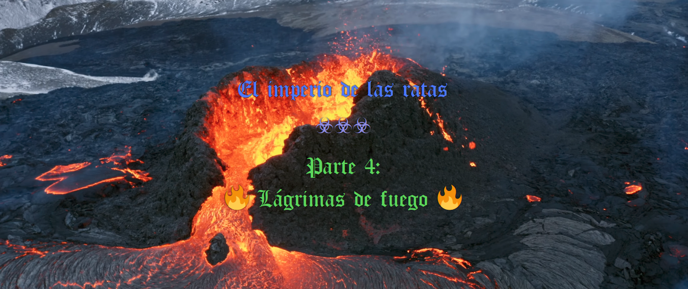
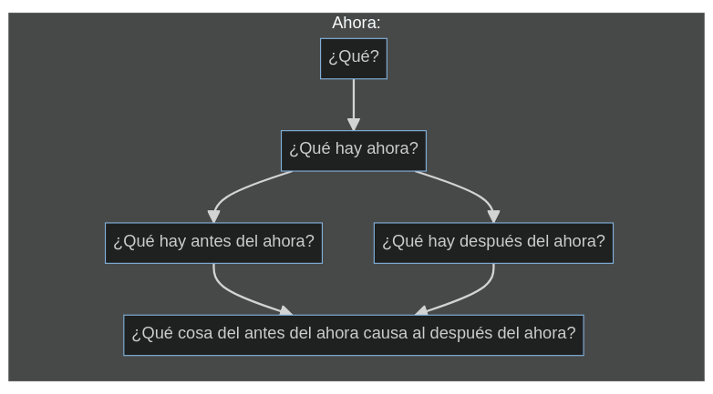
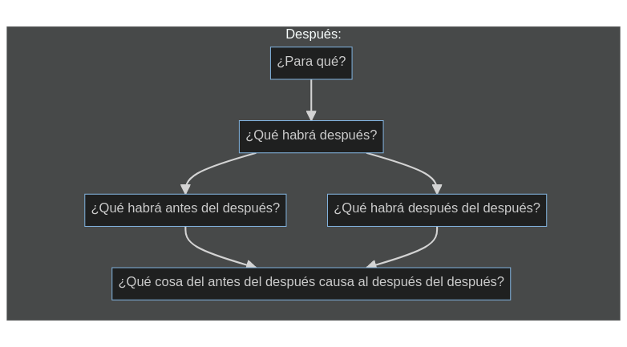

----

#### Índice

1. [Moción y emoción (1)](#moción-y-emoción)
1. [Moción y emoción (2)](#moción-y-emoción)
1. [Razón y emoción](#razón-y-emoción)

----

### Moción y emoción (1)

Este libro quería dedicarlo a la exploración racional de las emociones. Pero no sé qué saldrá, la verdad. De todos modos, primero, hay que decir algunas cosas para situar la reflexión.

La primera, mundo externo y mundo interno, conforman la realidad. Re-alidad. Ya lo dice el nombre: 2 alidades. Pues este patrón dual o polar se va repitiendo. 

Lo sentido y lo movido. Lo sentido se divide en varias, pero lo empírico y lo abstracto. Lo abstracto, entre lo racional y lo emocional. Lo empírico, entre lo interno o corpóreo, y lo externo. En última instancia, todo está unido, aliado. Re-aliado.

Bueno, pues en este pequeño mapa de las divisiones de la realidad, me centro en lo emocional y lo racional.

Desde hace un tiempo, y aunque me olvido, seguramente por razones de adaptación, mantengo que las emociones tienen una razón racional de ser, que podemos sublimar (o hacer consciente), o se puede quedar en ese plano inconsciente, y seguir operando en nuestros procesos igualmente.

Un momento. Antes que nada, y como yonki, yo sé que las emociones son producto de números. No digo que pueda controlar esos números, pero es lo que el yonki intenta indirecta o directamente. ¿Por qué las emociones son números? En el último apartado del libro anterior, se menciona la razón: endodrogas. Las endodrogas: dopamina, serotonina, feromonas, no sé, disto mucho de ser un experto en el tema. Sustancias. Adrenalina. No sé, varias. Hay más, estas son las más populares. Hay opioides endógenos, opioides que se generan dentro de nuestro cuerpo. Endodrogas es un buen nombre. Y un neurólogo sabrá decir más sobre ellas.

Las emociones son números. Y su repercusión, tiene un fin matemático también. Eso es otra tesis, hipótesis. Pero... bueno, a ver, no se me da muy bien ordenar ahora mismo.

El **amor** procura la unión del grupo. El **odio** procura la división del grupo, la desunión del individuo. La **rabia** procura que el uso de la fuerza no sea un impedimento para la división, para la separación. La **venganza** procura una compensación por daños. La **nostalgia** es producto de una comparación entre lo actual y lo anterior, y procura una valoración de lo anterior. La **pena** procura que la rabia no tome el control, es decir, la fuerza no tome el control, y también anuncia que algo no está bien con las cosas como están. La **avaricia**, procura un almacenamiento de recursos previsorio, una protección ante la escasez. La **alegría** procura una inyección de motivación, de energía, y un recuerdo para posteriores ocasiones.

Ahora no me vienen más.

¿Por qué nacen las emociones?

Bueno, antes de eso, que no lo sé yo, pero antes que eso, las emociones son el producto de un laboratorio de drogas, llamado cuerpo. Este laboratorio es racional. Es decir, el que domina los números de la realidad, sabía qué estaba haciendo con un *cuerpo*, un *laboratorio de drogas portátil e inseparable*. Parecen un... controlador.

El controlador, en servidores, programación, es una función que sirve para dar respuestas a los clientes, a las peticiones externas. Aquí no lo uso en ese sentido, lo uso en el sentido de: *algo que sirve para controlar*. Por eso, las emociones, convendría controlarlas si quieres... no ser víctima de ellas. Dejarse controlar por controladores instalados por el que controla los números de la realidad, parece no tan mala idea. Parece hasta buena idea.

Yo, como yonki, también quiero enfatizar lo bueno de las emociones sin más. Es decir, de las buenas, de todas también, pero de las buenas sobre todo. Es decir, ¿para qué sirve sentir alegría? Pues para disfrutarla, sin más, es uno de sus usos, y uno de los más importantes. Eso es lo que quiero enfatizar con este párrafo.

Ya está. Me cuesta mucho entrar en todo esto intentando pisar donde ya tengo algo de experiencia demostrándome certeza. Rápidamente podría pisar terreno pantanoso, donde aventuro cosas que pueden cumplirse a veces, pero no siempre. De hecho, seguro que ya lo he hecho.

Pero, en última instancia, y hablando con un pueblo tomado por la yonkicidad del dinero (ya lo hemos hablado en el último apartado del libro anterior), vale la pena resaltar que las emociones tienen una utilidad racional. Y conviene comprenderla para que no te engañen, porque mucho es engañarte con eso, la televisión son expertos, las religiones y sectas son estrellas, y demás. Ahora, paro de escribir, por prudencia.

----

### Moción y emoción (2)

El **miedo**, por ejemplo, puede ser un instrumento muy útil para salir corriendo en ciertos casos. También para quedarse paralizado. La **prudencia**, que sería un sucedáneo ligero del miedo, también puede resultar útil en muchos casos. La **satisfacción** es una sensación, ni siquiera emoción, nos indica que hemos hecho algo bien o que estamos obteniendo algo bueno. El **orgullo** puede tener distintas acepciones, una puede ser un signo de identidad y al mismo tiempo, satisfacción. Identidad satisfactoria. También orgullo puede usarse como preventor de actos altruistas, generosos o simplemente bondadosos. El **altruismo** o **generosidad** sirven para dar de más de lo compensatorio. La **bondad** sirve para actuar conforme a unas normas morales o éticas. 

Toda emoción puede desmenuzarse en más palabras. Pero, sobre todo, consiste en desembocar en conductas concretas que reportan un patrón homogéneo del movimiento.

Voy a ir apuntando una lista:

  - Decepción
  - Apatía
  - Desilusión
  - Desprecio
  - Rechazo
  - Aceptación
  - Ilusión
  - Motivación
  - Tristeza
  - Desaprobación
  - Autoestima
  - Ira
  - Confusión
  - Somnolencia
  - Aburrimiento
  - Diversión
  - Tranquilidad
  - Plenitud
  - ...

### Razón antes que emoción

Para continuar, y explicar por qué la razón es un superconjunto de las emociones, traigo primero unos diagramas.

La causalidad de los fenómenos emocionales es la razón por la cual la razón es un superconjunto de las emociones. Y estos diagramas es la forma más rudimentaria de explicarlo. De explicar que la **causalidad y el estado de las cosas causa emociones**.

Y en el fondo, es para decir que el que lo consigue explicar con flechas, ya lo tiene. Y la notación química, por ejemplo, lo hace. El lenguaje lógico-matemático, por ejemplo, también lo hace. Permiten observar y analizar la relación entre fotograma y fotograma, o *moméntums* he oído referirse alguna vez. Entre un *ahora* y otro *ahora*.

Quien tuviera el conocimiento de todos los eventos químicos y físicos (orgánicos e inorgánicos) y la relación causal entre sus grupos (y a todos sus niveles) coparía el conocimiento y llegaría a la omnisciencia. Dicho de otra forma, estoy definiendo la omnisciencia. Y como la omnisciencia es el conocimiento del todo, estoy definiendo el todo: *las cosas y sus relaciones*.

Pero, ¿y qué tiene que ver esto con las emociones? Que las emociones son cosas. Y sirven para crear relaciones entre otras cosas también. Es decir, las emociones se deriva del conocimiento que estoy describiendo.

Y es conocimiento porque alguien conoce, algo conoce las cosas y sus relaciones. Y mantiene sus formas coherentes en el tiempo. Alguien o algo se acuerda de cómo son las cosas. Pero entre lo que se sabe y lo que ocurre es tanto, hay tanto desconocimiento, que podemos llamarlo a menudo **magia**, pero es **ciencia correcta**. Y yo, por eso, tengo el mejor lenguaje para hacer *ciencia correcta* (junto con mermaid): el lenguaje lógico, el lenguaje más avanzado, el lenguaje más natural posible dentro de lo más pragmático posible. Pero es tan complicado que explico muchas más cosas en natural. También es cierto que esto no es del todo ciencia: es especulación filosófica. Por eso uso el lenguaje natural. Pero la fórmula de la gravedad tiene más sentido para JavaScript que para un ser humano (por decir una). ME refiero, no obstante, a Castelog (en inglés ya hice NaturalScript y me respondieron con un Scratch *de mierda* y *como para niños*). También hablo de las universidades, claro, que me ignoraron y me ignoran, o directamente me plagiaron e ignoraron luego. Muy listos los tontos *de mierda*, niñatos.

Pues las emociones son fruto de la **ciencia cierta**. Y yo doy por cierto que las emociones tienen, entre otras, un fin o meta o propósito conductual en cada caso, que no tiene por qué derivar en la misma actuación. Y parte del control emocional puede avanzarse conociendo estas relaciones entre el propósito de una emoción y la posible conducta derivada o la factual en caso de hablar de hechos pasados.

Que para controlar mejor las emociones, puede ir bien entenderlas, vamos. Y es lo que intento desglosar aquí. Pero igualmente, el Ministerio de Educación y el de Universiadades, entre otros, son los que más controlan de quién sí y qué sí en todo esto. Principalmente, por pagar por estudiar y homologar.

La **resignación** sirve para no quedarse pillado de por vida. Teniendo razón. Porque la tengo, ellos mismos lo saben. Y causa-efecto permanecerá ahí: sigo teniendo a día de hoy razón, privatizar la homologación del conocimiento es una lobotomía social forzada. Pero goza de buena salud, parece: la lobotomía sigue haciendo efecto.

La cumbre de la **aceptación** ha sido, para mí:

> A mí me ha tocado vivir esta vida. Esta vida es la que me ha tocado esta vez vivir.

Es una frase que te acepta en el sitio dónde estás. Sea cual sea. La aceptación es un valor budista. Uno muy salvable, para mí.

Y digo "salvable" porque si has estado en encerramiento, lo sabes. Y también me refiero a unas universidades vendidas, y a unos políticos que más todavía. El encerramiento era antes, fue durante, y depende de cómo lo pienses, puede acentuarse como sentimiento. Por eso, no encuentras gente que dispare en la brecha de los problemas, sí verás disparos tontos a donde el mogollón, con opiniones del montón. Es lo normal, intento juzgarlo poco, porque si no, no me creería a nadie.

Pero, sobre las emociones, decir que entender el... la *utilidad primitiva* de cada emoción te puede ayudar mucho a entender lo que sucede en tu entorno, y en algunos casos, hasta en uno mismo.

----

